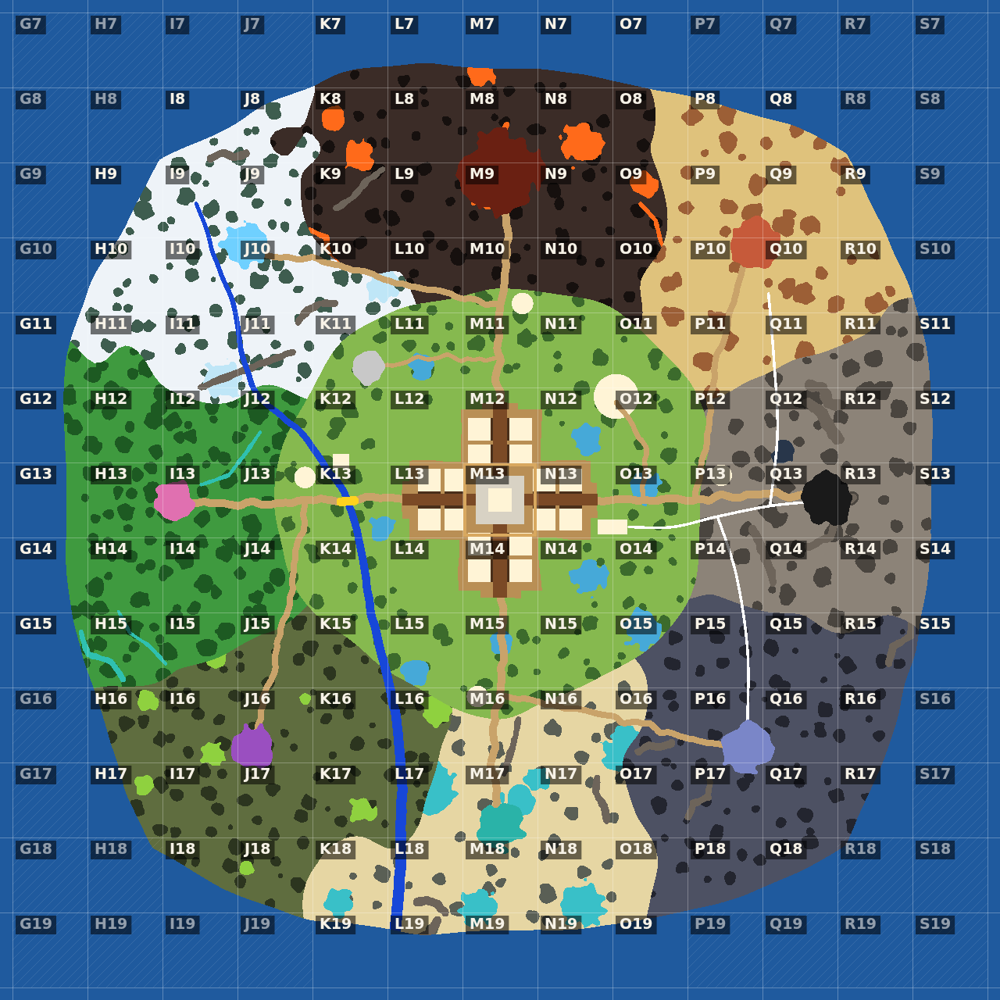
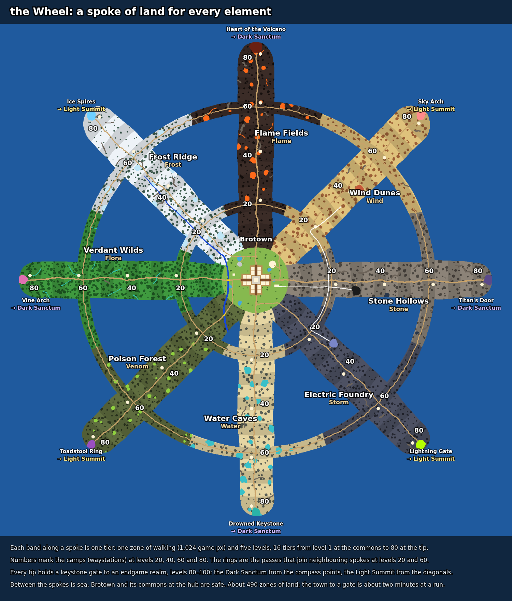
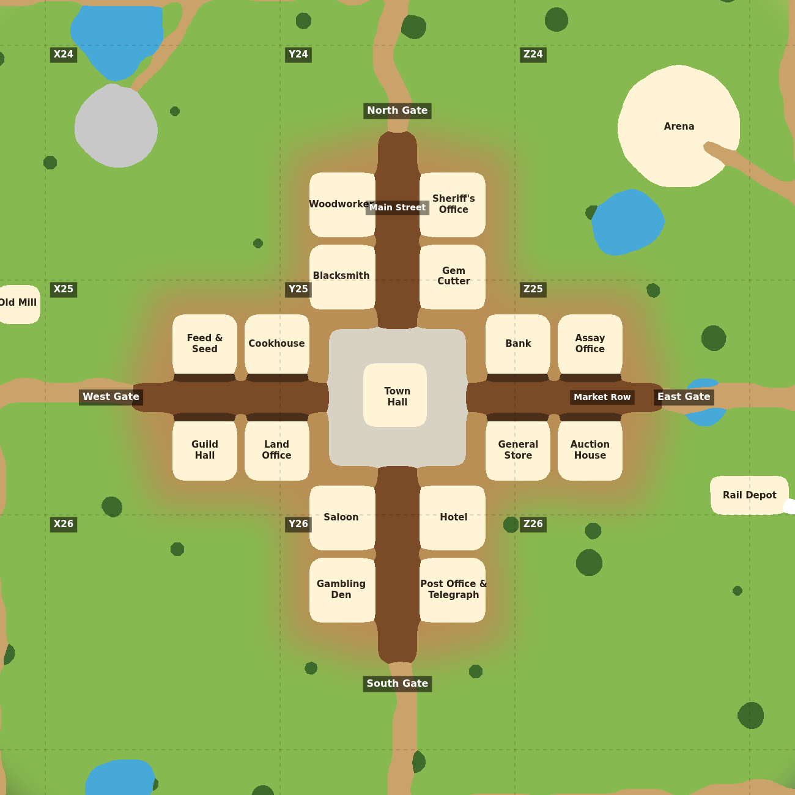

# The World Bible: Brotown and its island (v2.3.2931–2936, DRAFT)

**Status:** a draft for the owner to react to. Nothing in the game uses it
yet. It is the *story and look* of the one seamless world the
[World Builder](WORLD-MAP-PIPELINE.md) paints. The machine-readable version is
`public/tools/world/plan.js`, and **the plan wins wherever they disagree.**
The region, border and plot tables below were generated from it.

> Owner, 2026-09-29: *"I'm considering a full refresh of every map tile. I
> would want your help creating the through lines that tie it all together in
> a cool way … I'm considering a full refresh of the Brotown map too,
> something that allows easy entrance and exits … closer to an 1800's style
> map where there's a Main Street and some buildings line the street. I would
> also redo all the characters including Mayor Bro. I'm needing a consistent
> style across everything, and right now it's not."*

**This document covers:**

1. [The premise](#1-the-premise-a-shard-rush)
2. [The through-lines](#2-the-through-lines)
3. [The Wheel: a spoke of land for every element](#3-the-wheel-a-spoke-of-land-for-every-element)
4. [Borders and passes](#4-borders-and-passes)
5. [Brotown](#5-brotown)
6. [One look for everything: BroTown HD pixel art](#6-one-look-for-everything-brotown-hd-pixel-art)
7. [Redrawing the characters](#7-redrawing-the-characters)
8. [Farms, dungeons and interiors](#8-farms-dungeons-and-interiors)
9. [Growing the world, and the load it can carry](#9-growing-the-world-and-the-load-it-can-carry)
10. [Decisions for the owner](#10-decisions-for-the-owner)
11. [Trees, rocks, water and props: objects, not paint](#11-trees-rocks-water-and-props-objects-not-paint)
12. [Built by Bros: buildings, props and people](#12-built-by-bros-buildings-props-and-people)
13. [The ground: baked from swatches](#13-the-ground-baked-from-swatches)
14. [Easy to miss](#14-easy-to-miss)

**v2.3.2933, the owner's second round of decisions,** recorded where they
belong:

- All of today's environment art and every NPC is replaced; the player is
  kept, and monsters may be redone (§7).
- Everything that stands up is a separate object, water included (§11).
- Buildings and NPCs are made "more bro" (§12).
- One scale everywhere: the town's (§6).
- Many rooms, with characters that move between them and one shared
  auction house (§9).

And one question it raises that comes before all of them: **the player is
pixel art and every map is painted** (§6).

**v2.3.2935–2936, the owner's third round:**

- **The look: HD pixel art on a 1.5 px grid** (§6), with the rules every
  picture follows. (Since v2.3.2942: kept at 2 px per game px instead.)
- **The ground is made from swatches** (§13).
- **The island is the Wheel** (§3): a spoke of land for every element, each
  with its own levels 1–80, and the Dark and Light realms (80–100) behind
  gates at the tips.

---

## 1. The premise: a shard rush

**Brotown is a frontier boomtown.**

- Every region of the island already drops its own elemental shard
  (`src/data/shards.js`: Frost, Ember, Wind, Stone, Thunder, Tidal, Mist and
  Flora; today's Starting Meadow drops one too).
- Word got out. Prospectors came, a town grew where the trails crossed, and a
  railway was laid to haul ore out of the Great Cave.
- That is why the town looks the way it does: a Main Street of wooden
  false-front shops, a bank, an assay office and a rail depot.

**Nobody in town knows what the shards are for. The ruins do.**

- At the tip of every spoke stands a **keystone gate**: a round stone gate
  carved with an eight-spoked wheel.
- The wheel is a map of the island: eight spokes for eight elements around
  one hub. Since v2.3.2936 the island really is that shape (§3).
- In the commons, **Prospector's Circle** has eight standing stones, one for
  each spoke.
- The hub of the wheel is where the Town Hall stands. The prospectors built
  on top of it without knowing.
- **The gates open on the endgame**: the Dark Sanctum and the Light Summit,
  levels 80–100 (§3).

**The Convergence is a hook, not a commitment.**

- It is a vault beneath the Town Hall that opens when the eight keystones
  are woken.
- It could become a late-game dungeon or a server-wide event. Nothing
  depends on it.
- The map has the keystones either way, so the story has somewhere to live
  when it is wanted.

**Why a premise at all.** "Frost, fire, desert, cave …" is a list. A reason
for the town to exist, and one mystery that every region shares, turns it
into a world. It costs nothing to paint and it is the kind of detail that
makes people explore.

---

## 2. The through-lines

These are what make one world instead of eight zones stitched together. Each
one crosses several spokes, so walking anywhere you meet one of them.

*The blueprint the World Builder draws, in the colours it uses:*

- **Tan:** roads.
- **Royal blue:** the Sweetwater River.
- **White:** the railway.
- **Yellow:** bridges.
- **Cream:** empty building plots, and the camps.
- **Blobs:** each spoke's woods, ponds, cliffs and lava.
- **Coloured discs:** landmarks, and the gates at the tips.

*Regenerate the pictures with `node tools/world/render-plan-images.mjs`.*

| Through-line | What you see | Why it matters in play |
|---|---|---|
| **The Wheel itself** | Eight spokes round one hub, exactly like the eight-spoked wheel carved on every keystone (§1). | You always know where you are: which spoke is your element, and how far out is how dangerous. |
| **The roads** | A road runs down every spoke from town to the gate at its tip. The four compass roads leave the four town gates; the four diagonal roads fork off them in the commons, turning left (North Road → Frost Trail, East Road → Dune Trail, South Road → Foundry Road, West Road → Bog Trail). A **camp** stands by the road at levels 20, 40, 60 and 80, and the **passes** cross between spokes at 20 and 60. | Every spoke is one road from town. New players can never be lost: follow the road back. |
| **The Sweetwater River** | Born as meltwater under the glacier on Frost Ridge (level ~50), it drops over **Sweetwater Falls** where the glacier ends and runs down the spoke. It passes the town's west gate, where the **Mill Bridge** carries the West Road over it beside the **Old Mill**, crosses the Bog Trail under the **Snake Bridge**, and spreads into a delta in the brackish lagoon between the Poison Forest and the Water Caves. | A second way home: downstream is always town. It is also the natural spot for fishing. |
| **The mine railway** | From the **Rail Depot** outside the east gate down Stone Hollows to the **Great Cave**. At **Railhead Junction** (level 20) two branches leave through the passes: to the **Foundry Dome** through Ore Cut, and an **abandoned spur** through Redrock Gap toward the Buried City that was never finished, its rails rusted and half-buried in sand. Telegraph poles follow the line back to the Post Office & Telegraph in town. | It explains the industrial east, and ties the Hollows, the Foundry and the Dunes together. |
| **The keystones** | The same eight-spoked wheel on Prospector's Circle's slab in the commons, and on the **keystone gate** at the tip of every spoke. | One mystery across all eight spokes, and it ends at the gates to the endgame. |
| **Levels by distance** | Four stages per spoke, each a new look: the frontier the prospectors reached (1–20), the element's heartland (21–40), its wilds (41–60) and its extreme (61–80). | Players read how dangerous a place is from how it looks, and from how far they are from town. |
| **Designed borders** | Where two spokes meet, at their bases and on the passes, there is a named in-between landscape: steam fields between frost and fire, ash dunes between fire and sand, alpine meadows between frost and jungle (§4). | No hard line where one look stops and another starts, which was the worst look of the old zone joins. And the passes give two-element monsters a home. |
| **One sun, one scale, one style** | Daylight from the upper left everywhere, a person the same size everywhere, one style key for every picture (§6). | Consistency, which is the thing the owner asked for. |

---

## 3. The Wheel: a spoke of land for every element

> Owner, 2026-09-29: *"I want each 8 regions to have its own monster tiers
> though (im thinking 1-80 with a zone sized space separating each 5 levels)
> so The game is all about elements. Each monster should have an elemental
> type … except for light and dark which are endgame elements (im thinking
> lvl 80-100)."* Then, choosing: *"1-80 plus dark and light."*

**The shape (v2.3.2936):**

- **The hub is Brotown and its commons.** It is safe: no monsters, and
  everyone meets here.
- **Eight spokes run out from it, one per element**, each on the compass
  point its zone has on the World View painting.
- **Every spoke is its own ladder, levels 1 to 80.** One **tier** is one
  zone of walking (1,024 game px, about a phone screen tall) and five
  levels, so a spoke is 16 tiers long from the commons to its tip. Every
  spoke is three zones wide.
- **Four stages per spoke**, one per 20 levels. The ground changes look with
  each stage, and each stage ends at a **camp**, a waystation for resting
  and fast travel, at level 20, 40, 60 and 80.
- **Between the spokes is sea**, which the code draws. A round island this
  size would be about 1,000 zones, most of it empty high-level land.
- **Passes join neighbouring spokes** across the sea at levels 20 and 60,
  level for level. Their land is the two elements' border landscape (§4):
  the home for monsters of both elements, and the natural place for fusion.
- **A keystone gate stands at every tip** and opens on an endgame realm,
  levels 80 to 100: the Dark Sanctum from the four compass-point spokes,
  the Light Summit from the four diagonals (below).

**The numbers:**

- About **490 zones of land**, 3.6 times the round island it replaces.
- From the Town Hall to a gate is about 19 zones: **about two minutes at a
  run**. A tier takes about 7 seconds to cross.
- **128 monster tiers** (8 elements × 16), but not 128 drawings. For
  example: four families per element, one per stage, with the tiers in
  between as colour, size and gear variants of the same drawing.

**The neutral meadow is gone.** Every monster has an element, so the
Starting Meadow became the safe commons, and every spoke's level 1 starts
right outside it. Mayor Bro's first quest could have a new player pick their
first element.

**Where the level lives.** The blueprint stores every cell's tier, so "how
dangerous is it here?" is read from where you stand, like the spoke you are
on ([WORLD-ARCHITECTURE.md §2](WORLD-ARCHITECTURE.md#2-the-world-maps-not-zones)).
The World Builder's **Levels** view shows it.

**Everything is made in daylight.** The Foundry was painted at night and the
Hollows inside a cave. In one seamless map a hard day/night line at a border
would be the worst seam of all. A spoke's mood comes from its materials
instead (black iron, glowing crystal), and the game can still darken a
place as you walk in.

**The Wind Dunes will be made in the same top-down view as everywhere
else.** Its old painting's side-on perspective was an accident. The style
bible forbids perspective outright, and the mesas are described "seen from
above like everything else".

### Brotown Commons (the hub)

*safe: no monsters*

- **The commons.** Neat fenced fields of crops and hay, a few orchard trees,
  split-rail fences, haystacks and cart tracks through short green grass.
  - Ground: short green grass with a few small wildflowers.
- **Landmark: Prospector's Circle.** A ring of eight weathered standing
  stones on a grassy knoll, around a round, flat stone slab carved with an
  eight-spoked wheel: one stone for each spoke.
- **The Rail Depot, the Old Mill and the Arena** stand here (§5).

### Frost Ridge (north-west)

*Frost · reached by the Frost Trail · its gate opens on the Light Summit*

- **Levels 1–20: the thaw line.** Patchy snow melting over wet brown grass, bare birches, trickling meltwater and an abandoned trapper's sled.
  - Ground: patchy snow melting over wet brown grass and mud.
  - Camp at level 20: **Trapper's Rest**, a log cabin with furs drying on racks and a woodpile by the door.
- **Levels 21–40: the snowbound taiga.** Deep snow with wind-carved drifts, boot and hoof tracks, and snow-laden pines.
  - Ground: deep, soft snow in gentle rounded drifts, shaded pale blue in the hollows.
  - Camp at level 40: **the Snowshoe Lodge**, a snowed-in hunting lodge with a smoking chimney and snowshoes by the door.
- **Levels 41–60: the glacier.** A blue-white glacier of cracked ice and wind-scoured snow crust, split by deep blue crevasses.
  - Ground: blue-white glacier ice with fine cracks, under a thin, patchy crust of snow.
  - Camp at level 60: **Crevasse Camp**, an expedition camp of canvas tents, sledges and ice picks roped together on the ice.
- **Levels 61–80: the frozen crown.** A high white plateau of rime ice and frozen spires glittering under a hard blue sky.
  - Ground: hard rime ice and packed snow glittering with frost crystals.
  - Camp at level 80: **the Last Fire**, a squat stone hut with a lantern always burning, the last shelter before the Ice Spires.
- **The gate: the Ice Spires.** A cluster of tall, jagged, glowing blue ice crystal spires around a round stone gate carved with an eight-spoked wheel, frozen into the ice. It opens on the Light Summit.
- **Where the commons meets it:** the commons grass stiffens with frost and the first snow lies in the hollows.
- **The Sweetwater here:** a fast, icy meltwater river with shelves of ice along its banks.

### Flame Fields (north)

*Flame · reached by the North Road · its gate opens on the Dark Sanctum*

- **Levels 1–20: the burn line.** Scorched yellow grass giving way to grey ash, charred fence posts and blackened tree stumps, thin smoke rising from smouldering patches.
  - Ground: scorched yellow grass with patches of grey ash.
  - Camp at level 20: **Firewatch Post**, a wooden fire lookout tower with water barrels and a hand bell.
- **Levels 21–40: the ash plains.** Black volcanic ash and cracked basalt ground with glowing embers in the cracks, and sulphur-yellow vents puffing steam.
  - Ground: black volcanic ash over cracked basalt, with a few faint glowing embers.
  - Camp at level 40: **Cinder Camp**, soot-stained tents behind a windbreak of stacked basalt.
- **Levels 41–60: the lava fields.** Cracked black basalt crossed by channels of bright lava, with sulphur vents and heat shimmer.
  - Ground: cracked black basalt with thin glowing orange seams.
  - Camp at level 60: **Sulphur Springs**, a wooden bathhouse over a steaming yellow sulphur spring.
- **Levels 61–80: the volcano flanks.** Steep black basalt slopes and cooled lava flows, bright lava running in channels, drifting ash.
  - Ground: rough black cooled lava with drifts of grey ash.
  - Camp at level 80: **the Obsidian Stair**, a camp cut into glassy black obsidian at the foot of the last climb.
- **The gate: the Heart of the Volcano.** The foot of a great volcano: a steep black cone with glowing lava running down its sides and smoke rising from vents, and at its base a sealed round stone gate carved with an eight-spoked wheel. It opens on the Dark Sanctum.
- **Where the commons meets it:** the commons grass browns and scorches, with drifts of grey ash.

### Wind Dunes (north-east)

*Wind · reached by the Dune Trail · its gate opens on the Light Summit*

- **Levels 1–20: the sage flats.** Dry sage scrub and tough grass on cracked earth, bleached cattle skulls, tumbleweeds and a broken wagon wheel.
  - Ground: cracked dry earth with tufts of sage and tough grass.
  - Camp at level 20: **Tumbleweed Station**, a stagecoach relay station with a wooden water tower and a corral.
- **Levels 21–40: the dunes.** Golden sand dunes with wind ripples, red hoodoo rock stacks, cacti and a half-buried wagon wreck.
  - Ground: fine golden sand in soft, rounded hummocks, with a few small pebbles.
  - Camp at level 40: **Oasis Camp**, striped tents round a small palm-shaded oasis pool.
- **Levels 41–60: the red mesas.** Flat-topped red sandstone mesas seen from above like everything else: sunlit tops, layered sides in shadow, sand drifting between them.
  - Ground: red sandstone rock with drifts of red sand.
  - Camp at level 60: **Mesa Top**, a camp on a mesa top with a rope lift and a wind vane.
- **Levels 61–80: the storm heights.** Wind-scoured bare rock high above the desert, sand streaming across it, and arches carved by the wind.
  - Ground: wind-polished pale rock with small pockets of blown sand.
  - Camp at level 80: **Windbreak Keep**, a squat stone watchtower with ragged banners streaming in the wind.
- **The Buried City** (levels 41–45): half-buried sandstone ruins: broken columns, toppled statues and a giant carved stone face half sunk in the sand.
- **The gate: the Sky Arch.** A great natural stone arch on the highest rock, the wind howling through it, and beneath it a round stone gate carved with an eight-spoked wheel. It opens on the Light Summit.
- **Where the commons meets it:** the commons grass dries to straw and sand blows across it.

### Stone Hollows (east)

*Stone · reached by the East Road · its gate opens on the Dark Sanctum*

- **Levels 1–20: the quarry.** Stepped quarry terraces of cut grey stone, rubble heaps, abandoned mine carts and scattered picks and shovels.
  - Ground: packed grey gravel and stone dust with chips of cut stone.
  - Camp at level 20: **Railhead Junction**, the mine railway's junction: a wooden water tower, a coal bunker and a signal box.
- **Levels 21–40: the badlands.** Grey stone badlands of cracked flagstone ground, loose rubble and pale moss, with clusters of glowing blue and violet crystals.
  - Ground: cracked grey flagstone rock with loose rubble and pale moss.
  - Camp at level 40: **Crystal Camp**, a prospectors' camp of tents and sluice boxes among crystal outcrops.
- **Levels 41–60: the granite canyons.** Towering grey granite walls and narrow canyons dropping into shadow, with crystal veins glowing in the rock.
  - Ground: smooth grey granite with thin glowing crystal veins.
  - Camp at level 60: **Canyon Bottom**, a camp at the bottom of a canyon, strung with rope bridges.
- **Levels 61–80: the deep roots.** Dark stone galleries of the mountain's roots, with giant crystal pillars and still, dark pools.
  - Ground: dark slate-grey cave stone, smooth and cold.
  - Camp at level 80: **the Deep Lamp**, a miners' lamp-house with a cage lift and a rack of lanterns.
- **The Great Cave** (levels 26–30): the mouth of a huge cave in a grey rock mountainside, framed by glowing crystals, with the mine railway running into it.
- **The gate: the Titan's Door.** A colossal door carved into the mountainside at the end of the deepest canyon, sealed by a round stone gate carved with an eight-spoked wheel. It opens on the Dark Sanctum.
- **Where the commons meets it:** the commons thins over stony ground and grey boulders.

### Electric Foundry (south-east)

*Storm · reached by the Foundry Road · its gate opens on the Light Summit*

- **Levels 1–20: the smelter yards.** Trampled dirt yards scattered with slag heaps, coal piles and iron scrap.
  - Ground: trampled dark dirt with coal dust and flecks of slag.
  - Camp at level 20: **Coaling Station**, a coaling station with a crane over a heap of coal.
- **Levels 21–40: the foundry works.** Dark slate and iron floor plates joined by brass seams, thick iron pipes along the ground and crackling blue electric light in the cracks.
  - Ground: dark, square iron floor plates joined by brass seams.
  - Camp at level 40: **Shift House**, a brick workers' canteen with a steam whistle on the roof.
- **Levels 41–60: the coil fields.** Fields of copper coils and lightning rods on scorched iron ground, arcs of blue electricity jumping between them.
  - Ground: scorched iron plating and cracked slate, with loose loops of copper wire.
  - Camp at level 60: **Relay Nine**, a telegraph relay hut with a humming antenna mast.
- **Levels 61–80: the storm plateau.** A high plateau of black iron under endless lightning, with twisted metal towers.
  - Ground: black iron plate spattered with fused glass where lightning struck.
  - Camp at level 80: **the Grounding Post**, a lightning-proof bunker under a tall copper rod.
- **The Foundry Dome** (levels 26–30): a great iron dome with glowing blue windows, ringed by crackling electric pylons.
- **The gate: the Lightning Gate.** A ring of iron pylons crackling with blue lightning round a round stone gate carved with an eight-spoked wheel, caged in copper coils. It opens on the Light Summit.
- **Where the commons meets it:** the commons is trampled to dirt, with coal dust and scattered scrap.

### Water Caves (south)

*Water · reached by the South Road · its gate opens on the Dark Sanctum*

- **Levels 1–20: the dune grass.** Low sandy dunes held together by dune grass, driftwood, fishing nets drying on poles and a beached rowing boat.
  - Ground: pale sand with tufts of dune grass.
  - Camp at level 20: **Netmender's Wharf**, a fishing shack on stilts with nets drying on poles.
- **Levels 21–40: the lagoons.** Pale sand bars and dark mossy rocks between shallow lagoons, with the wreck of a small ship lying on its side.
  - Ground: wet pale sand with small tide pools.
  - Camp at level 40: **Wreck Cove**, a camp built from the planks of a wrecked ship.
- **Levels 41–60: the sea caves.** Dark mossy sea cliffs and rock shelves with glowing teal caves at their foot.
  - Ground: dark wet rock with barnacles and faintly glowing teal algae.
  - Camp at level 60: **Lighthouse Point**, a small striped lighthouse on a rock.
- **Levels 61–80: the drowned reef.** A shallow reef of coral and giant shells, half under the water.
  - Ground: pale coral rubble and wet sand.
  - Camp at level 80: **Coral Watch**, a hut of driftwood and giant shells on the reef.
- **The gate: the Drowned Keystone.** A rocky headland pierced by sea caves glowing teal from inside, and in the shallows before it a round stone gate carved with an eight-spoked wheel, half under the water. It opens on the Dark Sanctum.
- **Where the commons meets it:** the commons grass turns to sandy dune grass.
- **The Sweetwater here:** a wide, slow river mouth splitting into sandy channels as it meets the sea.

### Poison Forest (south-west)

*Venom · reached by the Bog Trail · its gate opens on the Light Summit*

- **Levels 1–20: the blighted farm.** A blighted field of withered crops and sickly yellow grass, a toppled scarecrow and a broken snake-oil wagon spilling green bottles.
  - Ground: sickly yellow grass and patchy clumps of withered crops on grey soil.
  - Camp at level 20: **Snake-Oil Stop**, a travelling quack doctor's painted wagon and awning.
- **Levels 21–40: the slime woods.** Murky moss and bog ground among twisted dead trees dripping green slime and giant purple and yellow toadstools.
  - Ground: murky green moss over black bog mud.
  - Camp at level 40: **the Stilt House**, a house on tall stilts above the bog, with a ladder.
- **Levels 41–60: the mangrove marsh.** A mangrove marsh of tangled roots over dark water and green scum, hung with grey moss.
  - Ground: dark mud laced with tangled roots and green scum.
  - Camp at level 60: **Gator Landing**, a plank landing over the marsh with a flat-bottomed boat tied up.
- **Levels 61–80: the spore depths.** A deep fungal forest floor carpeted in glowing spores, with toadstools taller than trees.
  - Ground: a spongy purple fungal mat dusted with glowing spores.
  - Camp at level 80: **the Mask Hut**, a hut hung with gas masks and bundles of drying herbs.
- **The gate: the Toadstool Ring.** A ring of giant purple toadstools round a glowing poison pool, with a round stone gate carved with an eight-spoked wheel sinking into the mud at its centre. It opens on the Light Summit.
- **Where the commons meets it:** the commons grass yellows and sickens, with the first mushrooms and a sour green haze.
- **The Sweetwater here:** a slow, murky green-brown river edged with reeds and slime, spreading into a delta of muddy channels.

### Verdant Wilds (west)

*Flora · reached by the West Road · its gate opens on the Dark Sanctum*

- **Levels 1–20: the overgrown orchards.** An old orchard of fruit trees gone wild, a tumbledown stone wall, tall grass and the first giant flowers.
  - Ground: tall green grass with fallen leaves and small wildflowers.
  - Camp at level 20: **the Orchard House**, an old farmhouse turned travellers' inn, with cider barrels on the porch.
- **Levels 21–40: the vine jungle.** Lush jungle floor of ferns and giant colourful flowers (red, purple, teal and yellow) under giant mossy trees hung with vines.
  - Ground: dark green jungle floor of ferns and moss with fallen petals.
  - Camp at level 40: **Vine Bridge Camp**, platforms and rope bridges slung between giant tree trunks.
- **Levels 41–60: the waterfall cliffs.** Mossy cliff terraces with small waterfalls tumbling between ferns into jade pools.
  - Ground: wet mossy stone and fern-covered earth.
  - Camp at level 60: **Mistfall Terrace**, a terraced camp beside a waterfall, with a water wheel.
- **Levels 61–80: the elder grove.** A primeval grove of colossal ancient trees with roots like walls and glowing flowers in the gloom.
  - Ground: deep moss and root-laced earth scattered with glowing petals.
  - Camp at level 80: **the Rootwarden's Hollow**, a round-doored hut built inside a hollow root.
- **The gate: the Vine Arch.** A great archway of living vines hung with giant flowers, framing a round stone gate carved with an eight-spoked wheel wrapped in roots. It opens on the Dark Sanctum.
- **Where the commons meets it:** the commons grass grows lush and tall, with giant flowers and the first vines.
- **The Sweetwater here:** a clear, fast river over mossy stones, edged with ferns and giant flowers.

### The realms (levels 80–100)

The endgame belongs to the two endgame elements, Dark and Light
(`src/data/elements.js`). Each realm is a map of its own behind four of the
keystone gates, so neither takes room on the island. Their ids and names are
today's endgame zones (`src/data/zones.js`).

- **The Dark Sanctum** (Dark): a realm of endless dusk where every element
  lives on corrupted: black frost, cold violet fire, still poisoned water,
  dead stone that whispers.
  - Its gates: the Heart of the Volcano, the Titan's Door, the Drowned
    Keystone and the Vine Arch.
- **The Light Summit** (Light): a realm of blinding dawn above the clouds
  where every element is found purified: singing ice, white flame, water
  like glass, stone that glows.
  - Its gates: the Ice Spires, the Sky Arch, the Lightning Gate and the
    Toadstool Ring.

**Each realm has eight corners, one per element**, so the element a player
chose still matters at the top. A gate opens onto its own element's corner:
the gate from the Flame Fields onto the Dark Sanctum's flame corner. The
other four corners are reached from inside. Designing the realms is later
work: the island only needs their gates.

**Which realm each gate opens on is easy to change** (`realm` on each spoke
in `plan.js`). Dark on the compass points and Light on the diagonals is only
the first arrangement.

---

## 4. Borders and passes

Neighbouring spokes meet in two kinds of place, and both get the same
designed in-between landscape:

- **At their bases**, where the spokes leave the commons side by side
  (levels 1–10).
- **On the passes** that join them across the sea: a **neck of land at
  level 20**, about two zones across, where the spokes are close; and a
  **long causeway at level 60**, about eight zones across open sea.

A square that straddles two spokes gets the landscape line below in its
prompt, so the change is designed rather than left to chance. Where the
commons meets a spoke, the spoke's "where the commons meets it" line (§3) is
used instead.

**The passes are where two elements meet**, level for level on both sides:
the home for monsters of both elements, and the natural place for fusion.
There are sixteen, each named:

| Neighbours | The land between | Passes: level 20 · level 60 |
|---|---|---|
| Flame Fields and Wind Dunes | Ash dunes: grey volcanic ash blowing over golden sand, and charred cacti | Cinder Crossing · the Ashen Reach |
| Wind Dunes and Stone Hollows | The sand gives way to stone: red sandstone breaking up into grey granite boulders | Redrock Gap · the Sandstone Stair |
| Stone Hollows and Electric Foundry | The mine works: spoil heaps, ore piles, abandoned mine carts and the first iron pipes | Ore Cut · the Slag Causeway |
| Electric Foundry and Water Caves | The foundry meets the shore: slag running down to the sand, rusted chains and cargo crates | Chain Ford · the Iron Pier |
| Water Caves and Poison Forest | Brackish marsh: lagoons gone murky, mangrove roots and sickly dune grass | Brackwater Crossing · the Rotting Causeway |
| Poison Forest and Verdant Wilds | The rot line: the jungle's giant flowers wilting grey-green and its vines turning into slimy dead branches | Wilt Gap · the Blight Bridge |
| Verdant Wilds and Frost Ridge | Alpine meadows: snowmelt streams through short green grass and alpine flowers, with the first pines | Meltwater Gap · the High Meadow Pass |
| Frost Ridge and Flame Fields | Steam fields: snow melting into hot springs and wet black rock, with geysers and drifting steam | Geyser Gap · the Steam Stair |

Only neighbours meet, so there are exactly eight borders.

---

## 5. Brotown

### The layout

**It is a courthouse-square town.**

- **Main Street** runs north–south and **Market Row** runs east–west.
- They meet at the **town square**, a gravel plaza with flagstones, benches
  and lamp posts.
- The **Town Hall** (Mayor Bro) stands in the middle of the square.
- Each street leaves town through a **gate** and becomes one of the Old
  Roads.
- The town is open on all four sides. That answers *"easy entrance and
  exits"*: today's town sits on a clifftop plateau with one stairway down.

**Sixteen building plots line the streets**, two on each side of each arm,
each fronted by a raised wooden boardwalk. The corners between the arms are
the **outskirts**: fenced fields, haystacks and cart tracks.

**The plots are painted EMPTY. Buildings are separate pictures standing on
them.** This is the one structural decision here, for three reasons:

1. **You can walk behind a building.** The game already sorts sprites by
   where they touch the ground (`src/rendering/depthSort.js`, v2.3.2633). A
   building painted into the ground can never cover a player standing behind
   it.
2. **A building can be redrawn without repainting the map.** That matters
   for the character and style refresh (§6, §7).
3. **ChatGPT is bad at buildings that cross a square's edge.** A building
   split between two pictures is the most visible seam there is. Empty
   plots are flat and hide seams well.

The same rule covers anything tall you walk under or behind: town gates,
the mill wheel, pylons and arches. These are sprites, not ground paint.

### Sizes (art px; × 1.5 for game px)

v2.3.2936: one art px is now one pixel of the HD pixel art (§6), 1.5 game
px. Every number was scaled from the old 1.3, so the town keeps its size in
the game.

| Part | Size |
|---|---|
| Main Street | 124 wide (Market Row 104) |
| Boardwalk | 22 deep |
| Building plot | 200 × 200 |
| Town square | 434 × 434, with the Town Hall plot 208 × 208 in its middle |
| Gate to gate | 1,734 = 2,600 game px, about **17 s** to walk; about **9 s** from the square to any gate |
| The whole town | squares X24–Z26. **Y25, the middle square, holds the whole town square.** |

### Who goes where (a proposal)

The ends of town have characters:

- **North** (toward the Flame Fields): the workshops.
- **South** (toward the Water Caves): the saloon end.
- **West** (toward the river and the Verdant Wilds): farming.
- **East** (toward the depot and the mines of Stone Hollows): money.

Every building the game has today has a plot, and four plots are spare for
systems that exist without a building (duels, mail, clans) or might (an inn).

| Arm | Side | Plot | Takes today's | Plot (art px from the centre) |
|---|---|---|---|---|
| square | — | Town Hall | mayor (NPC) | -104,-104 → 104,104 |
| north | west | Blacksmith | blacksmith | -284,-495 → -84,-295 |
| north | west | Woodworker | woodworker | -284,-730 → -84,-530 |
| north | east | Gem Cutter | gemcutter | 84,-495 → 284,-295 |
| north | east | Sheriff's Office | (new: duels, arena sign-up, bounties) | 84,-730 → 284,-530 |
| south | west | Saloon | party | -284,295 → -84,495 |
| south | west | Gambling Den | gambler | -284,530 → -84,730 |
| south | east | Hotel | (new: rest, respawn) | 84,295 → 284,495 |
| south | east | Post Office & Telegraph | (new: mail and offline inbox) | 84,530 → 284,730 |
| west | north | Cookhouse | cooking | -495,-274 → -295,-74 |
| west | north | Feed & Seed | farm | -730,-274 → -530,-74 |
| west | south | Land Office | farmhome | -495,74 → -295,274 |
| west | south | Guild Hall | (new: clans and guilds) | -730,74 → -530,274 |
| east | north | Bank | bank | 295,-274 → 495,-74 |
| east | north | Assay Office | enchanting | 530,-274 → 730,-74 |
| east | south | General Store | marketplace | 295,74 → 495,274 |
| east | south | Auction House | auctionhouse | 530,74 → 730,274 |

**The NPCs:**

- **Mayor Bro** stands at the Town Hall.
- **Lil Bro** runs around the square.
- **Ace** deals cards at the Gambling Den.
- **Diego** keeps the General Store.
- **Blacksmith Bro** works at the Blacksmith.

### Just outside town: the commons

| Place | Where | What it is |
|---|---|---|
| **Rail Depot** | outside the east gate, south of the East Road | where the mine railway begins |
| **Old Mill** and **Mill Bridge** | the river, just past the west gate | the West Road's crossing; the mill's wheel turns in the river |
| **Arena** | north-east of town, on a path off the Dune Trail | a round rodeo ring for duels and the arena |
| **Prospector's Circle** | north-west of town, on a path off the Frost Trail | the commons' landmark and the first keystone clue |
| **The camps** | not here: four down every spoke, at levels 20, 40, 60 and 80 (§3) | waystations, where travel, rest and quests can live |

---

## 6. One look for everything: BroTown HD pixel art

> *"I'm needing a consistent style across everything, and right now it's not."*

### Decided: HD pixel art, on a 1.5 px grid (v2.3.2935)

> Owner, 2026-09-29, after comparing the looks side by side: *"I think HD
> pixel art is the direction I want to go. What should the rules be around
> generating art like that?"* And, choosing the pixel size: *"Yes 1.5 grid."*

**Everything except the bro is modern HD pixel art**, on one pixel grid and
in one palette: ground, objects, buildings, NPCs, and monsters as they are
redone.

**The bro is the size check, not the style reference (v2.3.2939).**

> Owner, 2026-09-29: *"I don't really want my character to be the reference
> image because I'm wanting the world to be high definition pixel art
> (especially material-aware texturing) and my character is simple pixel
> art."*

- **Nothing of the bro is attached to any chat.** ChatGPT copies what it
  sees, and an attached bro pulled every picture toward his chunkier, flatter
  pixels. The style key is the one picture everything is matched to (rule
  10), and it is made from words alone.
- **Sizes are given in words** ("a person standing here would be about one
  seventh as tall as this picture"), and the pipeline scales every object to
  its size anyway (rule 8).
- **He is still what everything is judged beside,** at game size, in the
  Ground Studio's and the Style Lab's previews: the game will show him on
  this ground.
- **Material-aware texturing** is rule 11.

**Pictures are kept at the phone's own sharpness, not on a 1.5 grid
(v2.3.2942).**

> Owner, 2026-09-29, on the first ground at game size: *"It's too gritty and
> low resolution compared to the character"*, then: *"Like it's soft and
> gritty at the same time. That's the look I don't like. But I know the
> image is being blown up. Maybe if you just made the tiles scale smaller
> before you apply them in the world?"*

- **Why it looked that way.** A ChatGPT picture (1,254 px) was shrunk onto
  the 1.5 game px grid (512 px for a 768 game px swatch) and the phone then
  stretched it back up: each of its pixels became about 3.7 phone pixels.
  The shrink blurred it, the stretch made it blocky, and fitting the
  blurred colours to the palette speckled it.
- **The fix is the owner's.** A swatch now covers **512 game px**, and is
  kept at **1,024 px: 2 px per game px**, about a phone's own sharpness (an
  iPhone 13–15 shows 2.47). ChatGPT's picture shrinks a little instead of a
  lot, and is shown at about its own size. The palette is applied at that
  resolution, where it adds no speckle.
- **Tested side by side** at an iPhone's density with the owner's key: the
  old way came out soft and blocky, the new one crisp, and finer than the
  bro's own pixels.
- The world plan's own unit (`worldPxPerArtPx`, 1.5 game px) does not change:
  it places things, it is no longer the size of a pixel of the art. The
  ground is laid at three picture pixels to one plan art px
  (`composeGround`, `opts.scale`).

**Why this was the first question.** The bro is pixel art, and every map and
building was painted. That mix was a large part of why the game looked
inconsistent, and no style key could fix it: whatever the key showed, either
the bro or the world would not match it. Pixel art won because:

- **it keeps the bro**, the art being kept and the most expensive in the game
  to redraw (§7);
- **consistency is enforced by machine instead of hoped for.** Every picture
  ChatGPT makes is snapped to one grid and one palette before it goes in the
  game, so a hundred pictures from a hundred chats come out as one world;
- **the effects the code draws** (night, lights, weather, water, sway, hits)
  are drawn on the same grid in the same colours, so they look like part of
  the art;
- **it is cheaper on the phone**: a picture stored at its true pixel size
  takes a fraction of the memory of a painting of the same ground.

**How it was chosen:** in the Style Lab, round the real bro at game size
([STYLE-TEST.md](STYLE-TEST.md)). The lab's "HD pixel art (chosen)" look now
uses exactly the settings below, so any picture can be checked there before
it is kept.

### The rules

ChatGPT never draws exact pixel art: its "pixel art" is only pixel-ish. So
each rule is held by the prompt, by the pipeline that processes every picture
afterwards (`public/tools/style/process.js`), or by the owner's eye, and the
table says which. The numbers and the prompt words live in one file,
`public/tools/style/bible.js`.

| # | Rule | Held by |
|---|---|---|
| 1 | **The phone's own sharpness** (v2.3.2942; one 1.5 game px grid until then). Every picture is kept at **2 px per game px**, about what a phone shows, so nothing is ever blown up. The bro's own pixels are about 2 game px, so the world is finer-grained than he is. A tree comes out about 380 px tall, and a ground swatch is 1,024 × 1,024 px covering 512 game px. | the pipeline: every picture is resized to it |
| 2 | **One frozen palette** of **128 colours** (64 until v2.3.2940, when the owner chose 128 for material-aware texturing across eight lands and the town), in ramps of 4–6 shades per material. Shadows lean cool (blue-purple) and highlights warm (yellow). It is made once from the style key, then frozen, and every picture is moved onto it. This is the biggest consistency lever. | the pipeline |
| 3 | **Readability ranking.** Ground is calm: middle tones, low contrast. Objects are medium contrast. Characters, monsters and loot are the brightest and punchiest. The test: squint at a screenshot, and the bro and the goblin still jump out. | the prompt, and the owner's eye |
| 4 | **Light.** Soft daylight from the upper left, with 3–5 shading steps per surface. Slightly darker pixels where things touch the ground are fine. **No shadows cast on the ground, and no glow, fog or night drawn in.** The game's code adds those, so they can change with the time of day. | the prompt |
| 5 | **Edges.** Hard pixels only: no blur, no soft brushes, no smooth gradients, and dithering rarely. Detail comes in clusters of two or more pixels. | the pipeline: hard alpha, and stray single pixels are cleaned up |
| 6 | **Outlines.** Ground has none. Objects get a 1-pixel outline in a darker shade of their own colour, never black, lighter on the sunny side. Characters keep their dark outlines, which helps them pop. | the prompt |
| 7 | **Quiet ground.** Small accents cover at most about a tenth of a ground tile, and nothing is bigger than a pebble or a flower. Variety comes from two versions of each ground mixed by the game, and from flower, crack and pebble details scattered on top. Anything that stands up is a separate object (§11), never painted into the ground. | the prompt, and the ground tool |
| 8 | **Objects.** Drawn whole on magenta, from the bro's steep three-quarter top-down angle, and recognisable at half size. Sizes come from one table: a tree about 1.8 × the bro, a door about 1.2 ×, a bush about 0.55 ×, a boulder about 0.5 ×. | the prompt; the pipeline scales each object to its size |
| 9 | **Characters against the world.** The world is a bit finer-grained than the bro on purpose: it makes characters read as figures on a stage. | the grid (rule 1) |
| 10 | **Process.** The style key first. Then a small **golden set** of approved pictures, attached alongside it. One fixed style paragraph in every prompt. Every picture judged next to the bro at game size, never on its own, but **the bro is never attached to a chat** (v2.3.2939): the key and the golden set are the only pictures anything is matched to. | the owner |
| 11 | **Materials** (v2.3.2939). Every material is drawn as itself, recognisable from its own texture and the shape of its highlights: grass in soft clumps of blades, packed earth with a few small stones, stone with hard-edged facets, chips and cracks, wood with grain lines and knots, metal with small, sharp, bright highlights, snow and ice in cool blues with crisp edges, sand in soft, fine drifts (v2.3.2944: not wind ripples, which run one way, rule 12). Texture comes from clear shapes and soft shading, never noise, speckle or grain (v2.3.2941: the first ground came back "too gritty"). Highlights are clusters of two or more pixels (rule 5). | the prompt (`MATERIALS` in `bible.js`), the style key's ninth tile, and the owner's eye |
| 12 | **Ground has no direction** (v2.3.2944). Owner, on the first Main Street swatch in the game: *"It's tiling wagon trails sideways and it doesn't look good. Any specific detail that would look bad when placed in the wrong direction tiled is probably not a good prompt."* A swatch is laid the same way up everywhere, whichever way the street, road or shore runs, so nothing in it may run one way: no ruts, tracks, footprints, rows, long planks, stripes, streaks or ripples. Every detail must look right from any side (soft drifts, not ripples; square plates, not long ones). Whatever really does follow a road, such as ruts or rails, is an object laid along it (§11). **The one exception** (v2.3.2949): the boardwalk swatch is plain boards that run one way, because the game lays them itself, turned across every boardwalk and bridge (the basket weave it asked for before came back as a checker the owner did not like; `PLANK_BOARDS`). | the prompt (`NO_DIRECTION` in `bible.js`, in every swatch prompt), and a test that no swatch brief asks for a direction |
| 13 | **Where two grounds meet** (v2.3.2947). Owner: *"the change between two swatches is still too jarring and obvious. Also layers need to be correct (grass slightly overlapping dirt areas)."* The ground lies in **one layer order**, bottom to top: lava; roads and the railway bed; bare rock; metal floor plates; earth and mud; sand and ash; moss; grass; ice; snow. Where two meet, the higher reaches over the lower, in a band whose width is the pair's (a road's edge narrow, sand drifting wide), and the two pictures interlock along their own tufts and lumps: nothing is blended, and no crumbs are left. A land's stages change over a wide band, in patches. The water's shore and the town's built surfaces keep their edges. **Edge pieces** are each ground's optional third picture: its own loose pieces on one flat magenta, scattered whole along its edges. They are the one chat shown more than the style key: the ground's own swatch too (or the chat it was made in), because the pieces must be that ground exactly. **Put away** since v2.3.2948 (owner, comparing: *"I don't see any difference"*): kept and tested, but nothing shows or loads them unless the address says `?edgepieces`; `EDGE_PIECES` brings them back. **Alike grounds mix** (v2.3.2950; owner: *"harsh transitions between different surfaces even if they're similar in theory"*): two grounds of one kind, or both loose dry ground (earth, sand, ash), change over a wide zone in big patches shaped by both pictures, not at an edge: the town square into the yards, one meadow into the next. A road stays a road; rock and ice keep a narrow band. **Blends** (v2.3.2951; owner, shown the zone with their own blended picture in it: *"Bottom right looks the best by a moderate margin"*): such a pair may have a third picture, the ground halfway between the two, made in a chat shown the two grounds' own swatches and not the style key (they already carry the style). The game lays it through the middle of the zone, most at the line and none at its sides. Optional for each pair: 42 pairs of alike grounds touch on the Wheel. | the game (`public/tools/world/core/ground.js`), the edge-pieces prompt (`edgePromptFor`), the blend prompt (`blendPromptFor`), and the owner's eye |

**What changed from ChatGPT's suggested style bible:** no gradients at all.
Shading comes from the colour ramps, and soft light comes from the code.

**The style paragraph every prompt carries** (`bible.js`, `HD_STYLE`):

> BroTown HD pixel art: crisp, modern high-definition pixel art on one clean
> square pixel grid, like Eastward or Sea of Stars. Every pixel is a
> hard-edged square: no blur, no anti-aliasing, no soft brushes and no smooth
> gradients. Each colour is shaded with 3 to 5 flat tones, in clusters of
> pixels rather than single stray ones, with shadows shifted toward cool
> blue-purple and highlights toward warm yellow. Every material is drawn as
> itself, so it can be told apart at a glance by its own texture and the
> shape of its highlights: grass in soft clumps of blades, packed earth with
> a few small stones, stone with hard-edged facets, chips and cracks, wood
> with grain lines and knots, metal with small, sharp, bright highlights, snow
> and ice in cool blues with crisp edges, and sand in soft, fine drifts.
> Texture comes from a few clear shapes and soft shading, never from noise,
> speckle or grain. Highlights are small clusters of pixels, never single
> stray ones. Soft,
> even daylight from the upper left. No shadows cast on the ground, and no glow, fog or lighting
> effects: the game adds those. The ground has no outlines. Anything that
> stands up has a one-pixel outline in a darker shade of its own colour, never
> black, lighter on the sunlit side. Moderate saturation, with the ground calm
> and mid-toned so characters stand out. Seen from a steep three-quarter
> top-down angle, with no perspective.

Ground prompts add: *"The texture is quiet and clean: broad, smooth areas of
the base tones, with small accents covering no more than about a tenth of the
area, and no noise, speckle or grain. Nothing bigger than a pebble or a
flower, and no objects, paths or water."*

**The earlier question, for the record.** v2.3.2933 asked "pixel art or
painted?" and recommended pixel art matched to the bro; v2.3.2934 set up the
style test to decide it. The painted alternative would have meant redrawing
the bro's whole paper doll (every body, gear piece and weapon, in every
direction and animation) in the painted style.

### One scale: the town's (measured, v2.3.2933)

> Owner: *"I prefer the scale of when the character is in town, the zones
> currently make the character too large when the dashboard is closed."*

**The camera is the same everywhere.** Measured in the real client
(`window.__btWorldView`), town and every 32 × 32 zone zoom identically:

| Phone | Dashboard | The bro on screen | World in view (game px) |
|---|---|---|---|
| iPhone 13/14/15 (390 × 844) | closed | 83 px tall | 495 × 1024 |
| | open | 64 px | 649 × 1024 |
| Pro Max (430 × 932) | closed | 92 px | 493 × 1024 |
| | open | 71 px | 639 × 1024 |

**What differs is how big the pictures are painted.**

- **Each zone is one 1254 px ChatGPT picture stretched over the whole zone**,
  at 0.82 game px per picture px. Its trees and rocks came out small, so the
  bro looks big beside them.
- **The town painting is drawn at 1.3 game px per picture px.** Its
  buildings are painted big.
- **The whole world is planned at the town's scale.** v2.3.2933 set the plan
  to the town painting's 1.3 game px per picture px. Since v2.3.2936 one art
  px is 1.5 game px (`plan.js`, `worldPxPerArtPx`), and the town's plan was
  scaled to keep its size in the game. (Since v2.3.2942 that is only the
  plan's unit: pictures are kept finer, at 2 px per game px.) Everything will stand beside the bro the way the town does
  today.
- **The dashboard zoom stays.** Closing it zooms in, which the owner asked to
  keep (v2.3.2262).
- The world trial's regions are copied from the zone paintings at their own
  scale, so away from the town they still look like the zones. The town in
  the middle shows the target.

**ChatGPT's 1254 × 1254 pictures change nothing.** They are square. The
World Builder lines each one up, resamples it to its 1024 px square (the town
painting's sharpness), and keeps ChatGPT's original in the backup.

### The style key

**Why it was inconsistent.** Every picture was made on its own, from words
alone. Words drift: "painterly, hand-painted" meant something slightly
different every time. Over a hundred map pieces, twenty buildings and a cast
of characters, the drift is what you saw.

**The fix is one picture that everything is matched to: the style key.**

- One square sheet of nine small tiles, all from the same camera, under the
  same light, in the same pixel art. **Eight are ground**, because the ground
  swatches are made first and must match each other exactly (§13):
  1. meadow grass crossed by a dirt path;
  2. the dirt Main Street meeting a boardwalk;
  3. beach sand meeting shallow water;
  4. snow meeting a frozen pond;
  5. volcanic ash and basalt with a lava crack (bright colour, no glow);
  6. desert sand;
  7. cave stone with sharp-faceted crystals;
  8. bog mud with roots and a puddle of green ooze.

  **The ninth is for size and materials** (v2.3.2939): a plain dark
  silhouette of a man, as a size marker only, beside an oak, a mossy boulder
  and an iron-hooped barrel. Foliage, bark, stone, wood and metal in one
  tile, so every later object has an outline, shading, materials and a size
  to match. Until v2.3.2939 it was the bro, from an attached screenshot,
  which pulled the whole key toward his simpler pixels.
- The prompt is in `plan.js` (`styleKey`), and the World Builder shows it in
  its **Style key** card.

**How it is used:**

1. **Make it first, before any other picture.** Start a new ChatGPT chat with
   the style key prompt and **nothing attached**, not even the bro
   (v2.3.2939): the key itself becomes the one picture everything matches.
   Ask again until you love it. It is
   the most important picture in the project.
2. **Check it at game size.** Put it through the Style Lab's HD pixel look,
   next to the bro. It is judged the way it will be seen.
3. **Save it in the World Builder**, and attach it to **every** later chat:
   ground swatches, objects, buildings, characters.
4. **Start the golden set.** The first few pictures you approve (a ground
   swatch, a tree, a building) are attached next to the key from then on. A
   picture to match beats a paragraph to follow.
5. **The palette is made from it** (rule 2) and then frozen.

---

## 7. Redrawing the characters

> Owner, 2026-09-29: *"Just to be clear I'm 100% ready to scrap all of the
> environmental art that currently exists (along with NPCS etc) it can all be
> improved. The biggest keepable art is the player itself. Then monsters
> (though these can be deeply rehauled too). Nothing about the current maps I
> really care about and can all be swapped (and should) same with the NPCs
> because they have inconsistent art style."*

**Decided (v2.3.2933):**

- Every map, building, prop and NPC is replaced.
- **The player is kept.** Everything new is drawn at his size (§6), in the
  world's finer HD pixel art rather than his simpler style (v2.3.2939).
- Monsters are kept for now and redone region by region wherever they clash
  with the style key.

**What exists today:**

| | What | Size |
|---|---|---|
| NPCs | Mayor Bro, Lil Bro, Ace, Diego, Blacksmith Bro. Walking NPCs have 8-direction walk strips. | ~3 MB |
| Monsters | Slimes (blue and moss), fire goblin, fishman, rock monster, mummy → skeleton, mire wisp, thorn shambler, bog lurker, snowman. Each has idle, attack, hit and death art. | ~8 MB |
| The player | A layered paper doll: body, clothes, every gear piece and weapon as its own layer, in 8 directions, for walking, attacking, bows … with anchor data to line the layers up | ~11 MB |

**The order, cheapest and most visible first:**

1. **The look, then the style key** (§6), made from words alone.
2. **Buildings and props**, in the Bros brief (§12). Each is a single still
   picture, made with the key attached. They are objects standing on the
   ground (§11), so they prove the key works for everything that is not
   ground.
3. **NPCs, with Mayor Bro first as the test.** Every one is redrawn: they
   are few and seen by everyone. The method:
   - Make a front/side/back reference sheet with the key attached, at the
     bro's size given in words (not his picture: v2.3.2939). The pipeline
     scales every figure to its size anyway.
   - Make the walk strips from that sheet.
   - Keep the existing sprite machinery. Only the pictures change.
4. **Monsters, region by region**, alongside that region's ground, so each
   region's new ground and its monsters are judged together. A monster that
   already sits well next to the key stays.
5. **The player is kept.** He is by far the biggest art job: every layer and
   gear piece in every direction and animation. Choosing pixel art (§6) is
   what lets him stay as he is.

**Honest cost.** Buildings, props and NPCs are days of prompting. Monsters
are a few days per region where they need it.

---

## 8. Farms, dungeons and interiors

> *"Maybe just the world map is one big fused tapestry but those are still
> separate areas?"*

**Yes. The tapestry is the shared outdoor world everyone walks in. Anything
that belongs to one player or one group is a separate place behind a door**,
with the brief loading screen it has today.

**Dungeons: already done this way.**

- A dungeon run is a server **instance**: a private copy with its own
  monsters, with zone id `dungeon:<id>` (`server/src/dungeon.js`). Up to 8
  run at once.
- On the tapestry, dungeon entrances become places: the Great Cave's mouth,
  the sealed gate in the volcano, the Buried City, the sea caves.
- Walking in is the loading screen into an instance.

**Farms: should become the same kind of place.**

- Today the farm is a single zone on the server (`farm_home`), not a
  per-player copy.
- The proposal is a **homestead instance** per player, `farm:<playerId>`,
  built the same way dungeon instances are.
- It is entered through the **Land Office** in town. Visiting a friend's
  farm means walking into their instance.
- Your crops and buildings stay yours, and nobody's farm takes up room on
  the shared map.

**Interiors: separate small scenes.** Any building interior added later
(the saloon, the bank vault, the Town Hall and the Convergence below it) is
a small separate scene behind its door.

**Why.** Instances are what let a crowd share one world without sharing one
farm or one boss fight. Small separate scenes also keep iPhone memory flat:
only what is behind the door you walked through is loaded.

---

## 9. Growing the world, and the load it can carry

### "Would I just convert the outer sea to more squares?"

That is exactly how it is built.

- **The frame and the active area.** The grid is a fixed **49 × 49 frame**
  of names and positions (A1 to AW49). The Wheel uses the middle **37 × 37**
  of it (G7 to AQ43, with Y25 at the centre). v2.3.2936 widened it from
  25 × 25 round M13: a spoke reaches 17 squares from the centre, and M13 had
  only 12 to its north and west. Nothing had been painted, so the renaming
  cost nothing.
- **Growing** means widening the active area in `plan.js`, in any direction.
  Every square keeps its name and its place. Everything in the plan is
  measured from the world centre and scattered by position, so the new
  squares simply appear around the old ones.
- **The guarantee is tested.** The core test suite grows the world and
  checks that the plan under every existing square is unchanged. If a later
  plan change does touch squares already built on, the builder names exactly
  which ones.

There are three ways to use the new room:

1. **Longer spokes.** Levels 81–100 for the eight elements, if they are ever
   wanted, are four more tiers on every spoke: the frame has room.
2. **Islands in the sea**, reached by boat. Nothing already made changes.
3. **Underground**, for example the inside of the Great Cave, as its own
   map behind its mouth.

Past that the frame itself can grow toward the south and east (columns after
AW, rows after 49). The world centre is pinned to square Y25, so that moves
nothing either. Adding anything before column A or row 1 would rename every
square, so that is the one direction that is closed.

### More players: rooms, characters that travel, and one auction house

> Owner, 2026-09-29: *"I would want it so that players can join different
> game room servers. I don't want their character limited to only one server
> forever. I also don't see how isolated game servers would work with the
> auction house where I intended all of the shared server items to be
> available."*

**More squares help content, not crowding.** More players than one room
holds means more copies of the world.

**How it is today:**

- One room, `brotown-1`, holds everyone: up to **60 players**
  (`MAX_PLAYERS`).
- The room also holds every character's save (`rpg:<id>`, `auth:<id>`,
  `inbox:<id>`), the market's order book and the auction house
  (`server/src/market.js`, `store.js`). There is no store outside it (the
  storage-key registry in `docs/ARCHITECTURE-HANDOFF.md`).
- An earlier lobby spread players over `brotown-1` to `brotown-10`
  automatically. It was removed (v2.3.1112) because it silently put two
  friends who joined seconds apart into different rooms, invisible to each
  other.

**How big games do it: channels.** Several copies of the same world run side
by side. The *live* world belongs to a room; everything that belongs to *you*
or to *everyone* lives outside the rooms and is shared.

| Shared by every room | Belongs to one room |
|---|---|
| your character, bag and coins | the players walking around you |
| mail and the offline inbox | monsters, loot on the ground, fights |
| the auction house and the market | duels and face-to-face trades |
| friends, clans, chat between rooms; leaderboards (already shared) | dungeon and farm copies |

**What that takes on the server:**

1. **A character vault**: one small store per player, outside every room
   (one Durable Object per player id).
   - Joining a room *borrows* your character from the vault; leaving hands
     it back.
   - Only one room can borrow a character at a time, so nobody can log into
     two rooms and spend the same coins twice. If a room crashes, its loan
     runs out after a short timeout.
   - Switching rooms is a leave and a join: a short loading screen.
   - **Players choose their room, and "join a friend" puts you in theirs.**
     Never split people silently: that is what the v2.3.1112 lobby did.
2. **One shared auction house and market**, as a service of their own that
   every room talks to.
   - **Listing:** your room takes the item out of your bag first, then hands
     it to the market.
   - **Buying:** your room takes your coins first. The market decides who got
     the item and **delivers it to your mailbox**, and the coins to the
     seller's. If someone beat you to it, your coins come back by mail. World
     of Warcraft's auction house delivers by mail for the same reason.
   - **The rule this respects:** the server never waits on another service
     between checking something and committing it (ARCHITECTURE-HANDOFF,
     rule 9). That rule is why the market was moved *into* the room. Handing
     things over by mail keeps it.
   - The pieces already exist: the mailbox, escrow, and ids that make every
     order count exactly once (`opId`, `oplog:`).
3. **Mail moves into the vault**, so it reaches you whichever room you are
   in.

**When.** It is not needed until one room fills up. It is much easier
before launch, while few people play, than after, because moving
live characters out of a room is a migration with real players' items at
stake. It is the largest server change on the list, larger than streaming
the map.

### What it costs to run, and how many one world holds

> Owner, 2026-09-29: *"From a cost perspective is 200 per room or more
> feasible? I'm just thinking there could be thousands of rooms if this
> becomes popular and I'm not sure that's the best option."*

The full working, with Cloudflare's prices, is in
[WORLD-ARCHITECTURE.md §11](WORLD-ARCHITECTURE.md#11-what-it-costs-and-how-many-one-world-holds).
In short:

- **Cost follows players, not rooms.** About **0.1 cent per player-hour**,
  whatever the rooms are. A player who plays an hour a day costs about 3–4
  cents a month. An empty room costs nothing, and Cloudflare allows any
  number of them.
- **The limit is messages, not money.** One room can handle about 500–1,000
  incoming messages a second, and today each moving phone sends 15–30. So
  one room tops out around **30–60 busy players** as the game stands, and
  200 in one room would not work.
- **The fix suits the Wheel:**
  - phones send their position about 5 times a second with direction and
    speed, and the server fills in between: about 5 × fewer messages, and
    about half the bill;
  - **each world is split into area servers**: Brotown, each spoke and each
    realm get their own, 11 per world, joined at the town gates and the
    passes. About **1,000 players per world**;
  - a handful of big worlds rather than thousands of small rooms, filled
    before a new one opens. The market, chat and guilds span all of them.
- **The size of the world is free.** Map pieces are plain files served by
  Cloudflare Pages. The server never touches them.
- **Monsters only run near players.** Today a zone with nobody in it does not
  tick its monsters (`_activeZones`). The Wheel does the same, area by area.

### How walking the Wheel will feel

- **You never see the grid.** The squares are how the map is made, not how
  it is walked.
- **Speed.** The bro walks 150 game px a second, faster with agility,
  swiftness and potions.
  - A phone screen shows about 500 × 1024 game px with the dashboard closed.
    Crossing it takes about 3 s side to side and 7 s top to bottom.
  - **One tier is one screen's height**: about 7 s of walking and five
    levels. From the commons to a spoke's tip is 16 tiers, about 2 minutes.
  - The four camps down every spoke are the natural places for fast travel.
- **No loading screens outdoors.** The ground streams in around you. The
  trial showed no gaps at a brisk walk against a local server; a phone over
  the internet is the real test.
- **Loading screens stay at doors:** the first join, the realm gates,
  dungeons, farms, interiors, switching worlds, and fast travel.
- **A spoke's monsters load as you walk out.** Only the next stage's
  monsters are needed ahead of you, so the phone never holds more than a
  couple of families at once. The passes need both elements' monsters: they
  are their own small sets.
- **Monsters on screen.** This is a density chosen per area.
  - Today's is 6 per 1024 × 1024 zone, about 3 per screen: 6 per tier.
  - Wild areas might carry 4–8 per screen; roads, camps and the commons
    none.
  - Nobody has measured the most an iPhone can draw. A crowd test with bots
    is the way to find out.
- **Players on screen:** about 20 moving near you is comfortable on
  cellular; more works on wifi.

### "What would the load handling be like?"

**On the phone:**

- The ground is built from swatches in small chunks round the camera. The
  game keeps only the chunks around you in memory, makes the next ones as
  you walk toward them, and frees the ones behind.
- Ground art in memory stays around **10–25 MB whatever the size of the
  world**, so a world three times as big costs no more memory to walk
  around in.
- The per-zone loading screens go away outdoors. They stay only at doors.
- The memory to watch is monster art, not the map. iPhone Safari kills a
  tab at about 250 MB, and the game sits at 165–185 MB. On the Wheel a
  player is on one spoke at a time, so only that element's monsters, and
  on a pass its neighbour's, are needed.

**On the server:**

- One room already simulates a whole world at 45 ticks a second, and 60
  players use 0.16 ms of each 22 ms tick (`docs/specs/room-full.md`).
- What changes is *who hears what*: updates go to players near each other
  instead of to players in the same zone, and each area server runs only
  its own part of the Wheel.

---

### Measured: the world trial

The streaming above is not only a design. `?trial=world` builds it today (see
[WORLD-MAP-PIPELINE.md, "The world trial"](WORLD-MAP-PIPELINE.md#the-world-trial-walking-a-seamless-island-today-v232932)).
It is the round island the Wheel replaced, at full size, baked from copies
of today's zone art and walked in the real game. It measures how streaming
loads and feels, which the Wheel's shape does not change.

The first measurements, headless against a local worker:

- **0.8 s** to walk in.
- **14–15 pieces (~15 MB)** in memory however far you go.
- **Zero** pieces seen before their picture arrived, at a brisk walk.
- The worker followed the player across the whole island with no server
  change.

The phone over the internet is the test that matters. The trial's readout is
there so the owner can take it.

---

## 10. Decisions for the owner

**Decided in v2.3.2936: the Wheel** (§3). Owner: *"1-80 plus dark and
light."* Eight element spokes, levels 1–80 at one zone per five levels,
the Dark and Light realms (80–100) behind gates at the tips.

**Open, and easy to change in `plan.js` at any time** (they only change
names, looks and prompts):

1. **Which realm each gate opens on.** Dark from the compass points and
   Light from the diagonals is the first arrangement.
2. **The names**: the stages, the 32 camps, the 16 passes and the three new
   gates (the Sky Arch, the Titan's Door, the Lightning Gate).
3. **The four stages of each spoke** (§3): are these the looks you want at
   levels 1–20, 21–40, 41–60 and 61–80?

**Decided in v2.3.2935:**

- **The look: HD pixel art, on a 1.5 game px grid** (§6). The bro stays as
  he is. Next: the style key. (v2.3.2942: kept at 2 px per game px instead,
  the owner's fix for a soft, gritty ground.)
- **The ground: made from swatches** (§13). Owner: *"Yes definitely do the
  swatches."*

**Decided in v2.3.2933:** everything but the player is replaced (§7); what
stands up is an object (§11); buildings and NPCs are made more bro (§12);
one scale, the town's (§6); characters that travel between rooms, and one
shared auction house (§9). The last one's timing is still open: before
launch is easier.

**From the first draft:**

1. **The premise.** Shard rush and keystones: keep it, change it, or drop
   it. The map has keystones either way; they can mean anything later.
2. **The plot table** (§5). Is each building where it should be? Are the
   four new ones (Sheriff's Office, Hotel, Post Office & Telegraph, Guild
   Hall) wanted?
3. ~~**Island size.**~~ Decided: the Wheel (v2.3.2936).
4. **The style key.** Make it and approve it before any other picture.
5. **The character order** (§7). Mayor Bro as the first test.
6. **Farms as personal homesteads** (§8). A server change, separate from the
   map.
7. **Trees as objects** (§11). Which trees you can chop, and how fast they
   come back. (Objects in general: decided in v2.3.2933.)

---

## 11. Trees, rocks, water and props: objects, not paint

> Owner, 2026-09-29: *"I'm inclined to make all of the water, trees, rocks,
> and other props as separate objects. I figure if would work better with
> layering and manipulating it for different purposes."*

**Agreed (v2.3.2933): everything that stands up is an object**: trees,
rocks, bushes, fences, lamp posts, signs, crates, bridges, gates and every
building. What that buys:

- **Layering.** The game sorts objects by where they touch the ground, so
  you pass behind a tree or a building and in front of it (`depthSort.js`,
  v2.3.2633). Paint can never do that.
- **What stops you is what you see.** Each object carries its own footprint,
  so collision cannot drift away from the picture. On a painted map the wall
  and its collision line are drawn separately and disagree.
- **They can change.** Chop, mine, break, move; lit at night, snowed on in
  winter, swapped for a festival. None of it means repainting a square.
- **One drawing, a thousand copies.** A pine is drawn once and placed
  everywhere, and one picture in memory serves every copy on screen.
- **Consistency.** A few hundred object pictures, each checked against the
  style key, drift far less than a hundred painted squares.

**Two refinements:**

1. **Water is a surface the game draws, not a pile of sprites.**
   - The plan already knows exactly where every river, pond and sea is.
   - The game draws moving water over those areas (ripples, shore foam), and
     collision comes from the same outline, so the shore stops you exactly
     where it is drawn.
   - The ground paint supplies the bed and the banks (mud, pebbles, sand).
   - Water can then freeze, flood or drain.
2. **A thick forest is a few big canopy pieces, not four hundred trees.**
   - The trees along its edge and in the open are separate, choppable
     objects. The middle is canopy you cannot enter.
   - Walking *under* a canopy needs a foreground layer the renderer does not
     have yet (DEPTH-ROADMAP item 5).

**What it costs:**

- **On the phone:** a screen might hold 50–150 objects. That is fine when a
  region's objects share a few packed picture sheets instead of hundreds of
  separate files.
- **On the server:** nothing for decoration. Only the objects you can use
  (chop, mine, open) are known to the server, and only near players.
- **In placing them:** the plan scatters most objects by rule: trees along
  woodland edges, rocks on slopes, crates by the depot. Hand-placed spots
  need a small placement tool, which the World Builder can grow.

**The consequence: ChatGPT paints ground only.** The ground prompts stop
asking for trees, rocks, buildings and water surfaces, and the blueprint
writes out where the objects stand. That rewrite waits on the look (§6). How
the ground itself is made is §13.

### Trees in particular

> Owner, 2026-09-29: *"Don't you think all the trees in the game should be
> replaced with objects that the character can cut down like the pine
> tree?"*

**Mostly yes.**

**How it is today.** Each zone has exactly one choppable tree: a server
gather node that respawns quickly, by the owner's own rule (v2.3.1592, "one
resource per zone but with quick respawn"). Every other tree is paint. You
walk straight through its trunk, its canopy never hides you, and you cannot
chop it.

**Why trees should be objects:**

1. **They would behave the way they look.**
   - A tree object stands on its footprint, so you walk round it.
   - The depth sort (`depthSort.js`, v2.3.2633) draws you behind it when you
     are behind it.
   - Neither is possible for paint.
2. **Woodcutting would be everywhere,** instead of one tree per zone.
3. **The seamless map gets easier.**
   - ChatGPT paints ground, not trees, and a tree straddling a square's
     edge is one of the hardest seams to hide.
   - Trees can be redrawn in the new style without repainting a single
     square, the same argument as the empty building plots (§5).
4. **One set of tree art per biome,** drawn once with the style key (§6):
   pine, oak, palm, dead tree, giant jungle tree, the Foundry's iron pylons.

**But not literally all of them:**

1. **Dense forest stays painted.**
   - A forest mass is a wall you walk round, not four hundred trees.
   - Every choppable tree is server state (where it is, whether it is
     standing, when it comes back). The worker has to keep it and send it to
     the players near it.
   - Hundreds per region is easy; tens of thousands is not.
   - So: the trees on the edges of woods and the ones standing alone in the
     open are objects. The inside of a wood is painted canopy you cannot
     enter.
2. **The economy moves.**
   - Making every tree choppable multiplies the wood supply, and with it
     log prices and woodworking progress.
   - The one-tree rule was chosen on purpose. So pick one: trees come back
     more slowly, a chop yields less, or only some kinds of tree can be cut.
3. **It belongs with the engine work.**
   - Trees placed by the plan (not at random), and sent to the players near
     them, need the same by-distance updates the seamless world needs anyway
     (§9).
   - So it lands in phase 5–6, not before.

**What changes in the World Builder when this is decided:**

- The prompts stop painting trees at all (v2.3.2933: everything that stands
  up is an object).
- The plan's woods (the dark blobs) become canopy pieces over a painted
  forest floor.
- The blueprint writes out a list of tree positions along the edges of the
  woods and scattered in the open, for the game to stand objects on.

---

## 12. Built by Bros: buildings, props and people

> Owner, 2026-09-29: *"For regenerating buildings and NPCs I want something
> more 'bro.'"* — quoting ChatGPT's description of it:
>
> *"A place should feel like it was actually built, modified, and lived in by
> Bros—not like a generic polished fantasy building. The personality was
> bold, friendly, slightly ridiculous, loyal, competitive, adventurous, and
> not overly serious. Bros tend to turn normal things into a challenge,
> hangout, joke, trophy, or opportunity for friendly one-upmanship.
> Visually, that meant details like trophies, weapon racks, weights,
> mugs/barrels, oversized signs, dumb slogans, improvised repairs, adventure
> dents, bragging boards, goofy mascots, ridiculous statues, training
> equipment, or little environmental jokes. I called some of that 'bro
> clutter.' The idea was that the architecture itself could still be
> attractive and handcrafted, but the small details should quietly
> communicate: 'A bunch of optimistic idiots who love adventure, competition,
> and each other live here.'"*

**The brief, for every building, prop and NPC prompt:**

- **Handsome underneath, bro on top.** Solid, well-made frontier
  architecture. The personality is in what was added later: things bolted
  on, bragged about, or patched after an adventure went wrong.
- **Every place is a competition or a hangout.** A scoreboard, a trophy, a
  challenge, somewhere to sit and argue.
- **Proud repairs and adventure dents.** Nothing is new; everything has a
  story.
- **Big, dumb, friendly signs**, with one or two words each. ChatGPT's
  lettering is unreliable past that. Ground squares never carry text.

**Readable at phone size.** A building is seen a few hundred pixels tall on a
phone.

- The bank already has the spirit: lions in sunglasses, "BRO SAVINGS".
- The next versions keep the humour with **fewer, bigger jokes**:
  - one strong silhouette per building, recognisable at a glance;
  - one or two hero jokes per building, big enough to read;
  - clutter at the edges (porch, roof, side yard), never on the ground in
    front of the door where people walk.

**Starting ideas per building,** for the prompts:

| Building | Bro details |
|---|---|
| Town Hall | Mayor Bro's statue mid-flex; a trophy case on the steps; bunting |
| Blacksmith | a rack of hammers ranked by weight; a dented anvil on a plinth; a dumbbell made of two anvils |
| Saloon | a wall of named mugs; an arm-wrestling table on the porch; a moose head in sunglasses |
| Sheriff's Office | wanted posters of monsters (a slime in a cowboy hat); a "days since slime incident" board stuck at 0 |
| Bank | a vault door with a friendly padlock; gold bars stacked like weights |
| General Store | crates stacked into a leaning tower; one huge "DEALS" sign |
| Auction House | an auctioneer's podium with a gong; a bidding paddle as big as a door |
| Hotel | hammocks on the balcony; a "no dragons" sign |
| Gambling Den | a giant die as a doorstop; a wheel of fortune by the door |
| Waystations | joke signposts; a campfire ring; a bench press made of a log |

**NPCs** follow the same brief.

- Each has one bro trait you can see from across the street. The blacksmith
  is always mid-flex, the shopkeeper wears sunglasses at night, and Lil Bro
  carries a stick like a sword.
- They are drawn in the player's style (§6), at his size, so they stand
  beside him as equals.

---

## 13. The ground: baked from swatches

**Once everything that stands up is an object (§11), ChatGPT only paints
ground:** grass, dirt, sand, snow, ash, stone, cobbles, roads, and the banks
round the water. That opens a second way to make it.

| | Paint every square (the World Builder's first plan) | Bake from swatches (how the trial was made) |
|---|---|---|
| What ChatGPT makes | 137 squares for the old round island, 536 for the Wheel, each from its own template | 48 seamless ground swatches (grass, dry grass, dirt, cobbles, sand, snow, ash, stone, mud …), plus small ground details (flowers, cracks, puddles) as objects |
| Keeping one style | hundreds of separate pictures | 48 pictures, two versions each |
| Roads, shores and collision | roughly where ChatGPT put them | exactly where the plan says |
| Changing the plan later | repaint every square it touches | re-bake in minutes |
| The owner's time | hundreds of chats | a few evenings |
| The look | the most hand-made: every square unique | more even; variety comes from the details and objects on top |

**Decided (v2.3.2935): the ground is baked from swatches.** Owner: *"Yes
definitely do the swatches."*

- **HD pixel art (§6) settles it.** That is how pixel-art ground is built,
  and ChatGPT's pixel density rules out painting squares anyway: one of its
  pictures covers only about 512 game px at the phone's own sharpness
  (v2.3.2942), a third of a World Builder square across. A square painted in
  one picture would come out blown up three times over.
- **Special places are swatches plus objects**, not paintings: the town
  square is paving and lamp posts, a landmark is an object (§11), the falls
  are code-drawn water over a cliff object.
- **The World Builder is not wasted.** Its plan and blueprint say where every
  swatch, road, shore and wall goes, and they are the collision map.
- **48 swatches:** four stages for each of the eight elements (32), the
  commons, the town's yards, street, boardwalk and square, roads, the railway
  bed, lava, and the eight border lands. Each has two versions, mixed by the
  game so the ground does not repeat.
- **Nothing in a swatch runs one way** (v2.3.2944, rule 12 in §6). The
  first Main Street swatch had wagon ruts, which the game tiled sideways
  down every north-south street. The street, road and boardwalk prompts,
  and eight others that asked for tracks, ripples, rows, streaks or long
  plates and wires, were rewritten, and the Ground Studio marks any swatch made from an older
  prompt. Ruts, rails and plank lines that really follow a road will be
  objects laid along it.
- **The phone composes the ground** from the swatches as you walk, so the
  download does not grow with the map. `public/tools/world/core/ground.js`
  already does it: it decides which swatch covers each spot of the plan and
  lays them down at the swatches' own sharpness (2 px per game px since
  v2.3.2942), with ragged pixel-art edges between two swatches and never a
  soft blend. Two pieces of ground composed apart meet
  with no seam, which is what lets the game build it in chunks.
- **Built surfaces have straight edges** (v2.3.2945). The town's street,
  boardwalks and square are laid exactly on their squares of the plan, over
  the natural ground; only natural ground (grass, dirt, sand, snow, the
  roads, the water) meets on a ragged line. Owner, on Main Street: *"I think
  wooden plank bits are on the edges."* They were the boardwalks, one plan
  square wide: the ragged method cannot hold a strip that thin, and broke
  them into specks along the street. Bridges are built surfaces too, and
  always walkable. Since v2.3.2950 only the boardwalks and bridges keep that
  straight edge: the street and the square mix into the yards (rule 13).
- **Bridges and boardwalks are plank decks** (v2.3.2949). Owner, on the Mill
  Bridge: *"The bridge needs to take shrink the tiles and maybe make them
  line up using your coding."* Every bridge is a straight deck, square at
  both ends, across the river the short way, with the road joined to both
  ends. The game lays the boardwalk swatch's boards itself: across every
  boardwalk and bridge, each 12 game px wide (half a cell), lined up with
  the ends, every board one of the picture's boards. Details:
  `docs/WORLD-MAP-PIPELINE.md`, "Bridges and boardwalks".
- **Where two grounds meet** (v2.3.2947, rule 13 in §6). The grounds lie
  in one layer order (lava at the bottom, snow on top); the higher one reaches
  over the lower in a band as wide as the pair calls for, interlocking along
  the two pictures' own tufts and lumps; a land's stages change in patches
  over about a screen; and each ground can have **edge pieces**, its loose
  tufts, lumps or drifts on magenta, which the game scatters whole along its
  edges. One prompt per ground, not per pair: 208 pairs touch on the Wheel.
  Since v2.3.2948 the edge pieces are **put away**: the owner saw no
  difference, so nothing shows or loads them unless the address says
  `?edgepieces`. Details: `docs/WORLD-MAP-PIPELINE.md`, "Where two grounds
  meet".
- **Blends** (v2.3.2951, rule 13). Two alike grounds mix over a wide zone
  (v2.3.2950); a pair may also have a **blend**, a third picture of the
  ground halfway between the two, made in ChatGPT from the two pictures.
  The game lays it through the middle of the zone, so one ground turns into
  the other. It is optional for each pair; the Ground Studio lists all 42,
  the town's three first. Details: `docs/WORLD-MAP-PIPELINE.md`, "Blend
  pictures".
- **The Ground Studio** (`/tools/ground/`, v2.3.2937) is where the owner
  makes them:
  - every swatch's prompt, ready to copy (attach the style key, and only
    the key);
  - each picture brought back is made seamless, kept as one 1,024 px tile
    covering 512 game px, and moved onto the shared palette, exactly as the
    game will use it;
  - a preview at game size, with the bro standing on the real plan: the
    roads, rivers, shores and borders round the swatch;
  - a map of the Wheel that fills in as the swatches come in;
  - **Download all** gives one zip to upload to GitHub, and it doubles as the
    backup.

---

## 14. Easy to miss

Things a first big online world tends to trip on, roughly in order of how
much they hurt:

1. **The server does not know where the walls are.** It checks only how fast
   you move (`server/src/movement.js`), not where. On one big map with a real
   economy, a tampered client could walk through water or walls to reach
   things. The Wheel's walk map is small (about 400 KB at one bit a cell,
   far less compressed, since most of it is sea), so the server can check it
   too.
2. **"Zone" is everywhere in the code.** Quests ("go to the Flame Fields"),
   unlocks, level bands, music, banners, gather nodes, the minimap. On one map
   the zone becomes *the spoke and tier you are standing in*, worked out
   from your position (the blueprint already stores both). That is the
   biggest code change of the move, done one system at a time.
3. **Empty space.** A big map needs something to find every 20–30 seconds
   of walking, about every three or four tiers: a camp, a chest, a gather
   spot, a view, an NPC, a shortcut. Plan the points of interest per stage
   before filling a spoke.
4. **Phone memory is the hard ceiling.** Safari kills the tab at about 250 MB
   of pictures, and the game uses 165–185 MB today. Give each stage a budget
   for its objects and monsters.
5. **Saved positions after a map change.** When the map changes after launch,
   a saved position can end up inside a new wall. The game moves such a
   player to the nearest safe spot on join.
6. **Characters out of the room before launch** (§9). Easy with no players;
   a careful migration with them.
7. **Test with crowds.** A way to fill a room with bots shows how 60 players
   feel on the owner's phone before real players find out, and whether one
   room can take in their messages at all
   ([WORLD-ARCHITECTURE.md §11](WORLD-ARCHITECTURE.md#11-what-it-costs-and-how-many-one-world-holds)).
