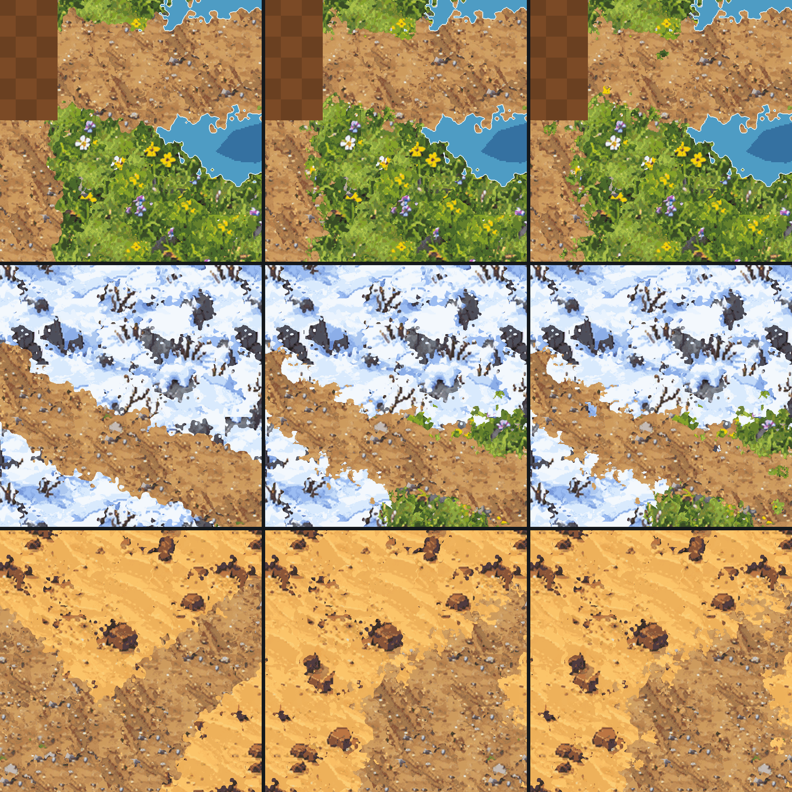
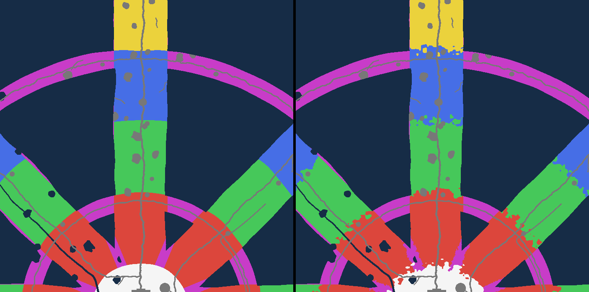
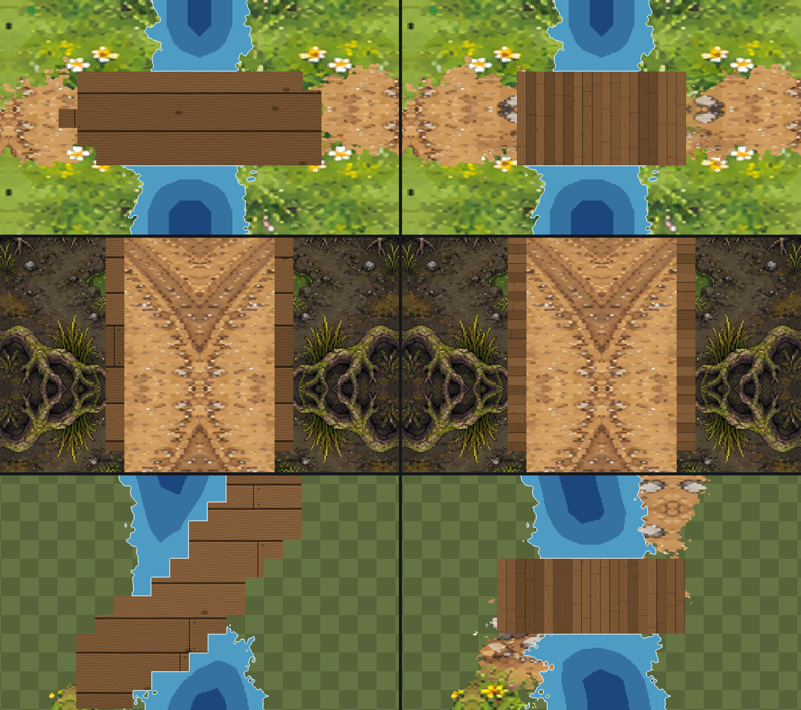
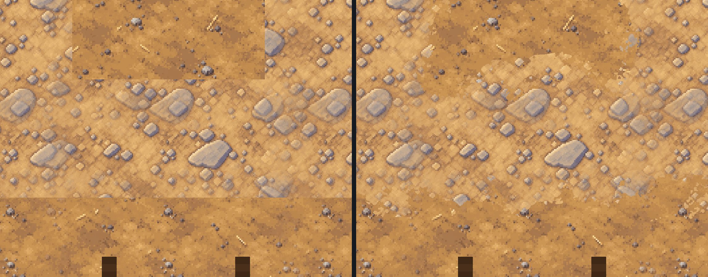
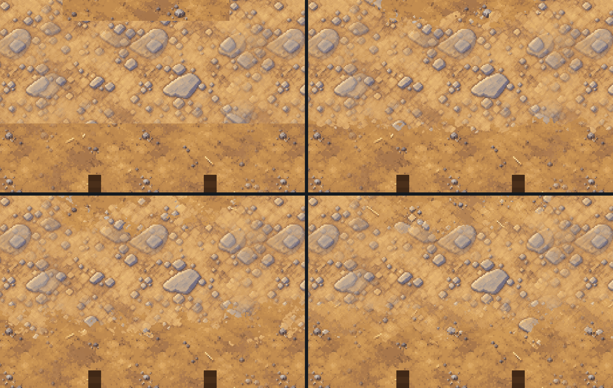
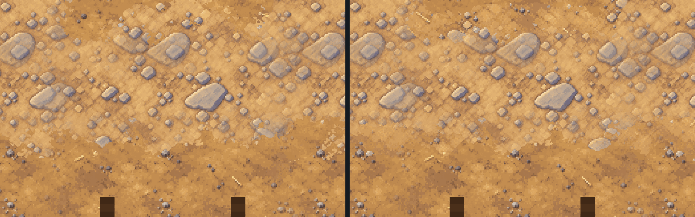
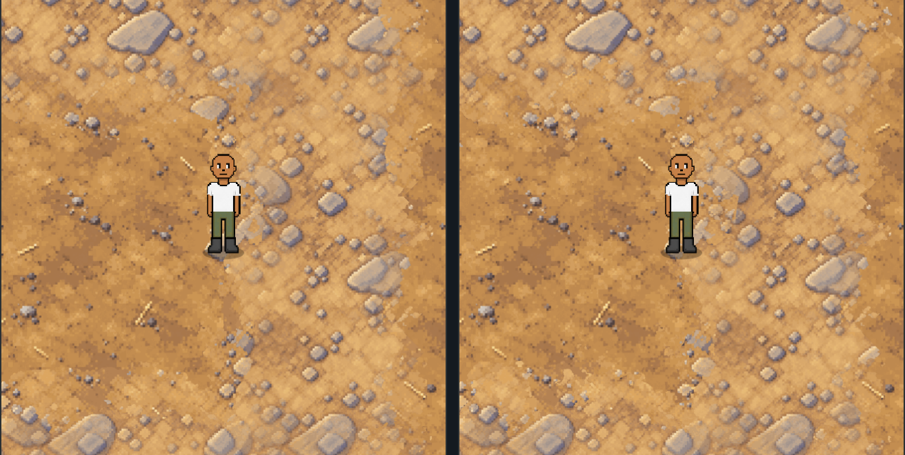
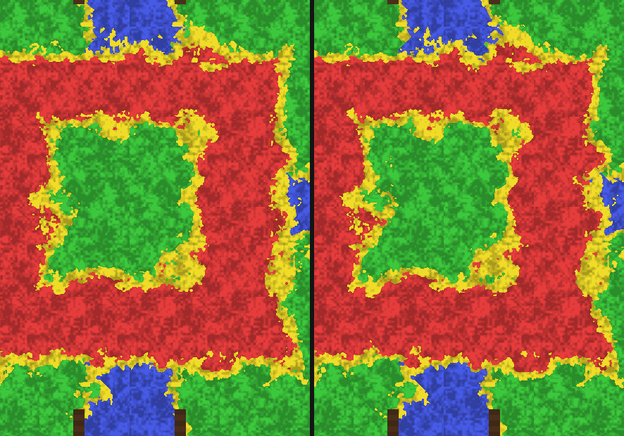
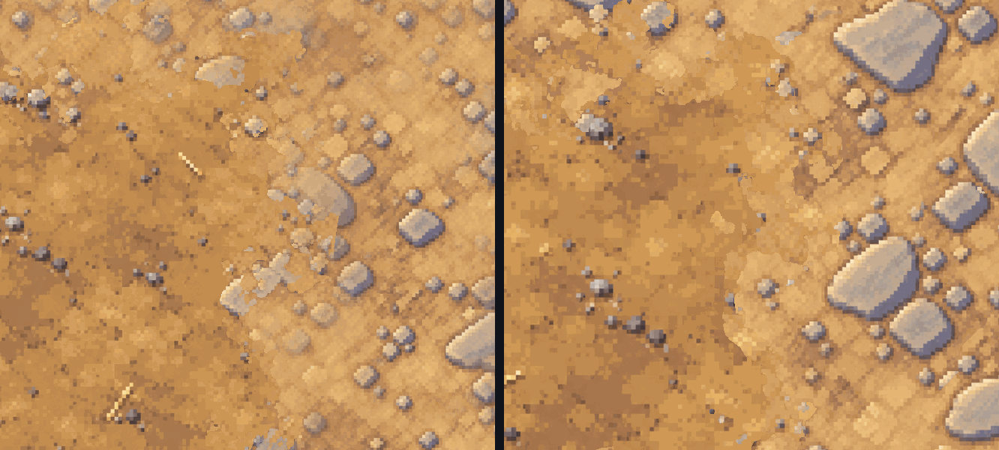
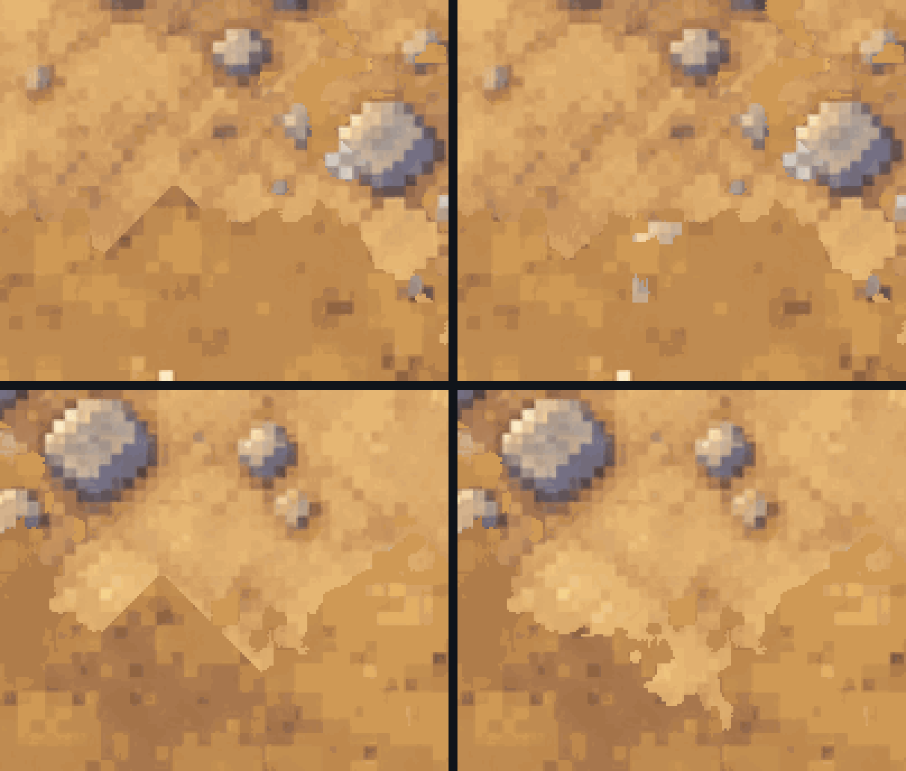

# One Seamless World — the grid, the prompts and the fuser (v2.3.2931–2936)

**Status:** Phase 1 is shipped: the **World Builder** page
(`public/tools/world/`, live at `/tools/world/` on the site).

- No game code has changed yet, apart from the `?trial=world` switch
  (v2.3.2932, below) and the `?trial=wheel` switch (v2.3.2943, below: the
  Wheel at full size, its ground laid on the phone from your swatches).
- The world plan in `public/tools/world/plan.js` is the source of truth for
  the map's layout.
- **v2.3.2933 asked two questions before phase 2; v2.3.2935 has both
  answers** (World Bible §6 and §13):
  - the new world is **HD pixel art** (on a 1.5 game px grid until
    v2.3.2942; since then every picture is kept at 2 px per game px, the
    phone's own sharpness). Every prompt here now asks for it;
  - the ground is **baked from swatches**, not painted square by square.
    ChatGPT's pixel art holds about half a square's width per picture, so
    squares are no longer painted one picture each. This page stays the
    plan, the blueprint (where every swatch, road, shore and wall goes) and
    the home of the style key.
- **v2.3.2936: the plan is the Wheel** (World Bible §3): the commons round
  the town, a spoke of land for each of the eight elements with its own
  levels 1–80, sea between them, passes at levels 20 and 60, and a gate to
  the Dark or the Light realm (80–100) at every tip. The geometry is
  `core/wheel.js`; the blueprint stores every cell's level.
- The world's story and look (through-lines, regions, Brotown's Main
  Street, the style key, the character refresh) are written up for people
  in **[WORLD-BIBLE.md](WORLD-BIBLE.md)**.

> Owner, 2026-09-28: *"I'm wanting one seamless map and to have chatGPT draw it
> into squares. I'll need to fuse them together but have some type of grid and
> prompt system to construct the entire thing."*

This follows a feasibility study done the same day. It found that the zones
cannot be joined as they are:

- Every zone is a self-contained painting with its own framing and its own
  sun.
- Frost is a peninsula, tidal an island, town a cliff-ringed plateau, and
  ember and the dunes fade to horizons.

A seamless world therefore needs **new continuous art**, and art is the long
pole. This document covers how that art gets made; the engine work that
follows is at the end.

---

## The phases

| # | Phase | Who | State |
|---|---|---|---|
| 1 | **Tooling**: plan, blueprint, prompts, fuser, World Builder page | sessions | **shipped v2.3.2931** |
| 2 | **The style key**, then the first **ground swatches** in the **Ground Studio** (`/tools/ground/`, v2.3.2937), judged on a phone next to the bro. *(Before v2.3.2935: paint a test strip of squares round the town square.)* | owner | **next: the style key** |
| 3 | **Make the ground**: every swatch, baked onto the plan. *(Before v2.3.2935: paint every land square.)* | owner + sessions | — |
| 4 | **Export for the game**: cut the fused world into streaming chunks under `public/maps/world/` | sessions | — |
| 5 | **Engine**: chunk streaming, region from position, server interest by region (see "What the game needs") | sessions | — |
| 6 | **Walls, climbing, jumping** from the blueprint's terrain classes | sessions | — |

Phase 2 exists so the style key, the prompts and the fuser can be tuned on
real ChatGPT output before hundreds of pictures are made with them.

---

## The owner's loop

**Once, first: the style key.**

- The page's **Style key** card shows a prompt. Ask ChatGPT with it until
  you love the look, then save the picture in the card.
- From then on every prompt asks ChatGPT to match it, and you attach it next
  to every template. On a phone, **Share…** sends both.
- Why this matters, and the HD pixel art rules it carries: [WORLD-BIBLE.md §6](WORLD-BIBLE.md#6-one-look-for-everything-brotown-hd-pixel-art).

**Then, per square:**

1. Open **`/tools/world/`** on the site.
   - The map shows the plan with the grid over it.
   - Squares outlined in gold are **ready**: their neighbours are finished,
     so ChatGPT will see real edges.
   - **Next square →** picks the best one. The first is always Y25, the town
     square.
2. **Save the template picture.** It shows the square's piece of the plan in
   flat colours, with the finished art of its neighbours already painted
   along its edges.
3. **Copy the prompt.**
4. In ChatGPT, start a **new chat**. Attach the template and the style key,
   paste the prompt and send. Save the picture it makes.
   - If it added a border, text, a building on a plot or a horizon, ask
     again. That is cheaper than fixing a seam.
5. **Bring the picture back** (choose it, drop it, or paste it).
   - The page lines it up, matches its colour and cuts the seam.
   - It then shows the join with a grade: *Seamless*, *Joins well*, *May
     show* or *Try again*.
6. **Keep it** or **Try again**.

**Keeping the work safe:**

- Work is kept in the browser on that device.
- **Download backup** gives a `.zip` of every ChatGPT picture and the style
  key. **Restore backup** rebuilds the whole world from it on any device.
- The page asks for a backup every 5 squares.
- iPhone Safari may reload the tab while you are in the ChatGPT app; the
  page reopens the square you were on.

---

## How it works

### The grid, and growing it later

**Names.** Squares are named like a spreadsheet, fixed by a **frame of
49 × 49** (A1 is the north-west corner, AW49 the south-east).

**What is planned today.** The **active area** in the middle of the frame:
**G7 to AQ43, 37 × 37 squares**. **Y25** sits exactly on the world centre,
and holds the town square. (v2.3.2936: the frame was 25 × 25 round M13
until the Wheel needed room for its spokes; nothing had been painted.)

**Size of a square.**

- Each square is **1024 px** of art, and each ChatGPT picture is resampled to
  that. ChatGPT returns 1024 or 1254 px squares depending on the day.
- Squares **overlap by 256 px (25%)** on every side, so origins sit 768 px
  apart.
- The overlap is where the seam goes. It is also all the model ever sees of
  a neighbour, which is why it is generous.

**Size of the world.**

- The active area is 37 × 768 + 256 = **28,672 art px**. At **1.5 game px
  per art px** (one pixel of the HD pixel art, v2.3.2936; it was the old
  town painting's 1.3), that is **43,008 game px**.
- The Wheel inside it is about **490 zones of land** (a zone is today's
  1,024 × 1,024 game px). From the Town Hall to a spoke's gate is about
  **2 minutes** at a run.
- **536 squares have land.** 833 are open sea between and round the spokes.

**Growing.** Owner: *"how would I expand the game later?"*

- Widen `plan.active`, in any direction. Nothing already painted moves or is
  renamed.
- The frame can grow too (south and east), because the world centre is
  pinned to square Y25 rather than to the frame's middle.
- This works because every value in the blueprint is a function of absolute
  position:
  - plan positions are measured in squares from the centre;
  - noise is sampled at those positions, on a lattice aligned to absolute
    cells;
  - scattered features sit on a **hashed lattice**, not a random sequence
    whose every draw would shift when the area grew.
- The core suite proves it: it grows the active area and the frame, and
  checks that the plan under every existing square is bit-for-bit unchanged.
- The ways to use new room (longer spokes, islands, underground) and why
  more players need more worlds rather than more squares:
  [WORLD-BIBLE.md §9](WORLD-BIBLE.md#9-growing-the-world-and-the-load-it-can-carry).

**When the plan changes under painted squares.**

- Every kept square records a **plan key**: a fingerprint of its piece of
  the blueprint.
- If a later change touches it (a road moved, the coast pushed out), the page
  names exactly those squares for repainting, and no others.
- The positions, the scale and the seed still decide where everything sits;
  descriptive text (paint, zones, borders, style) is safe to change at any
  time.

### Brotown is part of the plan

**The town is drawn as a Main Street town, from the plan, like everything
else** ([WORLD-BIBLE.md §5](WORLD-BIBLE.md#5-brotown)):

- streets, a town square, boardwalks and 17 EMPTY building plots;
- four gates, with the Old Roads leaving from them.

**Buildings become separate sprites standing on their plots.** The game
depth-sorts sprites by their ground line (`depthSort.js`), so a player can
walk behind a building. A building painted into the ground can never cover
a player standing behind it.

**The old town painting is no longer the centrepiece.**

- `town_v17` was the anchor of the first plan.
- The anchor machinery stays (`plan.anchors`) for any painting that must be
  kept exactly as it is, but none is used by default.

### The blueprint (`core/layout.js`)

**What it is.** A colour-coded plan of the active area: one cell per 16 art
px (1,792 × 1,792 cells; 8 before v2.3.2936). Each cell holds four things:

- a terrain **class**: ground, road, thick trees/rocks, water, sea, cliff,
  lava, landmark, street, boardwalk, plaza, building plot, river, railway,
  bridge or gate;
- a **region**: the town, the commons or one of the eight spokes;
- a **stage**: which of its spoke's four looks, one per 20 levels (stored as
  `band`);
- a **tier**: the level, five levels a tier, 1 to 16 along every spoke, and
  0 where no monster goes. It is the level map a game system asks "how
  dangerous is it here?"

**It is deterministic.** It is built from the plan's seed, so every device
builds the same world. It avoids `Math.sin/cos/pow`, which may differ in the
last bits between Chrome and Safari: the spokes point along the eight
compass directions, made with square roots alone (`core/wheel.js`). It
builds in about 1 s on a desktop.

**What the layout contains (the Wheel, v2.3.2936):**

- **The commons** round the town, safe, and **eight spokes** of land, one
  per element, where the World View painting has the zones: frost NW,
  flame N, wind NE, stone E, storm SE, water S, venom SW, flora W. Sea
  between them. Each spoke is a capsule from the centre, three zones wide,
  with a ragged coast.
- **Passes** joining neighbouring spokes across the sea at levels 20 and 60.
- **Brotown**: Main Street and Market Row, the square, the boardwalks and
  plots.
- **The roads**: a trunk down every spoke from the town gates to the tip,
  the passes, and footpaths to the Arena, to Prospector's Circle and to the
  landmarks beside the roads.
- **The Sweetwater River**: a smooth meandering curve from the glacier on
  Frost Ridge to the lagoon between the Poison Forest and the Water Caves.
  Its falls are cut through a cliff, and a bridge is stamped wherever a road
  crosses it.
- **The mine railway**, with its branch and its abandoned spur through the
  passes.
- Plots for the Rail Depot, the Old Mill, the Arena and 32 camps (levels
  20, 40, 60 and 80 on every spoke).
- Each spoke's woods, ponds, cliffs and lava, by stage. The Buried City,
  the Great Cave and the Foundry Dome partway out, and a **keystone gate**
  at every tip.

**The roads, camps, passes, river and railway are laid out from the wheel's
geometry** at the end of `plan.js`, so they always run where the spokes are.

**The builder's Levels view** colours every land square by its tier, green
at level 1 to red at 80, and each square's title says which levels it
holds.

**Job 1, today: the sketch in every template.**

- It keeps roads, rivers and coasts continuous across squares before
  anything is painted. The main source of seams in tiled AI art is two
  squares disagreeing about *where* things are.
- Outlines are smoothed, so the model is not shown 8 px stair-steps to copy.

**Job 2, later: the game's collision map.**

- The `walk` flag on each class says whether you can stand there, and cliffs
  are where climbing goes.
- Walls are drawn *first* and painted to. That is the reverse of the two
  failed attempts to trace walls off finished paintings (`tiledMaps.js`
  v2.3.1693 and v2.3.1794).

### One light for the whole world

- Electric Foundry is painted at night today, and Stone Hollows inside a cave.
  In one continuous map, a day/night line at a region border would be the
  worst seam of all.
- So every square is painted in the **same daylight**, from the upper left.
- A region's mood comes from its materials (black iron, glowing crystal).
- The game can still darken a region as you walk in, using the atmosphere
  layer it already has.

### The prompt (`core/prompt.js`)

Each prompt is built from four things only.

**1. The style bible** (`plan.style`, `plan.never`), identical for every
square:

- a steep three-quarter top-down view with no horizon and no perspective;
- daylight from the upper left, with shadows to the lower right;
- painterly detail matching the finished edges;
- the scale: a person ≈ 90 px, a tree ≈ a person;
- never text, borders, vignettes, sky, people, monsters, or buildings
  (plots stay empty).

**2. The style key**, when saved: *"paint in exactly the style of the style
key … but do not copy its tiles"*.

**3. What the blueprint puts in the square:**

- **Its region and band.** For example *"Frost Ridge — the snowbound taiga:
  deep snow with wind-carved drifts …"*, plus the next band when the square
  crosses into it.
- **Any other region coming in**, and the **border landscape** between them
  (steam fields, ash dunes …).
- **Brotown's streets and plots**, including which gate a street ends at.
- **Every road, the river and the railway, with the edges they cross.**
  *"The Sweetwater River flows in from the top edge and out by the bottom
  edge"*; *"The Frost Trail comes in from the right edge and ends at the Ice
  Spires"*.
- **The places**: landmarks, the plots outside town, the bridge and the
  falls.
- **A legend of only the colours this sketch shows**, each described in that
  region's terms. Frost water is "a frozen lake …", and the river gets one
  description per region it crosses.

**4. What is already painted:** which edges are finished neighbours.

Consistency across a hundred generations comes from the style key, the style
bible and the real neighbour pixels in each template. It never relies on
ChatGPT remembering earlier squares, which it cannot be trusted to do. A new
chat per square is fine.

### The fuser (`core/fuse.js`, `core/maxflow.js`)

ChatGPT redraws the whole picture, so the "kept" edges come back shifted, a
little zoomed, a shade off in colour, and with all the fine texture re-invented.
Pasting a square down as it comes would leave a line at every border. So:

1. **Align.** It finds the zoom and shift that best line the picture's kept
   parts up with the real finished pixels. This is a masked normalised
   cross-correlation, searched coarse-to-fine on a three-level pyramid, with
   zoom and shift refined *together*. When only one edge is known, a small
   zoom and a small shift look alike along it. Refining them separately left
   the far side of a square 3 px off; the fix is covered by a test.
2. **Colour.** A per-channel gain and offset, measured over the parts it was
   meant to keep.
3. **Seam.** A **minimum graph cut** over the whole overlap ("Graphcut
   Textures", Kwatra et al. 2003). The max-flow is Boykov–Kolmogorov.
   - Pixels touching finished art outside the square must stay old.
   - Pixels touching the square's new-only area must become new.
   - The cut runs where old and new differ least: round a tree, not through it.
   - One cut handles every overlap shape the grid makes: one band, an L, a
     corner block that only a diagonal neighbour painted, a full ring.
   - Pixels the alignment had to smear in at an edge never replace finished
     ones.
4. **Blend** across the cut over ~12 px, then write the square.

**Grades**, calibrated on real zone paintings cut into squares and damaged the
way a regenerated picture is:

| Case | Alignment match | Seam | Grade |
|---|---|---|---|
| clean re-render | 0.97 | 0.027 | Seamless |
| shapes moved 6 px | 0.92 | 0.03 | Seamless |
| shapes moved 15–30 px | 0.83 | 0.045 | Joins well |
| strong colour cast | 0.99 | 0.03 | Seamless (colour match absorbs it) |
| a different picture | 0.4 | 0.15 | Try again |

A fuse takes about 2 s per square in desktop Chromium. Expect 2–5 s on an
iPhone.

### Storage (`store.js`)

IndexedDB in the owner's browser:

- **the project record:** squares, order, grades, and each square's plan key;
- **every ChatGPT picture as uploaded:** these are the real asset;
- **the fused world** in 512 px PNG chunks;
- **the overview picture and the style key.**

**Backups.** A backup `.zip` holds the pictures, the style key, the order and
the plan keys. Restoring re-fuses the pictures in order and gives
byte-identical results, which the browser test checks.

**Redo.** Removes a square and re-fuses the world without it. It then lists
the squares painted after it that touched it, because they were painted to
match it.

---

## Tests

**`node tools/world/test-world-core.mjs`: 72 zero-dependency checks.**

- **Grid:** maths, the frame and the active area, Y25 on the centre, and one
  art px equal to one pixel of the HD pixel art (`style/bible.js`).
- **Growth:** widening the active area, and even the frame, changes the plan
  under no square. Moving one path changes only the few squares it crosses.
- **Blueprint:**
  - determinism;
  - sea at the corners;
  - the Town Hall in the middle of the square, both streets to their gates,
    17 plots each fronting a boardwalk, the depot, the mill and the arena;
  - **the Wheel**: eight spokes, one per element; down every spoke the tier
    climbs 1 to 16, one per zone, in four stages; the commons has no tier;
    sea between the spokes; 16 passes joining neighbours at levels 20 and 60;
    32 camps; 8 gates, four to each realm; a road to every gate and landmark;
    the town to a gate about 19 zones;
  - the railway into the Great Cave and the Foundry Dome, and the spur
    stopping short of the Buried City;
  - the river from Frost Ridge to the sea, the Mill Bridge and the Snake
    Bridge, the falls;
  - about 490 zones of land.
- **Prompts:**
  - the town square and streets, and a gate becoming a road;
  - the river's flow edges, the bridge, the fork, the mill and the commons'
    edge;
  - the river's source, the stage a square is in and the next one, a road
    ending at its gate, a pass with its border landscape, a pass joining the
    next spoke's road, and the abandoned spur;
  - the HD pixel style bible, and the style key line appearing only when a
    key is saved.
- **Max-flow** against brute force on 600 random grids.
- **Fusing** 9 damaged squares on a procedural painting:
  - shift and zoom undone to under 1 px;
  - every join great or ok;
  - the "ignored template" case and the border constraint.
- **The zip round trip.**

**`node tools/qa/world-page.mjs`: 38 checks in real Chromium**, against a
local server over `public/`.

- The plan, and Y25 offered first with a prompt that sets the look; the
  Levels view, and a spoke square saying which levels it holds.
- The style key saved, shown, and written into every prompt.
- Three squares fused through the real upload button:
  - The fake ChatGPT pictures are cut from a known "true" world (the meadow
    painting, tiled) and damaged with zoom, shift, colour cast and noise.
  - Y25 is damaged in colour only, because the first square defines the
    world's geometry.
  - They match the truth at about 31 dB after a colour fit.
  - The second square's template carries the first square's pixels.
- An unrelated picture graded "bad"; a non-square picture centre-cropped.
- Surviving a reload: the squares, the square you were on, and the style
  key.
- Plan keys recorded; Redo.
- A backup restored into a fresh browser profile, with byte-identical
  pixels and the style key.
- Screenshots with `WORLD_SHOTS=<dir>`.

**`node tools/world/render-plan-images.mjs`** regenerates the plan pictures
in `docs/world/` from the live plan: the Wheel with its levels, names and
gates (`wheel-plan.png`), the builder's map with every land square's name,
and Brotown close up.

None of these is on the CI path, following the owner's 2026-07-16 directive.
Run them when touching `public/tools/world/`.

---

## The Ground Studio: making the ground from swatches (v2.3.2937)

> Owner, 2026-09-29: *"Yes definitely do the swatches."*

**What it is.** A page at **`/tools/ground/`** where the owner makes the 48
ground swatches the Wheel needs (World Bible §13):

- **The catalog** comes from the plan (`core/ground.js`, `groundCatalog`):
  four stages per spoke, the commons, the town's yards, street, boardwalk and
  square, roads, the railway bed, lava, and the eight border lands. Each has a
  ground-only brief.
- **The prompts** (`public/tools/ground/prompts.js`) are the brief, the HD
  pixel art paragraph and the quiet-ground rule (`public/tools/style/
  bible.js`), and the scale line. The owner attaches the style key, and only
  the key: the bro is simpler pixel art than the world, so since v2.3.2939 his
  size is given in words instead (World Bible §6).
- **Nothing in a swatch runs one way** (v2.3.2944, World Bible §6 rule 12).
  Owner, on the first Main Street in the game: *"It's tiling wagon trails
  sideways and it doesn't look good. Any specific detail that would look bad
  when placed in the wrong direction tiled is probably not a good prompt."*
  A swatch is laid the same way up everywhere, so every prompt now says so
  (`NO_DIRECTION`), and eleven briefs that asked for ruts, planks, tracks,
  ripples, rows or streaks, or long plates and wires, were rewritten (the
  street, the road, the boardwalk as a basket weave, and eight stages and
  borders; v2.3.2949 made the boardwalk plain boards again, laid by the
  game: see "Bridges and boardwalks" below). A test fails
  if a brief ever asks for one again. Each picture now records the brief it
  was made from, and a swatch made from an older one says **"Made from an
  older prompt … make this one again"** on its card.
- **Each picture brought back** is squared, made seamless (since v2.3.2953
  by a hard cut where its two ends look alike, not a cross-fade: see
  "Seamless by a cut" below), shrunk to one
  1,024 px tile covering 512 game px (2 px per game px since v2.3.2942: the
  1.5 game px grid blew ChatGPT's picture up, soft and gritty), and moved
  onto the one shared palette with
  stray pixels cleaned up (`public/tools/style/process.js`).
- **The palette** is made from the style key (weighted) and every swatch so
  far, taken in name order so the same pictures always make the same colours,
  with the game's effect colours kept. **Freeze** fixes it; after that every
  new swatch is moved onto exactly those colours.
- **Phone memory.** A full set is 96 pictures. The page keeps only the
  finished tiles' pixels at full size; each seamless tile before the palette
  stays a PNG, decoded only while the colours are redone, and the colours are
  made from small copies (about 200,000 pixels in all).
- **The preview** composes the real plan round a chosen spot at game size
  (1,024 game px of height on a phone-shaped screen) with the bro standing in
  the middle, and says which swatches are on screen and which are not made
  yet. The progress map shows the whole Wheel, each swatch in its own
  colour once made.
- **Download all** gives one zip: `manifest.json` (the palette, the swatch
  list), `ground/<id>-<A|B>.png` (the tiles as the game will use them) and
  `originals/` (ChatGPT's pictures as uploaded). It restores into any
  browser. The owner uploads it to GitHub; a session unpacks it into the game.
- **The style key** is read from the World Builder's own storage on the
  same site, so it is made once.
- **"Saved on this phone"** (v2.3.2946) heads the page: which swatches this
  browser holds, by name, and when the last picture went in. Owner: *"I
  can't tell if the ground studio has saved what I put in earlier."* The
  trap it names: storage belongs to the browser, and **the Claude app's
  built-in browser and Safari keep separate copies** of the same site, so
  work made in one is missing from the other (and from the game opened in
  the other; the Wheel trial's readout says "swatches none in this
  browser"). Use one of them throughout; Download all and Restore move work
  between them. The page also asks the browser to keep its storage when the
  phone runs short of space (`navigator.storage.persist`).

**How the ground is laid** (`core/ground.js`):

- `materialMap` gives every blueprint cell a swatch: water for the sea, the
  river and ponds (drawn by the game, not a swatch); the town's own
  surfaces; roads, the railway bed and lava; the commons; and on a spoke its
  stage's swatch, or its border land's where it meets a neighbour (on a pass,
  or near the line halfway between two spokes at their bases).
- `composeGround` gives every pixel of a rectangle the swatch whose share of
  the ground round it (a blurred field over the cells), plus a little noise of
  its own, is highest: the edges come out ragged, in clusters, like a pixel
  artist's, and never blended. Two versions of a swatch share the ground in
  large noisy patches. Tiles are anchored to the frame, so rectangles
  composed apart meet with no seam. Since v2.3.2947 that line is only where
  an edge starts: see **Where two grounds meet** below.
- **Built surfaces are the exception** (v2.3.2945): the street, the
  boardwalks and the square (`BUILT` in `ground.js`) are laid exactly on
  their cells, straight-edged, over the natural ground, which takes no
  account of them. The owner saw "wooden plank bits" along Main Street:
  the boardwalks are one cell wide, and between a street and a yard a
  blurred field gives all three about a third, so the noise decided every
  pixel. The walk grid never blocks a built cell, so a one-cell bridge over
  a wide river is walkable.

**Tests.** `node tools/world/test-world-core.mjs` checks the catalog, each
spoke's stages and its passes' border land, determinism, seamless chunks,
tile-true laying and the not-made-yet colour. `node tools/qa/ground-studio.mjs`
(38 checks in real Chromium, at a phone's size) checks the prompts (only the
style key attached, never the bro, every material drawn as itself: v2.3.2939,
and nothing running one way: v2.3.2944), a picture made from an older
prompt marked to make again,
the style key from the World Builder, a picture in through the real file input coming
out 512 px, seamless, hard-edged and on the palette, the map and the preview,
frozen colours, a reload, and a zip restored into a fresh browser with the
same pixels, and (v2.3.2947) the edge-pieces prompts and pictures below
(v2.3.2948: put away, so the test first checks the page shows none of them,
then opens it with `?edgepieces`).

## Where two grounds meet (v2.3.2947)

> Owner, 2026-09-30: *"There needs to be specific and additional prompts for
> when two swatches have a contact area to make a smoother transition.
> Otherwise the change between two swatches is still too jarring and
> obvious. Also layers need to be correct (grass slightly overlapping dirt
> areas). I'm thinking of an irregular border area for when things like
> grass and dirt come together but likely that border area will need to vary
> in size depending on what two swatches are coming together. I'll let you
> think about what other considerations there are and how you can think of
> the best solution."*

**Why it looked jarring.** Two unrelated pictures met on a ragged line cut by
noise. Nothing of either crossed it, nothing lay on top of anything, and the
contrast was sharpest exactly at the line. Every pair looked the same, whether
a road's edge or meadow turning to snowfield.

**What the game does now, at three sizes** (`public/tools/world/core/ground.js`):

1. **Stages change over a wide band, in patches** (`materialMap`,
   `landStage`). Each land cell's stage (the commons as −1, a spoke's stages
   0–3) is averaged over about a dozen cells (~300 game px) either way; the
   patches are cut from that average plus noise that is strongest halfway
   between two stages. So the next stage arrives as islands that grow and
   join over about a screen either side of the old line, and the commons
   meets each first stage the same way. Border lands wobble in and out too.
   The levels (tiers) do not move: only the ground's look.
2. **Every edge is a band whose width is the pair's** (`edgeRecipe`,
   `composeFine`).
   - **One layer order** of materials, bottom to top: liquid (lava); roads and
     the railway bed; bare rock; metal floor plates; earth and mud; sand and
     ash; moss; grass; ice; snow (`KIND_OF` gives each swatch its kind). The
     higher one is the **upper**: it reaches over the lower by `reach` game
     px, and the band round that line is `ragged` game px either way.
   - **Widths by kind** (`EDGE_SPREAD`, game px): a road's edge is narrow
     (reach 1, ragged 6), rock 2/7, earth 3/9, grass 5/12, snow 5/13, sand and
     ash 5/14, metal plates 0/2 (almost crisp). Both vary along the edge by
     up to half again, so it wanders. Two grounds of the **same kind** (one
     grass giving way to another) interlock evenly with no upper
     (`EDGE_SAME`).
   - **The edge is drawn from the pictures themselves.** In the band each
     pixel goes to whichever ground stands higher there: its brightness,
     ranked within its own picture and averaged with the pixels two either
     side (the lit tips of grass blades, a pebble's top, a snow lump stand
     high; the shadows between them lie low), plus patches a few game px
     across, against a ramp across the band. So grass reaches over the road
     in its own tufts and the road shows through the gaps; every pixel is a
     pixel of one of the two pictures, so nothing is blended and the palette
     holds.
   - **No crumbs.** Any bit of one ground an edge leaves that is smaller
     than a tuft (`EDGE_BIT`, 20 picture px) goes to the ground round it.
   - **What keeps its crisp edge:** the water's shore (drawn by the game) and
     the town's street, boardwalks and square (v2.3.2945's straight,
     surveyed edges). That is a choice, easy to change for the street.
3. **Edge pieces, one prompt per ground** (`pieceMap`; the Ground Studio's
   third slot under each swatch, `edgePromptFor` in
   `public/tools/ground/prompts.js`). The owner's "additional prompts".
   - **Put away (v2.3.2948).** Shown the picture above, the owner: *"I don't
     see any difference I'll put away the edge piece stuff. You can hide it
     or whatever in case we want to bring back later."* The middle column is
     the right one without its loose pieces: the edge did the work. So no
     tool shows or loads them now (`EDGE_PIECES = false` in
     `public/tools/world/core/ground.js`): the Ground Studio has no slot,
     prompt, step or paragraph for them, its preview lays none, the saved
     list and the colours leave them out, and the game's worker leaves them
     unread (so no chunk pays the wider margin). Nothing is deleted:
     pictures already made stay saved, go in the zip and restore, and
     everything below still works and is tested. **To try them again, add
     `?edgepieces` to the address** (the studio's, or the game's:
     `?trial=wheel&edgepieces`); to bring them back for good, set
     `EDGE_PIECES` to `true`.
   - **Per ground, not per pair.** 208 pairs of grounds touch on the Wheel;
     the road alone meets 46. One picture of a ground's own loose pieces
     works against every ground it lies over. 39 of the 48 swatches have one:
     every kind that is ever the upper (not the town's surfaces, the road,
     the railway bed, lava or the metal floors).
   - **Pieces, not a picture of an edge.** Every picture is laid the same way
     up (World Bible §6 rule 12), and an edge drawn in a picture runs one
     way. So the prompt asks for 40–60 separate pieces (tufts, clumps, lumps,
     drifts, stones: `PIECES` by kind) on one flat magenta, none touching
     another or the picture's edge; the game draws the edge's shape.
   - **Matched to the ground.** It is sent in the chat the swatch was made
     in, or with the style key and the swatch attached (`EDGE_MATCH`): the
     one chat shown more than the key, because the pieces must be that
     ground exactly.
   - **In the studio** the magenta is cut away (`keyOut`, only when the
     background really is magenta), the picture is kept at 1,024 px and put
     on the palette, and only whole pieces are kept: none the picture's edge
     cuts, no crumbs, none over 96 px across. The card says how many were
     found (or why none), what the ground lies over, and "See an edge on the
     map" jumps the preview there.
   - **In the game** each piece has a fixed place in the world (the picture
     repeats like a swatch, three times over at offsets, never turned, since
     everything is lit from the upper left). It is laid whole, or not, by
     what lies under its middle: a ground it lies over, within 14 game px
     beyond the upper's ragged edge, thinning out with distance. Pieces go
     into the label map before the tidy-up, so a pocket of road left between
     a tuft and the grass is tidied too.

**Chunks still meet with no seam.** Everything is a function of position: the
ground is worked out far enough beyond each rectangle (27 art px when there
are edge pieces, 23 without, only 2 where no edge is near) that any edge, any
crumb and the middle of any piece that can reach it are seen whole. The
distances are whole-number chamfer distances (3 a step across, 4 corner to
corner), so they come out the same to the last bit in any rectangle.

**Cost.** Measured in the Wheel trial (desktop Chromium, local server): a
piece of ground took 32 ms on average (about 30 ms before), with no pop-ins;
28 to 30 ms with the edge pieces put away (v2.3.2948). Building the plan takes
about 0.1 s longer (the stage patches). A phone is slower: the box in the
bottom left shows the real numbers, and, only with `?edgepieces`, a line
**edges N with edge pieces** says which edge pieces the game found.

**Tests.** `node tools/world/test-world-core.mjs` (109): the layer order and
widths, the pairs that touch, stage patches near the line and none far from
it, the same map every time, halves composed apart matching the whole with
edges and edge pieces, every pixel a pixel of a picture, the grass reaching
onto the road far more than the road shows through, no crumbs, pieces
laid whole, and the pieces off unless the address asks (v2.3.2948).
`node tools/qa/ground-studio.mjs` (41): the page shows no edge pieces, and
with `?edgepieces` the explanation, the 39
prompts, a ChatGPT-shaped pieces picture cut out whole (none cut by the
picture's edge), no magenta left, the preview showing them on the road, the
zip carrying them, a browser without `?edgepieces` keeping them but showing
none, and a picture with no magenta background giving no pieces and saying
why. `node tools/qa/mp/run.mjs wheeltrial` (28): the game leaves a ground's
edge pieces made in the studio unread, and a worker told `?edgepieces` finds
them.

## Bridges and boardwalks: plank decks (v2.3.2949)

> Owner, 2026-09-30, on the Mill Bridge in the Ground Studio: *"The bridge
> needs to take shrink the tiles and maybe make them line up using your
> coding I had to change the checker pattern wood the original prompt made
> it didn't look right. For the mill bridge by the west gate (and probably
> used elsewhere too)."*

**Why it looked wrong.** The boardwalk swatch, which the town's boardwalks and
every bridge use, was laid like any other ground: the same way up
everywhere, at the picture's own size. A plank picture's boards came out
about 48 game px wide, half the bro's height, running along the Mill Bridge
instead of across it. A bridge was also the road's own discs stamped wider
over the water, so its ends were rounded and ragged, and on a diagonal
crossing (the Snake Bridge, the Verdant–Frost pass) it was a staircase. The
basket weave that v2.3.2944 asked for, so that nothing ran one way, came
back as a checker pattern.

**What the game does now:**

1. **Every boardwalk and bridge is a deck** (`public/tools/world/core/layout.js`,
   `bp.decks`): a rectangle of cells, and the way you walk along it
   (`along`, `x` or `y`). The town's boardwalks are each plot's strip along
   its street. A bridge is now a straight deck, square at both ends, laid
   across the river the short way (along `x` or `y`, whichever crosses less
   water at the road's crossing). It reaches `BRIDGE_PAD` (2) cells onto
   both banks, bank to bank on every row even where the river runs aslant,
   and is as wide as the road's old bridge. Where the road reached the bank
   off the deck's end (a diagonal crossing), a short stretch of road joins
   it on (`joinRoad`). The Mill Bridge is 9 × 5 cells; the other two are
   10 × 4 and 11 × 4. Bridges stay walkable, and the river under them
   stays water.
2. **The game lays the boards itself** (`public/tools/world/core/ground.js`,
   `planksOf`, and the plank branch of `composeFine`):
   - it finds which way the picture's boards run (lines along a board stay
     on one board, so their brightness differs board to board) and where
     the seams are (the darkest line within about a third of a board, most
     clearly dark first, spacing found past the wood's grain);
   - it makes the picture smaller, area-averaged and snapped back onto the
     picture's own colours, so its middle board is **12 game px** wide, half
     a cell (`BOARDS_PER_CELL`);
   - it lays the boards **across** every deck, one board per half cell of
     the whole world, so every seam lines up with the deck's ends and with
     the next deck along the street;
   - each board is one of the picture's boards, picked and slid along its
     length by its place (A and B mixed board by board), so a long boardwalk
     does not repeat.
   With no picture yet, a deck shows its boards in the plan's two colours.
3. **The prompt asks for plain boards** (`PLANK_BOARDS` in
   `public/tools/style/bible.js`, the catalog's `laid: 'planks'`): boards
   that all run one way, about twelve to sixteen of them, big and clear,
   with a dark gap along both sides. It is the one swatch that may run one
   way, because the game turns it. A picture made while the prompt still
   asked for the basket weave is not marked to make again (`accepts`): the
   owner made planks with it.

**Cost.** A plank picture is got ready once (about 30–100 ms, kept with the
picture). A piece of town ground with a plank picture took about 10 ms here
against 8 before; the Wheel trial's pieces averaged 33 ms, as before.

**Tests.** `node tools/world/test-world-core.mjs` (117): every bridge a
straight deck with the road at both ends; every boardwalk and bridge cell on
a deck; the boards 12 game px, across the deck and starting at its ends (the
plan-colour boards checked pixel by pixel); a plank picture's boards found
(uneven widths, either way round, the same result); each board laid whole,
every pixel the picture's own colour; a deck laid in two halves matching it
laid whole. `node tools/qa/ground-studio.mjs` (42): the boardwalk's prompt and
card, and the owner's planks not marked to redo. `node tools/qa/mp/run.mjs
wheeltrial` (28).

---

## Alike grounds mix (v2.3.2950)

> Owner, 2026-09-30, with their own town-square and yard pictures in the
> Ground Studio: *"The problem surfacing is still the harsh transitions
> between different surfaces even if they're similar in theory. … It looks
> obvious and unnatural. One idea I have is to have chatGPT make a blend of
> the two surfaces that are mapped together."* And, steering: *"Focus on the
> area near the player where the dirt transitions from one type to the
> other."*

**Why it looked that way.** The town's street and square were laid on their
cells with crisp edges (v2.3.2945, to save the one-cell boardwalks from
crumbling, and "a surveyed town has straight edges"), so the v2.3.2947 edges
never reached them: the square's pale, stony dirt met the yards' orange dirt
along a ruler line, just below where the bro arrives, and round the Town
Hall's plot.

**Four ways, tried on the owner's own pictures at that spot**
(`docs/world/dirt-mix-options.png`): now; a plain soft edge (still read as a
line, only wobbly); a wide mixing zone; and the same zone with the owner's
blended third picture in its middle. The wide zone did most of the work;
the blend added a little more in-between texture, for one more picture per
pair of grounds. So the game now does the zone by itself, everywhere two
grounds are alike, and a blend slot can come later if it is wanted. (It
came in v2.3.2951: "Blend pictures", below.)

**What the game does now** (`public/tools/world/core/ground.js`):

- **Alike grounds MIX instead of meeting at an edge** (`MIX`, `edgeRecipe`):
  two of one kind (the square, the street and the yards are all earth now;
  one meadow and the next; snow and snow), or two of the loose, dry family
  (earth, sand, ash). The change is spread over a zone about 36 game px
  either side of the line, wandering by a third either way.
- **In big patches, shaped by the pictures.** Inside the zone each pixel
  goes to one ground or the other by big patches of noise (about 30 and 75
  game px across, `MIX_PATCH`) against a ramp across the zone, plus the two
  pictures' own heights (`MIX_HEIGHTS`, as at an edge): so the square's
  stones hold on out into the yard's dirt, and the dirt comes in between
  them, the patches' rims following both pictures. Every pixel is still a
  pixel of one of the two pictures.
- **Not everything mixes.** A road stays a road (its edges stay narrow), and
  rock and ice keep their narrow even band, since their boulders and plates
  would be cut. Different kinds still meet at a layered edge (v2.3.2947).
- **The town:** the street and the square still lie on their cells (it keeps
  the town cheap to lay) but now MIX into the yards; only the boardwalks and
  bridges keep straight edges (`CRISP`).

**Cost.** Most of the town is now a mixing zone, so a piece of town ground
costs more to lay: about 20 ms in Node against 8 before, after caching the
slow noise on a coarse lattice, settling whole art px where the patches
alone decide, and a smaller lookup table. Elsewhere pieces cost about what
they did. In the Wheel trial (desktop Chromium, local server) the way in
took about 5 s against 4.5 s, a piece averaged about 42 ms against about 30,
with no pop-ins; a phone is slower, and its box shows the real numbers.

**Tests.** `node tools/world/test-world-core.mjs` (120): which pairs mix and
which do not; at the owner's own spot, the square's share of the ground
falling off across the zone and its last pixel wandering, every pixel one
of the two pictures', and the zone laid in halves the same as whole.
`node tools/qa/ground-studio.mjs` (42) and `node tools/qa/mp/run.mjs
wheeltrial` (28) as before.

## Blend pictures (v2.3.2951)

**Put away since v2.3.2955** (the owner choosing two pictures a pair; see
"Blend pictures, put away" below): everything here still works, but only
with `?blends` in the address.

> Owner, 2026-09-30, shown the four ways at their spot: *"Bottom right looks
> the best by a moderate margin than the bottom left. What's the performance
> tradeoff though?"* Told it: *"Yes build it"*.

**What it is.** Where two alike grounds mix (above), a pair may have a third
picture, a **blend**: the ground halfway between the two, made in ChatGPT
from the two pictures. The game lays it through the middle of the zone, so
the square turns into the yards through ground that looks like both.
Optional for every pair: a pair without one mixes exactly as before, to the
byte.

**How it is laid** (`public/tools/world/core/ground.js`, BLEND PICTURES).
The zone runs from one ground, through the blend, to the other, as **two
whole plain mixes** (v2.3.2952): the upper ground gives way to the blend a
little way (`BLEND_OFF`, 0.4 of a zone) to one side of the line, and the
blend to the lower ground the same way to the other, each change with a
plain mix's ramp, big patches and room, the pictures' heights shaping their
rims (at `BLEND_HEIGHTS`, 0.45), their big patches 1.3 times as strong as
a plain mix's (`BLEND_BIG`, v2.3.2953). The zone of a pair with a blend is
that much wider (1.7 times). Both changes are judged everywhere, so nothing jumps
at the line; the blend is most at the line and none is left at the zone's
sides (at the owner's spot, with stand-in pictures: 64% of the ground at the
line, about 40–50% 12 game px either side, none 60 game px out). Every pixel
is still one of the three pictures'. A blend is laid as a ground of its own,
so the tidy-up leaves no crumbs of it; blends are numbered by their pairs'
keys, so pieces laid apart still meet with no seam. `composeGround(...,
{ blends })` takes them by `blendKey(a, b)` (the two ids in order, joined by
`__`), and `blendsUnder` names the ones a piece can use.

> **v2.3.2952, the first fix.** Owner, on the first preview: *"Why does the
> top part of that patch look correctly blended but not the bottom? I can
> see its edge … Bottom looks like it has a noticeable straight edge where
> it transitions."* In v2.3.2951 each of the two changes had half the zone,
> on a ramp twice as steep, so the patches moved it half as far, and where
> they would have moved it further the zone's end stopped it. Along the
> bottom of the Town Hall's plot the yards therefore turned into the blend
> along a line running beside the plan's straight cell edge. Now, where the
> yards end wanders 11 game px against a plain mix's 12.6 (it was 6.8), and
> its straightest stretch is 17 game px against a plain mix's 33 (it was
> 30). A test holds it there.
>
> 

> **v2.3.2953, the second.** Owner, on that fix: *"Looks better but could
> use further improvement."* Two things were still wrong, and the larger
> was not the edge at all: the pictures' stones were see-through, which the
> seamless step did to every picture (next section). The edge itself:
> measured along every straight stretch of the town where the square meets
> the yards (the regions blurred as the eye sees them, every 100 game px
> window), the two changes still wandered less than a plain mix's edge at
> their straightest, the straightest tenth of the windows swaying 17 and 19
> game px against a plain mix's 25, because each change had only a plain
> mix's room. Now a blend pair's big patches are `BLEND_BIG` (1.3) times as
> strong, in a zone as much wider, so the zone's end cuts off no more than
> before: 27 and 23 game px at their straightest, the middle window 43 and
> 47 against 36 and 37. At the bottom of the Town Hall's plot the yards' end
> now wanders 12.4 game px (a plain mix's 12.6), its straightest stretch 13
> game px (a plain mix's 33). Tried and not taken: 1.5 times (bigger bays
> still, at twice the cost, hardly visible in the owner's pictures); a blend
> of varying width, in patches with gaps (a third dearer, and straighter
> at its straightest); and softened zone ends (straighter still). Pairs without a blend, and every
> other edge, are unchanged to the byte.
>
> 

**Where they come from.**

- **The Ground Studio** (`/tools/ground/`) has a **Blends** card below the
  swatches: every pair of alike grounds that meet on the Wheel (42), the
  town's three first (the square and the yards, Main Street and the yards,
  the square and Main Street), the rest folded away, longest meeting first.
  Each has its **blend prompt** (`blendPromptFor`): the ground halfway
  between the two, both briefs, the two pictures attached (not the style
  key: they already carry the style; never the bro), nothing running one
  way, seamless. A button beside it saves or shares the two ground pictures
  for the chat. A blend brought back is made seamless and put on the
  colours like a swatch, but it is never used to make the colours (it is
  made of two grounds already on them). It is marked to make again when one
  of its grounds is made again after it. It is kept under the pair's key as
  version `M` (`plaza__town-yard|M`), goes in the zip as
  `ground/<key>-M.png` with the original, listed in the manifest's
  `blends`, and restores.
- **The game's worker** (`ground-worker.js`) finds blends in both places it
  finds swatches (the studio's storage on the site, then
  `/world/ground/manifest.json`), unpacks the ones a piece needs, and lays
  them. The trial's readout says `blends  N made`.

**Cost**, measured on the owner's own pictures, laid the way the game's
worker lays them (desktop Chromium), since v2.3.2953:

| | without the blend | with it |
|---|---|---|
| a piece of town ground | about 22 ms | about 29 ms (27 in v2.3.2952: the blend's zone is wider again) |
| pieces its zone does not reach | | no difference |
| the Wheel trial, walking out of town and back | 44 ms a piece on average (v2.3.2951) | 49–51 ms (54 for v2.3.2952 in the same session: runs vary that much); one piece a moment late on screen in each of two walks, none with v2.3.2952 |
| memory while near the pair | | 1 MB more (the town's busiest piece needs 13 pictures of the 16 kept) |
| download, the first time near the pair | | one picture, about 0.9 MB |
| unpacking it | | about 50 ms, once, in the worker |

(With the heights at a plain mix's 0.7 instead of 0.45, the same fix cost
half as much again a piece, and six pieces came on screen late in the
trial: hardly any pixel of the wider zone could be settled a whole art px at
a time.)

The cost that counts is making the pictures: 42 pairs of alike grounds
touch on the Wheel. Start with the town square.

**Tests.** `node tools/world/test-world-core.mjs` (131): the key and its
pair; square -> blend -> yards at the owner's spot, the blend most at the
line and gone at the sides; every pixel one of the three pictures', `mat`
naming only real swatches; halves the same as whole; a blend for a pair
that does not mix, or none, changing nothing; and (v2.3.2952, tightened in
v2.3.2953) the yards turning into the blend along a ragged line at the
bottom of the Town Hall's plot, wandering at least nine tenths as much as a
plain mix's, its straightest stretch under half a plain mix's. `node tools/qa/ground-studio.mjs`
(55): the card, the prompt, a blend in and on the palette without shifting
it, laid in the preview to the pixel, marked to redo, through the zip and
back, removed. `node tools/qa/mp/run.mjs wheeltrial` (31): a blend made in
the studio is found by the game, named in the readout, and laid on screen
between the square and the yards.

## Seamless by a cut, not a fade (v2.3.2953)

> Owner, 2026-09-30, on the blend's fixed edge: *"Looks better but could use
> further improvement."*

Looked at again in their own pictures, the largest thing wrong was in every
picture, not at the edge: **stones you could see through**. ChatGPT's
pictures do not repeat on their own (on the owner's, the two ends of a
picture differ two to five times as much as neighbouring columns do), so
the Ground Studio makes each one repeat. It did so with the trial bake's
cross-fade: the picture laid over itself shifted half a tile, faded in
across the outer quarter each way. Three quarters of every tile was
therefore two pictures at once: every stone there see-through, the ground
between them the low-contrast mush that averaging two textures makes (the
town-seam trap in `docs/TRAPS.md`), and the middle of the picture shown
twice in every tile, so the ground repeated at half the picture's size.

**Now** (`seamless` in `public/tools/style/process.js`, `seamlessPixels` on
bare pixels): the tile repeats every *n − overlap* px. The picture's last
*overlap* columns are laid over its first, and the two meet along the
cheapest path down that strip, where they already look alike. That path
runs round the stones, not through them: it is found by dynamic
programming, each place costing how unlike the two pictures are over a
5 × 5 box, so a cut beside a stone in one picture costs as much as a cut
through it. Then the rows the same way, that path closing on itself round
the tile so it still repeats both ways. Every pixel is one of the picture's
own, none is shown twice, and the picture keeps its contrast (the owner's
square: 11.1 against 11.2 as uploaded, the cross-fade's 10.0). The overlap
is whichever of 12–20% of the picture joins best: ChatGPT's pictures carry
a pixel grid of their own, about 6.4 px, and some overlaps line it up
across the join better than others. The tile comes out that much smaller
(about 1,050 px of a 1,254 px picture) and is shrunk to 1,024 as before.
Making a picture seamless takes about a third of a second on a desktop.

**Pictures already saved are remade, once.** The first time the Ground
Studio opens, tiles saved the old way are made again from the pictures as
uploaded. A line on the page counts them ("Making your pictures seamless
the new way, once: 2 of 4…", about half a second each on a desktop), and
the mark `prepMade` in its storage says it is done. A restored zip is
always made from its originals. The game's worker reads the remade tiles.

**Tests.** `node tools/world/test-world-core.mjs` ("seamless"): a
ChatGPT-shaped picture (a coarse pixel grid, stones with rims, not
repeating) comes back square and an overlap of 12–20% smaller. Every pixel
is a colour the picture has (the cross-fade made 46% of them new), it is as
contrasty as it was, it repeats across its own edges, and it comes out the
same every time. `node tools/qa/ground-studio.mjs`: on the next load, tiles
saved without the mark are remade from the uploads, the same to the pixel,
and the mark is put back. The Style Lab uses the same step
(`node tools/qa/style-lab.mjs`, 34, unchanged).

## Where three grounds meet: no ruler lines (v2.3.2954)

> Owner, 2026-09-30, zoomed in on the town square: *"In each of your
> pictures there's a noticeable straight line. I want to avoid that."*
> And, on blends: *"If I can get good results faster with just the 2
> pictures instead of a 'blend' custom picture I'd rather do that."*

**Two pictures are enough.** Every pair of alike grounds mixes in big
patches with just its two pictures, and every other pair meets in the
layered edge. A blend (above) stays optional, for a pair that ever looks
wrong without one.

**The straight lines were where three grounds meet.** At a street's corner
the square, the street and the yards all meet. A pixel near there answered
only to its *nearest* other ground, and which ground is nearest changes
along the straight line halfway between them, 45 degrees off the corner.
A patch of the square reaching into the dirt was cut off along that line.
The street's two top corners each drew a "V" of two of them: the owner's
line.

**Now every other ground in reach has its say** (`edgeAt` in
`public/tools/world/core/ground.js`):
- A pixel goes to whichever of them its own pair's edge rule gives it to
  (`ruleAt`), so each patch keeps the shape its own edge draws.
- Where two would both take it, it goes to the one further past its own
  line (`marginAt`), each nudged by its own slow noise (`PARTNER_TIE`), so
  the line between those two wanders too.
- Where only one other ground is in reach (most edges), nothing changes, to
  the byte.

Tried first and dropped: picking the nearest by a noisy distance. It bent
the lines, but cut patches into thin slivers where it ran beside their own
edge (`docs/TRAPS.md` §122).

**One smaller kind of straight line went too.** A mixing zone's end
stopped a patch dead where the patch would have gone further, drawing a
line 20–35 game px long beside the plan's cell edge. Mixing zones now
reach 1.15 of their width (`MIX_LIM`). Pixels still cut off that way in the
town fell from about 4,700 to 1,700; everything inside the old zone is
laid as before.

**Measured** over the whole town, with a flat colour per swatch (the
longest run of edge pixels on one row, column or diagonal):

| | before | after |
|---|---|---|
| diagonals | 22 and 26 game px | 14 and 12 |
| rows and columns | 16 and 18 | 15 and 17 |

Open country's ragged edges (three mixes on the spokes) run 11–16 either
way.

**Cost**, on the owner's own pictures, laid the way the game's worker lays
them (desktop Chromium):
- a piece of town ground: about 22 ms before, 26 now;
- with the square's blend: about 29 ms before, 35 now;
- pieces away from corners and mixing zones: no difference;
- the Wheel trial's walk (`wheeltrial`): 57 ms a piece on average (49–54
  before, run to run), no ground late on screen in the final run (four
  pieces a moment late in one earlier run).

**Tests.** `node tools/world/test-world-core.mjs`: nowhere in the town does
an edge run straight for more than 18 game px, where three grounds meet
included (a flat colour per swatch; the old code fails on the diagonals).

**Still open** (the owner stopped the round here, "Save what you have so
far and call it good"): a short checkmark-shaped edge where the square's
patch pokes into the yards beside the street corner (shown in
`world/corner-lines-fix.png`, top right) -- its two sides run straight for
about 10 game px; and the owner's wish that a rocky ground lie ON TOP of
plain dirt where the two mix ("blanket rocks on top of dirt"), where today
a MIX pair has no upper and cuts through stones either way.

---

## Blend pictures, put away (v2.3.2955)

> Owner, 2026-09-30: *"If I can get good results faster with just the 2
> pictures instead of a 'blend' custom picture I'd rather do that"*; offered
> the Blends card hidden: *"Yeah hide it"*.

Once the plain mixes lost their straight lines (v2.3.2954), two pictures a
pair were enough. So the blends are put away exactly as the edge pieces were
(v2.3.2948): `BLENDS` in `public/tools/world/core/ground.js` is `false`, and
`blendsOn(search)` is true only when the address says `blends`.

- **Ground Studio:** no Blends card, no step for it, no mention of it; a
  blend already made is not counted, listed as saved or laid in the preview.
  It is still saved, goes in the zip and restores. `?blends` on the studio's
  address brings every part of it back.
- **The game:** the ground worker reads no blend unless the address says
  `blends` (`?trial=wheel&blends`), so every pair mixes on its two pictures.
- **Nothing is deleted:** `composeGround` still lays any blend it is given
  (`opts.blends`), and every blend test still runs. Bringing them back is
  the one line `BLENDS = true`.

**Tests.** `test-world-core.mjs` checks the switch; `ground-studio.mjs`
checks the card is hidden without `?blends`, still works with it, and that a
zip restored into a browser without it keeps the blend but shows none of it;
the Wheel walk (`wheeltrial`) checks the game's worker leaves the planted
blend unread, and that a worker told `blends` still finds it.

---

## The world trial: walking a seamless island today (v2.3.2932)

> Owner, 2026-09-29: *"Can we do one trial run where you just replicate the
> entire worldview map using copies of existing art so I can test loading times
> and game feel?"*

**v2.3.2936: the trial is the round island the Wheel replaced.** It was baked
from plan v2, and it stays as it is: it measures how streaming loads and
feels, which the Wheel's shape does not change. `bake-trial-world.mjs` now
refuses to run on the new plan rather than bake something half right; the
Wheel's ground will be baked from the new swatches instead.

**How to try it.** Open the game with **`?trial=world`** on the end of the
address (the pull request's preview link, or the site once merged). Then walk
down the town's stairs as usual.

- The World View is replaced by the **whole island at full size**: 13,312 ×
  13,312 game px, about 80 s coast to coast.
- You arrive at the foot of the town painting. The marker there takes you
  back to town.
- The switch sticks for that browser tab. `?trial=off` turns it off.
- Add `&perf=1` for the frame-time readout at the top of the screen.

**What it is:**

- **The layout is this plan's island.** The regions, roads, river and
  bridge, railway, beaches and sea are all where the blueprint puts them.
- **The pictures are copies of today's art.** Each region is its own zone
  painting cropped, resampled to the plan's density and tiled seamlessly,
  blended into its neighbours. Today's town painting sits in the middle at its
  real size.
- **It is baked by `tools/world/bake-trial-world.mjs`** into 400 pieces of
  512 × 512 art px under `public/maps/world-trial-v1/`: 16 MB in all, about
  42 KB a piece. That is the same chunking the World Builder stores, and the
  export in phase 4 will produce the same.
- It looks like a patchwork. The point is how the real thing will **load and
  feel**.

**How it runs** (`src/game/worldTrial.js`, `src/rendering/chunkGround.js`):

- **It rides on the World View.** It is a zone every worker already accepts,
  safe and without monsters, and the worker never clamps a position to a
  zone's size. So the trial needs **no server change**, and a player without
  the switch never meets it.
- **Only the pieces round the camera are in memory.** Those are the pieces
  the view touches plus 360 px, loaded nearest-first, four at a time, and
  freed a piece further out.
- **Pieces not yet arrived show a blurry copy.** A 1/13-scale picture of the
  whole island sits underneath, so they are never a black hole.
- **The way in waits for the first pieces.** The ordinary zone-loading
  overlay holds until the first screen has arrived, and that time is shown.
- **The sea and the river stop you; the bridge does not.**
- **It does not include** monsters, trees or props, buildings, or other
  regions' collision. It is ground only.

**The readout** (bottom-left, in the trial):

- the way in time;
- pieces in memory, and their MB;
- how many have loaded, with the average, last and worst load times;
- **pop-ins**: a piece that was on screen before its picture arrived. This is
  the number that says whether streaming is keeping up.

**Measured** (`node tools/qa/mp/run.mjs worldtrial`, 16 checks). This ran in
headless Chromium with software graphics against a local worker, so a phone
over the internet will be slower to fetch and faster to draw:

| | |
|---|---|
| way in | **0.8 s** |
| pieces in memory | **14–15 (~15 MB)**, however far you walk |
| a walk from town to the Mill Bridge to Frost Ridge | 42 pieces loaded, ~2.5 MB fetched |
| one piece | 230–390 ms to fetch and decode |
| pop-ins | **0**, at a brisk walk |
| the worker | followed the player across the whole island |

**One bug it found, fixed for every zone.** On the frame a zone change lands,
the camera was clamped to the *previous* zone's size. That pinned it in the
old map's far corner, and it slid in over ~15 frames.

- On a 1024 px spoke that is a flick nobody noticed.
- On the island it swept across the map and loaded 17 pieces for nothing.
- `BroTown.jsx` now clamps to the zone you are in.

**Removing the trial** once it has served:

- delete `public/maps/world-trial-v1/`, `src/game/worldTrial.js`,
  `src/rendering/chunkGround.js` and the lines tagged v2.3.2932 that call
  them;
- keep `chunkGround.js` if the real world is going to stream the same way,
  which is the plan.

## The Wheel trial: your own swatches under your feet (v2.3.2943)

> Owner, 2026-09-29, after the swatches came out sharp: *"I want to continue
> on. What are the next steps?"*

**How to try it.** Open the game with **`?trial=wheel`** on the end of the
address — on the **same site** as the Ground Studio you made your swatches
in (the pull request's preview link, or the site once merged). Walk down the
town's stairs as usual.

- The World View becomes **the Wheel at full size**: 43,008 × 43,008 game px,
  the plan in `public/tools/world/plan.js`, sea between the spokes.
- You arrive in **Brotown's town square**, in the middle of the Wheel. The
  glowing **Town** marker just west of where you land takes you back to
  town (beside you rather than ahead: the roads out of the square run north
  and south).
- **Your swatches are the ground.** Every swatch you have made in the Ground
  Studio on this site is laid where the plan puts it, the moment you walk
  in: nothing to download, upload or wait for. A swatch you have not made yet
  shows in its plan colour, chequered, as the studio shows it.
- **The sea and the rivers stop you**; the town, the commons and the roads do
  not.
- There is nothing else yet: no buildings, trees, monsters or other people's
  objects. It is ground only, like the island trial.
- The switch sticks for that browser tab. `?trial=off` turns it off, and
  `?trial=world` goes back to the island.

**How it runs** (`src/game/worldTrial.js`, `src/game/wheelTrial.js`,
`src/rendering/wheelGround.js`, `public/tools/world/core/ground-worker.js`):

- **It rides on the World View**, exactly as the island trial does, so it
  needs no server change.
- **A worker builds the Wheel on the phone.** On the way in, a background
  worker (another core, so walking never waits for it) builds the same
  blueprint and swatch map the World Builder and the Ground Studio build,
  about a second's work. The zone-loading overlay holds until that and the
  first screen of ground are done.
- **It lays the ground a piece at a time** — 192 × 192 game px, at the
  swatches' own sharpness (2 px a game px) — with the same
  `composeGround` the Ground Studio's preview uses, so what the studio shows
  is what the game draws. Pieces round the camera are laid nearest-first,
  and freed once you are more than about a piece away.
- **Where the swatches come from, newest first:** the Ground Studio's own
  storage on this site (IndexedDB — the pictures before the palette and the
  palette, put on the palette exactly as the studio does), then the game's
  copy in `public/world/ground/` (the studio's **Download all** zip,
  unpacked into the repo), which is what everyone else will see.
- **Drawn smooth, not blocky.** 2 px a game px against a phone's ~2.5 device
  px is a small, uneven blow-up; smooth scaling is how the Ground Studio drew
  the swatches you approved. Each piece is laid a little past its edges, so
  the smoothing never shows a join.
- **Where you cannot walk** is worked out from the same blurred share of
  water the shore is drawn from, so you stop where the water starts, give or
  take the shore's ragged edge (about 12 game px).
- **It is careful with memory.** The worker keeps a dozen swatches unpacked,
  as palette numbers (1 MB each rather than 4). The walk grid is kept as bits
  (400 KB, where plain rows would be ~26 MB on an iPhone), and the World
  View's tile map shares one row (it would be ~14 MB). Leaving the Wheel frees
  every piece at once, and stops the worker five seconds later, which frees
  the plan and the swatches.

**The readout** (bottom-left, in the trial):

- **way in**, and how long the plan itself took;
- **ground**: pieces in memory and their MB;
- **laid**: how many, with the average and worst time a piece took;
- **pop-ins**: pieces that came on screen before they were laid;
- **swatches**: how many are yours (from the Ground Studio) and how many came
  with the game, and how many this phone could not read (if any);
- **here**: the swatch under your feet, ✓ if it is made;
- **failed**: only if a piece could not be laid, with the reason, so a
  screenshot of the phone says what went wrong.

**Measured** (`node tools/qa/mp/run.mjs wheeltrial`, 26 checks then; 27 since v2.3.2947), on a
phone-sized screen in headless Chromium against a local worker, with a swatch
planted in the Ground Studio's storage exactly as the studio keeps it. A
desktop processor lays pieces perhaps two or three times faster than a phone:

| | |
|---|---|
| way in (the plan, then the first screen) | **3.3 s**, of which the plan is 1.4–1.7 s |
| pieces in memory | **28** on arrival, **40–48** while walking (~24–29 MB of colours), however far you go |
| one piece | **about 30 ms** in the worker; the first, which unpacks its swatch, ~250 ms |
| a walk east, north and back | 321 pieces laid |
| pop-ins | **0**, at a fast run (385 game px/s; a plain walk is 150) |
| the planted swatch | found, under your feet in the readout, and 24% of the screen at the arrival |
| the worker | followed the player; stopped five seconds after leaving |

**Two things the test found, both fixed before shipping:**

- **Pieces came on screen late at a run** (44 pop-ins). A margin the same
  all round cannot keep up with a camera moving a piece every half second.
  The ground is now laid **ahead of you**, where the camera will be 0.7 s
  from now, on the side you are heading; pop-ins went to 0.
- **The way home was on the road north out of the square**, two tiles'
  reach from it, so the first walk north sent the player back to town. It is
  now **beside** the arrival, off the roads.

**The price of the sharpness.** A piece is about 0.6 MB of colours, and as
much again on the graphics chip. A portrait phone shows about 585 × 1,270 game
px, so it holds 28 pieces standing and up to about 48 on the move: **16–30 MB
of colours**, one to two times the island trial's 15 MB, and as much again on
the graphics chip. That is fine on a recent iPhone. If it is ever too much, the fix is
known: keep each piece as **palette numbers** (one byte a pixel, as the worker
already keeps the swatches) and colour it on the graphics chip. That cuts the
ground's memory to a quarter.

**Removing the trial** once it has served: delete `src/game/wheelTrial.js`,
`src/rendering/wheelGround.js`, `public/tools/world/core/ground-worker.js`
and the lines tagged v2.3.2943 that call them. The real world will lay its
ground the same way, so expect to keep most of it.

---

## What the game needs afterwards (phases 4–6)

From the feasibility study, in order.

**Chunk export.**
- Cut the fused world into 512-game-px WebP chunks with a manifest.
- Ground art resident at one time is about 10–25 MB whatever the world's
  size.

**Client streaming.**
- One world coordinate space, with a region derived from position. That
  replaces `S.currentZone`, which is used 313 times across 44 files.
- Chunks prefetched ahead of the camera and freed behind it.
- The preloading rule needs a new clause from the owner: *load the next area as
  you approach it, so it is ready before it is on screen, with a brief hold if
  it is not.*

**Monster art is the memory risk, not the map.**
- iPhone Safari kills the tab at about 250 MB of textures, and the game sits
  at about 165–185 MB.
- Where two elements meet, both sets of monsters must be loaded. On the
  Wheel that is only at the spokes' bases and on the passes, which have
  their own small two-element sets.

**Server.**
- The whole world already runs in one room with about 20× CPU headroom.
- Updates would be scoped by distance instead of by zone, and each world
  split into area servers along the Wheel's spokes
  ([WORLD-ARCHITECTURE.md §11](WORLD-ARCHITECTURE.md#11-what-it-costs-and-how-many-one-world-holds)).
- About 370 zone-keyed sites become region-plus-distance checks.
- There would be a one-time "please refresh" cutover.

**Walls from the blueprint.**
- Server-side collision and simple monster pathing come first. Climbing strips
  and jumpable ledges come after.
- Monsters walk through everything today.

Dungeons, the farm and building interiors keep their doors and loading screens
([WORLD-BIBLE.md §8](WORLD-BIBLE.md#8-farms-dungeons-and-interiors)).

---

## Decisions for the owner

1. ~~**Island size.**~~ Decided in v2.3.2936: **the Wheel**, about 490 zones
   of land. Growing later is safe (longer spokes, islands), and shrinking is
   not.
2. ~~**Scale.**~~ Decided in v2.3.2935–2936: one art px is **1.5 game px**,
   and the town keeps the size the owner likes. (Since v2.3.2942 the art
   itself is finer: 2 px per game px.)
3. **One daylight.** Everything is made in day, with mood from the game's
   atmosphere layer. This is the plan's assumption.
4. **The style key.** Make it and approve it before any other picture.
5. **Brotown's plot table, the premise, and the Wheel's names.** See
   [WORLD-BIBLE.md §10](WORLD-BIBLE.md#10-decisions-for-the-owner).
6. **Where the pictures live.** Today that is the owner's device plus
   downloaded zips. With swatches there are only 48 of them, so
   committing them to the repo (uploaded on GitHub's website) is the obvious
   home.
