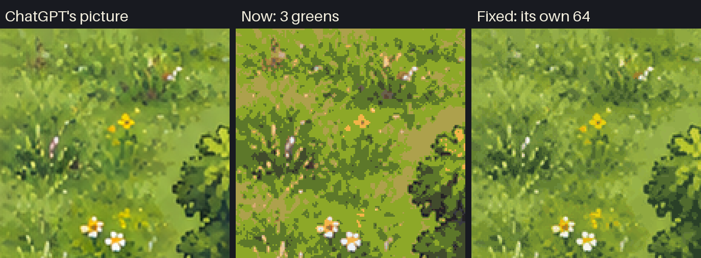
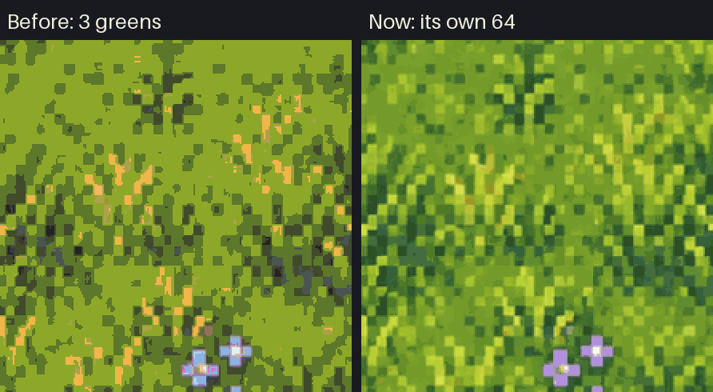
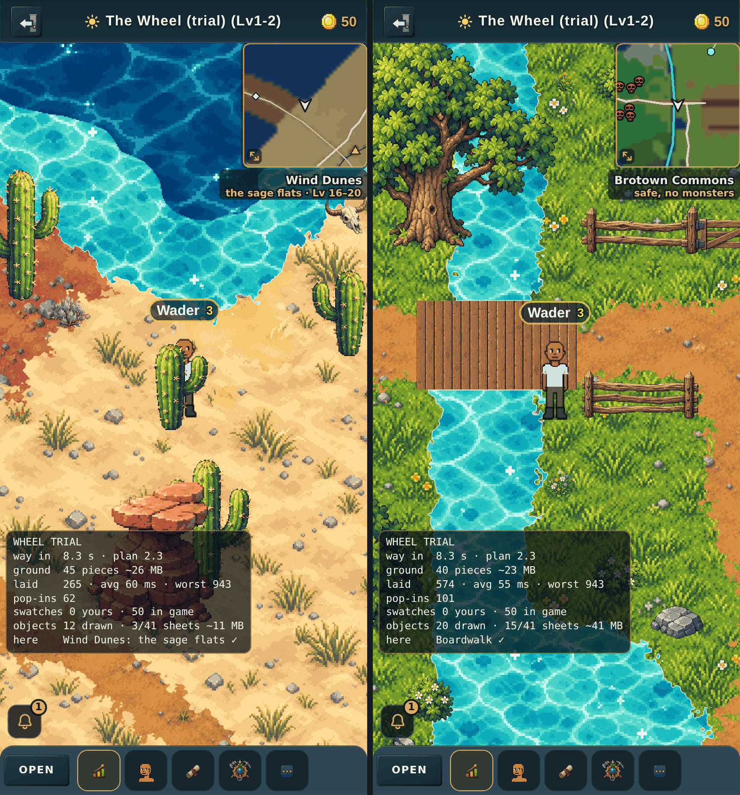
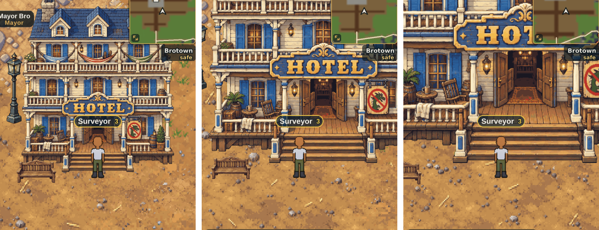
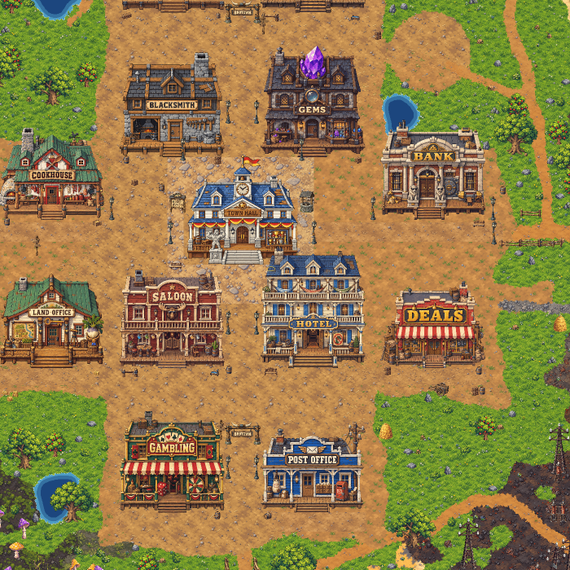

# One Seamless World — the grid, the prompts and the fuser (v2.3.2931–2936)

**Status:** Phase 1 is shipped: the **World Builder** page
(`public/tools/world/`, live at `/tools/world/` on the site).

- No game code has changed yet, apart from the `?trial=world` switch
  (v2.3.2932, below) and the `?trial=wheel` switch (v2.3.2943, below: the
  Wheel at full size, its ground laid on the phone from your swatches).
- **v2.3.2990: the Wheel is the world.** It is everyone's World View, players
  start in its Brotown, and the old lands are closed for now ("The Wheel is
  the world", below).
- The world plan in `public/tools/world/plan.js` is the source of truth for
  the map's layout.
- **v2.3.2933 asked two questions before phase 2; v2.3.2935 has both
  answers** (World Bible §6 and §13):
  - the new world is **HD pixel art** (on a 1.5 game px grid until
    v2.3.2942; since then every picture is kept at 2 px per game px, the
    phone's own sharpness). Every prompt here now asks for it;
  - the ground is **baked from swatches**, not painted square by square.
    ChatGPT's pixel art holds about half a square's width per picture, so
    squares are no longer painted one picture each. This page stays the
    plan, the blueprint (where every swatch, road, shore and wall goes) and
    the home of the style key.
- **v2.3.2936: the plan is the Wheel** (World Bible §3): the commons round
  the town, a spoke of land for each of the eight elements with its own
  levels 1–80, sea between them, passes at levels 20 and 60, and a gate to
  the Dark or the Light realm (80–100) at every tip. The geometry is
  `core/wheel.js`; the blueprint stores every cell's level.
- The world's story and look (through-lines, regions, Brotown's Main
  Street, the style key, the character refresh) are written up for people
  in **[WORLD-BIBLE.md](WORLD-BIBLE.md)**.

> Owner, 2026-09-28: *"I'm wanting one seamless map and to have chatGPT draw it
> into squares. I'll need to fuse them together but have some type of grid and
> prompt system to construct the entire thing."*

This follows a feasibility study done the same day. It found that the zones
cannot be joined as they are:

- Every zone is a self-contained painting with its own framing and its own
  sun.
- Frost is a peninsula, tidal an island, town a cliff-ringed plateau, and
  ember and the dunes fade to horizons.

A seamless world therefore needs **new continuous art**, and art is the long
pole. This document covers how that art gets made; the engine work that
follows is at the end.

---

## The phases

| # | Phase | Who | State |
|---|---|---|---|
| 1 | **Tooling**: plan, blueprint, prompts, fuser, World Builder page | sessions | **shipped v2.3.2931** |
| 2 | **The style key**, then the first **ground swatches** in the **Ground Studio** (`/tools/ground/`, v2.3.2937), judged on a phone next to the bro. *(Before v2.3.2935: paint a test strip of squares round the town square.)* | owner | **next: the style key** |
| 3 | **Make the ground**: every swatch, baked onto the plan. *(Before v2.3.2935: paint every land square.)* | owner + sessions | — |
| 4 | **Export for the game**: cut the fused world into streaming chunks under `public/maps/world/` | sessions | — |
| 5 | **Engine**: chunk streaming, region from position, server interest by region (see "What the game needs") | sessions | — |
| 6 | **Walls, climbing, jumping** from the blueprint's terrain classes | sessions | — |

Phase 2 exists so the style key, the prompts and the fuser can be tuned on
real ChatGPT output before hundreds of pictures are made with them.

---

## The owner's loop

**Once, first: the style key.**

- The page's **Style key** card shows a prompt. Ask ChatGPT with it until
  you love the look, then save the picture in the card.
- From then on every prompt asks ChatGPT to match it, and you attach it next
  to every template. On a phone, **Share…** sends both.
- Why this matters, and the HD pixel art rules it carries: [WORLD-BIBLE.md §6](WORLD-BIBLE.md#6-one-look-for-everything-brotown-hd-pixel-art).

**Then, per square:**

1. Open **`/tools/world/`** on the site.
   - The map shows the plan with the grid over it.
   - Squares outlined in gold are **ready**: their neighbours are finished,
     so ChatGPT will see real edges.
   - **Next square →** picks the best one. The first is always Y25, the town
     square.
2. **Save the template picture.** It shows the square's piece of the plan in
   flat colours, with the finished art of its neighbours already painted
   along its edges.
3. **Copy the prompt.**
4. In ChatGPT, start a **new chat**. Attach the template and the style key,
   paste the prompt and send. Save the picture it makes.
   - If it added a border, text, a building on a plot or a horizon, ask
     again. That is cheaper than fixing a seam.
5. **Bring the picture back** (choose it, drop it, or paste it).
   - The page lines it up, matches its colour and cuts the seam.
   - It then shows the join with a grade: *Seamless*, *Joins well*, *May
     show* or *Try again*.
6. **Keep it** or **Try again**.

**Keeping the work safe:**

- Work is kept in the browser on that device.
- **Download backup** gives a `.zip` of every ChatGPT picture and the style
  key. **Restore backup** rebuilds the whole world from it on any device.
- The page asks for a backup every 5 squares.
- iPhone Safari may reload the tab while you are in the ChatGPT app; the
  page reopens the square you were on.

---

## How it works

### The grid, and growing it later

**Names.** Squares are named like a spreadsheet, fixed by a **frame of
49 × 49** (A1 is the north-west corner, AW49 the south-east).

**What is planned today.** The **active area** in the middle of the frame:
**G7 to AQ43, 37 × 37 squares**. **Y25** sits exactly on the world centre,
and holds the town square. (v2.3.2936: the frame was 25 × 25 round M13
until the Wheel needed room for its spokes; nothing had been painted.)

**Size of a square.**

- Each square is **1024 px** of art, and each ChatGPT picture is resampled to
  that. ChatGPT returns 1024 or 1254 px squares depending on the day.
- Squares **overlap by 256 px (25%)** on every side, so origins sit 768 px
  apart.
- The overlap is where the seam goes. It is also all the model ever sees of
  a neighbour, which is why it is generous.

**Size of the world.**

- The active area is 37 × 768 + 256 = **28,672 art px**. At **1.5 game px
  per art px** (one pixel of the HD pixel art, v2.3.2936; it was the old
  town painting's 1.3), that is **43,008 game px**.
- The Wheel inside it is about **490 zones of land** (a zone is today's
  1,024 × 1,024 game px). From the Town Hall to a spoke's gate is about
  **2 minutes** at a run.
- **536 squares have land.** 833 are open sea between and round the spokes.

**Growing.** Owner: *"how would I expand the game later?"*

- Widen `plan.active`, in any direction. Nothing already painted moves or is
  renamed.
- The frame can grow too (south and east), because the world centre is
  pinned to square Y25 rather than to the frame's middle.
- This works because every value in the blueprint is a function of absolute
  position:
  - plan positions are measured in squares from the centre;
  - noise is sampled at those positions, on a lattice aligned to absolute
    cells;
  - scattered features sit on a **hashed lattice**, not a random sequence
    whose every draw would shift when the area grew.
- The core suite proves it: it grows the active area and the frame, and
  checks that the plan under every existing square is bit-for-bit unchanged.
- The ways to use new room (longer spokes, islands, underground) and why
  more players need more worlds rather than more squares:
  [WORLD-BIBLE.md §9](WORLD-BIBLE.md#9-growing-the-world-and-the-load-it-can-carry).

**When the plan changes under painted squares.**

- Every kept square records a **plan key**: a fingerprint of its piece of
  the blueprint.
- If a later change touches it (a road moved, the coast pushed out), the page
  names exactly those squares for repainting, and no others.
- The positions, the scale and the seed still decide where everything sits;
  descriptive text (paint, zones, borders, style) is safe to change at any
  time.

### Brotown is part of the plan

**The town is drawn as a Main Street town, from the plan, like everything
else** ([WORLD-BIBLE.md §5](WORLD-BIBLE.md#5-brotown)):

- streets, a town square, boardwalks and 17 EMPTY building plots;
- four gates, with the Old Roads leaving from them.

**Buildings become separate sprites standing on their plots.** The game
depth-sorts sprites by their ground line (`depthSort.js`), so a player can
walk behind a building. A building painted into the ground can never cover
a player standing behind it.

**The old town painting is no longer the centrepiece.**

- `town_v17` was the anchor of the first plan.
- The anchor machinery stays (`plan.anchors`) for any painting that must be
  kept exactly as it is, but none is used by default.

### The blueprint (`core/layout.js`)

**What it is.** A colour-coded plan of the active area: one cell per 16 art
px (1,792 × 1,792 cells; 8 before v2.3.2936). Each cell holds four things:

- a terrain **class**: ground, road, thick trees/rocks, water, sea, cliff,
  lava, landmark, street, boardwalk, plaza, building plot, river, railway,
  bridge or gate;
- a **region**: the town, the commons or one of the eight spokes;
- a **stage**: which of its spoke's four looks, one per 20 levels (stored as
  `band`);
- a **tier**: the level, five levels a tier, 1 to 16 along every spoke, and
  0 where no monster goes. It is the level map a game system asks "how
  dangerous is it here?"

**It is deterministic.** It is built from the plan's seed, so every device
builds the same world. It avoids `Math.sin/cos/pow`, which may differ in the
last bits between Chrome and Safari: the spokes point along the eight
compass directions, made with square roots alone (`core/wheel.js`). It
builds in about 1 s on a desktop.

**What the layout contains (the Wheel, v2.3.2936):**

- **The commons** round the town, safe, and **eight spokes** of land, one
  per element, where the World View painting has the zones: frost NW,
  flame N, wind NE, stone E, storm SE, water S, venom SW, flora W. Sea
  between them. Each spoke is a capsule from the centre, three zones wide,
  with a ragged coast.
- **Passes** joining neighbouring spokes across the sea at levels 20 and 60.
- **Brotown**: Main Street and Market Row, the square, the boardwalks and
  plots.
- **The roads**: a trunk down every spoke from the town gates to the tip,
  the passes, and footpaths to the Arena, to Prospector's Circle and to the
  landmarks beside the roads.
- **The Sweetwater River**: a smooth meandering curve from the glacier on
  Frost Ridge to the lagoon between the Poison Forest and the Water Caves.
  Its falls are cut through a cliff, and a bridge is stamped wherever a road
  crosses it.
- **The mine railway**, with its branch and its abandoned spur through the
  passes.
- Plots for the Rail Depot, the Old Mill, the Arena and 32 camps (levels
  20, 40, 60 and 80 on every spoke).
- Each spoke's woods, ponds, cliffs and lava, by stage. The Buried City,
  the Great Cave and the Foundry Dome partway out, and a **keystone gate**
  at every tip.

**The roads, camps, passes, river and railway are laid out from the wheel's
geometry** at the end of `plan.js`, so they always run where the spokes are.

**The builder's Levels view** colours every land square by its tier, green
at level 1 to red at 80, and each square's title says which levels it
holds.

**Job 1, today: the sketch in every template.**

- It keeps roads, rivers and coasts continuous across squares before
  anything is painted. The main source of seams in tiled AI art is two
  squares disagreeing about *where* things are.
- Outlines are smoothed, so the model is not shown 8 px stair-steps to copy.

**Job 2, later: the game's collision map.**

- The `walk` flag on each class says whether you can stand there, and cliffs
  are where climbing goes.
- Walls are drawn *first* and painted to. That is the reverse of the two
  failed attempts to trace walls off finished paintings (`tiledMaps.js`
  v2.3.1693 and v2.3.1794).

### One light for the whole world

- Electric Foundry is painted at night today, and Stone Hollows inside a cave.
  In one continuous map, a day/night line at a region border would be the
  worst seam of all.
- So every square is painted in the **same daylight**, from the upper left.
- A region's mood comes from its materials (black iron, glowing crystal).
- The game can still darken a region as you walk in, using the atmosphere
  layer it already has.

### The prompt (`core/prompt.js`)

Each prompt is built from four things only.

**1. The style bible** (`plan.style`, `plan.never`), identical for every
square:

- a steep three-quarter top-down view with no horizon and no perspective;
- daylight from the upper left, with shadows to the lower right;
- painterly detail matching the finished edges;
- the scale: a person ≈ 90 px, a tree ≈ a person;
- never text, borders, vignettes, sky, people, monsters, or buildings
  (plots stay empty).

**2. The style key**, when saved: *"paint in exactly the style of the style
key … but do not copy its tiles"*.

**3. What the blueprint puts in the square:**

- **Its region and band.** For example *"Frost Ridge — the snowbound taiga:
  deep snow with wind-carved drifts …"*, plus the next band when the square
  crosses into it.
- **Any other region coming in**, and the **border landscape** between them
  (steam fields, ash dunes …).
- **Brotown's streets and plots**, including which gate a street ends at.
- **Every road, the river and the railway, with the edges they cross.**
  *"The Sweetwater River flows in from the top edge and out by the bottom
  edge"*; *"The Frost Trail comes in from the right edge and ends at the Ice
  Spires"*.
- **The places**: landmarks, the plots outside town, the bridge and the
  falls.
- **A legend of only the colours this sketch shows**, each described in that
  region's terms. Frost water is "a frozen lake …", and the river gets one
  description per region it crosses.

**4. What is already painted:** which edges are finished neighbours.

Consistency across a hundred generations comes from the style key, the style
bible and the real neighbour pixels in each template. It never relies on
ChatGPT remembering earlier squares, which it cannot be trusted to do. A new
chat per square is fine.

### The fuser (`core/fuse.js`, `core/maxflow.js`)

ChatGPT redraws the whole picture, so the "kept" edges come back shifted, a
little zoomed, a shade off in colour, and with all the fine texture re-invented.
Pasting a square down as it comes would leave a line at every border. So:

1. **Align.** It finds the zoom and shift that best line the picture's kept
   parts up with the real finished pixels. This is a masked normalised
   cross-correlation, searched coarse-to-fine on a three-level pyramid, with
   zoom and shift refined *together*. When only one edge is known, a small
   zoom and a small shift look alike along it. Refining them separately left
   the far side of a square 3 px off; the fix is covered by a test.
2. **Colour.** A per-channel gain and offset, measured over the parts it was
   meant to keep.
3. **Seam.** A **minimum graph cut** over the whole overlap ("Graphcut
   Textures", Kwatra et al. 2003). The max-flow is Boykov–Kolmogorov.
   - Pixels touching finished art outside the square must stay old.
   - Pixels touching the square's new-only area must become new.
   - The cut runs where old and new differ least: round a tree, not through it.
   - One cut handles every overlap shape the grid makes: one band, an L, a
     corner block that only a diagonal neighbour painted, a full ring.
   - Pixels the alignment had to smear in at an edge never replace finished
     ones.
4. **Blend** across the cut over ~12 px, then write the square.

**Grades**, calibrated on real zone paintings cut into squares and damaged the
way a regenerated picture is:

| Case | Alignment match | Seam | Grade |
|---|---|---|---|
| clean re-render | 0.97 | 0.027 | Seamless |
| shapes moved 6 px | 0.92 | 0.03 | Seamless |
| shapes moved 15–30 px | 0.83 | 0.045 | Joins well |
| strong colour cast | 0.99 | 0.03 | Seamless (colour match absorbs it) |
| a different picture | 0.4 | 0.15 | Try again |

A fuse takes about 2 s per square in desktop Chromium. Expect 2–5 s on an
iPhone.

### Storage (`store.js`)

IndexedDB in the owner's browser:

- **the project record:** squares, order, grades, and each square's plan key;
- **every ChatGPT picture as uploaded:** these are the real asset;
- **the fused world** in 512 px PNG chunks;
- **the overview picture and the style key.**

**Backups.** A backup `.zip` holds the pictures, the style key, the order and
the plan keys. Restoring re-fuses the pictures in order and gives
byte-identical results, which the browser test checks.

**Redo.** Removes a square and re-fuses the world without it. It then lists
the squares painted after it that touched it, because they were painted to
match it.

---

## Tests

**`node tools/world/test-world-core.mjs`: 72 zero-dependency checks.**

- **Grid:** maths, the frame and the active area, Y25 on the centre, and one
  art px equal to one pixel of the HD pixel art (`style/bible.js`).
- **Growth:** widening the active area, and even the frame, changes the plan
  under no square. Moving one path changes only the few squares it crosses.
- **Blueprint:**
  - determinism;
  - sea at the corners;
  - the Town Hall in the middle of the square, both streets to their gates,
    17 plots each fronting a boardwalk, the depot, the mill and the arena;
  - **the Wheel**: eight spokes, one per element; down every spoke the tier
    climbs 1 to 16, one per zone, in four stages; the commons has no tier;
    sea between the spokes; 16 passes joining neighbours at levels 20 and 60;
    32 camps; 8 gates, four to each realm; a road to every gate and landmark;
    the town to a gate about 19 zones;
  - the railway into the Great Cave and the Foundry Dome, and the spur
    stopping short of the Buried City;
  - the river from Frost Ridge to the sea, the Mill Bridge and the Snake
    Bridge, the falls;
  - about 490 zones of land.
- **Prompts:**
  - the town square and streets, and a gate becoming a road;
  - the river's flow edges, the bridge, the fork, the mill and the commons'
    edge;
  - the river's source, the stage a square is in and the next one, a road
    ending at its gate, a pass with its border landscape, a pass joining the
    next spoke's road, and the abandoned spur;
  - the HD pixel style bible, and the style key line appearing only when a
    key is saved.
- **Max-flow** against brute force on 600 random grids.
- **Fusing** 9 damaged squares on a procedural painting:
  - shift and zoom undone to under 1 px;
  - every join great or ok;
  - the "ignored template" case and the border constraint.
- **The zip round trip.**

**`node tools/qa/world-page.mjs`: 38 checks in real Chromium**, against a
local server over `public/`.

- The plan, and Y25 offered first with a prompt that sets the look; the
  Levels view, and a spoke square saying which levels it holds.
- The style key saved, shown, and written into every prompt.
- Three squares fused through the real upload button:
  - The fake ChatGPT pictures are cut from a known "true" world (the meadow
    painting, tiled) and damaged with zoom, shift, colour cast and noise.
  - Y25 is damaged in colour only, because the first square defines the
    world's geometry.
  - They match the truth at about 31 dB after a colour fit.
  - The second square's template carries the first square's pixels.
- An unrelated picture graded "bad"; a non-square picture centre-cropped.
- Surviving a reload: the squares, the square you were on, and the style
  key.
- Plan keys recorded; Redo.
- A backup restored into a fresh browser profile, with byte-identical
  pixels and the style key.
- Screenshots with `WORLD_SHOTS=<dir>`.

**`node tools/world/render-plan-images.mjs`** regenerates the plan pictures
in `docs/world/` from the live plan: the Wheel with its levels, names and
gates (`wheel-plan.png`), the builder's map with every land square's name,
and Brotown close up.

None of these is on the CI path, following the owner's 2026-07-16 directive.
Run them when touching `public/tools/world/`.

---

## The Ground Studio: making the ground from swatches (v2.3.2937)

> Owner, 2026-09-29: *"Yes definitely do the swatches."*

**What it is.** A page at **`/tools/ground/`** where the owner makes the 48
ground swatches the Wheel needs (World Bible §13):

- **The catalog** comes from the plan (`core/ground.js`, `groundCatalog`):
  four stages per spoke, the commons, the town's yards, street, boardwalk and
  square, roads, the railway bed, lava, and the eight border lands. Each has a
  ground-only brief.
- **The prompts** (`public/tools/ground/prompts.js`) are the brief, the HD
  pixel art paragraph and the quiet-ground rule (`public/tools/style/
  bible.js`), and the scale line. The owner attaches the style key, and only
  the key: the bro is simpler pixel art than the world, so since v2.3.2939 his
  size is given in words instead (World Bible §6).
- **Nothing in a swatch runs one way** (v2.3.2944, World Bible §6 rule 12).
  Owner, on the first Main Street in the game: *"It's tiling wagon trails
  sideways and it doesn't look good. Any specific detail that would look bad
  when placed in the wrong direction tiled is probably not a good prompt."*
  A swatch is laid the same way up everywhere, so every prompt now says so
  (`NO_DIRECTION`), and eleven briefs that asked for ruts, planks, tracks,
  ripples, rows or streaks, or long plates and wires, were rewritten (the
  street, the road, the boardwalk as a basket weave, and eight stages and
  borders; v2.3.2949 made the boardwalk plain boards again, laid by the
  game: see "Bridges and boardwalks" below). A test fails
  if a brief ever asks for one again. Each picture now records the brief it
  was made from, and a swatch made from an older one says **"Made from an
  older prompt … make this one again"** on its card.
- **Each picture brought back** is squared, made seamless (since v2.3.2953
  by a hard cut where its two ends look alike, not a cross-fade: see
  "Seamless by a cut" below), shrunk to one
  1,024 px tile covering 512 game px (2 px per game px since v2.3.2942: the
  1.5 game px grid blew ChatGPT's picture up, soft and gritty), and moved
  onto the one shared palette with
  stray pixels cleaned up (`public/tools/style/process.js`).
- **The palette** is made from the style key (weighted) and every swatch so
  far, taken in name order so the same pictures always make the same colours,
  with the game's effect colours kept. **Freeze** fixes it; after that every
  new swatch is moved onto exactly those colours.
- **Phone memory.** A full set is 96 pictures. The page keeps only the
  finished tiles' pixels at full size; each seamless tile before the palette
  stays a PNG, decoded only while the colours are redone, and the colours are
  made from small copies (about 200,000 pixels in all).
- **The preview** composes the real plan round a chosen spot at game size
  (1,024 game px of height on a phone-shaped screen) with the bro standing in
  the middle, and says which swatches are on screen and which are not made
  yet. The progress map shows the whole Wheel, each swatch in its own
  colour once made.
- **Download all** gives one zip: `manifest.json` (the palette, the swatch
  list), `ground/<id>-<A|B>.png` (the tiles as the game will use them) and
  `originals/` (ChatGPT's pictures as uploaded). It restores into any
  browser. The owner uploads it to GitHub; a session unpacks it into the game.
- **The style key** is read from the World Builder's own storage on the
  same site, so it is made once.
- **"Saved on this phone"** (v2.3.2946) heads the page: which swatches this
  browser holds, by name, and when the last picture went in. Owner: *"I
  can't tell if the ground studio has saved what I put in earlier."* The
  trap it names: storage belongs to the browser, and **the Claude app's
  built-in browser and Safari keep separate copies** of the same site, so
  work made in one is missing from the other (and from the game opened in
  the other; the Wheel trial's readout says "swatches none in this
  browser"). Use one of them throughout; Download all and Restore move work
  between them. The page also asks the browser to keep its storage when the
  phone runs short of space (`navigator.storage.persist`).

**How the ground is laid** (`core/ground.js`):

- `materialMap` gives every blueprint cell a swatch: water for the sea, the
  river and ponds (drawn by the game, not a swatch); the town's own
  surfaces; roads, the railway bed and lava; the commons; and on a spoke its
  stage's swatch, or its border land's where it meets a neighbour (on a pass,
  or near the line halfway between two spokes at their bases).
- `composeGround` gives every pixel of a rectangle the swatch whose share of
  the ground round it (a blurred field over the cells), plus a little noise of
  its own, is highest: the edges come out ragged, in clusters, like a pixel
  artist's, and never blended. Two versions of a swatch share the ground in
  large noisy patches. Tiles are anchored to the frame, so rectangles
  composed apart meet with no seam. Since v2.3.2947 that line is only where
  an edge starts: see **Where two grounds meet** below.
- **Built surfaces are the exception** (v2.3.2945): the street, the
  boardwalks and the square (`BUILT` in `ground.js`) are laid exactly on
  their cells, straight-edged, over the natural ground, which takes no
  account of them. The owner saw "wooden plank bits" along Main Street:
  the boardwalks are one cell wide, and between a street and a yard a
  blurred field gives all three about a third, so the noise decided every
  pixel. The walk grid never blocks a built cell, so a one-cell bridge over
  a wide river is walkable.

**Tests.** `node tools/world/test-world-core.mjs` checks the catalog, each
spoke's stages and its passes' border land, determinism, seamless chunks,
tile-true laying and the not-made-yet colour. `node tools/qa/ground-studio.mjs`
(38 checks in real Chromium, at a phone's size) checks the prompts (only the
style key attached, never the bro, every material drawn as itself: v2.3.2939,
and nothing running one way: v2.3.2944), a picture made from an older
prompt marked to make again,
the style key from the World Builder, a picture in through the real file input coming
out 512 px, seamless, hard-edged and on the palette, the map and the preview,
frozen colours, a reload, and a zip restored into a fresh browser with the
same pixels, and (v2.3.2947) the edge-pieces prompts and pictures below
(v2.3.2948: put away, so the test first checks the page shows none of them,
then opens it with `?edgepieces`).

## Where two grounds meet (v2.3.2947)

> Owner, 2026-09-30: *"There needs to be specific and additional prompts for
> when two swatches have a contact area to make a smoother transition.
> Otherwise the change between two swatches is still too jarring and
> obvious. Also layers need to be correct (grass slightly overlapping dirt
> areas). I'm thinking of an irregular border area for when things like
> grass and dirt come together but likely that border area will need to vary
> in size depending on what two swatches are coming together. I'll let you
> think about what other considerations there are and how you can think of
> the best solution."*


**Why it looked jarring.** Two unrelated pictures met on a ragged line cut by
noise. Nothing of either crossed it, nothing lay on top of anything, and the
contrast was sharpest exactly at the line. Every pair looked the same, whether
a road's edge or meadow turning to snowfield.

**What the game does now, at three sizes** (`public/tools/world/core/ground.js`):

1. **Stages change over a wide band, in patches** (`materialMap`,
   `landStage`). Each land cell's stage (the commons as −1, a spoke's stages
   0–3) is averaged over about a dozen cells (~300 game px) either way; the
   patches are cut from that average plus noise that is strongest halfway
   between two stages. So the next stage arrives as islands that grow and
   join over about a screen either side of the old line, and the commons
   meets each first stage the same way. Border lands wobble in and out too.
   The levels (tiers) do not move: only the ground's look.
2. **Every edge is a band whose width is the pair's** (`edgeRecipe`,
   `composeFine`).
   - **One layer order** of materials, bottom to top: liquid (lava); roads and
     the railway bed; bare rock; metal floor plates; earth and mud; sand and
     ash; moss; grass; ice; snow (`KIND_OF` gives each swatch its kind). The
     higher one is the **upper**: it reaches over the lower by `reach` game
     px, and the band round that line is `ragged` game px either way.
   - **Widths by kind** (`EDGE_SPREAD`, game px): a road's edge is narrow
     (reach 1, ragged 6), rock 2/7, earth 3/9, grass 5/12, snow 5/13, sand and
     ash 5/14, metal plates 0/2 (almost crisp). Both vary along the edge by
     up to half again, so it wanders. Two grounds of the **same kind** (one
     grass giving way to another) interlock evenly with no upper
     (`EDGE_SAME`).
   - **The edge is drawn from the pictures themselves.** In the band each
     pixel goes to whichever ground stands higher there: its brightness,
     ranked within its own picture and averaged with the pixels two either
     side (the lit tips of grass blades, a pebble's top, a snow lump stand
     high; the shadows between them lie low), plus patches a few game px
     across, against a ramp across the band. So grass reaches over the road
     in its own tufts and the road shows through the gaps; every pixel is a
     pixel of one of the two pictures, so nothing is blended and the palette
     holds.
   - **No crumbs.** Any bit of one ground an edge leaves that is smaller
     than a tuft (`EDGE_BIT`, 20 picture px) goes to the ground round it.
   - **What keeps its crisp edge:** the water's shore (drawn by the game) and
     the town's street, boardwalks and square (v2.3.2945's straight,
     surveyed edges). That is a choice, easy to change for the street.
3. **Edge pieces, one prompt per ground** (`pieceMap`; the Ground Studio's
   third slot under each swatch, `edgePromptFor` in
   `public/tools/ground/prompts.js`). The owner's "additional prompts".
   - **Put away (v2.3.2948).** Shown the picture above, the owner: *"I don't
     see any difference I'll put away the edge piece stuff. You can hide it
     or whatever in case we want to bring back later."* The middle column is
     the right one without its loose pieces: the edge did the work. So no
     tool shows or loads them now (`EDGE_PIECES = false` in
     `public/tools/world/core/ground.js`): the Ground Studio has no slot,
     prompt, step or paragraph for them, its preview lays none, the saved
     list and the colours leave them out, and the game's worker leaves them
     unread (so no chunk pays the wider margin). Nothing is deleted:
     pictures already made stay saved, go in the zip and restore, and
     everything below still works and is tested. **To try them again, add
     `?edgepieces` to the address** (the studio's, or the game's:
     `?trial=wheel&edgepieces`); to bring them back for good, set
     `EDGE_PIECES` to `true`.
   - **Per ground, not per pair.** 208 pairs of grounds touch on the Wheel;
     the road alone meets 46. One picture of a ground's own loose pieces
     works against every ground it lies over. 39 of the 48 swatches have one:
     every kind that is ever the upper (not the town's surfaces, the road,
     the railway bed, lava or the metal floors).
   - **Pieces, not a picture of an edge.** Every picture is laid the same way
     up (World Bible §6 rule 12), and an edge drawn in a picture runs one
     way. So the prompt asks for 40–60 separate pieces (tufts, clumps, lumps,
     drifts, stones: `PIECES` by kind) on one flat magenta, none touching
     another or the picture's edge; the game draws the edge's shape.
   - **Matched to the ground.** It is sent in the chat the swatch was made
     in, or with the style key and the swatch attached (`EDGE_MATCH`): the
     one chat shown more than the key, because the pieces must be that
     ground exactly.
   - **In the studio** the magenta is cut away (`keyOut`, only when the
     background really is magenta), the picture is kept at 1,024 px and put
     on the palette, and only whole pieces are kept: none the picture's edge
     cuts, no crumbs, none over 96 px across. The card says how many were
     found (or why none), what the ground lies over, and "See an edge on the
     map" jumps the preview there.
   - **In the game** each piece has a fixed place in the world (the picture
     repeats like a swatch, three times over at offsets, never turned, since
     everything is lit from the upper left). It is laid whole, or not, by
     what lies under its middle: a ground it lies over, within 14 game px
     beyond the upper's ragged edge, thinning out with distance. Pieces go
     into the label map before the tidy-up, so a pocket of road left between
     a tuft and the grass is tidied too.

**Chunks still meet with no seam.** Everything is a function of position: the
ground is worked out far enough beyond each rectangle (27 art px when there
are edge pieces, 23 without, only 2 where no edge is near) that any edge, any
crumb and the middle of any piece that can reach it are seen whole. The
distances are whole-number chamfer distances (3 a step across, 4 corner to
corner), so they come out the same to the last bit in any rectangle.

**Cost.** Measured in the Wheel trial (desktop Chromium, local server): a
piece of ground took 32 ms on average (about 30 ms before), with no pop-ins;
28 to 30 ms with the edge pieces put away (v2.3.2948). Building the plan takes
about 0.1 s longer (the stage patches). A phone is slower: the box in the
bottom left shows the real numbers, and, only with `?edgepieces`, a line
**edges N with edge pieces** says which edge pieces the game found.

**Tests.** `node tools/world/test-world-core.mjs` (109): the layer order and
widths, the pairs that touch, stage patches near the line and none far from
it, the same map every time, halves composed apart matching the whole with
edges and edge pieces, every pixel a pixel of a picture, the grass reaching
onto the road far more than the road shows through, no crumbs, pieces
laid whole, and the pieces off unless the address asks (v2.3.2948).
`node tools/qa/ground-studio.mjs` (41): the page shows no edge pieces, and
with `?edgepieces` the explanation, the 39
prompts, a ChatGPT-shaped pieces picture cut out whole (none cut by the
picture's edge), no magenta left, the preview showing them on the road, the
zip carrying them, a browser without `?edgepieces` keeping them but showing
none, and a picture with no magenta background giving no pieces and saying
why. `node tools/qa/mp/run.mjs wheeltrial` (28): the game leaves a ground's
edge pieces made in the studio unread, and a worker told `?edgepieces` finds
them.

## Bridges and boardwalks: plank decks (v2.3.2949)

> **v2.3.2960: the town's boardwalks are put away** until the buildings,
> whose porches they become (owner: *"The one thing I want to change are the
> boards … I don't know what those are supposed to be"*; World Bible §5).
> `boardwalks: false` in the plan's `town` leaves the town's ground running up
> to the street; `true` lays them exactly as below, and the tests still do.
> The bridges keep their plank decks, and the boardwalk swatch is now theirs.

> Owner, 2026-09-30, on the Mill Bridge in the Ground Studio: *"The bridge
> needs to take shrink the tiles and maybe make them line up using your
> coding I had to change the checker pattern wood the original prompt made
> it didn't look right. For the mill bridge by the west gate (and probably
> used elsewhere too)."*


**Why it looked wrong.** The boardwalk swatch, which the town's boardwalks and
every bridge use, was laid like any other ground: the same way up
everywhere, at the picture's own size. A plank picture's boards came out
about 48 game px wide, half the bro's height, running along the Mill Bridge
instead of across it. A bridge was also the road's own discs stamped wider
over the water, so its ends were rounded and ragged, and on a diagonal
crossing (the Snake Bridge, the Verdant–Frost pass) it was a staircase. The
basket weave that v2.3.2944 asked for, so that nothing ran one way, came
back as a checker pattern.

**What the game does now:**

1. **Every boardwalk and bridge is a deck** (`public/tools/world/core/layout.js`,
   `bp.decks`): a rectangle of cells, and the way you walk along it
   (`along`, `x` or `y`). The town's boardwalks are each plot's strip along
   its street. A bridge is now a straight deck, square at both ends, laid
   across the river the short way (along `x` or `y`, whichever crosses less
   water at the road's crossing). It reaches `BRIDGE_PAD` (2) cells onto
   both banks, bank to bank on every row even where the river runs aslant,
   and is as wide as the road's old bridge. Where the road reached the bank
   off the deck's end (a diagonal crossing), a short stretch of road joins
   it on (`joinRoad`). The Mill Bridge is 9 × 5 cells; the other two are
   10 × 4 and 11 × 4. Bridges stay walkable, and the river under them
   stays water.
2. **The game lays the boards itself** (`public/tools/world/core/ground.js`,
   `planksOf`, and the plank branch of `composeFine`):
   - it finds which way the picture's boards run (lines along a board stay
     on one board, so their brightness differs board to board) and where
     the seams are (the darkest line within about a third of a board, most
     clearly dark first, spacing found past the wood's grain);
   - it makes the picture smaller, area-averaged and snapped back onto the
     picture's own colours, so its middle board is **12 game px** wide, half
     a cell (`BOARDS_PER_CELL`);
   - it lays the boards **across** every deck, one board per half cell of
     the whole world, so every seam lines up with the deck's ends and with
     the next deck along the street;
   - each board is one of the picture's boards, picked and slid along its
     length by its place (A and B mixed board by board), so a long boardwalk
     does not repeat.
   With no picture yet, a deck shows its boards in the plan's two colours.
3. **The prompt asks for plain boards** (`PLANK_BOARDS` in
   `public/tools/style/bible.js`, the catalog's `laid: 'planks'`): boards
   that all run one way, about twelve to sixteen of them, big and clear,
   with a dark gap along both sides. It is the one swatch that may run one
   way, because the game turns it. A picture made while the prompt still
   asked for the basket weave is not marked to make again (`accepts`): the
   owner made planks with it.

**Cost.** A plank picture is got ready once (about 30–100 ms, kept with the
picture). A piece of town ground with a plank picture took about 10 ms here
against 8 before; the Wheel trial's pieces averaged 33 ms, as before.

**Tests.** `node tools/world/test-world-core.mjs` (117): every bridge a
straight deck with the road at both ends; every boardwalk and bridge cell on
a deck; the boards 12 game px, across the deck and starting at its ends (the
plan-colour boards checked pixel by pixel); a plank picture's boards found
(uneven widths, either way round, the same result); each board laid whole,
every pixel the picture's own colour; a deck laid in two halves matching it
laid whole. `node tools/qa/ground-studio.mjs` (42): the boardwalk's prompt and
card, and the owner's planks not marked to redo. `node tools/qa/mp/run.mjs
wheeltrial` (28).

---

## Alike grounds mix (v2.3.2950)

> Owner, 2026-09-30, with their own town-square and yard pictures in the
> Ground Studio: *"The problem surfacing is still the harsh transitions
> between different surfaces even if they're similar in theory. … It looks
> obvious and unnatural. One idea I have is to have chatGPT make a blend of
> the two surfaces that are mapped together."* And, steering: *"Focus on the
> area near the player where the dirt transitions from one type to the
> other."*


**Why it looked that way.** The town's street and square were laid on their
cells with crisp edges (v2.3.2945, to save the one-cell boardwalks from
crumbling, and "a surveyed town has straight edges"), so the v2.3.2947 edges
never reached them: the square's pale, stony dirt met the yards' orange dirt
along a ruler line, just below where the bro arrives, and round the Town
Hall's plot.

**Four ways, tried on the owner's own pictures at that spot**
(`docs/world/dirt-mix-options.png`): now; a plain soft edge (still read as a
line, only wobbly); a wide mixing zone; and the same zone with the owner's
blended third picture in its middle. The wide zone did most of the work;
the blend added a little more in-between texture, for one more picture per
pair of grounds. So the game now does the zone by itself, everywhere two
grounds are alike, and a blend slot can come later if it is wanted. (It
came in v2.3.2951: "Blend pictures", below.)


**What the game does now** (`public/tools/world/core/ground.js`):

- **Alike grounds MIX instead of meeting at an edge** (`MIX`, `edgeRecipe`):
  two of one kind (the square, the street and the yards are all earth now;
  one meadow and the next; snow and snow), or two of the loose, dry family
  (earth, sand, ash). The change is spread over a zone about 36 game px
  either side of the line, wandering by a third either way.
- **In big patches, shaped by the pictures.** Inside the zone each pixel
  goes to one ground or the other by big patches of noise (about 30 and 75
  game px across, `MIX_PATCH`) against a ramp across the zone, plus the two
  pictures' own heights (`MIX_HEIGHTS`, as at an edge): so the square's
  stones hold on out into the yard's dirt, and the dirt comes in between
  them, the patches' rims following both pictures. Every pixel is still a
  pixel of one of the two pictures.
- **Not everything mixes.** A road stays a road (its edges stay narrow), and
  rock and ice keep their narrow even band, since their boulders and plates
  would be cut. Different kinds still meet at a layered edge (v2.3.2947).
- **The town:** the street and the square still lie on their cells (it keeps
  the town cheap to lay) but now MIX into the yards; only the boardwalks and
  bridges keep straight edges (`CRISP`).

**Cost.** Most of the town is now a mixing zone, so a piece of town ground
costs more to lay: about 20 ms in Node against 8 before, after caching the
slow noise on a coarse lattice, settling whole art px where the patches
alone decide, and a smaller lookup table. Elsewhere pieces cost about what
they did. In the Wheel trial (desktop Chromium, local server) the way in
took about 5 s against 4.5 s, a piece averaged about 42 ms against about 30,
with no pop-ins; a phone is slower, and its box shows the real numbers.

**Tests.** `node tools/world/test-world-core.mjs` (120): which pairs mix and
which do not; at the owner's own spot, the square's share of the ground
falling off across the zone and its last pixel wandering, every pixel one
of the two pictures', and the zone laid in halves the same as whole.
`node tools/qa/ground-studio.mjs` (42) and `node tools/qa/mp/run.mjs
wheeltrial` (28) as before.

## Blend pictures (v2.3.2951)

**Put away since v2.3.2955** (the owner choosing two pictures a pair; see
"Blend pictures, put away" below): everything here still works, but only
with `?blends` in the address.

> Owner, 2026-09-30, shown the four ways at their spot: *"Bottom right looks
> the best by a moderate margin than the bottom left. What's the performance
> tradeoff though?"* Told it: *"Yes build it"*.


**What it is.** Where two alike grounds mix (above), a pair may have a third
picture, a **blend**: the ground halfway between the two, made in ChatGPT
from the two pictures. The game lays it through the middle of the zone, so
the square turns into the yards through ground that looks like both.
Optional for every pair: a pair without one mixes exactly as before, to the
byte.

**How it is laid** (`public/tools/world/core/ground.js`, BLEND PICTURES).
The zone runs from one ground, through the blend, to the other, as **two
whole plain mixes** (v2.3.2952): the upper ground gives way to the blend a
little way (`BLEND_OFF`, 0.4 of a zone) to one side of the line, and the
blend to the lower ground the same way to the other, each change with a
plain mix's ramp, big patches and room, the pictures' heights shaping their
rims (at `BLEND_HEIGHTS`, 0.45), their big patches 1.3 times as strong as
a plain mix's (`BLEND_BIG`, v2.3.2953). The zone of a pair with a blend is
that much wider (1.7 times). Both changes are judged everywhere, so nothing jumps
at the line; the blend is most at the line and none is left at the zone's
sides (at the owner's spot, with stand-in pictures: 64% of the ground at the
line, about 40–50% 12 game px either side, none 60 game px out). Every pixel
is still one of the three pictures'. A blend is laid as a ground of its own,
so the tidy-up leaves no crumbs of it; blends are numbered by their pairs'
keys, so pieces laid apart still meet with no seam. `composeGround(...,
{ blends })` takes them by `blendKey(a, b)` (the two ids in order, joined by
`__`), and `blendsUnder` names the ones a piece can use.

> **v2.3.2952, the first fix.** Owner, on the first preview: *"Why does the
> top part of that patch look correctly blended but not the bottom? I can
> see its edge … Bottom looks like it has a noticeable straight edge where
> it transitions."* In v2.3.2951 each of the two changes had half the zone,
> on a ramp twice as steep, so the patches moved it half as far, and where
> they would have moved it further the zone's end stopped it. Along the
> bottom of the Town Hall's plot the yards therefore turned into the blend
> along a line running beside the plan's straight cell edge. Now, where the
> yards end wanders 11 game px against a plain mix's 12.6 (it was 6.8), and
> its straightest stretch is 17 game px against a plain mix's 33 (it was
> 30). A test holds it there.
>
> 

> **v2.3.2953, the second.** Owner, on that fix: *"Looks better but could
> use further improvement."* Two things were still wrong, and the larger
> was not the edge at all: the pictures' stones were see-through, which the
> seamless step did to every picture (next section). The edge itself:
> measured along every straight stretch of the town where the square meets
> the yards (the regions blurred as the eye sees them, every 100 game px
> window), the two changes still wandered less than a plain mix's edge at
> their straightest, the straightest tenth of the windows swaying 17 and 19
> game px against a plain mix's 25, because each change had only a plain
> mix's room. Now a blend pair's big patches are `BLEND_BIG` (1.3) times as
> strong, in a zone as much wider, so the zone's end cuts off no more than
> before: 27 and 23 game px at their straightest, the middle window 43 and
> 47 against 36 and 37. At the bottom of the Town Hall's plot the yards' end
> now wanders 12.4 game px (a plain mix's 12.6), its straightest stretch 13
> game px (a plain mix's 33). Tried and not taken: 1.5 times (bigger bays
> still, at twice the cost, hardly visible in the owner's pictures); a blend
> of varying width, in patches with gaps (a third dearer, and straighter
> at its straightest); and softened zone ends (straighter still). Pairs without a blend, and every
> other edge, are unchanged to the byte.
>
> 

**Where they come from.**

- **The Ground Studio** (`/tools/ground/`) has a **Blends** card below the
  swatches: every pair of alike grounds that meet on the Wheel (42), the
  town's three first (the square and the yards, Main Street and the yards,
  the square and Main Street), the rest folded away, longest meeting first.
  Each has its **blend prompt** (`blendPromptFor`): the ground halfway
  between the two, both briefs, the two pictures attached (not the style
  key: they already carry the style; never the bro), nothing running one
  way, seamless. A button beside it saves or shares the two ground pictures
  for the chat. A blend brought back is made seamless and put on the
  colours like a swatch, but it is never used to make the colours (it is
  made of two grounds already on them). It is marked to make again when one
  of its grounds is made again after it. It is kept under the pair's key as
  version `M` (`plaza__town-yard|M`), goes in the zip as
  `ground/<key>-M.png` with the original, listed in the manifest's
  `blends`, and restores.
- **The game's worker** (`ground-worker.js`) finds blends in both places it
  finds swatches (the studio's storage on the site, then
  `/world/ground/manifest.json`), unpacks the ones a piece needs, and lays
  them. The trial's readout says `blends  N made`.

**Cost**, measured on the owner's own pictures, laid the way the game's
worker lays them (desktop Chromium), since v2.3.2953:

| | without the blend | with it |
|---|---|---|
| a piece of town ground | about 22 ms | about 29 ms (27 in v2.3.2952: the blend's zone is wider again) |
| pieces its zone does not reach | | no difference |
| the Wheel trial, walking out of town and back | 44 ms a piece on average (v2.3.2951) | 49–51 ms (54 for v2.3.2952 in the same session: runs vary that much); one piece a moment late on screen in each of two walks, none with v2.3.2952 |
| memory while near the pair | | 1 MB more (the town's busiest piece needs 13 pictures of the 16 kept) |
| download, the first time near the pair | | one picture, about 0.9 MB |
| unpacking it | | about 50 ms, once, in the worker |

(With the heights at a plain mix's 0.7 instead of 0.45, the same fix cost
half as much again a piece, and six pieces came on screen late in the
trial: hardly any pixel of the wider zone could be settled a whole art px at
a time.)

The cost that counts is making the pictures: 42 pairs of alike grounds
touch on the Wheel. Start with the town square.

**Tests.** `node tools/world/test-world-core.mjs` (131): the key and its
pair; square -> blend -> yards at the owner's spot, the blend most at the
line and gone at the sides; every pixel one of the three pictures', `mat`
naming only real swatches; halves the same as whole; a blend for a pair
that does not mix, or none, changing nothing; and (v2.3.2952, tightened in
v2.3.2953) the yards turning into the blend along a ragged line at the
bottom of the Town Hall's plot, wandering at least nine tenths as much as a
plain mix's, its straightest stretch under half a plain mix's. `node tools/qa/ground-studio.mjs`
(55): the card, the prompt, a blend in and on the palette without shifting
it, laid in the preview to the pixel, marked to redo, through the zip and
back, removed. `node tools/qa/mp/run.mjs wheeltrial` (31): a blend made in
the studio is found by the game, named in the readout, and laid on screen
between the square and the yards.

## Seamless by a cut, not a fade (v2.3.2953)

> Owner, 2026-09-30, on the blend's fixed edge: *"Looks better but could use
> further improvement."*

Looked at again in their own pictures, the largest thing wrong was in every
picture, not at the edge: **stones you could see through**. ChatGPT's
pictures do not repeat on their own (on the owner's, the two ends of a
picture differ two to five times as much as neighbouring columns do), so
the Ground Studio makes each one repeat. It did so with the trial bake's
cross-fade: the picture laid over itself shifted half a tile, faded in
across the outer quarter each way. Three quarters of every tile was
therefore two pictures at once: every stone there see-through, the ground
between them the low-contrast mush that averaging two textures makes (the
town-seam trap in `docs/TRAPS.md`), and the middle of the picture shown
twice in every tile, so the ground repeated at half the picture's size.

**Now** (`seamless` in `public/tools/style/process.js`, `seamlessPixels` on
bare pixels): the tile repeats every *n − overlap* px. The picture's last
*overlap* columns are laid over its first, and the two meet along the
cheapest path down that strip, where they already look alike. That path
runs round the stones, not through them: it is found by dynamic
programming, each place costing how unlike the two pictures are over a
5 × 5 box, so a cut beside a stone in one picture costs as much as a cut
through it. Then the rows the same way, that path closing on itself round
the tile so it still repeats both ways. Every pixel is one of the picture's
own, none is shown twice, and the picture keeps its contrast (the owner's
square: 11.1 against 11.2 as uploaded, the cross-fade's 10.0). The overlap
is whichever of 12–20% of the picture joins best: ChatGPT's pictures carry
a pixel grid of their own, about 6.4 px, and some overlaps line it up
across the join better than others. The tile comes out that much smaller
(about 1,050 px of a 1,254 px picture) and is shrunk to 1,024 as before.
Making a picture seamless takes about a third of a second on a desktop.

**Pictures already saved are remade, once.** The first time the Ground
Studio opens, tiles saved the old way are made again from the pictures as
uploaded. A line on the page counts them ("Making your pictures seamless
the new way, once: 2 of 4…", about half a second each on a desktop), and
the mark `prepMade` in its storage says it is done. A restored zip is
always made from its originals. The game's worker reads the remade tiles.


**Tests.** `node tools/world/test-world-core.mjs` ("seamless"): a
ChatGPT-shaped picture (a coarse pixel grid, stones with rims, not
repeating) comes back square and an overlap of 12–20% smaller. Every pixel
is a colour the picture has (the cross-fade made 46% of them new), it is as
contrasty as it was, it repeats across its own edges, and it comes out the
same every time. `node tools/qa/ground-studio.mjs`: on the next load, tiles
saved without the mark are remade from the uploads, the same to the pixel,
and the mark is put back. The Style Lab uses the same step
(`node tools/qa/style-lab.mjs`, 34, unchanged).

## Where three grounds meet: no ruler lines (v2.3.2954)

> Owner, 2026-09-30, zoomed in on the town square: *"In each of your
> pictures there's a noticeable straight line. I want to avoid that."*
> And, on blends: *"If I can get good results faster with just the 2
> pictures instead of a 'blend' custom picture I'd rather do that."*


**Two pictures are enough.** Every pair of alike grounds mixes in big
patches with just its two pictures, and every other pair meets in the
layered edge. A blend (above) stays optional, for a pair that ever looks
wrong without one.

**The straight lines were where three grounds meet.** At a street's corner
the square, the street and the yards all meet. A pixel near there answered
only to its *nearest* other ground, and which ground is nearest changes
along the straight line halfway between them, 45 degrees off the corner.
A patch of the square reaching into the dirt was cut off along that line.
The street's two top corners each drew a "V" of two of them: the owner's
line.

**Now every other ground in reach has its say** (`edgeAt` in
`public/tools/world/core/ground.js`):
- A pixel goes to whichever of them its own pair's edge rule gives it to
  (`ruleAt`), so each patch keeps the shape its own edge draws.
- Where two would both take it, it goes to the one further past its own
  line (`marginAt`), each nudged by its own slow noise (`PARTNER_TIE`), so
  the line between those two wanders too.
- Where only one other ground is in reach (most edges), nothing changes, to
  the byte.

Tried first and dropped: picking the nearest by a noisy distance. It bent
the lines, but cut patches into thin slivers where it ran beside their own
edge (`docs/TRAPS.md` §122).

**One smaller kind of straight line went too.** A mixing zone's end
stopped a patch dead where the patch would have gone further, drawing a
line 20–35 game px long beside the plan's cell edge. Mixing zones now
reach 1.15 of their width (`MIX_LIM`). Pixels still cut off that way in the
town fell from about 4,700 to 1,700; everything inside the old zone is
laid as before.

**Measured** over the whole town, with a flat colour per swatch (the
longest run of edge pixels on one row, column or diagonal):

| | before | after |
|---|---|---|
| diagonals | 22 and 26 game px | 14 and 12 |
| rows and columns | 16 and 18 | 15 and 17 |

Open country's ragged edges (three mixes on the spokes) run 11–16 either
way.

**Cost**, on the owner's own pictures, laid the way the game's worker lays
them (desktop Chromium):
- a piece of town ground: about 22 ms before, 26 now;
- with the square's blend: about 29 ms before, 35 now;
- pieces away from corners and mixing zones: no difference;
- the Wheel trial's walk (`wheeltrial`): 57 ms a piece on average (49–54
  before, run to run), no ground late on screen in the final run (four
  pieces a moment late in one earlier run).

**Tests.** `node tools/world/test-world-core.mjs`: nowhere in the town does
an edge run straight for more than 18 game px, where three grounds meet
included (a flat colour per swatch; the old code fails on the diagonals).

**Still open** (the owner stopped the round here, "Save what you have so
far and call it good"): a short checkmark-shaped edge where the square's
patch pokes into the yards beside the street corner (shown in
`world/corner-lines-fix.png`, top right) -- its two sides run straight for
about 10 game px; and the owner's wish that a rocky ground lie ON TOP of
plain dirt where the two mix ("blanket rocks on top of dirt"), where today
a MIX pair has no upper and cuts through stones either way.

---

## Each ground keeps its own colours (v2.3.2961)

> Owner, 2026-10-01, on their commons in the Wheel trial: *"I'm not sure
> about the grass. It looks like a lot of the same green color got clumped
> together making it look clumpy."*



**Why it looked clumpy.** Every swatch was moved onto **one palette of 128
colours**, made from the style key and all 48 grounds at once. The palette is
made by cutting the colours where they spread widest. Lava's reds, snow's
whites and the sea's blues spread wide, so they got most of the colours. The
grass is one narrow band of greens, even though it covers more of the world
than anything else, so it got **3 greens**. 92% of the owner's commons came
out as those three flat greens, and some light green came out tan.

**Now each swatch keeps its own 64 colours**, chosen from its own picture by
the same cut (`ownPalette` in `public/tools/style/process.js`,
`PIXEL.ownColours` in `bible.js`).

- It is still hard-edged pixel art: no gradients, and the stray single
  pixels are still cleaned up. The grass in the picture above comes out with
  63 colours, close to what ChatGPT drew. The look stays one world through
  the style key and the prompts.
- **Nothing to remake.** The Ground Studio keeps every swatch's seamless tile
  before any palette, so it simply chooses the colours again from it the next
  time it opens. Adding a swatch no longer changes any other swatch's pixels,
  and there is nothing left to freeze, so the colours card now says so.
- **The game** keeps each picture as numbers into its own colours
  (`coloursOf`, at most 255). Pictures made on the old shared palette come out
  exactly as before, so the game's copy works whichever version is uploaded.
  The Ground Studio's swatches on the same site are put on their own colours
  by the worker, exactly as the studio does.
- **Cost.** A finished tile is about 1.3–1.6 times the bytes, so the game's
  set is about 30–35 MB (two zips under 24 MB). Choosing a picture's
  colours takes about 40 ms, after the cut was made to measure each box once
  rather than every box for every cut (155 ms before).
- **The shared palette** stays for the Style Lab's looks and, for now, for
  future objects.

**For the owner:** open the Ground Studio once on the phone where your
pictures are, then tap **Download for the game** and upload the zips to
`main`, as before.

**v2.3.2962: done.** The owner uploaded the two zips, and their 96 tiles
replaced the old ones in `public/world/ground/` (33.8 MB, each a palette PNG
on at most 64 colours, the manifest saying `ownColours: 64`). Their commons
went from 100 colours, 92% of it three greens, to 64, the top three only
35%:



Tested: `node tools/world/test-world-core.mjs` (a grass picture keeps 63
colours of its own where the one palette made with eleven other grounds
left it 8, and stays closer to the picture; the same colours every time);
`node tools/qa/ground-studio.mjs` 62/62 (each finished tile at most 64
colours; a new swatch changes no other's pixels; reload and restore the same
to the pixel with nothing frozen; the game zip says `ownColours: 64`);
`wheeltrial` and `wheelnet` pass.

## Download for the game (v2.3.2957)

> Owner, 2026-10-01, every swatch made: *"It's 279mb in the zip file. Isn't
> that way too much for GitHub? And the game in general?"*

**Download all** is the backup, and nearly all of its size is the originals
as ChatGPT made them (about 3 MB each), which the game never reads: they are
there so the studio can make the tiles again. GitHub's website takes files
of up to 25 MB, and refuses anything over 100 MB.

**Download for the game** (the Ground Studio's Save card) packs only what the
game's worker reads, `manifest.json` and `ground/<id>-<version>.png`, with:

- **every opaque tile saved as palette numbers** (`world/core/png8.js`: a
  PNG of colour type 3, one byte a pixel, the colours listed once). These are
  the same pixels, about half the bytes: the owner's square 0.96 MB to 0.41,
  the yards 0.50 to 0.20. The rows are unfiltered, as the PNG spec advises for
  palette pictures; trying all four filters saved nothing. Edge pieces keep
  their see-through full-colour PNG, as does any picture past 256 colours, or
  a browser without CompressionStream;
- **as many zips as keep each under 24 MB** (`GAME_PART`), each holding the
  whole manifest (plus `forGame`, `part`, `parts`). The page shows a "Save
  part N of M" button for each, because a phone saves one download per tap.

All 96 tiles come to about 30 MB this way, against about 65 MB as the canvas
saves them. A player downloads only the tiles near them: about 1.5 MB for
the town.

**Unpacking** (a session): every part's `ground/*.png` and one
`manifest.json` into `public/world/ground/`. The manifests differ only in
`part`.

**v2.3.2958: the owner's ground is in the game.** The owner uploaded
`brotown-ground-game-20261001-1049-part1of1.zip` (22.7 MB, one part) to
`main`, with all 48 swatches in versions A and B. That is 96 palette tiles,
each 1024 px and 0.05-0.47 MB (0.24 MB typical), and no blends or edge
pieces. Main was merged into this branch, the tiles and manifest were
unpacked into `public/world/ground/`, and the zip was removed, so the merge
takes it out of `main` again. Every tile was checked as a 1024 x 1024
palette PNG whose numbers stay inside its palette. Laid by the composer
round the town square, they show the owner's own square, street and
boardwalks. Their colours were not frozen when downloaded (`frozen: false`).
That is fine for the game, which lays each tile's pixels as they are.

**Tests.** `test-world-core.mjs` reads a palette PNG back by hand
(signature, IHDR, PLTE, IDAT inflated) to the same pixels, smaller than full
colour, and checks that more than 256 colours, or anything see-through,
keeps the full-colour PNG. `ground-studio.mjs` checks the game's zip carries
every finished picture the backup does and no originals, each one decoded
pixel for pixel the same as the backup's. It also checks that a smaller part
limit splits the zips (each under the limit, each with the manifest, every
picture once), and that the page's "Save part" button saves the zip.

## Footstep sounds, one per kind of ground (the list, v2.3.2965)

> Owner, 2026-10-01: *"I also want to give each ground type its own footstep
> sound. Grass sounds like walking through grass, walking through rocks
> sounds like walking through rocks etc. come up with a list of the different
> footstep sounds I'll need (since some terrain types work with several)"*

Twelve sounds cover all 48 swatches. The game's one footstep today,
`footstep-v3`, is dirt (v2.3.1422). Since v2.3.2969 the table goes by what
the owner's pictures show, not the plan's words (below, "Tweaks after
listening").

| Sound | Like | Swatches |
|---|---|---|
| grass | a soft swish | commons, ember-1, mist-1, verdant-1, border-mist-verdant, border-frost-verdant |
| dirt | a dull, packed-earth thud (today's `footstep-v3`) | town-yard, street, road, sky-1, thunder-1, border-hollows-thunder |
| gravel | loose stones crunching | plaza, gravel, hollows-1, tidal-4, border-hollows-sky |
| stone | a hard scuff on solid rock | ember-2, ember-3, ember-4, sky-3, sky-4, hollows-2, hollows-3, hollows-4, tidal-3, border-ember-frost |
| sand | a soft, sliding crunch | sky-2, tidal-1, tidal-2, border-thunder-tidal, border-ember-sky |
| snow | a squeaky crunch | frost-1, frost-2, frost-4 |
| ice | a hard, glassy click | frost-3 |
| mud | a wet squelch | mist-3, border-mist-tidal |
| forest floor | soft and muffled, a little leaf rustle | mist-2, mist-4, verdant-2, verdant-3, verdant-4 |
| ash | a dry, brittle cinder crunch | none since v2.3.2969: no picture is ash. A choice in the Ground Studio's menu |
| wood | a hollow knock | boardwalk (every bridge, porch and dock) |
| metal | a clanky ring | thunder-2, thunder-3, thunder-4 |

Lava is not walked on. A thirteenth, **shallow water** (a splash), would
only be needed if players can wade, through fords or tide pools.

**What to make:** one clip a sound of about six single steps (light boots
at a jog), each under about 0.3 s with a short gap between, no echo, music
or background noise, as MP3, like `public/sfx/footstep/`. The game cuts the
steps apart and varies their pitch and loudness, as `footstep()` in
`src/data/gameDisplay.js` does today.

### In the game (v2.3.2967)

> Owner, 2026-10-01, with eleven Freesound recordings: *"Here are the
> footstep sounds you can use in order of how you have them to me (you can
> use current footstep sound for dirt)."*

Every step in the Wheel now plays the sound of the ground **drawn** under
the bro's feet. Today's zones keep their one dirt step.

- **The clips.** `tools/audio/cut_footsteps.py` turns each recording into
  one small mp3 of single steps, `public/sfx/footstep/step-<sound>.mp3`
  (184 KB for all ten), and writes where each step lies in it to
  `src/data/footstepClips.js` (generated: run the tool again, never edit).
  It finds the steps (a step stands out from the walk's quiet; the one-step
  files are all one step), cuts each from where it rises to where it dies
  away (at most 0.45 s, faded at both ends so nothing clicks), keeps the
  best few, brings each to **the loudness of today's step** (footstep-v3,
  measured the way ears hear it), and **measures** each step's place in the
  encoded file, because an mp3 decoder starts the sound about 25 ms late.
  Dirt stays footstep-v3.
- **Which sound where.** `public/tools/world/core/footsteps.js` names the
  sound of every swatch (the table above). The ground worker gives each
  catalog entry its sound.
- **The ground under the feet.** The plan's cell says only which ground is
  *meant* at a spot; where two grounds meet or mix, the pictures decide,
  patch by patch. So the worker sends each piece of ground with `under`, the
  swatch actually laid every 3 game px (4 KB a piece). `wheelGroundAt(x, y)`
  reads it, and the sound changes exactly where the picture does.
- **Playing.** The renderer passes the sound at each foot plant
  (`footstepSurface`). `BT_AUDIO.footstep(armored, surface)` plays one of
  that clip's steps, never the same one twice running, with the same
  armoured or bare pitch and volume as always. Dirt, no ground, or a clip
  still loading plays today's step: never silence.
- **Loading.** The ten clips load behind the Wheel's own loading overlay,
  never in `SFX_MANIFEST` (which every player downloads). They go when the
  Wheel's worker stops, a few seconds after you leave.
- **Still open.**
  - **Forest floor.** The wood step came twice, so the forest floor plays
    grass until it has its own recording.
  - **Sand.** The sand walk was recorded beside the surf: its steps stand
    only 2–4.5 dB over the waves. Cleaned, two steps came out clear, and
    those two are used. A cleaner recording would be better. (v2.3.2969:
    those two were the walk's worst; three better ones now, below.)
  - **Licenses.** Six recordings' licenses still need a look (CREDITS.md).
    Snow and ice are CC BY and are credited in the game's About panel.
- **Tested.** `tools/world/test-world-core.mjs` checks that every ground
  has a sound and every sound a clip. `mp-wheelsteps` walks it in Chromium:
  - town is dirt;
  - the ten clips decode on the way into the Wheel;
  - in Chromium's own decoder, every step window holds its step whole;
  - the town square, the commons and Frost Ridge each play their own ground
    (gravel, grass, snow);
  - back home it is dirt again, and the clips are let go.

To change a sound, download a better recording and run the tool with it
(its Freesound id goes in `SOURCES`).

### In the Ground Studio (v2.3.2968)

> Owner, 2026-10-02: *"Yes make each grounds sound with play button idea"*

Every swatch card in the Ground Studio now has a **Footsteps** row:

- **The menu** says the ground's sound ("Grass (as planned)") and offers
  all twelve. Picking another changes it and plays it at once. A **Back to
  …** button returns to the planned sound. Lava says nobody walks on it.
- **▶ Hear it** plays four steps of the ground's own recording, a jog's
  pace apart. It picks among the recording's steps, never the same one
  twice in a row, with the small pitch and loudness changes the game gives
  every step. The forest floor says it plays grass until it has its own
  recording.
- **Where a change goes.** Only the grounds changed are kept,
  `{ id: sound }`. They are stored with the studio's swatches (its `misc`
  store, key `steps`) and go in **both downloads** as the manifest's
  `steps`. A restore brings them back.
- **The game follows it.** The ground worker plays the studio's choice on
  that site, else the game copy's (the manifest in `public/world/ground/`),
  else the table in `world/core/footsteps.js`. `cleanSteps` keeps only real
  grounds and real sounds, and only where they change something. So a
  change heard in the studio is in the game on that phone straight away,
  and in everyone's once the "Download for the game" zip is uploaded.
- **The clips.** The studio is a page served as it is and cannot read
  `src/`. So `tools/audio/cut_footsteps.py` also writes the clip table to
  `public/sfx/footstep/clips.json`, with dirt as `footstep-v3` plays it.
  `test-world-core` checks the two copies match.
- **Tested.**
  - `ground-studio` (70/70): every card's row; ▶ playing four steps of the
    glacier's ice; a change kept, surviving a reload, in both downloads,
    restored in a fresh browser, and undone.
  - `mp-wheelsteps` (11/11): the commons, made snow in the studio's
    storage, plays snow in the game on the next way in.

### Tweaks after listening (v2.3.2969)

> Owner, 2026-10-02: *"Ok so sand, mud, and ash are ones I think can use
> tweaking, especially sand. What is "ash" used for? I don't recall seeing
> any ground type of primarily ash"*

**Which ground plays which sound now goes by its picture.** The first table
followed the plan's words, but four of the owner's pictures show something
else:

| Ground | The plan says | The picture shows | Was | Now |
|---|---|---|---|---|
| ember-2, the ash plains | black volcanic ash | cracked dark rock over red dust | ash | stone |
| border-ember-sky, flame meets dunes | ash dunes | orange sand with stones | ash | sand |
| border-ember-frost, the steam fields | wet black rock and snow | the same: rock slabs, snow | mud | stone |
| mist-2, the slime woods | moss over bog mud | moss, leaves and roots | mud | forest floor |

Mud keeps the mangrove marsh (mist-3, dark mud and roots) and the salt
marsh where the poison forest meets the sea (border-mist-tidal). No ground
plays ash: it is still one of the twelve in the Ground Studio's menu. A
sound the owner already chose in the studio still wins over this table.

**The three clips, cut again** by `tools/audio/cut_footsteps.py` from the
same recordings:

- **Sand.** The two steps kept in v2.3.2967 were the walk's worst. After
  cleaning they stood only 1–4 dB over what was left of the sea: more a
  burst of hiss than a step. The walk is now cleaned against a **noise
  print**, its own quiet before the waves (`clean='print'`). That keeps
  three steps standing 7–17 dB clear (`at`), each 0.28 s, with the surf's
  rumble taken off under 200 Hz. It is still a beach walk.
  - **The real fix is a cleaner recording.** Candidates on Freesound:
    - byjoshberry, *Walking on beach sand* (431416, CC BY 4.0): sneakers in
      deep dry sand, shotgun microphone;
    - kessir, *Footsteps in Sand* (264124, CC0): rice, made to sound like
      sand.
  - Its id in `SOURCES` and one run of the tool replace the clip.
  - **v2.3.2970: done, by the owner** -- *"I attached two more sounds for
    sand and mud. These might be better"*. Sand is now BlondPanda's
    *Steps_Fine_Snow_Or_Sand_Strong_29* (778568): one clean, strong step on
    fine sand, used as it is (its first 0.32 s, no cleaning and no boost:
    -4.7 dB). One step, like grass and gravel, so the game varies it only
    by pitch and loudness; more steps from the same series would add
    variety. The beach walk and its cleaning (`at`, the noise print) are
    gone from the tool.
- **Mud.** The walk's steps are a squelch and a suck, often two or three
  hits in one, and the five kept had two each, a "squish-squash" every
  step. The five kept now are each **one squelch** (`pick`: their starts),
  cut to its own end.
  - **v2.3.2970: the owner's second mud is held back.** arnaud coutancier's
    *walking in the mud* (582400) is louder and cleaner, but search results
    give the uploader's sounds as **CC BY-NC 3.0**, non-commercial, which
    the supporter pass rules out (CREDITS.md). Its cut (five single
    squelches) is kept, commented out, in `SOURCES`, should the license
    ever allow it.
- **Ash.** A 0.46 s "pfff" became a short 0.22 s puff (`most`), so it is a
  step if the owner ever chooses it.

The other eight clips came out byte for byte the same.

## Blend pictures, put away (v2.3.2955)

> Owner, 2026-09-30: *"If I can get good results faster with just the 2
> pictures instead of a 'blend' custom picture I'd rather do that"*; offered
> the Blends card hidden: *"Yeah hide it"*.

Once the plain mixes lost their straight lines (v2.3.2954), two pictures a
pair were enough. So the blends are put away exactly as the edge pieces were
(v2.3.2948): `BLENDS` in `public/tools/world/core/ground.js` is `false`, and
`blendsOn(search)` is true only when the address says `blends`.

- **Ground Studio:** no Blends card, no step for it, no mention of it; a
  blend already made is not counted, listed as saved or laid in the preview.
  It is still saved, goes in the zip and restores. `?blends` on the studio's
  address brings every part of it back.
- **The game:** the ground worker reads no blend unless the address says
  `blends` (`?trial=wheel&blends`), so every pair mixes on its two pictures.
- **Nothing is deleted:** `composeGround` still lays any blend it is given
  (`opts.blends`), and every blend test still runs. Bringing them back is
  the one line `BLENDS = true`.

**Tests.** `test-world-core.mjs` checks the switch; `ground-studio.mjs`
checks the card is hidden without `?blends`, still works with it, and that a
zip restored into a browser without it keeps the blend but shows none of it;
the Wheel walk (`wheeltrial`) checks the game's worker leaves the planted
blend unread, and that a worker told `blends` still finds it.

---

## The Object Studio: everything that stands up (v2.3.2964)

> Owner, 2026-10-01, asking what the new map needs next: *"Yes make object
> studio. I'll also want to redo all the buildings again using more specific
> prompts."*

Everything that stands up is an object, not ground paint
([WORLD-BIBLE.md §11](WORLD-BIBLE.md#11-trees-rocks-water-and-props-objects-not-paint)).
The **Object Studio** at `public/tools/objects/` is where the owner makes
them, the way the Ground Studio makes the ground.

**The catalog** (`objects/catalog.js`) has 76 objects, one picture each:

- **the 17 Brotown buildings**, each under its plot's own id in `plan.js`
  (`town.hallLot`, `town.lots`), so placing one is a lookup;
- **14 town props**: lamp posts, barrels, crates, hay bales, troughs,
  hitching posts, benches, the well, signposts, a hand cart, the bragging
  board, the town gate, and fences running across and up and down;
- **45 nature objects, land by land**: the commons' oaks, orchard trees,
  bushes, haystacks, stones, wildflowers and stumps, and each spoke's own
  (snowy pines and bare birches, charred trees, cacti and palms, boulders
  and crystals, iron pylons and copper coils, driftwood and coral, slime
  trees and toadstools, giant jungle trees and ferns).

Each entry says how many different ones one picture holds (`count`, 1 to 4,
side by side), its size in game px (`size`, measured by `fit`: its height,
or its width for buildings, fences, carts and boats), the ground it is shown
on, and its background (`key`).

**The buildings' prompts**, the owner's "more specific prompts". Each one
says:

- **its job** ("where players forge their gear") **and its end of town.**
  The four ends each have their own materials (`ENDS`), from the World
  Bible's "who goes where" (§5): the workshops north in fieldstone and
  soot-dark timber; the saloon end south in bold painted boards; farming
  west in whitewash, barn red and green tin; money east in red brick,
  sandstone and brass. A street reads as one place;
- **its look**: the architecture, the materials, one strong silhouette;
- **its one or two big jokes**: the World Bible's table (§12) where it has
  them, new ones in the same spirit for the rest;
- **one sign of one or two words**, since ChatGPT's lettering fails past
  that. The Sheriff's "0" (days since the last slime incident) is the one
  number allowed;
- **a raised wooden porch** along its front, with steps down at the door.
  This is how the boardwalks come back (v2.3.2960);
- **drawn square-on**: its front and its roof from above, no side walls,
  every upright straight up the picture, so it stands squarely on its
  rectangular plot;
- **the Built by Bros brief** (`BUILT_BY_BROS` in `style/bible.js`).

**The scale.** Every picture is as tall as a ground swatch covers, 512 game
px (a person about one fifth of it, as in the ground prompts), and the
object is asked for at its true size inside that: *"each one is about
waist-high on a person, so it is about a tenth as tall as the picture."*
Matched to the style key's pixel size, its pixels then come out the
ground's size. The big trees and pylons come two to a **wide** picture
(3:2), still 512 game px tall.

**The background** is one flat colour the studio cuts away: magenta, or
bright green for the things that are pink or purple themselves (coral,
shells, toadstools, crystals, the giant flowers and the Gem Cutter's
amethyst), whose edges a magenta key would eat (`objectBackground`).
`keyOut` finds the background's colour round the border, so either works.

**A picture in** (`makePieces` in `objects/app.js`):

1. it is cut out of its background (`keyOut`, as the edge pieces were);
2. a set is cut apart (`splitObjects`). A single object keeps the loose bits
   round it that are at least 8% of its biggest part, such as a sign on its
   own post, and drops specks (`partsOf`, `cropTo` in `style/process.js`);
3. it is sized exactly, at 2 px a game px. The middle of a set is made the
   catalog's size (of four, the two middle ones averaged) and the rest stay
   in step, so a set keeps its big and its small ones. It is shrunk
   smoothly, as the ground is, and never blown up smoothly: enlarging only
   repeats its pixels;
4. the whole set shares 64 colours of its own (`ownPalette`, the ground's
   rule since v2.3.2961), with hard edges and the stray pixels cleaned up
   (`hardenAndMap`).

**The card says what went wrong:**

- the background was not one flat colour (less than 60% of the border
  within 40 of its commonest colour; a flat colour shading a little toward
  the corners passes);
- fewer were found than asked for (two that touch count as one);
- it was drawn far too big or too small for its picture, so its pixels came
  out finer or coarser than the ground's (outside 0.7 to 1.45 times the
  ground's own scale, `pixelRatio`);
- it was made from an older prompt (each picture keeps a short fingerprint
  of the prompt it was made from).

**The stage** stands it on its land's ground, from the game's own swatches
(`public/world/ground/<id>-A.png`), next to the bro, as big as it will be on
a phone held upright: 844 CSS px for 1024 game px. A building has the bro at
its steps. One stage at a time, in the card that asked.

**Size.** Each object's size can be nudged from 70% to 140%. The pieces are
made again from the upload.

**Saving**, as in the Ground Studio:

- **Download all** (the backup): `manifest.json`, `objects/<id>-<n>.png` and
  `originals/<id>.<ext>`, and since v2.3.2965 `originals/sheets/<sheet>.<ext>`
  with each sheet's boxes and names in the manifest. Restore makes
  everything again from the originals, with the size choices and the names;
- **Download for the game**: the manifest and each land's sprite sheets
  (v2.3.2965, below), in zips under 24 MB. Until v2.3.2965 it held each
  piece on its own, as palette numbers with number 0 see-through
  (`png8.js` `clear`, a tRNS chunk), which the sprite sheets still use when
  a sheet has 255 colours or fewer;
- the manifest lists each object's pieces with their size in px and in game
  px, and `foot`, where it touches the ground: the middle of its bottom row,
  until the placing round gives each a footprint.

### Sprite sheets (v2.3.2965)

> Owner, 2026-10-01: *"I also want to fit as many things as I can on one
> sprite sheet for objects as long as it stays organized."*

Two kinds of sheet, one at each end of the pipe.

**Sheet pictures: many objects to a ChatGPT picture** (`objects/sheets.js`).
A picture is 512 game px tall so that its pixels come out the ground's size,
and a set of four barrels filled a tenth of it. Now each land's objects are
packed as many to a wide picture as fit at their true size:

- **in rows read like a page**, each row left to right and the rows top to
  bottom, each kind's ones together, in the order the prompt lists them;
- **tallest first, first fit**: each kind goes beside the kinds in the
  first row with room for it, else in a new row, else on a new sheet. The
  sizes are estimates (the catalog's `ar`, how wide one is for its height),
  with 16 game px of margin and 28 between any two objects;
- **at most 7 kinds a sheet** (`SHEET_KINDS`), since past that ChatGPT
  starts losing count;
- **one flat background a sheet**: the pink and purple things get sheets of
  their own on green;
- **some objects keep a picture of their own**: a kind too big to share a
  row (the two giant jungle trees), or a kind that would be alone on its
  sheet;
- **buildings are never packed**: each has its own long prompt, and two in
  one chat would blend.

59 objects that are not buildings come on 15 sheet pictures, plus 5 with a
picture of their own: 20 chats instead of 59, and 37 with the buildings
instead of 76.

**Reading a sheet back** (`addSheet` in `objects/app.js`):

1. it is cut out like any picture, and its objects found (`partsOf`; since
   v2.3.2971 `objectsIn`, by count, below), specks left out (anything
   smaller than 15% of the smallest object asked for);
2. they are put in rows (`readingOrder`): a part joins the row it shares the
   most height with, at least 40% of the shorter one;
3. each is named by its place (`autoAssign`): row by row in the prompt's
   order, or simply in reading order when ChatGPT drew a different number
   of rows. Past the ones asked for, a part is "not used";
4. every name is a select on the sheet's card, so the owner can put any the
   studio got wrong right with a tap. Only the objects whose names changed
   are made again;
5. each object is then made from its parts exactly as from a picture of its
   own (`finishPieces`): sized, on its own 64 colours, hard-edged.

**An object's own picture always wins.** Its own prompt is still on its
card, to make or redo just that one. Remove its own picture and the
sheet's ones take its place. Remove a sheet-made object and its parts on the
sheet become "not used".

**Sprite sheets for the game** (`atlasFiles`). "Download for the game" packs
each land's finished objects into as few pictures as hold them:

- at most 2048 px a side (`ATLAS_MAX`; every iPhone takes a texture that
  big), in shelves, tallest first, with 2 clear px between any two objects
  (`ATLAS_PAD`) so the game's smoothing never bleeds one into another;
- one sheet a land, and two for the buildings;
- beside each, a **PixiJS sheet file** (`objects/<land>-<n>.json`): the
  frames, named `<object>-<n>`, each with its **anchor at its foot** (0.5,
  1), and `meta.scale` 2, the art's px per game px, so the game's sprites
  come out in game px;
- the pixels are the pieces' own: each frame is the very piece the backup
  holds;
- the game's manifest says which sheet and frame each object's pieces are.

So the game loads one file a land, for the land you are in: per-zone
loading, as CLAUDE.md asks of zone art.

**Facing.** Every building faces the viewer with its door at the bottom, as
in most top-down games. The plots along Main Street line a north-south
street, so their doors face south, not onto the street. The placing round
decides how to handle that: a path round to each door, or turning the plots.

### Objects found by count; bigger buildings; the buildings in the game (v2.3.2971)

> Owner, 2026-10-02, with a zip of sixteen buildings: *"Your object detector
> isn't doing a good job of recognizing the objects from the sprite sheet
> even though there's space between the objects. … Also the buildings
> needed to be upscaled to 140% for all of them because they were too small
> in the game. Maybe could've been larger too."*

**Finding the objects on a sheet** (`objectsIn` in `style/process.js`).
`partsOf` grew every part about 30 px before joining parts, so a canopy kept
its trunk. But objects ChatGPT drew closer together than the prompt's 56 px
came out as one piece, and every name after them slid along by one. On a
test sheet drawn that way it found 5 of 15 objects. Now the studio uses
what it knows, **how many objects the sheet asks for**:

1. the solid parts, joined only where they touch, on a grid of about 3 px;
2. the gap between each two neighbouring parts (`gapsOf`: every part grows
   a ring at a time until two growths meet);
3. specks join a part within 3% of the picture, or are dropped;
4. the two closest parts join, then the next two, and the joining stops
   where the gaps jump. That is at the count asked for, unless a clearly
   better break lies within two of it, when ChatGPT drew one more or fewer.
   No join bridges more than 10% of the picture.

Each object is then cut out by its own parts (`cropObject`), so a
neighbour's overhang or a speck inside its box never comes along. A part
touching three of the picture's edges is background left in (a picture
drawn on a scene), never an object. Sets on a picture of their own (four
barrels) are found the same way. **Sheets read by the old finder are read
again, once, on the next visit** (`FINDER`). Their names are set by place
again, so a name the owner changed by hand needs changing again.

**Bigger buildings** (`catalog.js`). The size menu's top was 140%, and the
owner chose it for all sixteen. A building is now planned 1.4 times as big:
386 game px wide, about three and a half people (the Town Hall 406). So:

- the menu's 140% now goes nearly twice the old plan;
- a 140% chosen against the old plan becomes "as planned", the same size,
  once (`SIZES_BASE`), and a backup's choice is taken by its own `size`;
- the prompt asks for the building to fill three quarters of the picture,
  not half, so its pixels come out the ground's size without enlarging;
- a building made from the old prompt gets a gentle note, not a warning
  (`sizeWas`): it is fine at its size, and making it again only matches its
  pixels to the ground more closely.

**On the owner's own five sheets** (v2.3.2972: town sheets 1 and 2, the
commons' two, the frost's second), every object was found and named by
place: 10 of 10, 21 of 21, 18 of 18, 4 of 4 and 6 of 6. The old finder had
6, 4, 5, 1 and 2. Each came out whole: the gate with its horns and sign, the
lamps with their heads, the noticeboard with its fish, the stump with its
axe.

**Despill** (v2.3.2972, `keyOut`). ChatGPT's pictures are soft, so between
a bush's thin twigs the magenta blends in several px deep, past the 2 px
edge band. The owner's frost bushes came out with pink twigs. Now, within
`DESPILL_R` (6) px of the background, a px whose red and blue are both more
than `SPILL_OK` (24) over its green has that lean taken off both, the way a
green screen is despilled. Brown, grey, white, red and blue are untouched;
pink and purple things are drawn on green anyway. Pink px on the frost
bushes went from 194 to 43, on the birches from 46 to 0.

**Background seen through gaps** (v2.3.2973, `keyOut`). The owner's next
five sheets (Frost Ridge 1 and 2, the Flame Fields, Wind Dunes 1 and 2) were
also all found and named: 6, 8, 12, 10 and 10, against the old finder's 2,
7, 10, 5 and 5. But magenta spots were left inside the tumbleweeds and the
sage: the background showing through their tangles is drawn darker or
paler than the border's, out of `T0`'s reach. Now, on magenta, a px of the
key's own hue with next to no green (red and blue within `HOLE_HUE` 60 of
each other, both more than `HOLE_LEAN` 90 over a green under `HOLE_G` 75)
is background wherever it is, and the despill works round it. Magenta-
leaning px went from 4.2% to 0 on the tumbleweeds and from 2.8% to 0.2% on
the sage. The obsidian's purple glints keep their green (110-140), so they
stay; so does the cactus flower's pink, another hue. The studio makes every
object again once for this (`MADE`).

**The last five sheets, and green** (v2.3.2974). The Stone Hollows, the
Electric Foundry, both Water Caves sheets and the Poison Forest's were all
found and named too: 9, 10, 11, 8 and 3 (the old finder 3, 4, 8, 2 and 3).
The fishing nets keep their mesh with the holes cut through, and the
pylons their lattice. The corals and shells are on green, and the orange
fan coral kept green specks between its branches. So the gap rule and the
despill now work on green as on magenta, by each px's LEAN (on magenta, red
and blue over green; on green, green over red and blue). That took the
corals' green-leaning px from 1.7% to 1.4%. The rest are olive blends of the
fan's thin branches, too small to see at its size; un-mixing them against
the coral's own colour made no difference, so it was not kept. Then the
Verdant sheet: 10 of 10 (the old finder 6). So **all 15 sheets of the plan,
the owner's own pictures, came back complete: 154 objects**, each named by
its place and cut out whole (the old finder: 64).

The plots (`plan.js` `town.lot`, 300 game px) are now narrower than the
buildings. They grow to fit in the placing round, which makes Main Street
longer.

**The buildings in the game files.** The owner's "Download for the game"
zip is in `public/world/objects/`: `manifest.json` and four sprite sheets
(`buildings-1` to `-4`, each a PNG and its PixiJS sheet file). That is
sixteen buildings at the owner's 140%, each 386 game px wide; only the Town
Hall is still to make (it came at v2.3.2976). Nothing in the game loads them
yet. Three of the four
pages are full-colour PNGs: four buildings of 64 colours each are one colour
too many for a palette PNG. So the sixteen are 6.7 MB, and packing three to
a page would bring that to about 2.8 MB. That is for the placing round.

**Next:**

1. ~~place the objects on the Wheel~~ and
2. ~~draw them in the game~~: done in v2.3.2975, "The objects in the game"
   below;
3. then the Old Mill, the Rail Depot, the Arena and the 32 camps join the
   catalog.

**Tests.**

- `test-world-core.mjs`, "objects" and "palette PNGs": every plot has its
  building under its own id; every object fits its picture with room; the
  sizes in words; every prompt carries the style, the style key only, one
  flat background and its size; every building's prompt is its own; signs
  of one or two words; sets ask for that many, not touching; and a piece
  with see-through round it is saved as palette numbers with number 0
  see-through, while a pixel only partly see-through never is.
- `test-world-core.mjs`, since v2.3.2965, also checks the sheets: every
  object that is not a building on exactly one sheet or with a picture of
  its own; every sheet one background, 2 to 7 kinds, its rows fitting a wide
  picture by the sizes asked for; and each sheet's prompt listing its rows
  in the order the studio reads them back.
- `tools/qa/object-studio.mjs` (45 checks since v2.3.2965) drives the page in Chromium:
  - the prompts and groups;
  - a set of barrels in through the file input, sized, hard-edged, on its
    own colours, with no magenta left;
  - a building keeping its sign and dropping a speck, and nudged to 125%;
  - the stage on the street with the bro;
  - the warnings: a scene background, two touching, drawn too big;
  - a green background shading toward its corners still counting as flat;
  - a reload, the backup restored in a fresh browser to the pixel, and the
    game's zip, decoded by hand, the same pixels;
  - an older prompt marked, and removing an object;
  - (v2.3.2965) the sheet cards and their prompts; a sheet of 21 objects in
    four rows, drawn as its prompt asks, coming back with every object named
    by its place and made as from its own picture; a name changed with a
    tap; an own picture winning and, once removed, the sheet's taking its
    place; the backup carrying the sheet and its names; and the game's
    sprite sheets, every frame decoded and compared with the backup's piece,
    anchored at its foot.

## The water's own pictures (v2.3.2980)

Owner, 2026-10-02: *"I don't see anywhere to add water in the ground studio
and also give me the prompts."*

The Ground Studio has a **Water** group now, after the roads: three cards made
like any swatch (two versions, A and B, a prompt each, the same seamless
cut), and no footstep row (nobody walks on water).

| Card | Id | Where the game draws it |
|---|---|---|
| Open sea | `sea` | the sea between the spokes, past the shallows |
| Shallows | `shallows` | the sea along every shore, before it deepens |
| Fresh water | `fresh` | the rivers, ponds, lakes and oasis pools |

- **Still one material.** The plan's water is one swatch (`water`) as before;
  the three pictures only say how a water pixel LOOKS (`waterLook` in
  `world/core/ground.js`). Fresh where its cell is a river or a pond (the
  plan's own classes); else the shallows where the water's share of the ground
  is low, near the shore (the same share the old blues were drawn by), and the
  open sea past them. Both lines wander with noise, as every other edge does:
  where a river meets the sea, and all round every shore.
- **The foam stays the game's own**: the line of white at the very edge is not
  in any picture.
- **Without them, nothing changes**: the flat blues and the foam as before.
  (v2.3.2984: once one is made, a look with no picture borrows one that has —
  see "The owner's water, in the game" below.)
- **The prompts** (`ground/prompts.js` `waterPromptFor`): a seamless square of
  water seen from straight above, quiet (glints of light on at most a tenth of
  it), the whole square water edge to edge (no shore, no foam, nothing
  floating), nothing running one way (`NO_DIRECTION`), in the HD pixel style
  and matched to the style key.
- **Moving water** (waves, a drift on the river) is a later round: these are
  still pictures. (Since v2.3.3019 the game moves them: "The water moves"
  below.)

Tests: test-world-core "the water's pictures" (the studio's group and no
footstep, the prompt, `swatchesUnder` asks for them under water, the flat
fallback, open sea away from the shore, a river all fresh, shore foam then
shallows then sea, two halves composed apart meeting exactly); the Ground
Studio's browser test (51 cards in 12 groups, the Water group's prompts).

## The owner's water, in the game (v2.3.2984)

Owner, 2026-10-02, with two pictures: *"Is this what you need for water?
Again I don't see anywhere to add water in the ground studio"*



- **They were what was needed.** The light turquoise one is the **Shallows**
  (version A), the deep blue one the **Open sea** (A). Both went through the
  studio's own steps (the seamless cut, 1024 px, each on its own 64 colours)
  by `tools/world/add-ground-pictures.mjs`: it runs the Ground Studio in a
  headless browser on a fresh page, puts each picture on its card as an
  upload would, takes the studio's own **Download for the game**, and MERGES
  it into `public/world/ground/` — two tiles and two manifest entries,
  nothing else touched. The manifest's `made` (the `?v=` every tile is
  fetched at) changes only when a tile the game had is REPLACED, as
  `public/_headers` lets a phone keep a tile forever at its address.

  ```
  node tools/world/add-ground-pictures.mjs sea:A=<picture> shallows:A=<picture> [--dry]
  ```
- **Fresh water is still to make.** Until it is, a look with no picture
  borrows one that has (`WATER_STANDIN` in `world/core/ground.js`): the
  rivers, ponds and oasis pools take the shallows' clear water, never the
  plan's flat blue beside two real pictures; the sea and the shallows stand
  in for each other the same way.
- **Since v2.3.2993 fresh water is the owner's own.** They sent two pictures
  in chat: *"here's the missing water I didn't want to rezip everything that
  included older stuff"*. Both went in the same way, as Fresh water A and B
  (`fresh:A=… fresh:B=…`). The rivers, ponds and oasis pools are drawn from
  them now, the stand-in only for a look still unmade. That includes the
  four ponds and the Sweetwater River in the safe commons, where the
  starting fish are planned. `mp-wheelwater` checks the river by the Mill
  Bridge shows them, not the shallows: 79,508 px in its own colours, 1 in
  the shallows'.
- **The shallows are a shelf, not a line.** About `SHALLOW_CELLS` 5 cells
  (120 game px) out from the shore, the outer line wandering `SHALLOW_WANDER`
  2.6 cells either way, in a broad sweep with a finer fray. Until now they
  were wherever the water's blurred share was under 0.8: about 2 cells, 54
  game px, one bro wide — a thin line round every coast. The distance
  (`shoreSampler`) is each cell of open sea's to the nearest cell that is not
  (land, a river, a pond), worked out round each piece only as far as
  `SHORE_CAP` 8 cells: exact that far, so the same whichever piece it is
  worked out in, and pieces meet. **Rivers and ponds count as shore**, so a
  river's mouth or a pond that meets the sea opens into the shallows: the
  first try put a pond's turquoise straight against the deep blue, along the
  cells' staircase.
- **A crash that waited for the first water picture.** The game's ground
  worker keeps a SLIM blueprint — `{ w, h, scale, x0, y0 }`, no classes —
  and v2.3.2980's `waterLook` read the classes. It never ran until a water
  picture existed; then every piece with water in it failed ("Cannot read
  properties of undefined"), its ground left the blurry overview. The look
  now reads only the materials and a one-bit FRESH layer (`mm.fresh`, made by
  `materialMap`, 0.4 MB; every water cell is the sea's unless fresh, which
  matches the classes cell for cell). test-world-core composes with the
  worker's slim blueprint and checks it lays water exactly as the whole one.
- **The Ground Studio says where things are.** A **Jump to** row at the top
  names every group with how many of its swatches have a picture, the Water
  group marked new; a link to `…/tools/ground/#water` (or `#sw-sea`, a card)
  opens the page there — the list is made after the page loads, too late for
  the browser's own jump; and each card says what the GAME already has
  ("in the game: A", read from `public/world/ground/manifest.json`), whatever
  this browser has saved. The owner's water cards would have said "not made"
  beside pictures the game was laying. The Water cards were third in the
  list all along — ten screens down a phone's page, under the cards about
  saving, the style key, the map and the preview. The version line at the
  top had not changed since v2.3.2968; it says v2.3.2984 now. (Each
  commit's own preview address is a different site with its own saved
  swatches; the branch's address, `claude-game-map-movement-fea.gamedev-aix
  .pages.dev`, is always the newest.)
- **Cost**: a piece along a coast takes ~5 ms more to lay (27 ms in Node,
  from 22); open sea and rivers the same as before.

Tests: test-world-core (5 more: a river drawn from the shallows' picture with
no fresh one; the sea's alone drawing every water px; the shallows reaching
about 5 cells out, median 72 art px over 31 coasts; no fresh px beside the
deep sea's at 9 mouths; the worker's slim blueprint laying water exactly as
the whole one); `mp-wheelwater` (4, phone viewport, real worker: both
pictures fetched, a coast drawn from them, the river from the shallows', no
errors); the Ground Studio's browser test (3 more: the jump row, the "in the
game" chips, `#water`).

## The water moves (v2.3.3019)

> Owner, 2026-10-04: *"Does the water move yet"*. Offered glints and slow
> lines of light drifting across the water, the white foam lapping in and out
> at the shore and a gentle drift down the rivers, all drawn in code:
> *"Yes"*.

The owner's water pictures stay as they are. The game moves them, on the GPU
(`src/rendering/wheelWater.js`), over each piece of ground that has water:

- **The picture swells.** Each water px is drawn from up to 3 game px away,
  along three waves of different length crossing different ways, so the
  pictures' own lines of light sway and stretch. The offset never reaches the
  shore, so no sand is pulled into the water. On the river the swell rides
  downstream. (The first try drew lines of light of its own over the
  pictures, and beside the owner's they read as scribbles.)
- **Surf** on the sea's coasts: a line of foam rides in with a wash behind
  it, lands, the shore's foam flares and lets go, and a thinner line draws
  back out. Each stretch of coast gets its wave in its own turn. River and
  pond banks lap too, smaller and softer.
- **Sparkles**, a star of light that flashes and goes; **crests**, short bowed
  lines of light that come up, drift and go; **streaks and flecks of foam**
  running down the Sweetwater the way it flows (source to sea); **rings**
  opening on ponds, lakes and oases; and **whitecaps** now and then on the
  open sea.

**Sized for a phone.** The first cut swayed the pictures one game px and drew
its lines one game px wide, and the owner, on a phone: *"I don't see the
water moving."* A game px there is under two device px, a tenth of a
millimetre. So the swell is now up to 3 game px, every line 2–3 picture px
thick (the surf's nearly 4), and each sparkle has a 3 x 3 px heart. All but
the swell is drawn a picture px at a time, so it is pixel art at the
pictures' own grain. The ground pieces' apron is 3 art px now (`APRON` in
`ground-worker.js`, was 1), so the swell never reads past a piece's picture.

It knows where the water is from a **field** the ground worker lays with
each piece (`ground.js` WATER THAT MOVES, `composeGround`'s `waterField`
option, asked for only by the game's worker). The field has one texel per art
px and holds:

- how far the spot is from the shore **as drawn**, exactly (a Euclidean
  distance transform over the worked-out area);
- which water the picture there is;
- which way the river runs (`waterRivers`, from the blueprint's own river
  line).

Pieces laid apart agree texel for texel. A piece of open sea with no shore in
reach shares one 1 x 1 texture. The worker pays about 3–6 ms more per coast
piece; the GPU, about 70 KB per piece with water. The program is built behind
the Wheel's loading screen. It is WebGL2 only; elsewhere the water stays
still. `?nowaves` keeps it still, and `?waves=1.5` makes it half as strong
again (0.25 to 3). The trial readout (`?trialhud`) has a **water** line that
says "moving", or "still" and why.

The details, switches and probes are in docs/specs/moving-water.md. Tests:
test-world-core "the water moves", `mp-wheelwaves`.

### The honeycomb taken out, and a web of light that moves (v2.3.3021)

> Owner, 2026-10-04: *"The water has a honeycomb pattern that needs to change
> to mimic water movement. Is that something I should get from chatGPT or you
> do it using code?"*

Code. The honeycomb is in all three of the owner's water pictures: ChatGPT drew
the light the surface throws on the bottom (caustics) as a web of light lines
round rounded cells. That light never holds still in real water, and held
still it reads as a pool's tiled floor. A new picture would hold still too.

- **The game's ground worker takes the web out** of each water picture, once
  (`calmWater`, ground.js CALM WATER):
  - it finds what is lighter than the water round it (a grey opening at half
    size);
  - it fills it from the colours round it, on the picture's own colours;
  - it keeps the tile seamless.
  - Only where the game draws the water moving: `?nowaves` keeps the pictures
    as made.
- **The shader draws its own web, moving** (wheelWater.js CAUSTICS):
  - round cells that swell, shrink and re-form, their lines curving, stretches
    of it fading out and back;
  - one cell size, so it runs on unbroken from the shallows into the sea;
  - brightest in the shallows, faint and broken on the open sea, none on a
    running river.
- **Switches:** `?caustics=k`, 0 to 2, sets its brightness (0: none).
- **Cost:** about 140 ms a picture in the worker (Node), four pictures,
  once a session.
- **Tests:** test-world-core "the water's frozen web of light taken out";
  `mp-wheelwaves` checks the pictures were calmed, and that `?nowaves` calms
  none.

## Oases in the Wind Dunes (v2.3.2981)

Owner, 2026-10-02: *"The palm trees don't belong in the desert unless they
surround water to emulate an oasis."*

- **The pools** (`plan.js`, the dunes' last feature): ten, on the sage flats,
  the dunes and the red mesas (2/4/4; none up on the storm heights), 306–455
  game px across. The first try was a third of that and the palms hid it:
  a palm is ~300 game px tall. Each keeps `clear` of the roads, the railway,
  the camps and the landmarks (`layout.js`, new): those are laid after the
  features, and a road through a pool would be a road across the water with
  no bridge.
- **The palms** (`placing.js`, `oasis`): none out on the sand any more (where
  one stood, nothing does, so the hoodoos are as thick as before). Every pool
  gets a ring, a trunk 22–46 game px past the water's edge and on dry ground a
  cell all round, about 150 px apart (4–9 a pool), **none on the side facing
  you** (a crown there hides the water — and it leaves a way down to the
  water), each **leaning in** over the pool. The land's other big things (the
  hoodoos) keep 8 cells (192 game px) off the water, its cacti 2.
- **A leaning picture stands on its trunk** (`objects/atlas.js` `standPiece`,
  the catalog's `lean: 'left'`). The owner's two palms lean opposite ways, their
  trunks 65 and 96 game px off their pictures' middles — and the game stood
  every picture on its middle, so a palm's trunk was drawn that far from where
  it was placed, its footprint bare sand beside it. On the way into the game
  (the studio's "Download for the game" and `repack-objects.mjs` alike) every
  piece of a `lean` object that leans the other way is mirrored, and its
  `foot` in the manifest is where its trunk meets the ground; the game
  anchors each sprite at its foot (`wheelObjects.js`, and
  `render-wheel-objects.mjs`). Today only the palm is marked; every other
  object keeps its foot at the middle of its bottom row, unchanged.
- **The monsters' places** were baked again: two pools stand at the dunes'
  inner end.

Tests: test-world-core "the oases" (the pools, their size, nothing running
into one; every palm by a pool, every pool ringed, none on the near side, each
leaning in; no hoodoo crowding one; `leanOf`/`standPiece`/`mirrorRGBA`; the
game's two palms leaning left on their trunks); the Object Studio's browser
test (two palms drawn leaning opposite ways come out of "Download for the
game" both leaning left, the right one mirrored pixel for pixel, each foot on
its trunk); `mp-wheelobjects` (at an oasis its palms drawn standing on their
trunks, leaning in as placed).

## The big-town preview: buildings twice the size (v2.3.2982)

Owner, 2026-10-02: *"I actually think all the buildings need to be twice as
large let me see preview"*

**`?trial=wheel&bigtown`** (and `bigtown=1.5`, any size up to 2.5) lays the
town for buildings that many times the size and draws them so. Without it
nothing changes: the default plan is the same object, byte for byte (the
monsters' baked hash says so).



- **What grows** (`plan.js` `bigTownPlan`): every plot (width, depth, the room
  for a roof), the Town Hall's, and halfway — `(1 + k) / 2` — the square, the
  front walks and the gaps. The streets keep their width.
- **13 of the 17 buildings stand.** Twice-size buildings make a town twice as
  wide (four times the ground), and the hub cannot grow: the Wheel already
  nearly fills its frame (its cardinal tips ~580 art px from the edge). So
  Market Row keeps one plot a side on each arm (`perSideRow`, layout.js);
  Feed & Seed, the Guild Hall, the Assay Office and the Auction House are left
  out. All 17 at that size would reach the Sweetwater River west of town.
- **The gates go where the plots end**, each street its own (`gateNS` 1,546,
  `gateEW` 1,285 art px; `townGates`), the wheel's roads are laid again from
  them (`layWheel` runs again on the preview's plan, the diagonal roads forking
  past the gates), and the Rail Depot and the Old Mill move out past the east
  and west gates.
- **Drawn bigger, not redrawn**: `placing.js` gives every kind a scale
  (`kindScale`: the buildings k, everything else 1), the porch props and Mayor
  Bro's spot stand k times further out, the footprints grow with the pictures,
  and `wheelObjects.js` draws each sprite at its kind's scale. Each building's
  pixels are k times as big as everything else's, so they look softer.
- **What it shows**: on a phone today's Hotel just fits the screen's width; at
  1.5x it overflows it; at 2x a screen holds its porch and door and little
  more. Choosing bigger for good means one of: the commons shrinking to a thin
  ring along the four roads (this preview), the whole Wheel growing (a bigger
  frame, every land moved out, about a day's work and more ground to lay), or
  fewer buildings in town — and, for sharp pictures, remaking the buildings
  bigger in the Object Studio (four times the memory each at 2x: ~9 MB
  decoded a building instead of ~2.3).



Tests: test-world-core "the big-town preview" (8: the switch, 13 of 17 on
their doors drawn twice, every door onto a street, no picture covering a door,
footprints twice as wide, the arrival and Mayor Bro clear, the town inside the
commons off the river with the roads from its own gates, the bridges, depot and
mill); `mp-bigtown` (5, phone viewport, real worker: the readout, buildings
drawn twice and nothing else, Mayor Bro beside the bigger Town Hall, the
Hotel's bigger porch stopping your feet, no errors; `BIGTOWN=1.5` for that
size's pictures). `node tools/world/render-wheel-objects.mjs --bigtown 2`
draws it from above.

### At 1.5x, all 17 fit (v2.3.2985)

Owner, 2026-10-02: *"Let me try 1.5 size for buildings. Does that fit?"*

Yes: `?trial=wheel&bigtown=1.5` keeps Market Row's **two plots a side**, so
all 17 buildings stand, every door on its street or the square and none
covering another's (`TWO_A_SIDE_MAX` in plan.js: up to 1.5x; past it, one a
side as at 2x). The town then reaches 1,455 art px from the centre on
Market Row, 95 short of the Sweetwater River — at 1.6x it is in it. Two
things the first try got wrong, both now fixed in `layWheel`:

- **The mine railway** started where the Rail Depot used to stand, so its
  first stretch ran through the bigger town; it now leaves from the depot
  where it stands (the plan's own town: the same points as before).
- **The diagonal roads** forked 0.3 squares past a bigger town's gate; on
  the west that is past the river, and the Bog Trail went back over it, a
  second bridge beside the Mill Bridge. They fork just past the gate now
  (the plan's own town still at 1.75 squares, unchanged).

Tests: test-world-core (2 more: 17 of 17 at 1.5x, doors, no covering,
1.6x back to one a side; the town in the commons with no river, railway or
pond in it, the railway from the moved depot, three bridges);
`BIGTOWN=1.5 mp-bigtown` (5: "preview buildings x1.5 (17 of 17)").

### 1.5x is the standard (v2.3.2994)

Owner, 2026-10-03, after trying `?bigtown=1.5`: *"yes make 1.5x live and the
standard size"*. The buildings had looked small.

- **The plan everything imports is the 1.5x town.** `plan.js` keeps the plan
  as written as `BASE_PLAN`, and exports `PLAN = bigTownPlan(BUILDINGS)`,
  with `BUILDINGS` 1.5. Everything that imports it gets the bigger town:
  - the game's ground worker;
  - the server's baked monster places (`bake-wheel-spawns.mjs`);
  - the World Builder and the Ground Studio's preview;
  - every test.
- **What the town is now:** all 17 buildings drawn 1.5x their pictures'
  size; the square, walks and gaps grown halfway; each street with its own
  gate (Main Street's at 1,226 art px, Market Row's at 1,455); the Rail
  Depot and the Old Mill out past the gates; the roads and the railway laid
  again from them.
- **The switch, turned round:** `?bigtown=1` shows the town as it was, the
  pictures at their own size. `?bigtown` is still 2x (13 of 17), and
  `bigtown=k` any other size.
- **Nothing outside the town moved.** Re-baked, the monsters' places, the
  safe ring and each land's middle are identical; only the bake's
  fingerprint changed.
- **Its edge has its own noise** (`BIG_TOWN_EDGE_SEED`, read as
  `town.edge.seed` in `core/layout.js`).
  - With the town's usual noise, Market Row's south side lay where that noise
    is nearly flat. Its edge on the grass ran ruler-straight for 672 game px
    (31% of the edge in straight runs), the owner's "razor straight" lines of
    v2.3.2977 back again.
  - The same noise also pushed the town's yard onto the east end of the Mill
    Bridge. In the bigger town, the bridge starts right at Market Row's west
    gate.
  - With its own noise: 16% straight, the longest 384 game px (the old town:
    18%, 336), and the bridge clear. test-world-core measures both.
- **The World Builder's prompts read the real gates.** A road starting
  within 1.5 squares of the centre used to count as starting at a town gate.
  The 1.5x town's north gate is just past that, so the North Road's square
  lost its "begins at the town gate here". Now it reads the town's own
  gates (`gateReach`, `core/prompt.js`).
- **Still to do, if wanted:** the pictures are stretched 1.5x, so they are a
  little softer than the ground beside them. Remaking them bigger in the
  Object Studio would make them as sharp as everything else.

### 1.15x, and the whole view 25% further out (v2.3.2997)

Owner, 2026-10-03, with 1.5x live: *"Change buildings from 1.5x to 1.15x and
let me see what making the default scale looks like about 25% more zoomed out
for everything by default (make both changes)"*.

- **The town is 1.15x** (`BUILDINGS` in `plan.js`). Everything the 1.5x section
  above says still holds at 1.15x:
  - all 17 buildings, Market Row two a side;
  - the gates at 1,050 art px (Main Street) and 1,161 (Market Row);
  - the edge on the grass with its own noise: 19% in straight runs, the longest
    264 game px;
  - the monsters' places re-baked, none moved.
- **The yard's few things keep to the town's ground.** The yard behind the
  Back Lane is 78 art px deep, and the town's edge wanders up to about 100 art
  px either way. So a spot a little way into the yard can come out on the
  commons' grass: at 1.15x the cart did, at 1.5x two of the hay bales, at 1x a
  barrel and a crate. Each moves to the nearest spot, along the yard or toward
  the lane, where the ground under its whole footprint is the town's
  (`placing.js`, the dressing's `yard`). If there is none, it stays put; one
  crate at 1x has none.
- **The view is 25% further out everywhere it can be**
  (`src/game/worldViewport.js`, `VIEW_OUT` 0.8). The scale is set by three
  floors that keep the character big enough:
  - the 32x32 reference zone, which gives one character size in every zone
    (v2.3.2257);
  - the vista's old width rule;
  - `FIGURE_SCALE_FLOOR`.

  `VIEW_OUT` multiplies all three. So wherever the map has room, the world is
  drawn at 0.8 the scale and the view takes in 1.25x the world each way. On the
  QA phone (390x844, dashboard folded) that is scale 0.787 → 0.630, the view
  495 → 619 world px across, and the bro 83 → 67 CSS px.
- **"Don't zoom out larger than the screen area would show" still holds**
  (v2.3.2247). Each zone's own no-void floor is not multiplied:
  - The Wheel, where everyone is, has room to spare, and so does today's town.
  - The old lands' 32x32 combat maps are exactly the screen already, so they
    keep their size (they are closed).
  - So the bro is now 0.8 the size in town that he is in a combat zone.
    `mp-figscale` pins that ratio where it used to pin equality.
- **`?zoom=k`** sets the factor for the tab, from 0.4 to 1.5. `?zoom=1` is the
  view as it was, and `?zoom=1&bigtown=1.5` is the game exactly as it was on
  2026-10-02.
- **What it costs** (`mp-zoomout`, standing still, the same phone):
  - The ground's pieces: 28 → 54 at the arrival (16 → 31 MB of colours) and
    37 → 45 out on Frost Ridge.
    - How many a view holds depends on how it sits on the 192 px grid of
      pieces. 54 is exactly what this view and its margin can touch, so
      nothing is kept that the view does not need.
  - The decoded pictures go 165 → 173 MB at the arrival (more of the town's
    sheets in view) and stay the same out on a land.
  - The tested ceiling is "no more pieces than the view can touch", not a
    ratio.
- **Tests:** `mp-zoomout` shows both views on a phone against a real worker:
  the scale ×0.8, the view ×1.25 across, the bro ×0.8, the buildings drawn
  1.15x their pictures (1.5x under the old switches), the ground laid, the
  cost, and pictures of each (`zoomout-{now,was}-{arrival,square,land}.png`).
  test-world-core checks the switch and the plan.

### The town laid roomier: 1.5x round 1.15x buildings (v2.3.3022)

> Owner, 2026-10-04: *"The town center's buildings feel too squished together.
> I think brotown itself might need to be bigger to accommodate."*

The pictures' size and the town's layout were one number (`bigTownPlan(k)`).
They are two now: `bigTownPlan(k, pictures)`.

- **The standard town** is `PLAN = bigTownPlan(TOWN, BUILDINGS)`:
  - laid as the 1.5x town (`TOWN` 1.5): its plots, square, walks and gaps;
  - its buildings drawn 1.15x (`BUILDINGS`), as before.
- **What changes:**
  - All 17 buildings stand, Market Row two a side.
  - The closest two pictures, the Town Hall and the Hotel, go from 4 to 103
    game px apart.
  - Market Row's neighbours go from 78 to 228 game px apart.
  - The town has 49% more ground.
  - The gates are at 1,226 art px (Main Street) and 1,455 (Market Row).
  - A plot bigger than its building is just more yard: the plots never stopped
    the feet.
- **The limit.** 1.5 is the most the town can take east-west: its west gate
  stands just short of the Sweetwater River. Bigger means moving the river's
  commons points, or growing the hub, which moves every land.
- **Fixed on the way:**
  - The town's arches, signposts, yard scatter and the Old Roads' fences stood
    at the plan's old gate (1,050). At 1.15 the east signpost stood inside the
    Assay Office. Each now stands at its own street's gate (`townGates`).
  - The Old Mill's empty plot was pushed out past the west gate and half into
    the river. It now stands whole on the far bank by the Mill Bridge
    (`MILL_NEAR_GATE`, `MILL_FAR_X`).
- **Re-baked:**
  - the monsters, the dungeons' doors and the safe ground: unchanged;
  - the commons' ore, trees and fishing spots: moved round the bigger town.
- **Switches:** `?bigtown=1.15` is the town before (laid and drawn 1.15).
  The trial readout says "buildings x1.15 (17 of 17) · town x1.5".
- **Tests:** test-world-core "the town laid roomier": the gates, the gap
  between pictures, the arches and signposts, and the mill.

### The town as a designed place (v2.3.3031)

> Owner, 2026-10-04, passing on a reviewer's look at the 1.5x town zoomed out:
> *"The 'after' version is the better base ... The main issue now is that,
> zoomed out, the center reads as one huge tan clearing with buildings placed
> on it, rather than a designed town with streets, districts, and landmarks
> ... Don't think of the brown area as 'town ground'; think of it as
> individual streets, plazas and lots. Once the green is allowed back between
> those pieces, I think this view will improve dramatically."* -- "Can you do
> this?"

Before and after, the same view (`--at town --size 5000x4400 --px 3.2`, the left
from main): `docs/world/brotown-designed-town.png`.

Ten points; what each became (`design` in plan.js, the standard plan's only):

1. **A centre.** The square is 28% bigger than the plots' scale gives it (300
   -> 384 art px a half, `squareK`), the Town Hall is DRAWN 18% bigger than the
   other buildings (`hallScale`, placing.js `kindScale`; Mayor Bro stands
   beside its wider steps), the paving runs under the hall too, and the lamps
   and benches carry on round the bigger square.
2. **Streets and blocks, the green let back in.** The town's region and classes
   are untouched (placing, the safe ground, the bake and the minimap read
   them): only the PICTURE changed (`townSurfaces`, layout.js; `town.lawn`):
   - open ground is the commons' grass, except an earth APRON round each plot
     (40 art px, wandering by 26) and a worn VERGE along every street, walk and
     lane (18, by 14);
   - **why the verge:** a street is laid exactly on its cells (ground.js
     `builtLookup`), so grass reaching its edge met it along a ruler line (seen
     zoomed in); a verge of earth meets the grass raggedly, grass over earth
     in its own tufts. It also goes on the commons' ground just outside the
     town where a street's end reaches past the town's wandering edge
     (`TOWN_SURF.earth`).
3. **Districts.** North: the civic front of the square (Guild Hall, Post
   Office) and the smithy and woodworker's yard by the gate. East, the mine
   side: Bank, Assay Office, Gem Cutter, Auction House. South, the strip:
   Saloon, Hotel, Gambling Den, the Sheriff at its far end. West, the farm
   road: Cookhouse, Feed & Seed, General Store, Land Office (`design.lots`).
4. **The edge, and the way in.** Where the town's ground meets the commons:
   runs of split-rail fence and of hedge (bushes), with a stone or a haystack
   between and gaps where the roads leave (`townGrounds`, placing.js); a wagon
   yard (hitching rails and a trough) inside each of the four gates. Every
   other fence along the old roads is the commons' own, as before.
5. **A clean halo.** The commons' scatter is thinned within 14 cells (336 game
   px) of the town's edge, to half its chance at 3 cells (`HALO`): 25% fewer
   in that band, 41% in its inner half, and exactly as before beyond. v1
   only: the `?placing=2` preview has no halo.
6. **One body of water.** The four stray ponds are gone from the commons;
   `ponds` in plan.js puts BRO POND where it is wanted -- south-west, between
   the South Road and the Bog Trail, 627 game px across -- clear of every road
   and of the town at any size the previews show (2x). No creek yet (below).
7. **Roofs and silhouettes** are pictures: not here (below).
8. **Rows broken.** The plots stand off their rows by `dx` and `dy` (art px)
   in `design.lots`; a plot set back from Market Row gets its own walk to the
   street (`fronts` with `door`), a ring-2 plot's front walk follows its door.
   Market Row's outer plots only move IN: its farthest plot sets the gates,
   and the west gate stands just short of the river (gates 1326 / 1447 art px;
   were 1226 / 1455).
9. **Landmarks you know the town by from afar.** The old grove (six oaks) on
   the east back lawn, the mine side's ore yard (a mine cart, coal and crates)
   at the end of the same lawn, the farm side's hay at the west end; the
   gates, the statue on the Town Hall's porch and the pond as they were.
10. **25-35% of the brown back to grass.** Measured (test-world-core): the
    town's earth (street + yard) fell 30%, to 63% of the town; lawn is 25% of
    it, paving 12%.

Also: gardens (an orchard or an oak where there is room on a lawn, bushes,
flowers, a stone), each standing a cell inside its lawn and never covering a
street, a walk, a plot or the paving (`crownOk`); the street lamps follow each
side's own plots (they stood by the row's grid, and twinned beside the
staggered plots); the barrel/crate/bale scatter keeps to the earth yards.

- **Nothing baked moved but the commons' ore, trees and fishing spots.** The
  monsters, the dungeons' doors and the safe ground are what they were
  (tools/world/bake-wheel-spawns.mjs re-run); the commons' spots are now on
  Bro Pond's shore and the Sweetwater.
- **Switches.** `?plaintown`: the standard size without any of this (the tan
  clearing, the plain square, plots in their rows; the ponds are the plan's
  either way) to look at the two side by side. `?bigtown=k` previews are the
  towns they were.
- **Look at it without a phone:** `node tools/world/render-wheel-objects.mjs
  --at town --size 5000x4400 --px 3.2` (the whole town; `--px 1` at 700x1400 is
  a phone's screen; `--px 8 --size 9000x7500` the commons; `--plaintown` the
  one without the design). Look at a seam at `--px 0.5` too, not only at 3
  (TRAPS 134).
- **Cost:** ~100 ms more placing and ~50 ms more laying the map, in the ground
  worker behind the loading screen; 168 objects stand in the town (79 before).
- **Tests:** test-world-core "the designed town": the design and `?plaintown`,
  the square and the hall, the share of brown, no grass touching a street,
  the districts, plots off their rows with every door still open, one pond,
  gardens on lawns, wagon yards, the landmarks, the edge, the halo, and a
  flood-fill from where you arrive to every door, gate and Mayor Bro round
  every fence and tree. QA, a real browser on a local worker: `questline` (CI's
  "playable", 99 of 99), `wheelhome`, `bigtown`, `wheelmap` (its "many colours"
  guard now asks for more than 8 where it asked for more than 12: the arrival's
  window is mostly the paved square, and 12 is still no flat fill),
  `placing2`, `mp-wheelseats` (all 34 fishing spots walked to), and
  `mp-wheelobjects` (12 of 13 here and on main alike: the oasis's palms are not
  drawn on this machine either way).
- **Not in this round, and why:** (7) roof colour and silhouette are the
  buildings' PICTURES (each building already has its tell -- the Town Hall's
  clock tower, the Bank's columns, the Saloon's balcony, the Auction House's
  bell tower, the smithy's chimney, the Guild Hall's roof -- but "avoid making them
  all similar rectangles" is a redraw); the zoom-readable water tower, mine
  entrance and giant statue need pictures made in the Object Studio; a
  creek from the Sweetwater to the pond would cross the Bog Trail (a fourth
  bridge); alleys between plots (they stand 9-60 art px apart now, too close for a
  lane); a bigger corner lot. The plaza kit the owner showed (flagstone tiles, curbs, a
  round medallion, planters, lamps, bench, fences, gate pillars): its flat
  pieces want a path for flat things in the Wheel's object renderer
  (`wheelObjects.js` draws everything depth-sorted by its feet in `entities`,
  so a flat tile would be drawn over you whenever you stood north of its
  bottom edge; the world has a `groundDetails` layer under the shadows), and
  every object needs the Object Studio's steps first; its props are in the
  catalog already, in another look.

### And another 25% (v2.3.3011)

Owner, 2026-10-03: *"Also on main is the game map zoomed out 25% already? If
not do it. If it is already zoom it out another 25%"*. It was (v2.3.2997), so:

- **`VIEW_OUT` is 0.64** (0.8 × 0.8). Wherever the map has room, the world is
  drawn at 0.8 the scale it was again, and the view takes in 1.25x the world
  each way: 1.56x the view before v2.3.2997.
- **The bro is 0.8 the size again.** On the QA phone that is about 67 → 54
  CSS px with the dashboard folded, and about 50 → 40 with it up. The owner
  once called 37 px "too small" (v2.3.2249), so this is the first thing to
  look at on a phone. `?zoom=0.8` brings the view before this step back for a
  tab, and `?zoom=1` the one before that.
- **Nothing else needed moving.** The ground's pieces and the Wheel's objects
  are laid and drawn for the view's own size. The worker sends the monsters
  within 2,400 px and their looks load at 2,600 px; the wider view reaches
  about 920 px from its middle to a corner.
- **The no-void floor still holds.** Today's town (2,176 x 1,760) still has
  room, so `mp-figscale` reads town at `VIEW_OUT` the scale of a combat zone
  as before.
- **Tests:** `mp-zoomout` now compares the default against `?zoom=0.8`
  (with the old town, for its building check): the scale ×0.8, the view ×1.25
  across, the bro ×0.8, the ground laid, what the wider view costs.

### Back in a little: the bro 64 px tall (v2.3.3020)

Owner, 2026-10-04: *"the game is doing a thing where the framerate looks a bit
gritty I think from the scale change and it's happened before. If you need to
make things a little more zoomed in to fix that's fine. I think char 64 pixels
tall was probably best"*.

- **What the grit was.** Everything the Wheel draws (its ground, its objects,
  the bro) is HD pixel art at 2 picture px a game px, about the phone's own
  sharpness. On a 3x phone a picture px is 1.5 x the scale in device px. At
  `VIEW_OUT` 0.64 (scale ~0.50) that is ~0.76: every screen px is a blend of
  one picture px and part of the next, and which part changes with every
  small step of the camera. So fine detail sparkles and crawls as the view
  slides. The same thing made the 1.5 grid "soft and gritty" (v2.3.2942).
  Measured on the owner's own ground pictures, drawn as the game draws them,
  the frame-to-frame flicker is 1.14 at 0.76 device px a picture px and 0.85
  at 0.91.
- **`VIEW_OUT` is 0.77.** On the QA phone with the dashboard folded the bro
  is 64 CSS px tall (scale 0.606), each picture px 0.91 device px on a 3x
  phone. On the owner's Pro Max, folded, about 68 px. With the dashboard up
  the canvas is shorter and he is drawn smaller (about 48 px on the QA phone).
- **Less to draw.** The view takes in 0.83x the world each way (0.69x the
  area), so fewer ground pieces and objects every frame.
- `?zoom=0.64` brings the view before this back for a tab.
- **Tests:** `mp-zoomout` compares the default against `?zoom=0.64`: the
  scale x1.203, the view 0.83x across, the bro 64 CSS px, the ground laid,
  what the view costs.

## The objects take hits (v2.3.2995)

Owner, 2026-10-03: *"change the sound if projectiles hit props to be more
appropriate for the type of material it is you already have access to
different sounds. Also destructive props would be cool. Maybe after too many
shots it shatters into pieces using code. It would be cool if there were burn
marks from magic or arrows stuck in it if using bow ... I also think it would
be cool if on the client side you could destroy buildings before having them
repaired in a few minutes"*

**On your screen only**, as asked: the worker knows nothing of the Wheel's
objects, so breaking one changes no fight and no one else's world. Another
player's shots that hit an object on your screen count too, so two players
shooting one barrel both see it go.

### What each is made of (`src/data/wheelMaterials.js`)

Until now every Wheel object answered a hit as grey stone: the old material
table is keyed by the OLD town's prop ids, a Wheel footprint carries its
catalog id (`oak`, `barrel`, `saloon`), and an id it did not know fell back to
stone. Now every one of the 76 catalog objects has a material, read off its
picture and prompt (a building is what its ground floor is built of), and how
many hits it takes. test-world-core fails when an object is added to the
catalog without one.

| Material | Objects | A hit sounds like | A hit throws | Its break |
|---|---|---|---|---|
| wood | 9 buildings, trees, barrels, crates, benches, fences, carts, signs, the gate, boats | the owner's hatchet (axe-chop); a heavy thing the deep wood-chop thunk | splinters cut from its picture, sawdust | the timber crash (tree-fall); a building with a heavy thud and rubble |
| stone / brick | 5 + 3 buildings, rocks, the well, boulders, hoodoos, walls | the owner's pickaxe on stone (mine-strike) | stone chips, dust, sparks from an arrow | a strike and the bones-crumble pitched down: stones tumbling |
| metal | lamps, pylons, coils, scrap, the mine cart | the armour clangs, cut short | sparks, a flake or two | a clattering crash |
| leaf | bushes | a rustle (the grass footstep) over a soft thup | leaves that sail and turn over | a big rustle |
| straw | hay bales, haystacks, the scarecrow | the rustle, the thup louder | straws, dust | rustles and a soft thump |
| ice / crystal | ice spires; crystals, obsidian | the ice step's crunch / the sword clang pitched up, which rings like glass | glassy shards that ring and skitter, glints | a glassy clatter |
| coal | coal heaps | a dull strike in gravel | black chips and black dust | a gravelly crumble |
| soft | toadstools, cacti, giant flowers | the fleshy monster-hit | a puff of spores, soft pieces | a splat |

A tree's crown lets go when its trunk is hit: leaves sail down from it, a pine
sheds snow, a burnt tree its char, a slime tree drips.

All the sounds are recordings the game already had (no sound is made in code:
the owner's v2.3.1103 rule); `wood-chop`, a Pixabay thunk that sat in
`public/audio` unused, is in the manifest now. Each slice is brought to the
hit mixer's loudness by a measured gain (the recordings lie 25x apart), the
mean of the plain and the A-weighted peak loudness, as a phone's speaker hears
the A-weighted half. What a hit throws is cut from the object's own picture,
round where the shot went in, at its own resolution (the HD pixel art): a
barrel's staves, an oak's bark, a bush's leaves.

### What stays in it

- **Arrows**: a plain arrow that sticks in a Wheel object now STAYS in it, for
  90 s or until it breaks (the old 2 s was a rock's, when nothing on the map
  could hold one); the newest six on any one object. A bow special keeps its
  planted life: its burn and its send-off hang off the arrow itself.
- **Burn marks**: a bolt leaves a mark of the object's OWN pixels where it
  landed, burnt dark, never spilling past the picture's edge, glowing hot for
  a couple of seconds, there for a minute; the newest four on an object. The
  bolt's element decides the mark: fire, lightning and plain magic burn, frost
  leaves rime, water a wet stain, venom and flora a green one, wind and stone
  nothing.
- **Sword cuts** on the Wheel's objects are drawn now too (they never were:
  the marks only knew the old zones' props), for 20 s.

### Breaking and mending (`src/game/wheelBreak.js`, `src/rendering/wheelShatter.js`)

- **The count**: an arrow, a bolt or a sword blow is 1 hit, a special 3. A
  barrel, a crate, a bench or a bush takes 3; a lamp 4; a cart 6; a rock 6–10;
  a tree 8–16; the town gate 14; a pylon 16; a building 24, the Town Hall 30.
  Left alone for 30 s, the count is forgotten. Each hit shakes the object (a
  tree sways on its roots), harder as it nears breaking.
- **The break**: the picture is cut into shards of itself (a Voronoi split,
  thicker round the last blow, each shard drawn once into one canvas so they
  share a texture), with a hairline of shadow along each cut. They fly apart
  from the blow, fall under gravity, bounce once and settle as a heap over the
  object's own footprint, sorted into the scene where each lies; a cloud of
  dust rolls out in the material's colour. A building cuts into 32 shards in
  about 20 ms. Its footprint leaves the walk test at once: you walk through
  where it stood, and the arrow that broke it flies on through the pieces.
- **The mending**: after **3 minutes** (`REPAIR_MS`; `?repairms=` for tests)
  the heap fades and the object fades back in, whole -- but never over you:
  while you stand where it stands, it waits.
- **Memory**: every heap's canvases together are held under 6 million pixels
  (a building's is ~1.3 million), the oldest fading early past that; at most
  24 objects are broken at once (the oldest mends). Everything is whole again
  after leaving the Wheel.

Tests: test-world-core "what the objects are made of" (5: every catalog object
has a material and nothing else does; each known, at least one hit; buildings
20+ and heavy, trees crowned; every material has its pieces and its sounds;
every sample those sounds play is one the game loads). `mp-wheelbreak` (28,
phone viewport, real worker, in the Wheel's Brotown, real arrows and bolts
through the game's own projectile code): the wood sound, its pieces cut from
its picture, a shake, one hit counted; the arrow staying in it past 2 s; a
bolt's burn mark and its heat fading; the break, its shards, its sound, its
marks gone, its footprint gone, the shards landing on its footprint, the next
arrow flying through, standing where it stood; the mending, its fade, never
over you; a lamp ringing as metal, the well as stone, a tree's leaves; a
building's 24 arrows and its collapse; no errors.

### Still to come (asked for, not in this round)

Elemental damage by monster (a snowman's snowball slowing you with a snowflake
on the hit, a fire goblin's burn ticking with a flame, a dune mummy's wind
knocking you back) is the worker's work -- it owns damage -- and monster
voices and projectile sounds need recordings the game does not have. Both are
planned in the PR that shipped this.

## The buildings' life (v2.3.2983)

Owner, 2026-10-02: *"Also add effects just using code to each building to
make subtle liveliness effects"*

Every building in the Wheel's town has a little life over its picture, drawn
in code (`src/rendering/wheelLife.js`), no new pictures:

| Effect | Where | What it does |
|---|---|---|
| smoke | every chimney and stovepipe (16 buildings) | a puff every second or so, rising ~50 px, drifting with the wind, fading |
| glow | the lanterns, the lit windows, the forge and the bread oven | a warm light that breathes and flickers a little |
| sparks | the Blacksmith's forge | a spark or two jumping up and falling |
| glint | the gem, the magnifying glass, the Sheriff's star, the bank's gold, the scales, the trophies, the bells | a four-pointed star that comes and goes every few seconds |
| chaff | the Feed & Seed's hay loft | a speck of hay drifting down |

- **Where** (`src/data/buildingLife.js`): 68 spots, as shares of each picture,
  so they follow it at any size (the big-town preview too). Measured off the
  owner's pictures: a chimney's spot is the top of its solid column, a lamp's
  the middle of its warm pixels. test-world-core checks every spot still sits
  on its picture, so a building drawn again says which spots moved.
- **Drawn with its building**: a building with life is one Container, its
  picture and its life over it, standing at its foot, so the depth pass moves
  both: walk behind the Hotel and its roof and its lanterns are drawn over you.
- **Subtle**: low alphas, a handful of sprites a building (up to ~10), only
  for buildings on screen. The Wheel is always daylight for now, so a lamp is
  a breath of warmth, not a pool of light. The first smoke, soft all the way
  through, vanished over the town's pale dirt; it is a shade greyer now.
- **Cheap**: 0.3–0.4 ms a frame for the five buildings round the arrival
  (headless Chromium on this box).
- **Textures**: five tiny canvases made on the way in, behind the zone overlay
  (`wheelLifeWarm`, from `wheelObjectsWarm`), destroyed with the objects'
  pages on the way out (`wheelLifeFree`).
- **`?trial=wheel&nolife`** leaves the buildings still, to compare.
- **Not done in code**: flags and banners waving, doors swinging, the clock's
  hands, the roulette wheel turning. Those move part of a picture, which needs
  that part drawn separately (an Object Studio job, if wanted).

Tests: test-world-core "the buildings' life" (2: every building has life and
only buildings; every spot on its picture); `mp-wheellife` (6, phone viewport,
real worker: buildings drawn with life round the arrival and nothing else, its
cost, the forge's sparks, the Hotel's life going over you with its roof,
`?nolife`, no errors).

## The Wheel's resources (v2.3.3012)

> Owner, 2026-10-03: *"Add harvestable resources back to the wheel"* —
> *"Copper can be in the safe areas around town. Iron can be in lvl 1 monster
> areas ... 'black steel' in like level 10+ areas and have its own ore to
> mine. Same principle for fishing and wood cutting too."*

140 nodes, baked with the monsters' places (`WHEEL_NODES` in
`server/src/wheelspawns.js`, by `tools/world/bake-wheel-spawns.mjs`
`bakeWheelNodes`):

- copper, pine and minnows on the commons;
- iron, softwood and clownfish at each land's levels 1–10;
- black steel, hardwood and trout at 11–20.

Fishing spots are in the real ponds, river and sea: a patch of water west of
each, the angler on dry ground two cells east. Every land has fishing (owner:
*"Make all 8 have fishing spots"*): six of eight at levels 1–10, seven at
11–20. The angler's seat is dry by the game's own walk grid, and so is the
cell under his boots. Their fish
are drawn in code swimming there (`src/rendering/wheelNodes.js` `WheelFish`),
not a pond picture. Nothing tall stands in front of a node or of the one
working it. Only the nodes near the view are drawn, and the Wheel's minimap
marks them, one glyph a kind tinted by tier (owner: *"Show nodes on
minimap"*).

The tier after iron is **Black Steel** (`BLACKSMITH_TIERS.steel`, key
unchanged). Its blades are black: the Black Steel metal in `materialTints.js`
(owner: *"Make the black steel black"*). The quest's road leads to the nearest node the next step needs.
The kill switch is `wheelnodes: false`.

The whole story is in docs/specs/wheel-resources.md. Tests:
`wheelzone` §8, `mp-wheelnodes`.

## The monsters on the Wheel (v2.3.2978)

Owner, 2026-10-02: "can you place the monsters where they belong in their
zones (on the ends closest to the central map)?"

The Wheel is a zone of its own on the worker now, `wheel`, and each of today's
eight element zones brings its own six monsters, unchanged, to the **inner end
of its own spoke**: the land's first stage (levels 1–5), from about 350 px past
where the land begins. Snowmen on Frost Ridge, fire goblins on the Flame
Fields, and so on round the Wheel; 48 in all. They fight, chase, die, drop and
pay as at home, and a kill counts for the home zone's quests. The commons and
Brotown are safe ground: no monster goes after anyone there, steps onto it, or
lands a hit there (one circle round the centre, baked with the places; the
nearest place stands 184 px outside it).

- **Where**: worked out from the plan by `tools/world/bake-wheel-spawns.mjs`
  into `server/src/wheelspawns.js` (the worker never builds the plan). Open
  ground of the land's first stage, clear of water, cliffs, lava, roads, the
  commons and anything placed there (`placing.js`). A plan or placing change
  that moves the land must re-bake in the same PR; test-world-core fails
  until it does, naming the command.
- **Deploy order**: the client goes into `wheel` only against a worker that
  advertises `caps.wheelmonsters`; otherwise the trial stays on `worldview`
  as before. `wheelmonsters: false` in liveflags is the kill switch.
- **Memory**: all eight lands' monster art loads behind the Wheel's overlay —
  60 MB decoded — and goes when you leave. The Wheel measured about 240 MB of
  textures on arrival (town 171), not counting the ground's pieces
  (16–30 MB). That is at the edge of iPhone Safari's ~250 MB (below); the
  next step, if a phone struggles, is loading each land's monsters as you walk
  toward it, which needs the owner's yes (it is the new preloading clause
  below). **Done in v2.3.2989** — the owner: *"Yes only load as you walk
  towards it"*: a monster type's look loads when one wearing it is within
  2,600 px (the worker tells a phone of those within 2,400; one is on screen
  within ~500) and goes once none has been within 3,600 px for 10 s
  (`src/rendering/wheelMonsterArt.js`); a monster whose look is not ready is
  not drawn at all. The Wheel now arrives with **no** monster looks: about
  176 MB of textures, not 241; Frost Ridge's and the Flame Fields' came on
  the way out there, the slowest in about a second, no monster in view ever
  waiting (docs/specs/wheel-monsters.md "Looks loaded as you walk").
- **Only the ones near you are drawn, or sent**: a monster far off screen is
  left undrawn, and the worker tells each player only of the monsters within
  2,400 px, so the other lands cost nothing a frame and nothing on the wire
  (from Brotown's square: 4 KB in 10 s, where telling everyone of all 48 was
  846 KB).
- **Not yet**: monsters deeper down the spokes (levels 6–80), fishing from the
  Wheel's water (its own round), resource nodes, PvP, dungeons.

The full design, wire and tests: [specs/wheel-monsters.md](specs/wheel-monsters.md).

## The town's edge wanders (v2.3.2977)

> Owner, 2026-10-02, with a picture of the town from above: *"The problems
> seen in this screenshot is that the lines between dirt and grass are razor
> straight."*

Brotown's yards are drawn from rectangles: the square, the four arms round
their plots, and the strips beside the streets out to the gates
(`townShape`). Each rectangle was grown by a wobble of at most 35 art px,
and that wobble changed over 480 art px. Each side of the town moved a
little, but stayed a ruler line, hundreds of game px long, wherever the
yards met the grass. The game drew it that way too; the preview tool was not
the cause.

Now each edge wanders in three sizes at once (plan.js `town.edge`):

| | either way | over |
|---|---|---|
| bays | 60 art px (90 game px) | 300 art px |
| coves | 30 | 110 |
| bumps | 12 | 45 |

- **Read per cell, near the edge only** (`edgeWobble`), never from the
  coarse lattice, whose points 128 art px apart are joined by straight lines.
- **Read at the nearest point of the edge** (`inWobblyRect`), not where the
  cell is. Read where the cell is, the edge got pinned in one column for 400
  game px where the noise climbed steeply away from it.
- **Still one town.** The edge never breaks off a yard out in the grass.
- **The plots out in the country** (the Old Mill, the Rail Depot) are
  irregular clearings now, not dirt rectangles (`PLACE_EDGE`). The Arena
  stays round.

**Measured** on the plan, round the whole town: before, 82% of the town's
edge on the grass ran straight along a row or column for 192 game px or
more, the longest 552. Now 18%, the longest 336.

**Tested:**
- `test-world-core`, 198 checks, two of them new: the town's edge (share of
  straight runs, longest run, one piece) and the country plots (never a
  rectangle). The old pixel test missed this because the ragged edge breaks
  every pixel run (TRAPS §125).
- `world-page` (38), `ground-studio` (70), `wheelsteps` (11) and
  `wheelobjects` (12) all pass.

## The objects in the game (v2.3.2975)

> Owner, 2026-10-02, with a zip of every object but the Town Hall: *"Wire
> this stuff into the game. Put mayor bro in town too."*

With `?trial=wheel`, the Wheel now has its objects: the sixteen buildings on
their plots, the town's lamps, benches, well, bragging board, barrels,
crates, hay, troughs, hitching rails, cart, gates and signposts, split-rail
fences and haystacks along the Old Roads, and every land's own trees, rocks
and things. They are about 13,000 in all. Mayor Bro stands beside the Town
Hall's steps. `?trial=wheel&noobjects` leaves the Wheel bare, as before, to
compare.

**v2.3.2976: the Town Hall too.** Owner: *"Town hall should be there but
here it is again."* Neither of their zips had it (the studio's "Download for
the game" takes only the objects it has finished), so the middle of the
square was an empty plot with Mayor Bro beside it. Their picture went
through the Object Studio's own steps in a browser, exactly as on their
phone: cut out of its magenta, 406 game px wide (812 × 807 px), on 64
colours of its own. `repack-objects.mjs` merged it into the game's copy as
a page of its own (`buildings-17`) and left the other 40 pages as they were.
All seventeen buildings stand now: 76 objects, 41 pages, 5.3 MB. Under it
the plot's yard ground mixes into the square's paving as before, so nothing
square shows round it.

### The sprite sheets, a few objects a page

The owner's zip had one full-colour sheet per land: 15.7 MB, 7.5 MB of it
the buildings. Every object has 64 colours of its own, so three objects
together fit a palette PNG (255 colours, number 0 see-through). Now:

- **a page takes objects only while their colours fit a palette PNG**
  (`pagesByColour` in `public/tools/objects/atlas.js`), so every page is
  palette numbers, with the same pixels;
- **a building is a page of its own** (`PAGE_KINDS`), since the Wheel loads
  a page for any of its objects standing near you;
- so the 75 objects are **40 pages, 5.2 MB** (with the Town Hall, v2.3.2976:
  76 objects, 41 pages, 5.3 MB).

The Object Studio's "Download for the game" packs this way, and so does
`node tools/world/repack-objects.mjs <zip or folder>`, which put the owner's
zip in `public/world/objects/`. That tool merges: an object already in the
game's copy and missing from the zip is kept (`--fresh` keeps only the
zip's). It checks every frame against the picture it came from, pixel for
pixel, before writing.

### The town, laid out round its buildings

Every building is drawn square-on with its door at the bottom, so every one
**faces south**. The old plots (300 game px, for buildings now 386) were
laid out before any was drawn, and along Main Street every door faced the
next plot's yard. `townPlan` in `core/layout.js` now lays the town out round
what was drawn:

- **every door opens** onto the square, a street, the **Back Lane** or a
  **front walk** to Main Street (strips of street, `fronts`);
- **along Main Street**, two a side on each arm, side-on, the first ones'
  doors on the square (north) or the Back Lane (south). Each stands its
  drawn height plus a walk from the next, so **no roof hides a door**;
- **on Market Row**, the north side opens straight onto the street; the
  south side stands back so its roofs stay off the street, and opens onto
  the Back Lane, which runs behind it end to end and across Main Street;
- **the Town Hall** stands in the middle of the square, its door to the
  south.

A plot is `lot.w` 270 × `lot.d` 150 art px (405 × 225 game px), with room
for a building drawn `lot.tall` 310 art px (465 game px; the tallest, the
Assay Office, is 453). The square is 480 across, the Town Hall's plot
280 × 160, and the gates 1,050 from the centre (867 before). Docs:
WORLD-BIBLE §5 has the new plot table.

### Where everything stands (`core/placing.js`)

Worked out once by the ground worker, on the way in, from the blueprint, the
same on every device (`placeObjects`):

- **the buildings**, the bottom of each one's steps on its plot's door;
- **the town's furniture** (`townDressing`, `DOOR_PROPS`):
  - in the square: benches either side of the Town Hall's porch, the well
    and the bragging board in its north corners, and lamps;
  - lamps along both streets at the gaps between plots, never at a door;
  - beside the porches that suit them: hitching rails and troughs at the
    saloon and the sheriff's, hay at the Feed & Seed, crates and barrels at
    the shops;
  - the town gate over both ends of Main Street, and a signpost where every
    street leaves town;
  - the cart and hay in the yards, and a light scatter of barrels, crates
    and bales where nothing else is;
- **the commons**: split-rail fences along the four Old Roads out of town,
  with a gap into each field now and then, and haystacks in the fields;
- **each land's own things** (`LANDS`), in three layers on a hashed lattice
  (`LAYERS`):
  - the **big** ones (trees, pylons, rock stacks) stand thick in the plan's
    obstacle clumps, the woods and rock fields the prompts always described
    and the ground could never draw, and sparse elsewhere;
  - the **middle** and **small** ones are scattered in drifts and clearings;
  - weights can change stage by stage: birches at the thaw line, pines in
    the taiga, ice spires on the glacier;
  - the shore things (driftwood, boats, nets, shells, mangroves) keep to
    the water;
  - a land's `dense` makes it thicker or thinner: the commons thicker, the
    jungle and the poison forest thinner.

**Never** on a road, a street, a bridge, the railway, water, lava, a cliff, a
plot, a camp, a landmark or a keystone gate, and nothing wild in town. A big
thing keeps a cell all round its trunk, and its picture never covers the
town.

**Positions come from the catalog**, never from which pictures exist. An
object with no picture yet keeps its place (the Town Hall did, until
v2.3.2976), and is neither drawn nor in anyone's way. Making a picture never moves anything else.

**Each object's footprint**, the ground it stops you on, comes from its
picture's size (`footprintOf`, `FOOT`):

- a building: its width, and back from its porch half its height (the roof
  is the half you walk behind);
- a tree: its trunk;
- the town gate: its two posts, with the street open between them;
- flowers, shells and small shrubs: nothing.

It takes about 0.4 s in Node and 0.7–1.1 s in the worker on the test
machine.

`node tools/world/render-wheel-objects.mjs [--at town|land:frost:6|x,y]`
draws a picture of any spot from the game's own swatches and sprite sheets,
sorted as the game sorts them (`--feet` outlines the footprints). Every
placing change here was looked at that way.

### In the game (`src/rendering/wheelObjects.js`)

- **Sprite sheets load near you.**
  - A page loads when one of its objects stands within 480 game px of the
    view, further on the side you are heading.
  - It is let go 4 s after none is within 1,000.
  - The way in loads the pages round the arrival behind the zone overlay,
    while the worker lays the first screen of ground.
  - Leaving the Wheel lets every page go.
  - Frames go into Pixi's cache under a prefix of their own
    (`wheel-object/`), since a bare frame name like `stone-1` would take,
    and on unload take away, any other sheet's frame of that name.
- **A sprite for each object whose picture can reach the screen**, anchored
  at its foot in `entities`. The depth pass (depthSort.js) sorts it by where
  it touches the ground like every prop: walk behind a building and its
  roof is drawn over you.
- **Footprints near the player go to the walk test** through
  `worldProps.setZoneBlockerHook`. What you can see is what stops you, and
  a page still loading stops nobody.
- **The readout** adds a line: objects drawn, sheets in memory and their
  size, and any that came on screen before their sheet ("late").

**Measured** in headless Chromium at phone size (`mp-wheelobjects`):

| | |
|---|---|
| at the arrival | 14 objects drawn, 16 of 40 sheets, **~31 MB** decoded; with the Town Hall (v2.3.2976) 15 drawn, 18 of 41 sheets, **~36 MB** |
| walking round town | up to 20 sheets, ~39 MB (the buildings within 1,000 px stay), measured before the Town Hall came; its page adds 2.6 MB |
| on Frost Ridge | 20 drawn, 7 sheets, ~23 MB; the town's let go |
| before the overlay lifts | 12 sheets in 1.1–1.3 s, alongside the ground |
| late draws | 0 |
| the way in, overall | 7.2 s on this machine (5.7 s before the objects) |

The test machine draws in software and is slow. Its ground pop-in check
(`wheeltrial`) fails the same way with and without this change: 34 pop-ins
before it, 31 with objects switched off.

**Memory.** A building is 772 px wide at 2 px a game px, 2.3 MB decoded,
and about ten stand near you in town. The sheets cost what they cost. The
saving was making each one load only when it is near. The Wheel already
frees today's town map (11.3 MB) and its NPCs, and has no monsters.

### Mayor Bro in the Wheel's Brotown

He stands **beside the Town Hall's steps, to the east** (`mayorSpot`). The
way home is marked just west of where you arrive, and his name plate
covered its label. He talks, gives and takes his quests exactly as in
today's town: the server's quest hand-ins never ask which zone you are in
(`server/src/quests.js`). The townsfolk checks that said "town" now say
"town, or the Wheel's Brotown" (`_npcZone` in BroTown.jsx). Only he stands
there: the shopkeeper, the blacksmith, Lil Bro and Ace wait for their
buildings' doors.

**His picture is the Wheel's own copy.** Town's NPC art is freed a beat
after you leave town (v2.3.2859), which is the moment you arrive in the
Wheel. The first run drew him from a texture destroyed under him: Pixi's
"Cannot read properties of null (reading 'alphaMode')". So:

- the Wheel loads its own copy behind its overlay
  (`npcSprites.loadWheelNpcArt`), and lets it go with the Wheel's worker;
- an NPC whose texture is freed under him now falls back to a live one, or
  to nothing, instead of crashing the frame (entityRenderer);
- the render loop's error now names what it tripped on.

### Tests

- `test-world-core.mjs`, "objects on the Wheel (v2.3.2975)" (21 checks):
  - placing: the same every time, under 3 s;
  - every building on its plot, facing south, its door on a street, the
    square or a walk; no roof hiding a door; plots as big as the buildings;
    the Back Lane with its six doors;
  - the town's furniture and nothing wild in town; the gate's posts beside
    Main Street;
  - nothing wild on anything it may not stand on, a free cell round every
    trunk, every land its own things, most tall things in the clumps, shore
    things by the water;
  - every object with its picture, the Town Hall too (v2.3.2976), and one
    with no picture neither drawn nor in the way (the game's copy as it was
    before the Town Hall came); the arrival and Mayor Bro's spot clear;
    buildings' footprints on their plots; no building's picture covering
    another's door, by the pictures' own sizes (v2.3.2976);
  - the sprite sheets all palette PNGs, a building a page, every frame
    right; the packer's colour rule.
- The town checks that measured the old layout read it from the plan now
  (the gates, the square's edge, the boardwalks of a plan that lays them).
- `node tools/qa/mp/run.mjs wheelobjects` (12 checks), on a phone against a
  real worker:
  - placed and the arrival's sheets loaded before the overlay lifts;
  - the town round you, the Town Hall among it (v2.3.2976), each object its
    own sprite on its foot;
  - Mayor Bro beside the steps and answering a tap, and a picture of the
    Town Hall with him (`wheelobjects-townhall.png`);
  - the Hotel stopping your feet at its porch;
  - behind it, its roof drawn over you; in front, under you again;
  - Frost Ridge's pines and birches, with the town's sheets let go;
  - every sheet let go back in town;
  - no page errors, and no render errors.
- `object-studio` (51), `ground-studio` (70), `style-lab` (34),
  `world-page` (38) and `test-world-core` (194; 196 with the Town Hall's
  checks, v2.3.2976) all pass.

### Still to do

- **doors**: a building is scenery so far; its job (forge, bank, market) is
  a later round;
- **the camps, landmarks, the Old Mill, the Rail Depot and the Arena** are
  still empty plots;
- the minimap could mark the buildings.

## The world trial: walking a seamless island today (v2.3.2932)

> Owner, 2026-09-29: *"Can we do one trial run where you just replicate the
> entire worldview map using copies of existing art so I can test loading times
> and game feel?"*

**v2.3.2936: the trial is the round island the Wheel replaced.** It was baked
from plan v2, and it stays as it is: it measures how streaming loads and
feels, which the Wheel's shape does not change. `bake-trial-world.mjs` now
refuses to run on the new plan rather than bake something half right; the
Wheel's ground will be baked from the new swatches instead.

**How to try it.** Open the game with **`?trial=world`** on the end of the
address (the pull request's preview link, or the site once merged). Then walk
down the town's stairs as usual.

- The World View is replaced by the **whole island at full size**: 13,312 ×
  13,312 game px, about 80 s coast to coast.
- You arrive at the foot of the town painting. The marker there takes you
  back to town.
- The switch sticks for that browser tab. `?trial=off` turns it off.
- Add `&perf=1` for the frame-time readout at the top of the screen.

**What it is:**

- **The layout is this plan's island.** The regions, roads, river and
  bridge, railway, beaches and sea are all where the blueprint puts them.
- **The pictures are copies of today's art.** Each region is its own zone
  painting cropped, resampled to the plan's density and tiled seamlessly,
  blended into its neighbours. Today's town painting sits in the middle at its
  real size.
- **It is baked by `tools/world/bake-trial-world.mjs`** into 400 pieces of
  512 × 512 art px under `public/maps/world-trial-v1/`: 16 MB in all, about
  42 KB a piece. That is the same chunking the World Builder stores, and the
  export in phase 4 will produce the same.
- It looks like a patchwork. The point is how the real thing will **load and
  feel**.

**How it runs** (`src/game/worldTrial.js`, `src/rendering/chunkGround.js`):

- **It rides on the World View.** It is a zone every worker already accepts,
  safe and without monsters, and the worker never clamps a position to a
  zone's size. So the trial needs **no server change**, and a player without
  the switch never meets it.
- **Only the pieces round the camera are in memory.** Those are the pieces
  the view touches plus 360 px, loaded nearest-first, four at a time, and
  freed a piece further out.
- **Pieces not yet arrived show a blurry copy.** A 1/13-scale picture of the
  whole island sits underneath, so they are never a black hole.
- **The way in waits for the first pieces.** The ordinary zone-loading
  overlay holds until the first screen has arrived, and that time is shown.
- **The sea and the river stop you; the bridge does not.**
- **It does not include** monsters, trees or props, buildings, or other
  regions' collision. It is ground only.

**The readout** (bottom-left, in the trial):

- the way in time;
- pieces in memory, and their MB;
- how many have loaded, with the average, last and worst load times;
- **pop-ins**: a piece that was on screen before its picture arrived. This is
  the number that says whether streaming is keeping up.

**Measured** (`node tools/qa/mp/run.mjs worldtrial`, 16 checks). This ran in
headless Chromium with software graphics against a local worker, so a phone
over the internet will be slower to fetch and faster to draw:

| | |
|---|---|
| way in | **0.8 s** |
| pieces in memory | **14–15 (~15 MB)**, however far you walk |
| a walk from town to the Mill Bridge to Frost Ridge | 42 pieces loaded, ~2.5 MB fetched |
| one piece | 230–390 ms to fetch and decode |
| pop-ins | **0**, at a brisk walk |
| the worker | followed the player across the whole island |

**One bug it found, fixed for every zone.** On the frame a zone change lands,
the camera was clamped to the *previous* zone's size. That pinned it in the
old map's far corner, and it slid in over ~15 frames.

- On a 1024 px spoke that is a flick nobody noticed.
- On the island it swept across the map and loaded 17 pieces for nothing.
- `BroTown.jsx` now clamps to the zone you are in.

**Removing the trial** once it has served:

- delete `public/maps/world-trial-v1/`, `src/game/worldTrial.js`,
  `src/rendering/chunkGround.js` and the lines tagged v2.3.2932 that call
  them;
- keep `chunkGround.js` if the real world is going to stream the same way,
  which is the plan.

## The Wheel is the world (v2.3.2990)

> Owner, 2026-10-02: *"I'm ready to have this replace the old game map. Just
> have players spawn in town. Then push to main"* — and, asked which town and
> what of the old lands: *"The Wheel's new Brotown"*, *"Close them for now"*.

What a player gets now, with nothing added to the address:

- **You start in the Wheel's Brotown**, by its town square, on every login
  and after every death. The game still begins in today's town for a moment
  (the client starts every session there, and the worker's respawn names it),
  then takes you down town's stairs at once. It is the same trip as walking
  them, with the same loading screen, so nothing about arriving is new
  (`src/game/wheelHome.js`). On a local worker it is about four seconds from
  pressing play to standing in the square.
- **The Wheel is the World View for everyone.** Today's town stairs lead into
  it. The old World View and its trails to the old lands went with it, so
  **the old lands are closed for now**: nothing leads to them.
- **Mayor Bro is in the Wheel's Brotown**, beside the Town Hall's steps. He
  gives the first quest there, with the sword and shield, as he does in
  today's town.
  - Until you have spoken to him you stay on the safe commons round Brotown:
    walking out stops at its edge, with the banner *"Speak to Mayor Bro
    first"*.
  - The edge is the worker's own safe ground: 2,937 game px round the middle,
    `ZONES.wheel.safeR`, a copy of `WHEEL_SAFE_R` that test-world-core checks.
  - It is v2.3.1676's gate, which kept you in today's town without him, moved
    to where the town is now.
- ~~**Today's town is still there**, through the glowing marker just west of
  where you land, with its shops and townsfolk. Its stairs bring you back to
  the Wheel.~~ Since v2.3.3025 there is **no marker back to today's town**
  ("One loading screen, and no way back", below).
- **The quest's way works in the Wheel** (`src/game/questRoute.js`). The gold
  road and a star on the Wheel's minimap both point the same way. Since
  v2.3.2992 the road is drawn on the minimap only, from you to the star. The
  owner: *"just rely on the gold road on the minimap of where to go"*; the road
  on the ground is put away, back with `?questpath`
  (docs/specs/quest-path-guide.md §0). The old rules led through the World
  View's portals, and the Wheel has none, so here they point at a place:
  - a new character's welcome, and a quest ready to hand in, lead to the
    Wheel's own Mayor Bro, not to the marker back to today's town;
  - a quest that names a land (*"Bring 4 Snowman Remnants from Frost
    Ridge"*) leads to the middle of where that land's monsters stand. Those
    spots are in `ZONES.wheel.lands`, a copy of the baked anchors that
    test-world-core checks. The road stops once you are among them;
  - "any zone will do" (fishing, ore) gets no road while there is nothing to
    gather; since v2.3.3012 the Wheel grows its resources, and the road leads
    to the nearest fishing spot, tree or vein the quest's next step needs
    ("The Wheel's resources", below);
  - while the spot is off the minimap's box, the star waits at its edge, on
    the line from you.
- **A death no longer carries the Wheel's Mayor Bro into today's town**
  (`src/game/respawn.js`). Every zone change clears the list of people
  standing in the zone, except the respawn did not. So after a death in the
  Wheel, today's town kept the Wheel's list and its own townsfolk never
  came, until you next changed zone. Since v2.3.2978 that has been the case
  for every death in the Wheel.
- The zone is called **The Wheel**. The test readout (top left: ground pieces
  and timings) shows only with `?trial=wheel` or `?trialhud` in the address.

**Not in the Wheel yet, so not in the game while the old lands are closed:**

- monsters past levels 1–5: each land has only its first stage's six;
- ~~gathering (fishing, trees, ore)~~ — in since v2.3.3012 ("The Wheel's
  resources", below), so *Learn a Trade* and *Rock Bottom* can be finished in
  the Wheel too;
- dungeons.

**Switches, each kept for that browser tab:**

- `?trial=off` brings back the old World View and its lands: a hidden way
  back, for testing or if something goes wrong.
- `?trial=wheel` and `?trial=world` work as before.
- `?nospawn` starts you in today's town, as before.
- `?wayback` (v2.3.3025) puts the marker back to today's town in the Wheel,
  for tests (`?nospawn` keeps it too).

**Tests:**

- `mp-wheelhome` (new) runs on a phone viewport against a real worker and
  checks the whole way in, the gate, the Wheel's Mayor Bro, the quest's way
  (road and star, to him and then to Frost Ridge's monsters), a death and
  today's town's townsfolk after it, the marker, and `?trial=off`.
- `mp-questline`, the pull request's "playable" check, now plays in the
  Wheel. A new character starts there, takes the first quest from the Wheel's
  Mayor Bro, then walks out onto a land and back.
- Every other scenario keeps today's world. The harness gives them
  `trial=off&nospawn` unless they ask for the Wheel (`world: 'wheel'`), or
  `nospawn` when they name a trial themselves.

### One loading screen, and no way back (v2.3.3025)

> Owner, 2026-10-04: *"players are starting in the old town and getting
> routed to the wheel on the loading screen. Also there still a portal to
> the old town. Disable that. Also sometimes the loading screen of the ocean
> is too small before it fits the right screen size."*

**What they saw.** The way in still runs through today's town for a moment
(the client starts every session there; the worker's respawn names it), and
it showed:

- the ocean clip, then up to two dark veils over it: "Entering Town" while
  today's town's pictures loaded, then "Entering The Wheel" for the stairs;
- if town's pictures came first, its veil lifted on today's town, frozen on
  the stairs, until the Wheel's began. A death and a dungeon's way out did the
  same.

**Now, one loading screen** (`src/game/wheelHome.js`, `zoneTransitions.js`
`syncTownScenery`, `src/ui/IntroVideo.jsx`):

- **The ocean clip waits for the arrival.** It waited for the pictures and the
  server; now it also waits until you stand in the Wheel's Brotown (its "world
  gate", `waitForWheelArrival`, at most 30 s after the server's gate).
- **No veil is painted over the clip** while it is up (`body.bt-intro-up` in
  game.css). Behind it the trip runs as before.
- **While the trip is wanted, the veil says "Entering The Wheel"** from the
  first frame, whatever town's pictures are doing, and is never lifted on
  today's town. The stairs' gate takes the same veil over and lifts it in the
  Wheel. No veil comes down while a gate is loading another zone (that race
  was the frozen-on-the-stairs look).
- **A death and a dungeon's way out** raise that veil the moment they put you
  in today's town (`veilWheelTrip`, `respawn.js`, `wheelDungeons.js`), so town
  is never painted on the way back either.
- A trip that has not happened in 30 s (a worker that never answers) lets go
  of the veil, so nothing waits on it for ever.

**No way back to today's town.** The marker four tiles west of where you land
is gone (`worldTrial.js` `setExits(null, …)`), and with it its tiles, beams,
"Town" label, hub exit and the quest road's fall-back to it. Today's town is
now only a stop on the way in, after a death and out of a dungeon. Its shops,
forge, bank and auction house can't be reached until the Wheel's own
buildings get doors. `?wayback` (and `?nospawn`) bring the marker back for
tests.

**...and its doors no longer count for quests (v2.3.3029).** Mayor Bro's
"Visit 3 buildings in town" (mayor_1) is offered only while three doors exist
(`needsDoor: 3`, gameSystems.js `anyBuildingDoor`). Today's town's forge, bank
and auction house still counted after the marker went, so every player who
reached it in the Wheel was handed an errand nothing could finish -- and the
Mayor offers his quests one at a time, so "Into the Wild" (mayor_2) and the
rest never came. Now `worldTrial.js` closes today's town while the Wheel is
home with no way back (`setClosedDoorZones(['town'])`) and its doors are not
counted: mayor_1 hides itself (a save already holding it is passed over too)
and the Mayor offers mayor_2. The worker takes any known quest from nothing,
so it needs no change. When the Wheel's own buildings get doors (or the road
comes back) the errand returns by itself. `server/test/tutorial.test.mjs` §9.

**The ocean screen's size.** The `<video>` had no size of its own until its
first frame decoded (a video's default is 300 x 150). The box round it leaned
on `inset`, which iPhones before iOS 14.5 don't know. So the beach could come
up small and then jump to full size. Now:

- the clip fills the screen on explicit edges and states its shape up front
  (`width`/`height` 400 x 736);
- its first frame shows as a still at once
  (`public/intro/loading-ashore-poster.webp`, 26 KB, cut from the clip);
- the warm-up while you make your character loads this clip and still
  (`characterCreatorEffects.js`). It used to warm `brotown-intro.mp4`, which
  left the game at v2.3.822, so the clip was always cold.

**Tests:**

- `mp-wheelhome`:
  - the clip lifts with you already in the Wheel, and every veil behind it
    said "The Wheel" under the clip;
  - after a death, every look at today's town had "The Wheel" veil over it;
  - there is no marker, no exit and no star back to today's town.
- `mp-wheelnodes` asks for `?wayback` for its last step (up to town, the
  Wheel's nodes dropped at the flip).
- The harness waits up to 60 s for the clip to lift (the Wheel loads behind
  it on this box's software renderer).

## The Wheel trial: your own swatches under your feet (v2.3.2943)

> Owner, 2026-09-29, after the swatches came out sharp: *"I want to continue
> on. What are the next steps?"*

**How to try it.** *(Since v2.3.2990 there is nothing to add: the Wheel is
everyone's World View, and you start in its Brotown. See "The Wheel is the
world" above.)* Open the game with **`?trial=wheel`** on the end of the
address — on the **same site** as the Ground Studio you made your swatches
in (the pull request's preview link, or the site once merged). Walk down the
town's stairs as usual.

- The World View becomes **the Wheel at full size**: 43,008 × 43,008 game px,
  the plan in `public/tools/world/plan.js`, sea between the spokes.
- You arrive in **Brotown's town square**, in the middle of the Wheel. The
  glowing **Town** marker just west of where you land takes you back to
  town (beside you rather than ahead: the roads out of the square run north
  and south).
- **Your swatches are the ground.** Every swatch you have made in the Ground
  Studio on this site is laid where the plan puts it, the moment you walk
  in: nothing to download, upload or wait for. A swatch you have not made yet
  shows in its plan colour, chequered, as the studio shows it.
- **The sea and the rivers stop you**; the town, the commons and the roads do
  not.
- There is nothing else yet: no buildings, trees, monsters or other people's
  objects. It is ground only, like the island trial.
- The switch sticks for that browser tab. `?trial=off` turns it off, and
  `?trial=world` goes back to the island.

**How it runs** (`src/game/worldTrial.js`, `src/game/wheelTrial.js`,
`src/rendering/wheelGround.js`, `public/tools/world/core/ground-worker.js`):

- **It rides on the World View**, exactly as the island trial does, so it
  needs no server change.
- **A worker builds the Wheel on the phone.** On the way in, a background
  worker (another core, so walking never waits for it) builds the same
  blueprint and swatch map the World Builder and the Ground Studio build,
  about a second's work. The zone-loading overlay holds until that and the
  first screen of ground are done.
- **It lays the ground a piece at a time** — 192 × 192 game px, at the
  swatches' own sharpness (2 px a game px) — with the same
  `composeGround` the Ground Studio's preview uses, so what the studio shows
  is what the game draws. Pieces round the camera are laid nearest-first,
  and freed once you are more than about a piece away.
- **Where the swatches come from, newest first:** the Ground Studio's own
  storage on this site (IndexedDB — the pictures before the palette and the
  palette, put on the palette exactly as the studio does), then the game's
  copy in `public/world/ground/` (the studio's **Download all** zip,
  unpacked into the repo), which is what everyone else will see.
- **Drawn smooth, not blocky.** 2 px a game px against a phone's ~2.5 device
  px is a small, uneven blow-up; smooth scaling is how the Ground Studio drew
  the swatches you approved. Each piece is laid a little past its edges, so
  the smoothing never shows a join.
- **Where you cannot walk** is worked out from the same blurred share of
  water the shore is drawn from, so you stop where the water starts, give or
  take the shore's ragged edge (about 12 game px). Since v2.3.2999 it is your
  BOOTS that stop there: the grid is read where they are (`atFeet`), not at
  the body's centre 52 px above them, which let a walk south take them ~45 px
  into a river and stopped a walk north 52 px short (`mp-wheelshore`).
- **It is careful with memory.** The worker keeps a dozen swatches unpacked,
  as palette numbers (1 MB each rather than 4). The walk grid is kept as bits
  (400 KB, where plain rows would be ~26 MB on an iPhone), and the World
  View's tile map shares one row (it would be ~14 MB). Leaving the Wheel frees
  every piece at once, and stops the worker five seconds later, which frees
  the plan and the swatches.

**The readout** (bottom-left, in the trial):

- **way in**, and how long the plan itself took;
- **ground**: pieces in memory and their MB;
- **laid**: how many, with the average and worst time a piece took;
- **pop-ins**: pieces that came on screen before they were laid;
- **swatches**: how many are yours (from the Ground Studio) and how many came
  with the game, how many this phone could not read (if any), and — since
  v2.3.2959 — how many pictures are still **coming** (downloading);
- after **pop-ins**, only when the connection is in trouble (v2.3.2959):
  **retried** — downloads that failed or hung and were tried again — and
  **filling in** — pieces on screen still waiting for a picture;
- **here**: the swatch under your feet, ✓ if it is made;
- **failed**: only if a piece could not be laid, with the reason, so a
  screenshot of the phone says what went wrong.

**Measured** (`node tools/qa/mp/run.mjs wheeltrial`, 26 checks then; 27 since v2.3.2947), on a
phone-sized screen in headless Chromium against a local worker, with a swatch
planted in the Ground Studio's storage exactly as the studio keeps it. A
desktop processor lays pieces perhaps two or three times faster than a phone:

| | |
|---|---|
| way in (the plan, then the first screen) | **3.3 s**, of which the plan is 1.4–1.7 s |
| pieces in memory | **28** on arrival, **40–48** while walking (~24–29 MB of colours), however far you go |
| one piece | **about 30 ms** in the worker; the first, which unpacks its swatch, ~250 ms |
| a walk east, north and back | 321 pieces laid |
| pop-ins | **0**, at a fast run (385 game px/s; a plain walk is 150) |
| the planted swatch | found, under your feet in the readout, and 24% of the screen at the arrival |
| the worker | followed the player; stopped five seconds after leaving |

**Two things the test found, both fixed before shipping:**

- **Pieces came on screen late at a run** (44 pop-ins). A margin the same
  all round cannot keep up with a camera moving a piece every half second.
  The ground is now laid **ahead of you**, where the camera will be 0.7 s
  from now, on the side you are heading; pop-ins went to 0.
- **The way home was on the road north out of the square**, two tiles'
  reach from it, so the first walk north sent the player back to town. It is
  now **beside** the arrival, off the roads.

**The price of the sharpness.** A piece is about 0.6 MB of colours, and as
much again on the graphics chip. A portrait phone shows about 585 × 1,270 game
px, so it holds 28 pieces standing and up to about 48 on the move: **16–30 MB
of colours**, one to two times the island trial's 15 MB, and as much again on
the graphics chip. That is fine on a recent iPhone. If it is ever too much, the fix is
known: keep each piece as **palette numbers** (one byte a pixel, as the worker
already keeps the swatches) and colour it on the graphics chip. That cuts the
ground's memory to a quarter.

### The minimap and the world map (v2.3.2966)

> Owner, 2026-10-01: *"I'm thinking the minimap will need to be larger and
> the most informative and intuitive it can be for navigation purposes.
> Maybe tapping it brings up an overlay of a labelled world map. It would
> probably help to have areas labelled so players can start memorizing the
> territory."*

**The map's facts** (`public/tools/world/core/wheelmap.js`, `wheelMap`).
They are built once by the ground worker from the blueprint and posted with
its first answer, about 22 KB, all in game px:

- the eight lands, each labelled out along its own spoke;
- each land's four stages, with their levels;
- the town and the commons;
- the 32 camps, each at the end of its stage, with its level;
- the 16 passes, at levels 20 and 60;
- the 8 gates, each with the realm it leads to;
- the landmarks, the depot, the mill, the arena, the falls and the bridges;
- the 33 roads, the river and the railway, as lines simplified from 13,461
  points to 579.

The worker now keeps every cell's region and tier (6 MB). Its answer for the
spot under you (`where`) also says the place **in words** (`whereWords`):
"Frost Ridge", "the thaw line · Lv 6–10". The town and the commons are
"safe".

**The minimap** (`src/rendering/systems/wheelMinimap.js`). In the Wheel,
`MinimapRenderer` hands its box over to it; today's zones keep their own
52 px box, a flat slab with icons, as the owner asked for it (v2.3.1792,
v2.3.2247). The Wheel's minimap:

- is 132 px, two and a half times bigger, in the same corner;
- shows 3,200 game px round you, about three zones across, centred on you
  and held at the world's edge like the camera;
- draws the land from the worker's overview, its own ground colours a touch
  darker so the marks read, with the sea round it;
- draws the roads, the river and the railway as clean lines;
- marks the town, camps, passes, gates and landmarks, and you (a chevron
  the way you face), other bros and monsters;
- says under the box where you are: the land, then its stage and levels;
- carries a small "expand" mark in its corner.

Nothing is loaded for it: the overview is a canvas the worker made before
the Wheel opened.

**The world map** (`src/ui/WorldMapOverlay.jsx`). A see-through button lies
exactly over the minimap (its place is published as `window.__btWheelMini`),
since the minimap is drawn in the WebGL canvas, which takes no taps. Tap it
and the whole Wheel opens, full screen, with **labels that grow with the
zoom**:

- the eight lands' names first (one line each while the whole Wheel is on a
  phone's screen), and you, in a pulsing ring;
- from zoom 2.2, each land's stages with their levels, in place of the land
  names;
- the gates and where they lead; from zoom 3, the camps and the passes with
  their levels; then the landmarks; from zoom 4.6, the roads' names along
  them;
- every label kept clear of the ones before it, so it never turns to mush.

Drag to look round, pinch or **+ / −** to zoom, **◎** to come back to you,
**×** to close. A key along the bottom names the marks. The top bar says
where you are.

The map is put into the page's body, not the game's tree. The bottom
dashboard (z 30) sits above everything inside the game's wrapper, whatever
its z-index, and covered the map's buttons until it moved (`mp-wheelmap`
caught it). The trial's own readout steps aside while the map is open.

**Tested.**

- `test-world-core.mjs`, "wheel map": the lands each along their own
  spoke; the stages in order outward with their levels; the camps, passes,
  gates and landmarks; the lines simplified and inside the world; the words;
  the size.
- `node tools/qa/mp/run.mjs wheelmap` (18 checks), on a phone against a real
  worker:
  - in town, today's minimap;
  - in the Wheel, the 132 px box with the land, lines and places, centred on
    you, saying "Brotown", and drawn on screen;
  - a real tap on it opens the world map: the eight lands named, you marked,
    where you are said;
  - zooming brings the stages, then the camps and passes; dragging looks
    round; ◎ brings you back; × closes it;
  - walking out onto Frost Ridge, the box says "Frost Ridge / the thaw line
    · Lv 6–10";
  - back in town, today's minimap again.
- `wheeltrial` 33/33 and `wheelnet` pass as before.
- `minimap` fails the same three checks with and without this change (the
  enchanter's mark, and a render error on the way through the World View),
  so those three were failing before it.

### Where you are, on the top bar; the minimap framed (v2.3.3009)

Owner, 2026-10-03: *"Put the 'brotown safe' and other location indicators in
place of the 'the wheel lvl 1-2' on the top bar. It'll free up more room
around the minimap. Also give the minimap thicker borders so it's not
confused with game screen area"*.

- **The top bar says where you are** in the Wheel
  (`src/ui/mobile/ZoneHeader.jsx`, `wheelWhere`). It shows the same words the
  minimap printed under its box, in two lines: the land (or "Brotown"), and
  under it in gold its stage and levels, or "safe". "The Wheel (Lv1-2)" is
  gone; the whole world is the Wheel, and the levels belong to each land.
  - The last answer is kept while the next is on its way, and out on the open
    sea, where there is no land to name, so the bar never blinks.
  - Each line keeps its own "…", so a long stage name loses its tail, never
    the land's name.
  - Everywhere else the title is `zoneTitle`'s as before (the zone banner
    docks into it).
- **Nothing is printed under the minimap any more.** Its probe still carries
  the words (`__btMinimap.words`).
- **The minimap wears a thick frame**, 7 px (`FRAME` in `wheelMinimap.js`):
  - a dark keyline outside;
  - a slate band, the bars' own panel colour, with a lighter lip top and left;
  - the brass line it always had, inside the band;
  - a faint dark line where the map begins.

  It is drawn over the map's edge, so the box stays 132 px and the map stays
  centred in it. The box is opaque now (it was 0.92). The quest star waits
  inside the frame (`QUEST_EDGE` 16), and the expand mark moved in with it.
- **Tests:** `mp-wheelmap` reads both lines on the top bar (whole, inside the
  bar), in the town and out on Frost Ridge. It checks nothing is printed
  under the box, and reads the frame's slate band and brass line off the
  screen. `mp-wheelhome` reads "Brotown" over "safe" on the way in.

### The way home: Brotown's badge on the minimap's edge (v2.3.3023)

> Owner, 2026-10-04: *"Right now the world feels hard to navigate without
> losing your sense of position relative to the town center."*

The box shows about 1,400 game px round you, so Brotown's square left it at
the town's own gates, and nothing on screen said where town was.

- **Now:** whenever the town's centre is off the box, a **home badge** rides
  the box's inner edge on the line from you to town. It is the house on a
  dark disc with a brass ring, and a brass point aimed at town.
- It works the way the quest's star rides the edge (`wheelMinimap.js`, THE
  WAY HOME), and slides clear of the expand mark.
- While the quest's own way leads to Mayor Bro, who stands in town, the star
  says it and the badge stands aside.
- **Probe:** `__btMinimap.home`: off the box or not, shown or not, where in
  the box, town's bearing and distance.
- **Tests:** `mp-wheelmap` checks there is no badge in town. Out on Frost
  Ridge it checks the badge points south-east, and reads its house, ring and
  disc off the screen.

### Which land you are in: its colour, its icon, its banner (v2.3.3024)

> Owner, 2026-10-04: *"There might need to be flat colors on the minimap to
> help orient you to what elemental zone you're in"* and *"I'm also thinking
> elemental zones need something more obvious that the player is in that
> elemental zone."*

One table says each land's look: `src/data/wheelLands.js`
(`WHEEL_LAND_LOOK`). It gives each land one flat mid-tone, far apart round
the colour wheel, and its element's icon (the icons the hits already use):

| Land | Colour | Element |
|---|---|---|
| Frost Ridge | ice blue `#7fbfe0` | frost |
| Flame Fields | ember red `#d85a36` | flame |
| Wind Dunes | sand gold `#d9b452` | wind |
| Stone Hollows | stone brown `#94806a` | stone |
| Electric Foundry | violet `#8a72e0` | storm |
| Water Caves | teal `#2fa3b6` | water |
| Poison Forest | purple `#a052c0` | venom |
| Verdant Wilds | green `#4fae47` | flora |

Brotown and the commons have a colour and no element.

- **The minimap and the world map** paint each land its one flat colour. The
  ground worker posts a small picture of which land each spot belongs to
  (`ground.js overviewLands`, water left out), and `wheelTrial.js
  landsCanvas` colours it. The roads, river, camps and skulls stay on top.
- **The top bar** puts the land's element icon before its name, and writes the
  name in the land's colour, lifted toward white so it reads on the dark bar
  (`ZoneHeader.jsx`).
- **A banner as you cross into a land** (`zoneBannerOverlay.js
  noteWheelLand`). You must have been in the new land 600 ms, so walking along
  a border doesn't flicker banners, and a land's banner comes back no sooner
  than any zone's.
  - Frost Ridge, the Flame Fields, the Wind Dunes and the Verdant Wilds play
    the owner's own banner art, with the element's icon and the name in the
    land's colour.
  - The other four play the plaque alone, with the icon and the name. Their
    art isn't drawn yet, and none is borrowed.
  - It docks into the top bar, which says the same.
  - The four strips load behind the Wheel's loading screen and go when you
    leave it.
- **Probes:** `__btZoneBanner.land()` (the land watched, the land shown) and
  `.onScreen()`.
- **Tests:** `mp-wheelmap` walks onto Frost Ridge and checks:
  - the frost icon and the name's colour on the top bar;
  - the banner shown;
  - the minimap's ice blue round you (57% of the box).

### Always daylight, for now (v2.3.2963)

> Owner, 2026-10-01, after one visit came out very dark just past the game's
> night: *"Something is wrong with the way it's displaying after entering the
> wheel (preview). Too dark"* … *"Yeah make it daylight only for now".*

While you are in the Wheel (or walking into it) the game's 40-minute day holds
at midday: no dusk, night or dawn tint, no lanterns, the sun in the top bar.
Town and every other zone keep the day as before. It is one switch,
`setAlwaysDay` in `src/game/timeOfDay.js`, set every frame by
`syncWheel` in `src/game/worldTrial.js`, and it wins over `?tod=` too.
`wheeltrial` sets the game clock to night in the Wheel and checks the ground
keeps its own colours to the pixel, then checks night is back in town.

(The dark visit itself was not reproduced: at that moment the lighting should
have been nearly full day, and the darkening layer looked as if it had kept an
earlier night picture while the character loaded in. If it is ever seen again
outside the Wheel, a screenshot with the phone's clock is what to look at.)

### The old map's shadows and air (v2.3.3000)

> Owner, 2026-10-03: *"I liked the old shadows (and any other visual effect
> enhancements?) of the old map put that on this wheel world too"*.

**Nothing in the Wheel cast a shadow.** The old map's shadows are drawn by the
game (`src/rendering/lightfx/`): each figure, prop and tree is drawn a second
time, flattened onto the ground along the map's sun, under one soft filter.
Each map's sun was a row in `zoneLight.js`, and the Wheel had no row. Its
13,000 objects were never on the list of things that cast, either. And the
Wheel's pictures may not bring shadows of their own: the art law says the game
adds them.

What it does now:

- **One sun for the whole Wheel** (`WHEEL_SUN`, town's upper left). A tree
  must never cast a different way from the rock beside it, and in a seamless
  world that holds across land borders too, so the direction never changes.
  Only the shade's colour and depth follow the land you stand in
  (`WHEEL_LAND_LIGHT`): blue on Frost Ridge's snow, warm brown in the dunes,
  faint under the swamp's haze. It eases over about a second as you cross.
  You, other players, the townsfolk and the monsters cast again.
- **Every object casts** (`wheelObjectCasters` in `wheelObjects.js`):
  - trees as one flattened copy, pivoted on their footprint;
  - since v2.3.3028 everything else that stands (rocks, barrels, crates,
    driftwood, bushes, fences) column by column, each column from its own
    base (below);
  - buildings column by column, the front wall from its foot and the roof
    from the back of its footprint, as the old town's did.

  An object just off the top or the left of the screen is drawn too when its
  shadow reaches into view, so shadows don't pop in at the edge.
- **Shaded toward the ground.** Every object is a little darker and cooler
  toward its foot (`formShade.js`, as the old props were); snow things take
  the near-neutral snow shade.
- **The wind.** Trees and bushes sway (`worldLife.js _updateWheelSway`), the
  same springs and rolling gusts as the old map's trees. Each leans from its
  foot, which stays put, and its shadow sways with it.
  - Since v2.3.3001 a strong gust also shakes a bit of a tree's crown loose,
    as the old map's pines shed needles, at the same rate (`CROWN_BITS`, by
    the tree's `canopy` in `wheelMaterials.js`). A leafy tree drops a leaf,
    a pine or a birch a fleck of its snow, and a burnt tree a flake of char.
    A slime tree's goo stays put; it drips only when the trunk is hit.
    A strong gust reaches a given tree about 1% of the time, so this is a
    now-and-then thing. The test sets `window.__btGustAll` to put every tree
    in one at once.
- **The air and the dust by land** (`worldFx.js airHere`):
  - snow drifts in Frost Ridge's air, embers over the Flame Fields, sand on
    the dunes, spores in the swamp, pollen in the green;
  - the dust a step kicks up is the colour of the ground under it (the
    worker's catalog now carries each ground's colour);
  - water kicks up none.
- **Prints in the snow.** Walking on the Wheel's snow leaves the old Frost
  Ridge footprints. `printsAt` asks the ground under your boots, so the
  prints start and stop where the snow does. Every print is drawn at the
  boots now, not 52 px up at the body's middle, as it always had been.

**What it costs.** No new pictures: a shadow shares its object's own sheet,
and the motes, prints and dust were already in the game.

- One soft filter pass a frame, over the shadows, which town already paid.
- A few dozen extra flattened copies on screen.
- When the Wheel lets a sprite sheet go, every shadow drops its pictures
  first (`releaseShadowTextures` in `shadows.js`), in the same frame and
  before anything is drawn. Otherwise a hidden shadow would keep a freed
  picture, the crash CLAUDE.md's zone-asset rule is about.

Switches: `?lightfx=0` (all shadows), `?shade=0` (the shading).

**Tested by `mp-wheelshadows`:**

- the Wheel's sun, and every drawn object and building casting;
- a pine's shadow darkening the snow below and right of it, with its sunlit
  left untouched;
- the shading, and the sway with the foot held;
- a gust shaking snow off Frost Ridge's trees (v2.3.3001);
- Frost Ridge's blue shade, its snow in the air, and prints at the boots;
- dust the colour of the ground;
- a long walk across the lands with no page error.

Pictures, off and on: `tools/qa/mp/out/wheelshadows-*.png`.

Still to do, if wanted:

- glints on the water and the lava's glow, found from the ground (the water
  has moved since v2.3.3019);
- swinging signs and waving flags on the Wheel's buildings;
- ~~a banner as you enter each land~~ since v2.3.3024.

#### A low thing's shadow starts at its own base (v2.3.3028)

> Owner, 2026-10-04: *"Sea level props have shadows that appear to be floating
> off the ground a bit. Shadows not connecting to the prop."*

**Why they floated.** A billboard's one flattened copy was pivoted on the
middle of its footprint. The footprint reaches back from the foot a share of
the picture's height (`placing.js` FOOT: 0.4 of a rock, a barrel, a crate or
driftwood, 0.35 of a bush), so a low thing's shadow began 11 to 20 game px up
its picture. The bottom of the picture, its front base, cast up toward the
sun, hidden behind it. Measured off the sheets:

- on 57 of the 109 low pictures nothing at all fell under the front base;
- the shadow reached a median 23% of what one cast from the base would.

The sea's rocks and driftwood showed it most.

**Now** (`wheelObjectCasters`, `shadows.js placeDepth`):

- Everything but a tree casts **column by column**, as a building does. Each
  column of the picture stands on its own base: the lowest solid pixel of that
  column (`propGround.js readArtBottoms`, read once a picture, at most four a
  frame).
- A base is never further back than the footprint's middle (`floor`), where
  the one copy pivoted before. So a fence's rail, a bench's seat or a sign
  casts from there and not from mid-air.
- A tree keeps its one copy: its footprint is a fixed 12 to 24 px under a crown
  hundreds tall, its trunk hides the pivot, and it sways.
- Until its picture is read, a thing casts as before.
- Bushes' shadows no longer sway with the bush. The sway is a few px at the
  top, and the base stays put.

**What it costs:** one small mesh a low thing instead of one sprite, and one
read of each picture's columns, kept with the picture (freed with its sheet).

**Tested by `mp-wheelshadows`:**

- a low thing on Frost Ridge casts column by column from its art's lowest
  pixel;
- the ground a quarter of its height below and right of its foot darkens with
  the shadows on, and darkens more than the old pivot made it (QA
  `__btWheelCastBoard` puts the old one back for the comparison);
- `__btWheelObjects.caster(i)` says how object i casts.

Pictures: `wheelshadows-low-before.png` / `-after.png`.

### Swimming (v2.3.3003)

> Owner, 2026-10-03: *"I'm thinking you can add swimming and just use the
> characters head poking out of the water plus code effects to make it look
> like swimming and change the movement behavior"*.

**Where you can swim:** every river, pond, lake and oasis, and the sea's
shallows (the lighter shelf round each coast).

**Where you can't:** the open sea past the shallows is still a wall. It keeps
the spokes apart, and swimming across it would skip every pass and gate.

How it is built:

- `ground.js` `swimBits` works out where you can swim from the same distance
  and noise that draw the shallows, so you swim out to the line you see.
- The worker sends it as `walk.swim`, and the walk grid opens those cells.
- You are swimming while the ground drawn under your boots is water.

What changes while you swim:

- **Speed:** 0.55 of your walk, in strokes.
- **Glide:** you ease in, and drift on when you let go.
- **No fighting:** no attacks, abilities, roll or shield. "Swimming!" says why.
- **The look:** you are a head in the water. The figure is sunk to its neck
  and cut there, with a foam ring, ripples, a wake, your body dark under the
  surface, and splashes for the arms.
- **Sound:** strokes, a splash going in and a drip coming out, all from the
  fishing recordings already in the game.

Other players are drawn swimming too. `?noswim` closes every drop of water
again. Details are in `docs/specs/wheel-swimming.md`; tests are `mp-wheelswim`
and test-world-core "swimming".

### On a slow connection (v2.3.2959)

> Owner, 2026-10-01, walking the Wheel on a phone with their own 96 tiles in
> the game: *"I don't know if it's because my internet got slow or what but
> the ground wasn't loading fast enough to keep up with me walking across it
> to the next area sometimes."*

Their readout said why: 177 ms a piece on average, the worst 6.5 s, pop-ins
52 and then 118, and then **no ground at all** — 3 pieces waiting, for good,
and one swatch "unreadable". A ground picture was downloaded only when a
piece first needed it, one at a time, with no time limit; and the worker lays
pieces one after another. So **one download that hung stopped every piece
behind it**, and one that failed was marked unreadable and never tried again.
Every picture was also checked with the server again on every visit.

Now (`ground-worker.js`, *DOWNLOADS THAT CANNOT STOP THE GROUND*;
`wheelGround.js`):

- **Downloads run on their own**, four at a time (one always kept for a
  piece being laid now), each given **15 s**. One that fails or runs out of
  time is **tried again** after 3 s, then 6, 12 … up to 30 s.
- **A piece waits at most 4 s for its pictures** — counted from when a piece
  first waited for that download, so one stuck download holds up one piece,
  not every piece after it in turn. A picture that has not come is drawn in
  its plan colour, and the piece is shown at once.
- **It fills in when the picture comes.** The worker keeps trying every
  picture a piece went without and says when one arrives; the game then lays
  just those pieces again, one at a time and after any new piece, and swaps
  the new one in without a blink. Never on a timer: a picture that never
  comes costs nothing but its tries.
- **Pictures come ahead of you.** Every piece asked for also starts the
  downloads for the swatches two pieces round it, so walking into the next
  area finds them already here.
- **The phone keeps them.** The game's pictures are asked for at
  `?v=<the manifest's date>`, and `public/_headers` lets the phone keep
  anything under `/world/ground/` for a year: a second visit reads them from
  the phone with no trip to the server. A new upload has a new date, so a
  new address; the manifest itself is fetched fresh every time.
- **"Unreadable" means unreadable**: only a picture this browser cannot
  unpack. A download that failed is not marked, it is tried again.

**Tested** by `node tools/qa/mp/run.mjs wheelnet` (10 checks): the game's own
tiles over a connection made worse than the owner's — every ground picture
450 ms late, the street's (the commonest in town) hanging with no answer the
first time, the square's failing the first time. The way in lifts (11 s
there, of which 4 s is the first piece waiting for the stuck street); a
walk east, north and back lays 312 pieces with **0 pop-ins** (31 before
the downloads came ahead); 53 pieces were laid short of a picture, every one
on screen filled in once it came, and **none left waiting**. The ordinary
`wheeltrial` passes as before.

**Removing the trial** once it has served: delete `src/game/wheelTrial.js`,
`src/rendering/wheelGround.js`, `public/tools/world/core/ground-worker.js`
and the lines tagged v2.3.2943 that call them. The real world will lay its
ground the same way, so expect to keep most of it.

---

## What the game needs afterwards (phases 4–6)

From the feasibility study, in order.

**Chunk export.**
- Cut the fused world into 512-game-px WebP chunks with a manifest.
- Ground art resident at one time is about 10–25 MB whatever the world's
  size.

**Client streaming.**
- One world coordinate space, with a region derived from position. That
  replaces `S.currentZone`, which is used 313 times across 44 files.
- Chunks prefetched ahead of the camera and freed behind it.
- The preloading rule needs a new clause from the owner: *load the next area as
  you approach it, so it is ready before it is on screen, with a brief hold if
  it is not.*

**Monster art is the memory risk, not the map.**
- iPhone Safari kills the tab at about 250 MB of textures, and the game sits
  at about 165–185 MB.
- Measured on the Wheel (v2.3.2978): the eight lands' first-stage monsters are
  60 MB decoded, all loaded behind the overlay, and the Wheel sits at 241 MB of
  textures on arrival before its ground pieces.
- Where two elements meet, both sets of monsters must be loaded. On the
  Wheel that is only at the spokes' bases and on the passes, which have
  their own small two-element sets.

**Server.**
- The whole world already runs in one room with about 20× CPU headroom.
- Updates would be scoped by distance instead of by zone, and each world
  split into area servers along the Wheel's spokes
  ([WORLD-ARCHITECTURE.md §11](WORLD-ARCHITECTURE.md#11-what-it-costs-and-how-many-one-world-holds)).
- About 370 zone-keyed sites become region-plus-distance checks.
- There would be a one-time "please refresh" cutover.

**Walls from the blueprint.**
- Server-side collision and simple monster pathing come first. Climbing strips
  and jumpable ledges come after.
- Monsters walk through everything today.

Dungeons, the farm and building interiors keep their doors and loading screens
([WORLD-BIBLE.md §8](WORLD-BIBLE.md#8-farms-dungeons-and-interiors)).

---

## Decisions for the owner

1. ~~**Island size.**~~ Decided in v2.3.2936: **the Wheel**, about 490 zones
   of land. Growing later is safe (longer spokes, islands), and shrinking is
   not.
2. ~~**Scale.**~~ Decided in v2.3.2935–2936: one art px is **1.5 game px**,
   and the town keeps the size the owner likes. (Since v2.3.2942 the art
   itself is finer: 2 px per game px.)
3. **One daylight.** Everything is made in day, with mood from the game's
   atmosphere layer. This is the plan's assumption.
4. **The style key.** Make it and approve it before any other picture.
5. **Brotown's plot table, the premise, and the Wheel's names.** See
   [WORLD-BIBLE.md §10](WORLD-BIBLE.md#10-decisions-for-the-owner).
6. **Where the pictures live.** Today that is the owner's device plus
   downloaded zips. With swatches there are only 48 of them, so
   committing them to the repo (uploaded on GitHub's website) is the obvious
   home.
