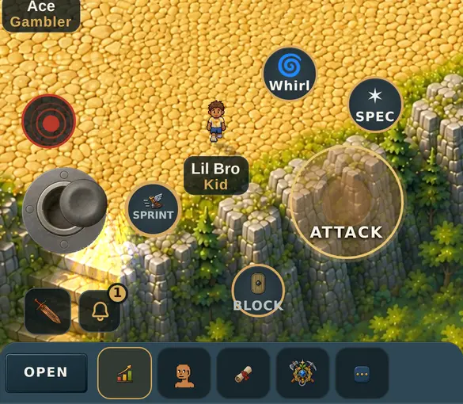
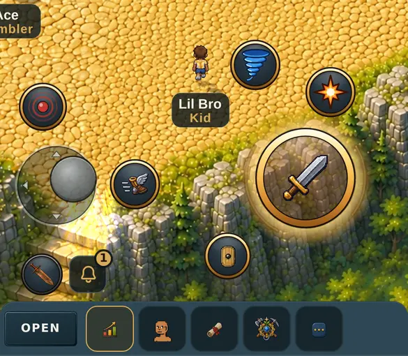
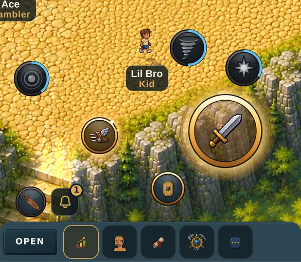
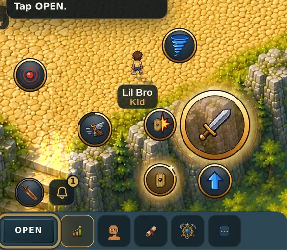
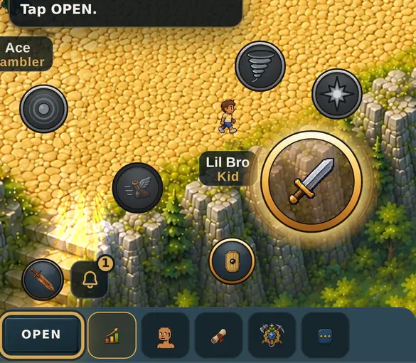
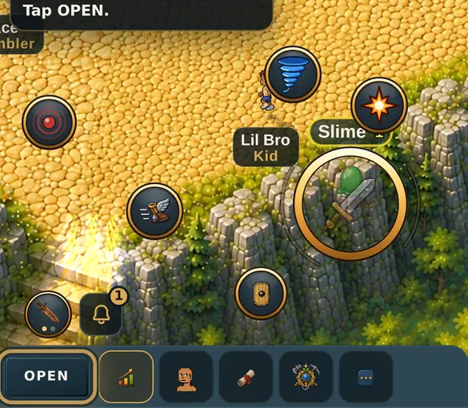
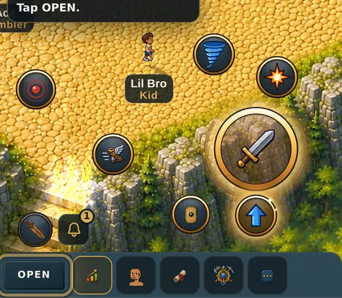
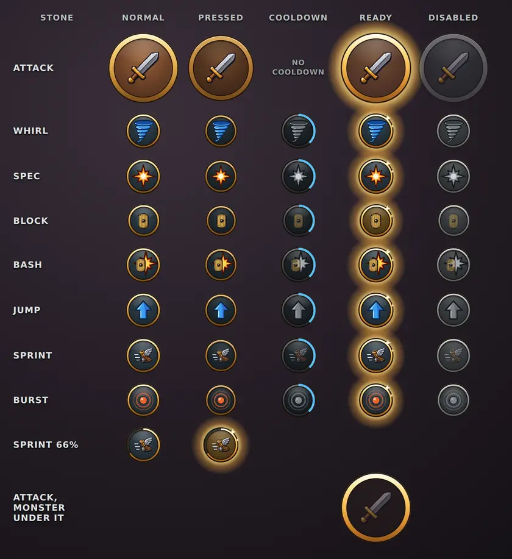
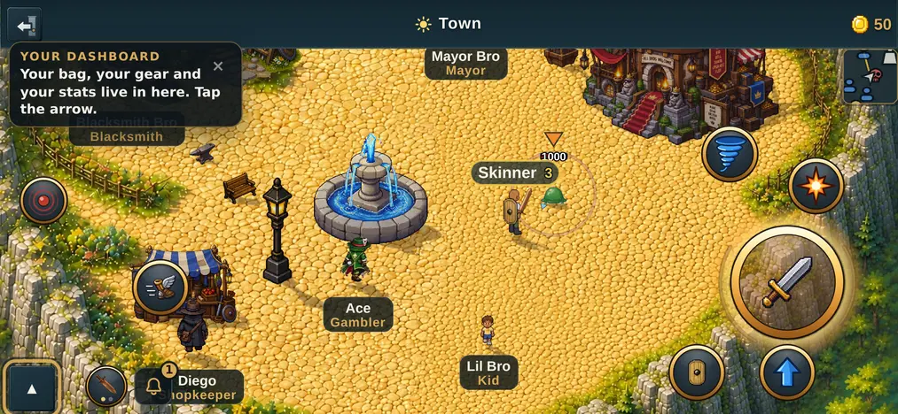

# The touch controls in the owner's mockup's look (v2.3.3018)

Owner: *"Make the on screen buttons look more like the improved mockup."*

Taken by `node tools/qa/mp/run.mjs btnskin` on a 390 x 844 phone, in a fight
(a sword, a shield, a monster in reach). "Before" is the same scenario run
against the previous build (`BTNSKIN_TAG=before QA_DIST=<old dist>`).

## In a fight

| Before | After |
|---|---|
|  |  |

The attack button goes see-through in a fight so monsters behind it stay
visible (the owner's v2.3.2263 ask); now the sword and the gold ring stay solid
over it.

## The mockup's states, in the game

| Cooldowns, the sprint on | The shield up (Shield Bash appears) |
|---|---|
|  |  |

| Out of mana and stamina (Disabled) | A monster under the attack button |
|---|---|
|  |  |

| In the air after a jump (Jump lit, under the attack button) |
|---|
|  |

## Every button in every state

The owner's button sheet, drawn by the game's own code
(`src/controls-harness.html`, saved by `node tools/qa/controls-sheet-shot.mjs`).
The Attack row is the attack button's own states, drawn through the game's
disc rules: it has **no cooldown** (the base attack has none; the mockup's
sheet had used Attack as its example). The Jump row is the real-jumping
work's button (v2.3.3017, PR #782), in the game in this look too.

## Sideways

