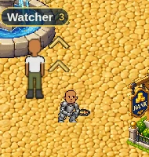
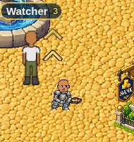

# v2.3.2607 — the cooking figure, 5% larger

The cook at the campfire, as another player sees him. Both crops are the same
190 × 200 region at the same zoom, captured by `tools/qa/mp/mp-cookpeer.mjs`.

**Before** is a run against `origin/main` itself, not a mock-up.

At this size a 5% change is deliberately subtle — the numbers below are the
reliable part, and the harness reads them off the sprite rather than off the
picture.

| | drawn height (world px) | scale applied to the 220px art |
|---|---|---|
| Before | 62.00 | 0.2818 |
| After | 65.10 | 0.2959 |

That is +5.0%, exactly.

Before:

After:

## Why the same number appears twice

There were two copies of `62` in the renderer: one for the cook on **your own**
screen and one for the cook on **everybody else's**. They are now one shared
value, so a future resize cannot land on one and not the other.

This has bitten the project before, on the woodcutter: a resize in v2.3.1476
moved the local figure and not the copy, and for about 230 versions every other
player's lumberjack was drawn 18% larger than your own. Nobody could see it,
because you never watch your own character from someone else's screen.
