# Damage numbers, 1.75x bigger (v2.3.3033)

Owner: *"Damage numbers for players and monsters needs to be about anywhere from
1.5-2x bigger"*

Taken by `node tools/qa/mp/run.mjs dmgsize` on a 390 x 844 phone (dpr 3) in the
Wheel. "Before" is the same scenario run against main's build
(`QA_DIST=<main's dist>`). The words are in the game's own font, Source Sans 3
(installed on the test machine, which cannot reach Google Fonts: docs/DEV-TOOLS.md).
The test numbers are held still so a slow screenshot catches them where they spawn.

## A hit you deal, and a crit

A plain hit (63) and a crit (152), at the height a monster's numbers spawn.

| Before | After |
|---|---|
| 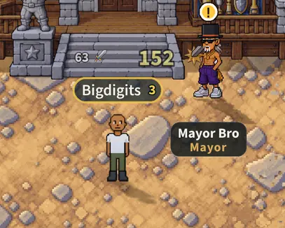 | 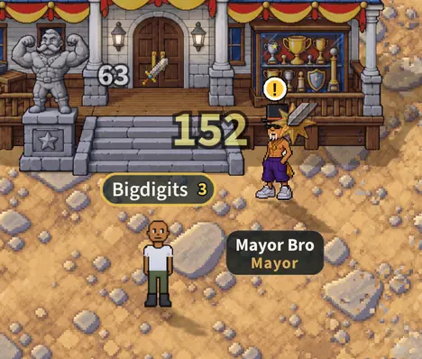 |

## Over a real monster

A fire goblin of the Flame Fields, hit through the worker with the same
`monster_damage` the game sends. The number sits over its HP bar, with the
air under it a plain number always had.

| Before | After |
|---|---|
| 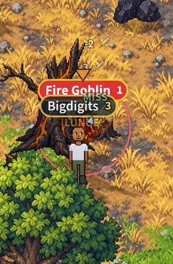 | 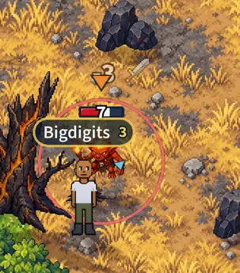 |

## A hit on you

Through the game's own dispatcher: the heart on a plain hit, the snowflake on a
snowman's. Over your name plate, as in v2.3.3026.

| Before | After |
|---|---|
| 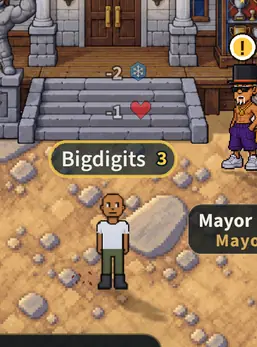 | 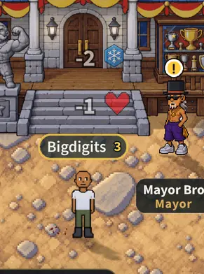 |

## A kill: the number, then the XP and gold

The XP and gold are not damage numbers and keep their size, so the kill's number
is the biggest thing and the pay-out reads under it.

| Before | After |
|---|---|
| 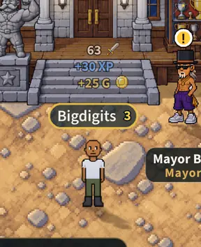 | 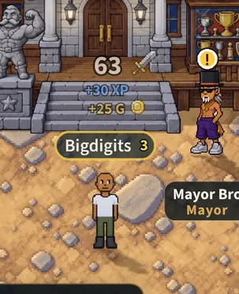 |

## A crit between two plain hits

Three numbers in one spot, spaced for their sizes (46 px between two plain ones,
64 beside a crit; it was 26).

| Before | After |
|---|---|
| 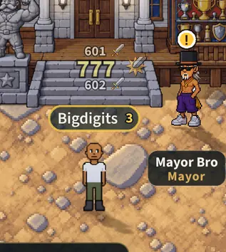 | 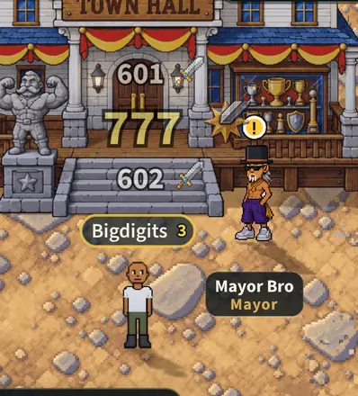 |

## A special's number, and thorns'

These two are drawn as classic text, not from the glyph atlas: the special's
outline and halo grow with it, and the thorns' number (an emoji, so no outline)
follows.

| Before | After |
|---|---|
| 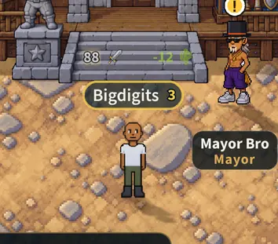 | 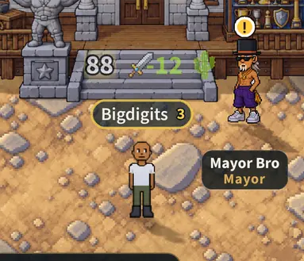 |

## What did not change

"Blocked!", "Dodged", a heal's "+12" and "Swimming!" are not damage numbers.

| Before | After |
|---|---|
| 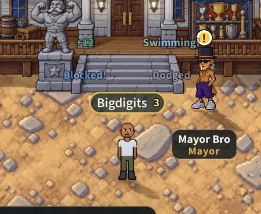 |  |

## Try 1.5 or 2

Add `?dmgscale=1.5` or `?dmgscale=2` to the address (any size from 1 to 3).
