# v2.3.2605 — the way out of a zone, before and after

Screenshots for the "exit areas aren't obvious enough once you're in that zone"
report. Captured by `tools/qa/mp/mp-exitmark.mjs` on the project's own
phone-sized harness, at the two iPhone widths that matter (360 and 390 CSS px),
portrait and landscape, in **two different zones** — Flame Fields (dark lava)
and Frost Ridge (bright snow), because a marker that reads over one can vanish
over the other.

**Before** is a run against `origin/main` itself (a worktree at the base
commit), not a simulation of it.

## What you are looking for

- **Before:** the way home is a pale, near-white plume that reads as haze. The
  only words naming it — the label "Town" — are drawn *outside the map*, in the
  black margin past the edge of the playfield, so they are on screen only once
  you have already walked to the border and found the exit yourself. Measured
  by the harness: that label sits at (528, 1056) in Flame Fields and
  (1064, 912) in Frost Ridge, on a 1024 × 1024 map. Both are off it.
- **After:** the words **"Way Out"** float over the doorway itself, in the
  game's existing white-on-black-stroke label style, and the plume wears the
  mint green that the marker's own halo has always used.

---

## 390 wide — portrait

### Flame Fields

Before:

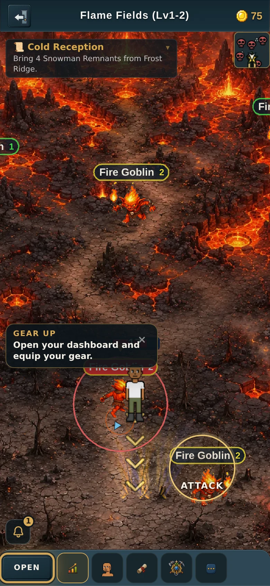

After:

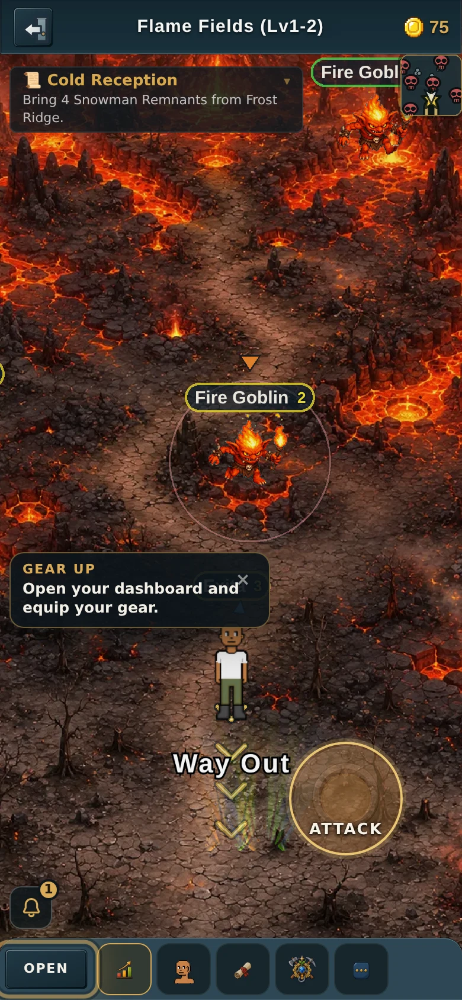

### Frost Ridge

Before:

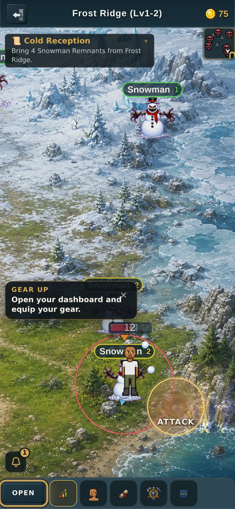

After:

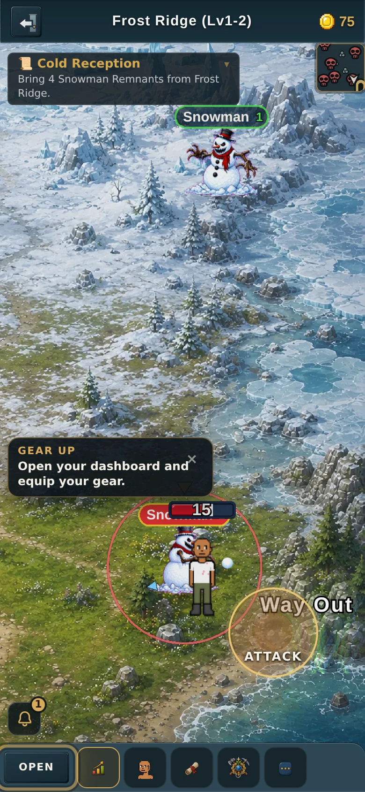

---

## 360 wide — portrait

### Flame Fields

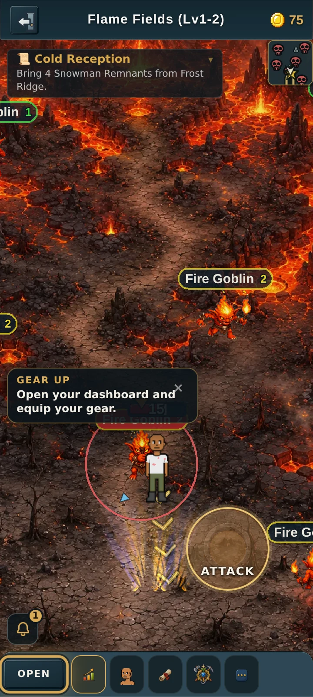

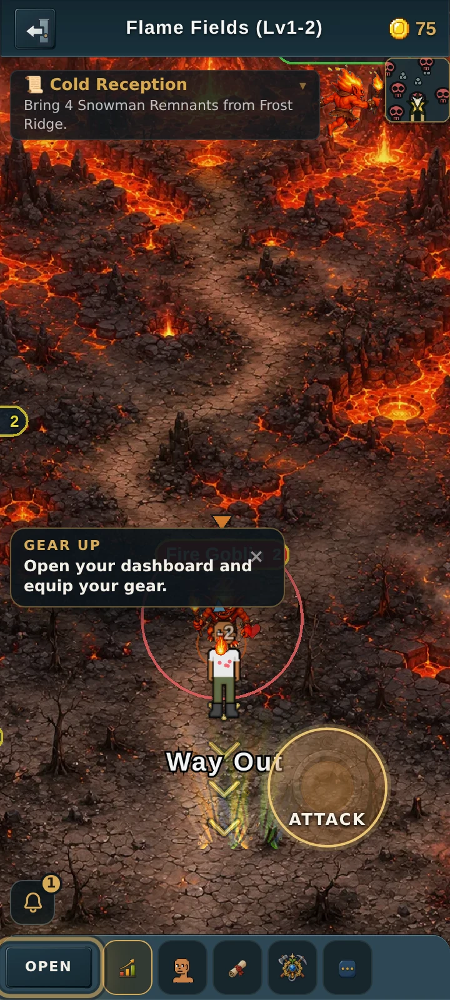

### Frost Ridge

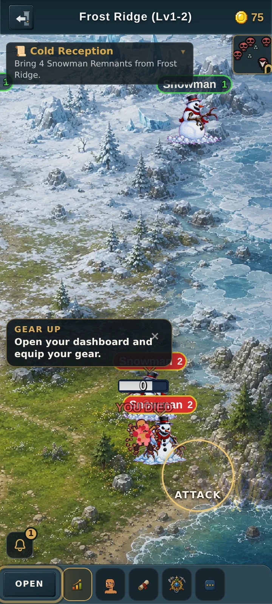

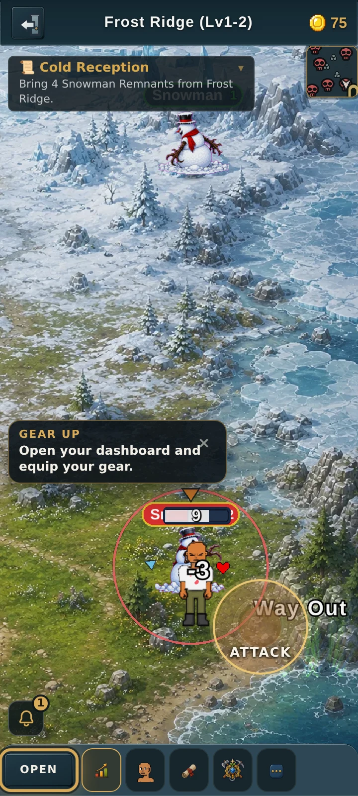

---

## 390 wide — landscape

### Flame Fields

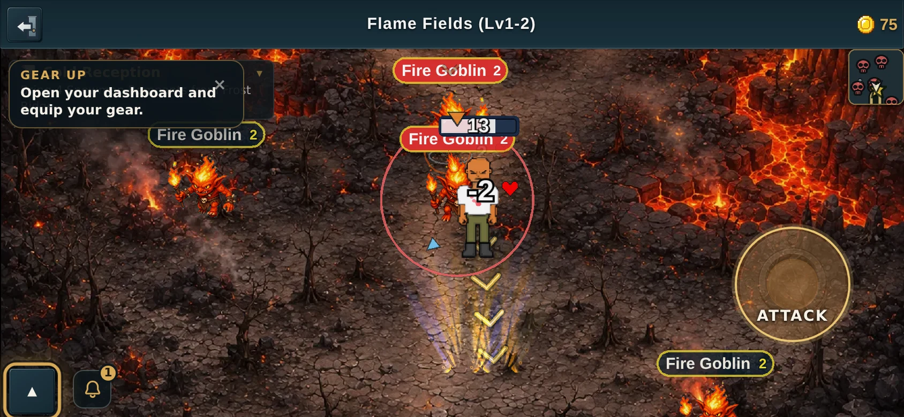

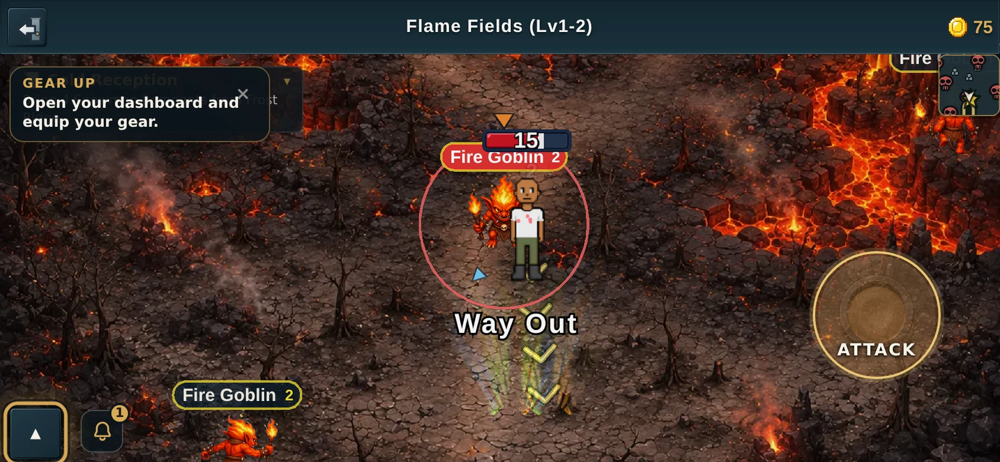

### Frost Ridge

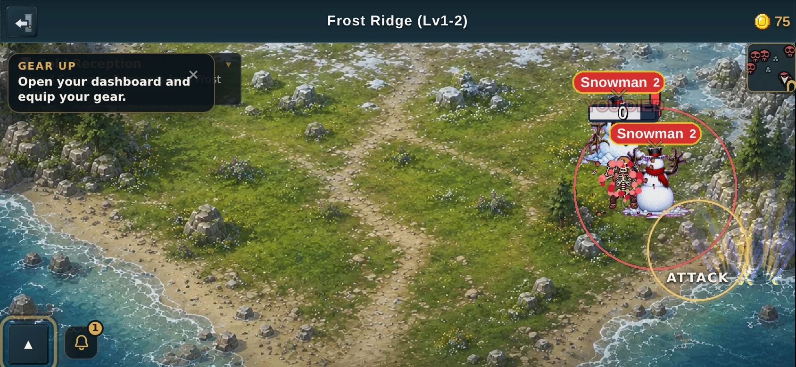

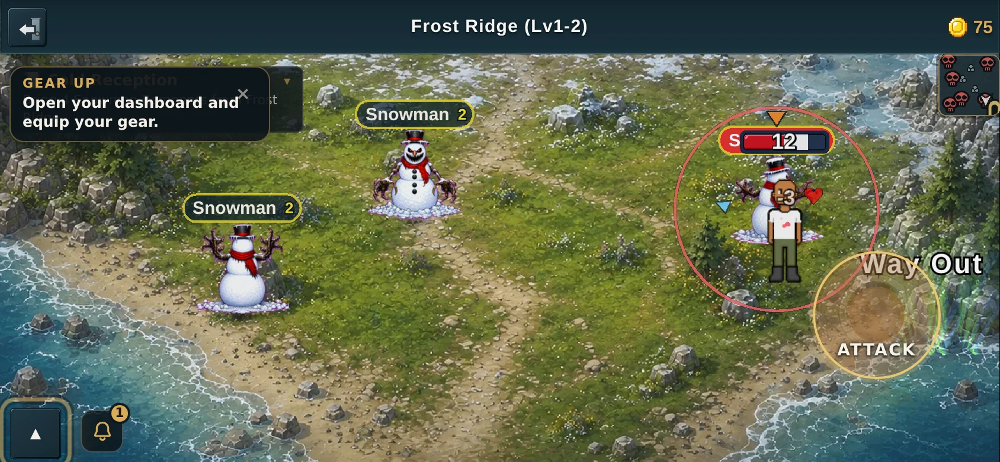

---

## 360 wide — landscape

### Flame Fields

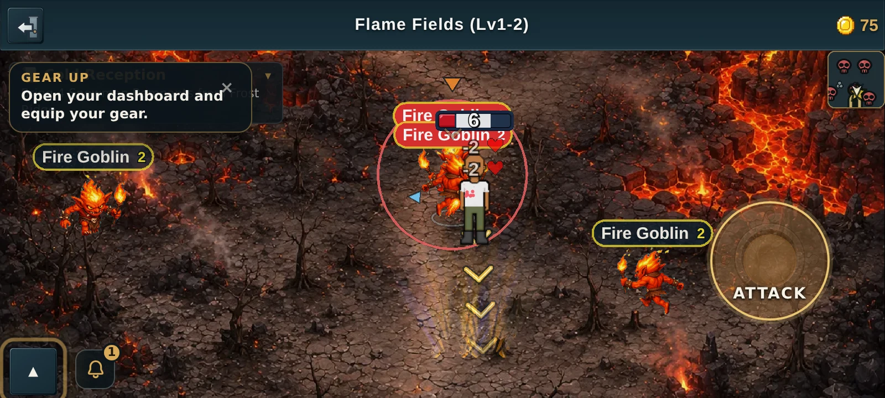

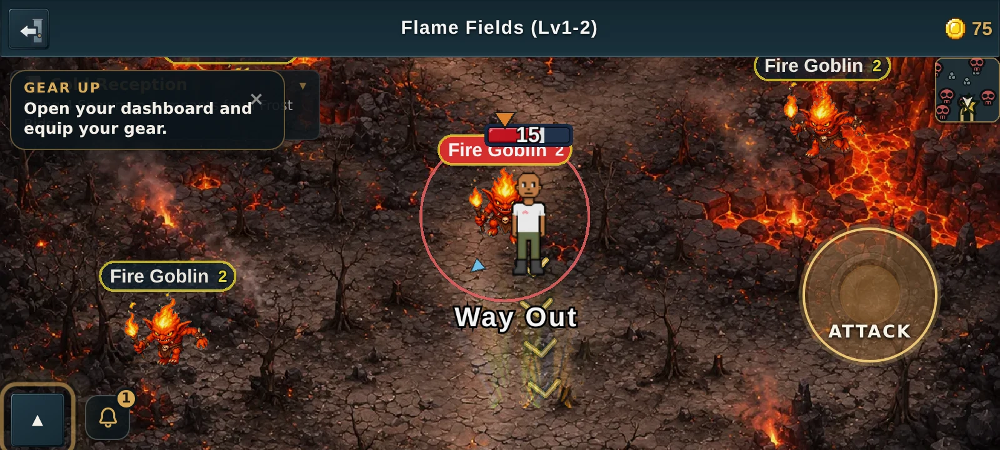

### Frost Ridge

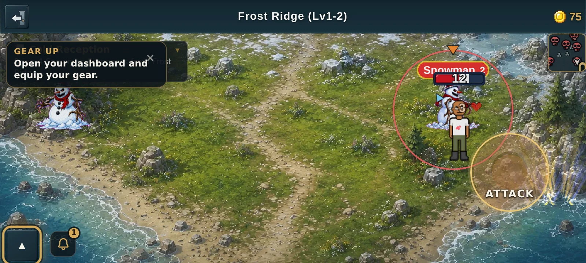

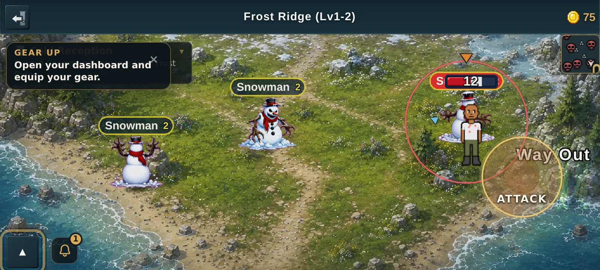

---

## One thing worth knowing

In these shots the player is parked six tiles from the doorway, which is close
enough that the label can pass behind the **ATTACK** button. That is the
closest range the label has to work at, and it is the range where it matters
least — by then the mint plume is right in front of you. Standing further back,
which is when you actually need the label, it sits clear in the middle of the
screen. In-world labels in this game have always been able to pass under the
controls (the "Coming soon" marks do the same), so this is existing behaviour
rather than something the change introduces.
