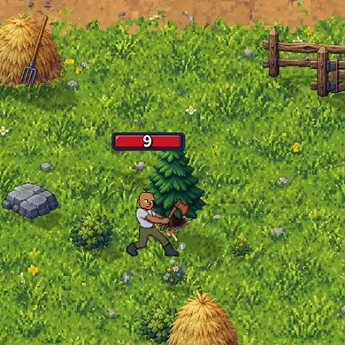
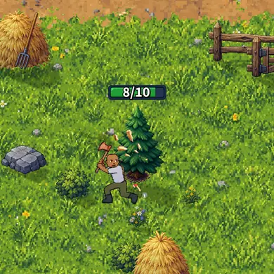
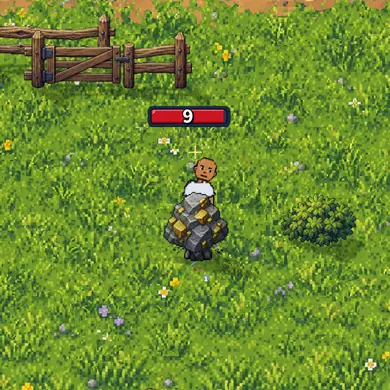
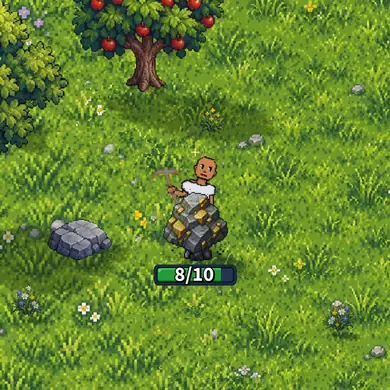
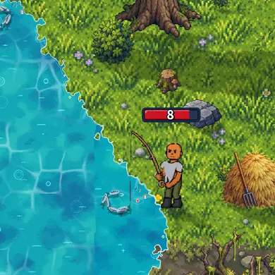
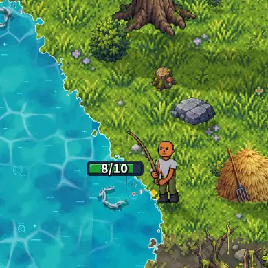

# The harvest's bar: green, at the resource, "7/10" (v2.3.3035)

Owner: *"I want resource harvesting bar to be green and to appear above the
resource, not the player head. It should also list the numbers on the bar right
now the bar has no numbers."*

Taken by `node tools/qa/mp/run.mjs harvestbar` on a 390 x 844 phone (3x) in the
Wheel, on the commons by Brotown, between two hits. "Before" is the same scenario
run against main's build (`QA_DIST=<main's dist>`). The test machine draws about
two frames a second, about as fast as the hits come, so for the picture only the
hits still to come are paused a few seconds: that lets the bar be caught at rest,
as a phone shows it between hits, instead of white with the flash of a hit.

## Chopping a tree

Over the crown, clear of the lumberjack. Before, it was over his head.

| Before | After |
|---|---|
|  |  |

## Mining a rock

The miner stands right behind the rock he works, so a bar over the rock would sit
on his head and shoulders. It sits on the rock's top instead.

| Before | After |
|---|---|
|  |  |

## Fishing

In the Wheel a fishing spot is its fish, swimming in the real water, so the bar is
over the fish.

| Before | After |
|---|---|
|  |  |

## Cooking

The cook leans right over his fire with the pan in the flames, so the fire's bar
stays under the fire (over it would be over his head). It is green and reads
"7/10" like the rest.

## A bar with no numbers

A harvest whose hits never come back from the server (a dead connection: PR
#790) falls back to an old timer bar. That bar had no numbers. It now reads the
resource's HP, counting down with the clock.
