# The quest windows in the owner's painted art (v2.3.3030)

Owner: *"Add these for the new quest windows."* (with three sheets of painted
frames, buttons and ornaments, and a mockup of the quest-complete flow)

Taken by `node tools/qa/mp/run.mjs questwin` on a 390 x 844 phone, through the
first quest with real finger taps. "Before" is the same scenario run against
main's build (`QA_DIST=<main's dist>`). The words are in the game's own font,
Source Sans 3: the test machine's browser cannot load it from Google Fonts, so
it was installed there for these pictures (docs/DEV-TOOLS.md).

## Mayor Bro offers a quest

| Before | After |
|---|---|
| 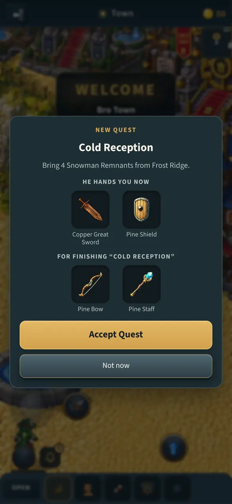 | 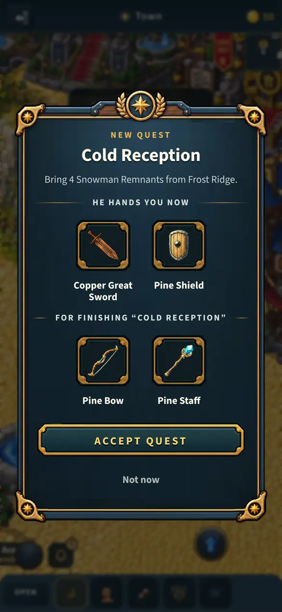 |

## You accept it

QUEST ACCEPTED! on the owner's thin green banner, over Mayor Bro's next line.
Before, the plate was drawn under the dialogue's dark backdrop, dimmed at the
moment it played.

| Before | After |
|---|---|
| 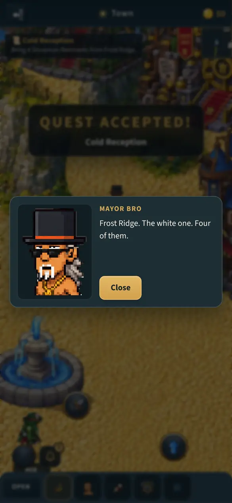 | 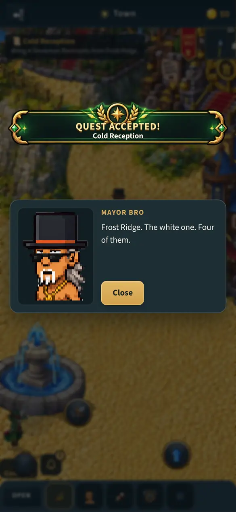 |

## The claim window (only when there is a choice)

Quest one pays XP, so it asks where the XP goes. The claim button is the
owner's grey bar until a chip is chosen.

| Before | After |
|---|---|
| 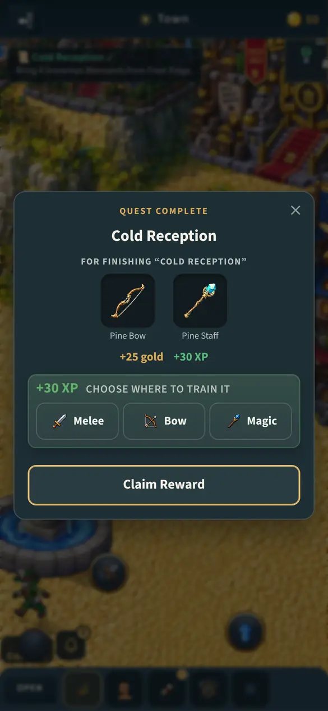 | 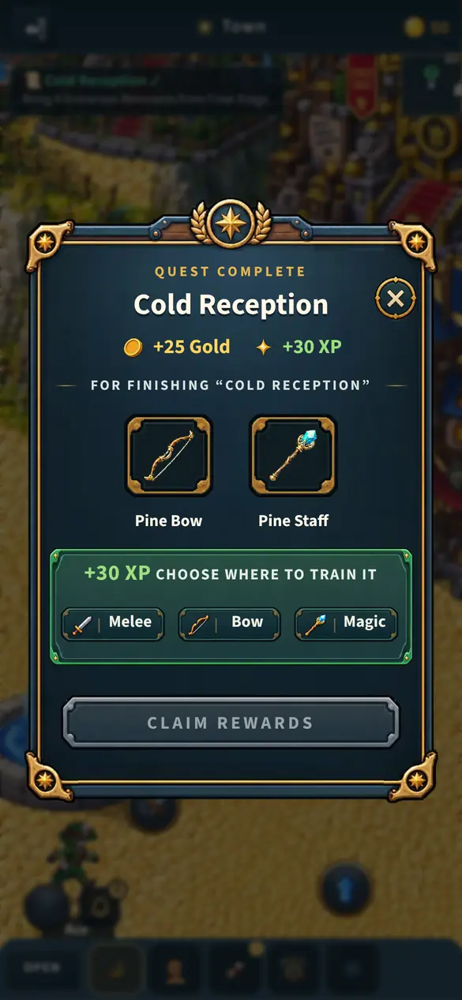 |

## A chip chosen

The chosen chip wears the owner's gold ring and check, and the claim turns
gold.

| Before | After |
|---|---|
| 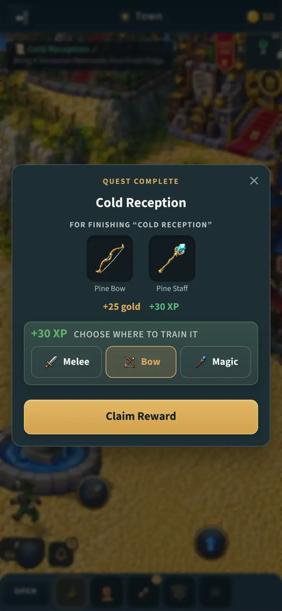 | 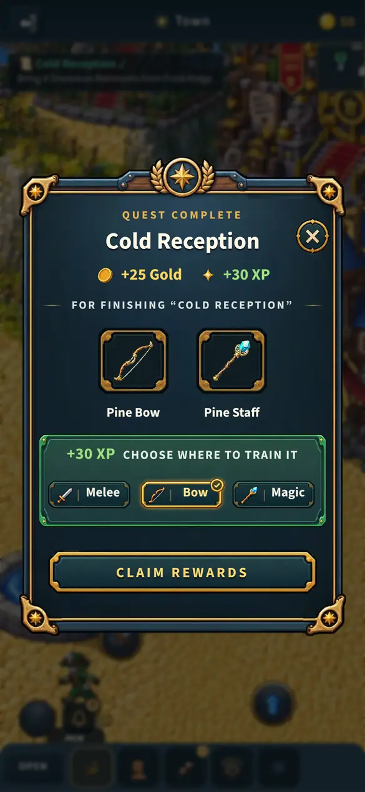 |

## Claim Rewards tapped

Before: straight to his next quest, with QUEST COMPLETED! dim under the
dialogue's backdrop (the bug this fixes). After: *Rewards claimed!*, the slots
glowing, *+30 XP to Bow*, the coins flying to the purse and the bow and staff
to the bag, and QUEST COMPLETE! at the top. His next quest follows about two
seconds later, or at a tap.

| Before | After |
|---|---|
| 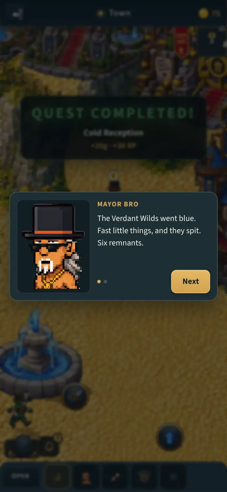 | 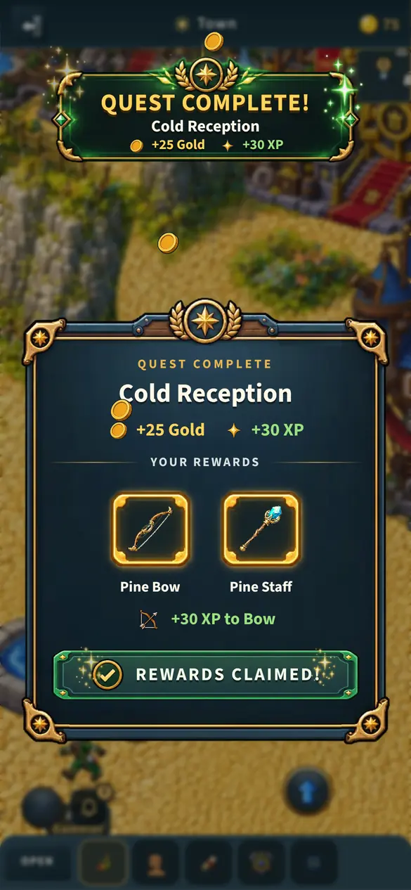 |

## A quest with nothing to choose (Gather Copper)

No window: the banner wears the owner's laurel check and the reward flies
straight from it to the top bar.

| Before | After |
|---|---|
| 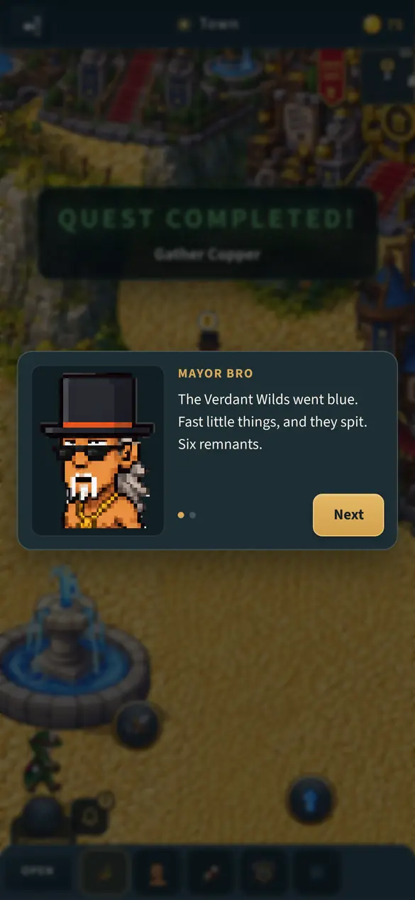 | 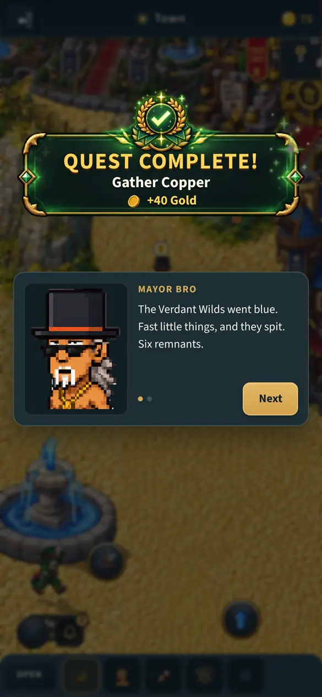 |

## Sideways

| Before |
|---|
| 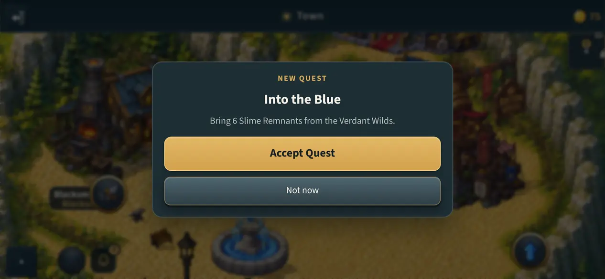 |

| After |
|---|
| 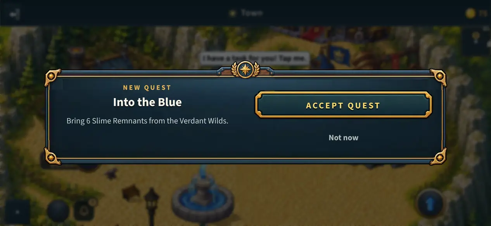 |

## Every window and banner

Drawn by the game's own components (`src/quest-harness.html`, saved by
`node tools/qa/quest-sheet-shot.mjs`): the offer, the choice, a chip chosen,
the confirmation; then QUEST COMPLETE!, its smaller copy at the top, the auto
reward's laurel check, QUEST ACCEPTED! and QUEST REWARD.

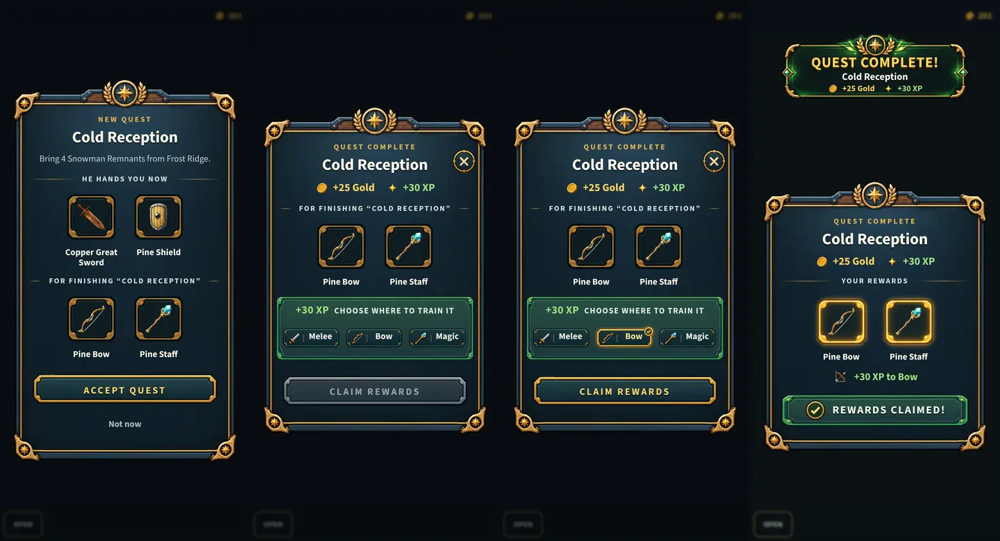

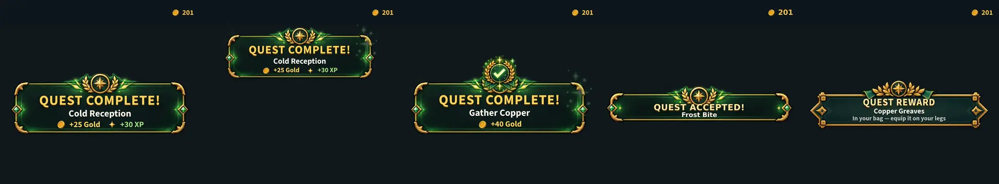

Sideways, the claim window and the confirmation:

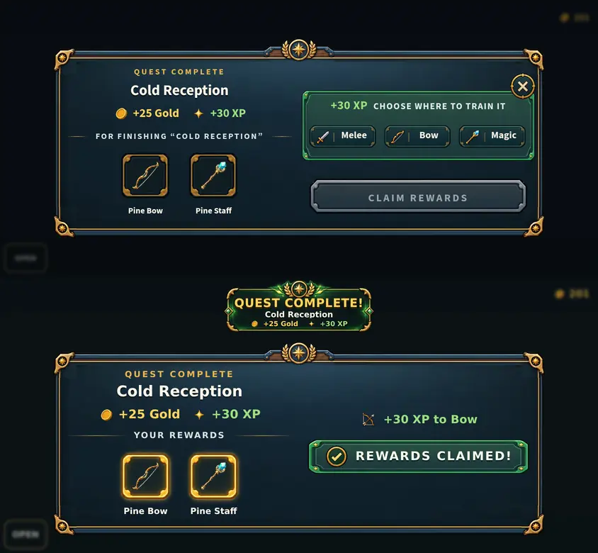
