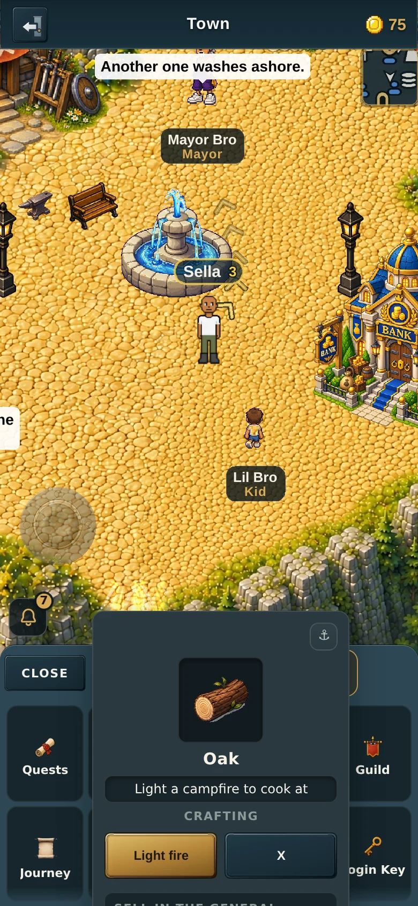
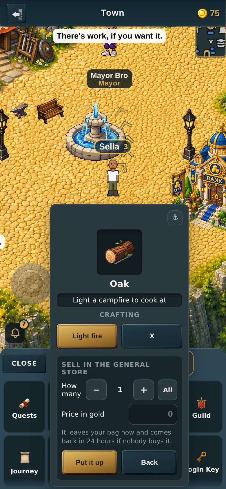
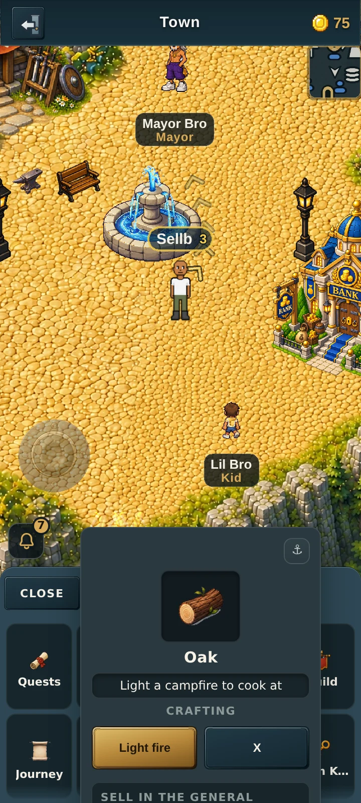
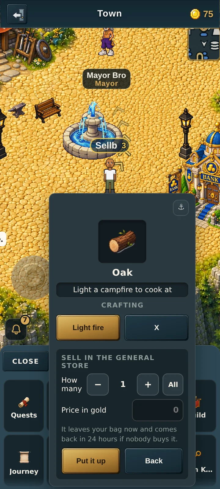

# v2.3.2612 — tapping Sell, before and after

Owner: *"tapping 'sell' on an item currently goes nowhere (the button just does
nothing) so I don't know what's built out for that."*

The sell flow was built. Tapping Sell opened the price sheet every time — it
just opened it **off the bottom of the screen**, because the card had been
positioned for its collapsed height and was never re-positioned when it grew.

Captured by `tools/qa/mp/mp-sellsheet.mjs`, tapping a **real bag tile low in
the grid** (which is what anchors the card low — an item card opened any other
way is centred, and centred always has room underneath it). **Before** is a run
against `origin/main` itself.

| | sheet ends | "Put it up" button |
|---|---|---|
| Before, 390×844 | 1046 of 844 (202px past the fold) | 193px below the fold, not tappable |
| After, 390×844 | 829 of 844 | on screen, tappable |
| Before, 360×800 | 994 of 800 (194px past) | 185px below the fold, not tappable |
| After, 360×800 | 785 of 800 | on screen, tappable |

## 390 wide

Before — the price sheet and its buttons are off the bottom of the screen:

After — the card is re-placed as it grows, so the whole sheet is in view:

## 360 wide

## A note on what this flow is

The sheet reads "Sell in the general store". It is a **fixed-price listing**,
not a live auction: you name a price, the item goes onto the shelf, and gold
reaches you when another player buys it — settled server-side. There is no
bidding anywhere in the build.
