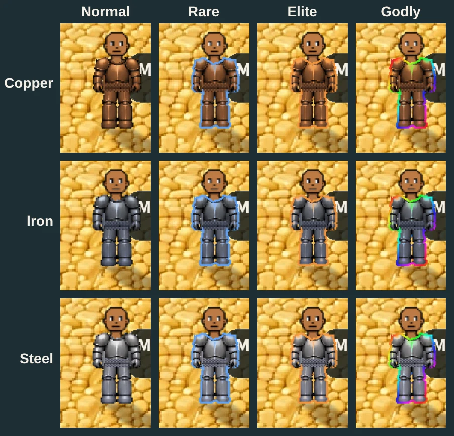
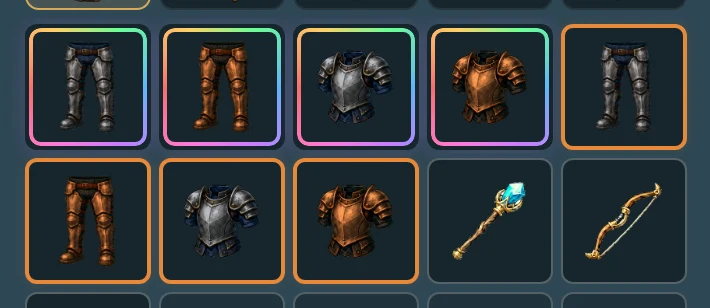
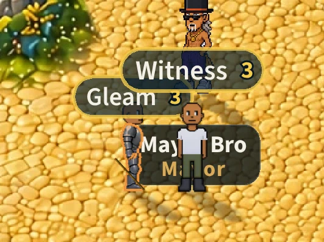

# Worn armour shows its grade (v2.3.3127)

Owner: *"I also think the armor should be visibly different if you're
wearing rare, elite, or godly. Wondering if you can change the outline hue or
something on the armor so it retains the color but has highlights. So rare is
blue, elite is orange, godly is prismatic"*.

## What it looks like

The torso and greaves you wear keep their metal's own colour and get two
things in the grade's colour:

- **an outline**: the piece's edge, about 1.4 CSS px, drawn just inside its
  silhouette;
- **highlights**: where the steel art is bright (the same mask the metal
  sheen uses), the bright pixels are lit in the grade's colour at their own
  brightness. A copper plate stays copper and gleams blue at its highlights.

| grade | colour |
|---|---|
| rare | blue (`[0.32, 0.62, 1.0]`) |
| elite | orange (`[1.0, 0.56, 0.14]`) |
| godly | a rainbow across the figure, about one whole spectrum from shoulder to boot, drifting round once every ~6 s |

- **Normal armour is unchanged.**
- **A full set while jogging** is one picture on the body sprite
  (entityRenderer `_fullsetFrame`), so its outline goes all the way round.
  Standing, the torso and greaves are separate pictures; the torso's bottom
  edge and the greaves' top edge are the seam between them and are not drawn
  (`uRimSkip`), or a line would cross the waist.
- **Weapons are unchanged.** The ask was the armour. A godly weapon keeps its
  gold gleam (`GRADE_SHINE.godly.color`); godly armour shines in its own metal
  instead, because gold under a rainbow outline muddied both.
- **It is drawn with the light effects off too** (`?lightfx=0`, or a device
  that turned them off): a grade is something the player owns, not
  decoration. Then only the graded pieces are filtered.

## How it is drawn

The metal sheen's own filter (`src/rendering/lightfx/glint.js`), which
already runs on every worn metal piece every frame, so it costs **no new
pass**:

- `GRADE_LOOK` holds the three colours, `GRADE_RIM` the outline's width.
- The shader (`FRAG`, the `uGrade` block): the outline is a pixel with open
  space within `uRim` of it in one of eight directions AND still open 2.6
  times as far, so a pinhole in the art (the gaps between a gauntlet's
  fingers) does not draw a little ring. Godly's colour is `hueRgb` of a
  diagonal ramp plus `uTime`.
- `uTime` wraps every 100 s, where 0.16 turns a second is a whole number of
  turns, so the drift never jumps.
- The loading screen's warm-up draws the grade branch once
  (`prewarmGlintPipe`), so the first graded piece does not compile a shader
  mid-play.
- **No textures, no memory.** Five uniforms on a filter that already exists.

## Whose grade, and why it cannot claim more than the fight counts

- **Yours** comes from your own bag: `seenGrade(R.armor)`.
- **Everyone else's** comes from the worker: `eqg` on that player's tick
  entry, two letters, the torso's then the greaves' (`n` / `r` / `e` / `g`),
  e.g. `'rn'` or `'ee'` (`armourGradeWire`, `server/src/gearprov.js`). It is
  absent in plain armour, so the usual player's tick is unchanged.
- **Both use combat's own rule** (`grade` in combat.js `_armorDrMult`):
  - a minted piece's grade is the ledger's;
  - a piece worn through the legacy lane is worn as the game describes it,
    grade included (the owner's v2.3.2534 decision, `gear-provenance.md`);
  - a godly piece the worker cannot prove (`prov !== 'minted'`) reads elite.

  So the outline never says more than the damage reduction gives. `prov` is
  the worker's own mark, stripped from every claim, and no message sets
  `eqg` itself: the worker derives it from what it already holds as worn.
- **A swap that changes only the grade** (an elite iron torso for a plain one:
  the same look, so no look update is relayed) marks the player for the next
  tick (`_gridsApplyArmor`, grids.js), so the others see it at once rather
  than at the next step.

## The bag and the cards say the same

The owner's colours were already the pets' ("White Normal, Blue Rare, Orange
Elite, Prismatic Godly", playerProfile.js), and the salvage essences use them
(#844). The bag and the cards used purple for elite and gold for godly; they
now match:

- **Elite is orange** (`#E8893A`): `QUALITY_COLOR` (dash/common.js),
  `RARITY_BORDER` / `RARITY_FILL` (inventoryStyles.js), `RARITY_TINT`
  (ItemArt.jsx), the two edges in InventoryPanel, and `.ls-slot--legendary`'s
  glow (game.css).
- **Godly's ring is a rainbow** (`.ls-slot--godly::after`, still turning on
  iOS 16.4+), and a godly item's NAME is rainbow text wherever the grade
  colours a name (`qualityInk`: the equip card, the quest reward label, the
  drop reveal's item line, the chest reveal's prize line).
- Gold stays godly's one SOLID colour (`QUALITY_COLOR.godly`) where a single
  colour is needed: a glow or a frame (the drop reveal's border, which
  mp-drops checks).

## Another player sees it

## Testing the look in the game

The admin panel (a 1.2 s press on the zone name) has **Rare armor**, **Elite
armor** and **Godly armor** buttons beside the kit: each puts the copper and
iron sets into your bag in that grade (`/dev/kit` `{ what: 'armor', quality }`,
devtools.md), minted, so a godly piece counts as godly.

**Found on the way:** the bag took a second armour piece with the same name
as one already held for a replay of the first, and dropped it (the
`quest_reward_stashed` handler's by-name guard, v2.3.1687). The worker had
minted it and the ledger held it, but it never reached the bag. A piece with
the worker's id is now the same piece only if it has the same id; a piece
with no id keeps the old guard.

## Checks

- **Server, `armorgrade` suite (19):** the letters (junk and `__proto__`
  read normal; godly only when minted); no `eqg` in plain armour; `'rn'` for
  a rare torso; a described godly torso with a forged `prov` goes out as
  elite; the kit's grade minted into the ledger and the bag, worn by its ids,
  `'ee'` and `'gg'`; a grade-only swap marked for the next tick (a control
  run without the mark fails it); `eqg` never saved.
- **Phone, `mp-armorgrade` (12):** every metal in every grade, one frozen
  frame each, measured against the same frame in plain armour: rare's
  outline bluer than red, elite's red over green over blue, godly's across at
  least five of twelve hues, copper's highlights still copper-warm; the look
  with the light effects off; another player told `'ee'` by the worker and
  drawing both pieces elite (on a 3x phone); the bag's elite edge orange and
  godly ring a rainbow; no page errors.
- `mp-sheen` and `mp-sheenall` (the metal sheen in every animation, yours
  and others') pass, except mp-sheen's "it follows the sun", which fails the
  same way, with the same numbers, on `main` before this change.

## Knobs

| | where |
|---|---|
| the three colours | `GRADE_LOOK`, glint.js |
| the outline's width (CSS px) | `GRADE_RIM`, glint.js |
| how strong the highlights / outline are | `hi * 0.6` / `rim * 0.92` in `FRAG` |
| godly's spread and drift | `p.x * 1.6 + p.y * 1.2` and `uTime * 0.16` in `FRAG` |
| the bag's colours | `QUALITY_COLOR`, `QUALITY_PRISM` (dash/common.js), `RARITY_*` (inventoryStyles.js), `.ls-slot--*` (game.css) |
