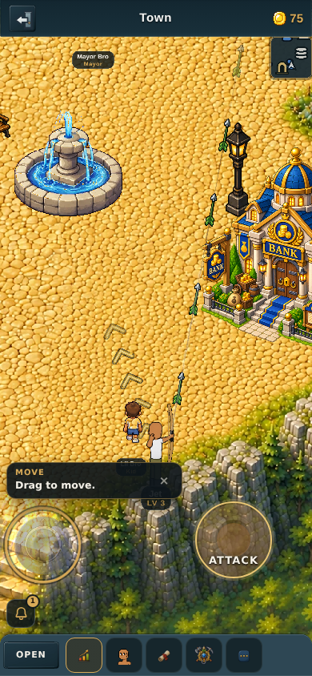
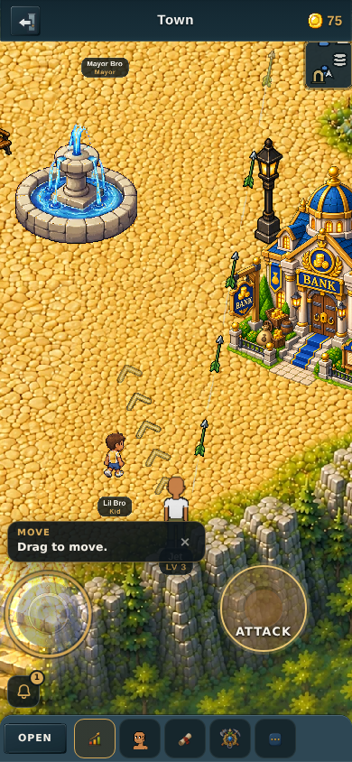
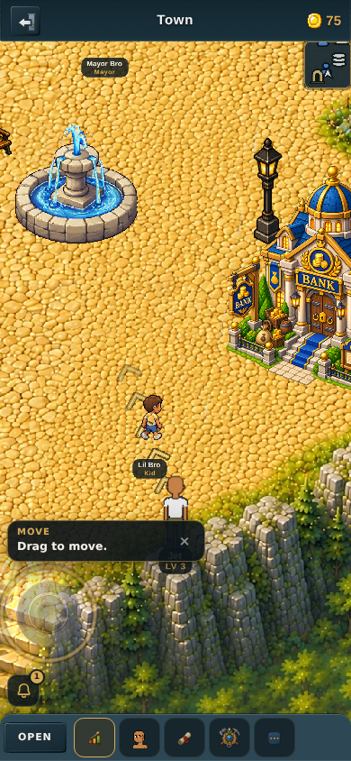
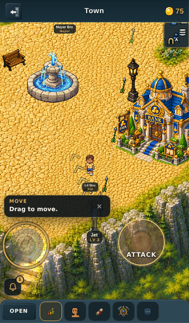

# The bow's jet stream (v2.3.2398)

**Status:** shipped. Replaces the bow's sight beam.

> "Instead of the aim tool (curvy line) for the bow I want to try to add a jet
> stream to each arrow. … For bro town I'm wanting to make a jet stream after
> each arrow so that way the player can use it as a visual guide to aim each
> successive arrow (like making a line out of it to aim better). I need just the
> jet stream effect (should be thin and long) to almost connect each successive
> arrow."
> — the owner

## What it does, in one sentence

Every ordinary bow arrow drags a thin pale-blue vapour streak behind it; the
streak stays put and fades for about a second after the arrow is spent, so a
volley leaves a line down the shot path that you can sight the next arrow along.

## Why it is *less* aim help than what it replaced, not more

This is the third time the bow's aim line has moved, and the earlier two moves
were about how much an archer should be given, so it is worth being straight
about which direction this one goes.

| version | what happened |
|---|---|
| v2.3.2258 | the sight beam removed for **bow and staff** — owner: *"too much of an advantage to have that on too (for both magic and bow)"* |
| v2.3.2320 | restored for the **bow only**, and only **while attacking** |
| **v2.3.2398** | **off again for the bow — the arrows draw the line instead** |

The beam was **predictive**: a line drawn down the range *before* the shot, from
the live aim angle. The jet stream is **retrospective**: it is exhaust. It only
marks where arrows have already been, and there is no arrow until you fire — so
the "while attacking, not while aiming" rule that v2.3.2320 had to write by hand
is not a rule here at all, it falls out of there being nothing to trail. An
archer ends up with less forward information than the beam gave and better
feedback about where the last few shots actually went.

**Magic gets nothing**, as it has since v2.3.2258. The staff flags are tested
explicitly in `_noteJetStream` rather than left to a short-circuit somewhere up
the chain — v2.3.2260's note about the beam ("safe by operator precedence … the
kind of thing a later edit reorders without noticing") applies here word for
word.

The beam is switched off behind `BOW_SIGHT_BEAM_ENABLED = false` rather than
deleted — the `SHIELD_CONE_ENABLED` pattern. Flip it to `true` and the beam is
exactly what v2.3.2320 shipped.

## The numbers, and where they come from

"Almost connect each successive arrow" is a measurable claim about a distance,
and it is the one number that decides whether the feature works.

- bow cadence = `SWING_COOLDOWN * BOW_SWING_MULT` = 600 × 0.75 = **450 ms**
  (`gameSystems.js`; attack speed only shortens it, floor 200 ms)
- arrow speed = 8 px per 60fps-frame (`projectiles.js`) = **480 px/s**
- so consecutive arrows in a held volley sit 480 × 0.45 ≈ **216 px** apart

| knob | value | why |
|---|---|---|
| `JET_LEN_PX` | 190 | one streak reaches back to within ~26 px of the arrow behind it — *almost* touching. Not a whole-flight streak: one that spanned launch-to-head would grow to the full 675 px range and every arrow in a volley would paint the same band, which is the "solid smear" failure mode. |
| `JET_LINGER_MS` | 1100 | an arrow crosses its range in ~1.4 s. A trail that died with its arrow could never be sighted along, which is the whole request. |
| `JET_ALPHA` | 0.55 | judged on town's sand, the brightest ground in the game — deliberately faint. Two overlapping streaks compose to ~0.80 rather than saturating. |
| fade curve | `1 - t²` | holds near full through the first half, drops away at the end. A linear ramp starts dimming exactly when the guide has just become useful. |

Bow range is 675 px, so a held volley has three of these down the shot path at
once. On a phone an arrow usually plants at the **screen edge** well before
675 px (`projectiles.js`), which shortens the line but does not change its shape.

## How it is built

**One sprite, stretched between two points.** Bow arrows fly straight — magic
steers mid-flight, the bow deliberately does not (v2.3.2261) — so an arrow's
path is a straight segment and there is no need for a polyline or a ribbon mesh.

**It needs nothing new stored on the arrow.** `projectiles.js` already stamps
`_pathX`/`_pathY`, the launch point frozen in absolute world coords at release
("a path is an origin AND a direction; both have to be stamped at release",
v2.3.2258). Launch → `(_renderX, _renderY)` is the whole path. Nothing in
`monsterCombat.js` or `projectiles.js` changed for this feature.

- the heading comes from the **path**, never from `a.ang` — the drawn arrow
  takes a live aim-bend and rotates toward straight-down as it plants, and
  neither of those is the line the shot was taken on;
- the streak starts one arrow-tail-inset (`ARROW_PINE.lenPx * anchor.x` = 24 px)
  behind the drawn arrow, so the vapour does not paint over its own shaft. It is
  written as that product rather than as a pixel count so a resized arrow
  carries it — the v2.3.1881 rule.

**The streaks outlive their arrows,** which is the whole feature, so they cannot
hang off the arrow records the way `_trail` does — `S.arrows` drops a spent
arrow and the guide would go with it. The renderer owns the list; an arrow only
feeds one while it is alive, and "was I fed this frame" is the entire liveness
test. A zone change drops them (a span between two points in one zone's world
coords means nothing in the next zone's), and the list is capped at 24.

**Pooled sprites, never allocated per frame** — the v2.3.1825 `arrowSprites`
pattern, refilled from zero every frame, unused ones hidden rather than
destroyed. A stretched sprite is one quad that never re-tessellates however long
it is drawn; v2.3.2331 converted the particle field off polygons because
tessellation was the single biggest frame cost. Measured in a held volley: **6–8
pooled sprites, 6–8 lit.**

**Its own container**, parented to the projectile layer at construction — ahead
of `projectileGfx` and ahead of every pool in the file, all of which are created
lazily. Pixi depth is child order, so leaving this to be created on the first
shot would put an arrow under or over its own exhaust depending on which frame
the player first fired on.

**The brown motion-blur smear stands down for any arrow that has a streak.**
`_updateProjectileTrail` is the same idea at a twentieth of the scale — an
8-sample ring buffer of recent positions stroked as dark brown segments — and
running both would put a brown line down the middle of the pale blue one. Staff
bolts, ice, the charged shots and every remote projectile keep it unchanged.

## Scope decisions

- **Ordinary bow arrows only.** The charged bow shot keeps its own golden flame
  wrap (`ARROW_SPECIAL`); it is fired one at a time off a swipe so it never
  forms the line this is for, and pale blue vapour over that art would fight it.
- **Local arrows only.** This is the owner's aiming aid. Extending it to remote
  players' arrows is a two-line change (`_updateProjectiles`' remote branch) but
  a crowded town with several archers would be several times the clutter for no
  aiming benefit to anyone. Deliberately left out of v1.

## The art

| file | size | what |
|---|---|---|
| `assets/icons-source/jet-stream-source.png` | 2172×724 | the owner's original |
| `assets/icons-source/jet-stream-trimmed.png` | 1978×149 | alpha-bbox crop |
| `public/sprites/effects/jet-stream-v1.png` | 512×39 | the shipped texture, 30 KB |

A pale blue wisp, mean rgb(198,222,247), with brighter sparkle points along its
length, tapering to nothing at **both** ends — which is what lets two streaks
meet without a visible butt joint, and why it does not matter which end leads.

It is stretched with **one scale on both axes**, so it keeps the ~15:1 aspect it
was drawn at. The zone perspective curve (`zonePlayerScale`) rides the thickness
only: `len` is the span between two world points and that function sizes
*sprites*, not spans. It is literally 1 on every zone but worldview, so on
everything you actually fight in the two axes are equal.

**Preloading.** Loaded through `effectsRenderer`'s `_fxLoad`, which pushes into
the list `effectsAnimationsReady()` awaits — so it rides the `fx` group of
`preloadWorldAnimations()` and the animation-preloading LAW is satisfied. Global
rather than per-zone: a bow goes everywhere its owner does. There is a note at
the `fx:` line in `preloadAnimations.js` saying so, because a texture with no
name in that manifest is the kind of thing a later reader assumes was forgotten
and "fixes" with a lazy first-use load.

## Tests

`tools/qa/mp/mp-jetstream.mjs` — 27 assertions per viewport, at 390×844 and
390×664 (iPhone Safari is the primary platform), against a real worker and a
real volley. It also photographs a volley and the linger into
`tools/qa/mp/out/jetstream/`, because the owner judges this by eye.

The claims with teeth:

1. **the streak lies on the arrow's real flight line** — v2.3.2320's property
   ("it points where the ARROW goes") moved to the feature that does the job
   now. Checked against the simulation's own frozen launch point, not against a
   second copy of the aim ladder. Measured: 0.0000 rad of heading disagreement,
   0.01 px off the line, 24.0 px behind the arrow;
2. **it outlives its arrow** — every arrow is deleted outright and the streaks
   must stay, hold still, and fade;
3. **successive streaks almost connect** — projected onto the aim ray, the gap
   between consecutive streaks must stay under 80 px;
4. **magic lays none**, and **the sight beam is dark while firing** — asserted
   mid-volley, so it cannot pass by the player merely not shooting.

Streaks carry a renderer-minted `id` because the list compacts as they expire:
watching `streaks[0]` compares a different object each frame, and the fade
assertion first read *backwards* for exactly that reason.

`mp-aimpath` block 6 is inverted rather than deleted — it used to assert the
beam was drawn while attacking. A test that once claimed the reverse is the
clearest record that this is a decision and not an accident.

## What it looks like

All four shot by `mp-jetstream` at 390×844 / 390×664 on town's sand — the
brightest, least forgiving ground in the game.

### Before → after, mid-volley

| before (the sight beam) | after (the jet stream) |
|---|---|
|  |  |

The difference is where the line *is*. The beam ran **forward** from the bow
along the live aim, 280 px of it, whether or not an arrow was ever there. The
jet stream runs **backward** from each arrow, over ground the shot has already
crossed, and three of them chain into one line down the flight path.

### The linger, and the shorter phone

| after the arrows are gone (390×844) | mid-volley at 390×664 |
|---|---|
|  |  |

The left-hand shot is taken after every arrow has been deleted from the
simulation: the line is still there, holding where it was laid and fading. That
is the whole request — a guide that dies with its arrow is not a guide.

**It is deliberately faint.** Judged against sand at `JET_ALPHA = 0.55`, which
measures a ~5 px readable core on screen; a stronger value was tried and the
owner preferred this one.
