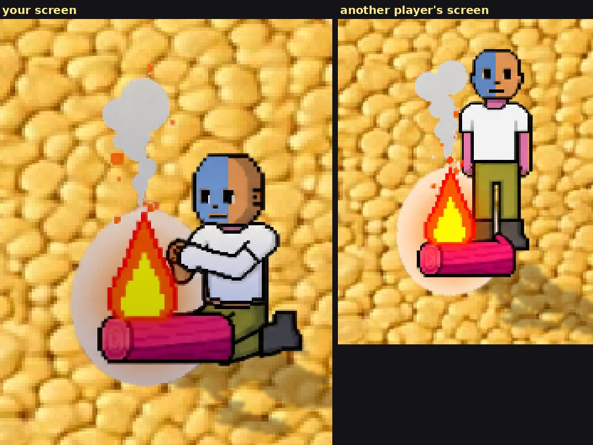
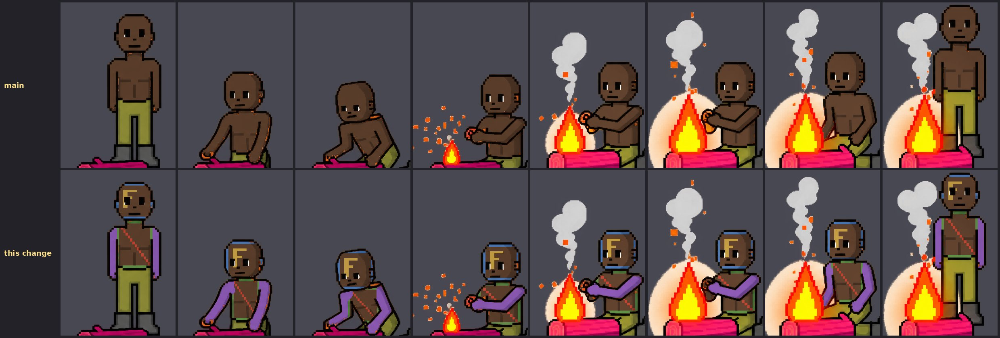
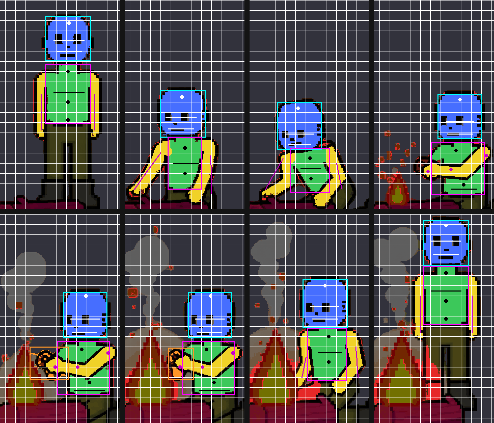
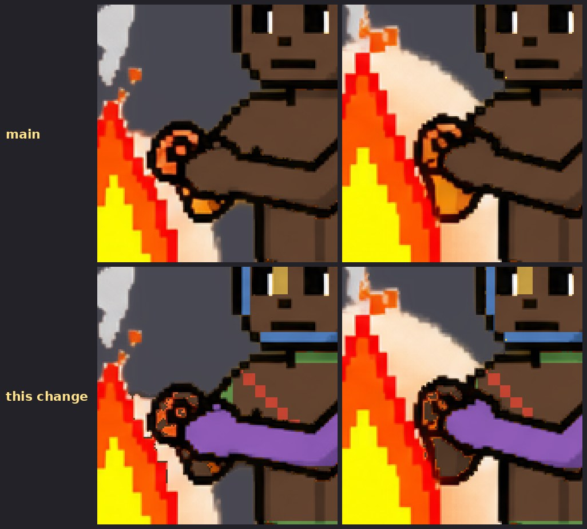

# Your tattoos stay on while you cook and light a fire (v2.3.2856, v2.3.2858)

Owner: *"Yea do woodcutting and missing ones."* Cooking is one of the missing
ones. Built on #725 (fishing and woodcutting), whose region tables and stamp it
reuses.

## What was wrong

At the campfire the game swaps your body for a separately drawn cook
(`sprites/skills/cook-strip.webp`, 24 frames). v2.3.1710 gave that figure your
skin colour and nothing else, so your face, chest and arm drawings vanished for
as long as you cooked, on your screen and everyone else's.

It also left your **fingers** orange. The hand on the pan's handle is drawn as
small separate pieces of skin (the handle's outline cuts them apart), and the
skin recolour skips small pieces so that it does not recolour the fish frying in
the pan, which is painted the same orange. Size can't tell fingers from fish, so
the fingers kept the artist's orange whatever skin you chose. This is the same
bug the lumberjack's head had (#725).

In the game, with the test drawings mp-cookink uses (a blue face on the left
half, pink arms and chest; the shirt covers the chest as it does when walking),
on your screen and on another player's:

The same cook on a dark skin, main above and this change below, with test
drawings on the face (an F, and a border round the grid), the chest (a box with
a diagonal) and both arms (filled in). The F reads the right way round:

The hand on the handle, zoomed:

## Why the drawings are a layer of their own

The cook figure the game bakes is **shared**. Every other player's cook on your
screen is drawn from your bake (the SPEC table in `effectsRenderer`, v2.3.1713:
a per-player bake of the whole figure costs about 4.5 MB each and was turned down
for phone memory). So the drawings cannot simply be baked into it. If they
were, every cook at every campfire would wear your tattoos.

A second, private copy of the figure would avoid that, at 9 MB for its two
strips (with and without greaves, 4.5 MB each: the cook fills his frames, so
cropping saves nothing on him). Instead the drawings go on a **layer of
their own**. `recolorStandInSkinSplit` bakes the figure exactly as before, then
stamps the drawings onto a copy and keeps only the pixels they changed. The
layer is cropped per frame like every other stand-in, and `cookInkSprite` draws
it over the figure, under the clothes. It exists only for a player who has drawn
something. The test fills every cell of the face, both arms and the chest, the
most ink a player can draw, and that costs 2.2 and 2.3 MB for the two strips:
about half of each figure. A small drawing costs a small fraction of that.

Each strip gets its own layer. The legless strip (used under greaves) was
exported separately and differs from the full one by a few hundred edge pixels
per frame, and it has part of the forearm erased where the thighs were, so a
shared layer would have floated ink over holes in the lap (~85 px per frame,
measured).

## Where the drawings go

`standInInk.js` (`COOK_INK_REGIONS`), fitted by hand like the lumberjack's.
This figure is easier: he squats facing the camera and only his arms and the pan
move. The head and torso sit on the same pixels in all 24 frames, so the face
and chest boxes are one entry each. Only the forearm lying across his lap moves
from frame to frame, and it needs a seed of its own on every frame, because its
top edge is outlined with gaps and the chest's flood ran through them into the
hand.

Blue face, green chest, yellow arms. The boxes are the face and chest boxes.
Red is skin that is not part of the cook (the fish).

Two measured settings come with the table:

- **`pieceKeep: 0.17`.** The arm drawing goes on each arm piece that is at least
  this share of the biggest one. The walking body uses 35%. Here the arm on the
  pan's handle is 23–58% of the other arm, so at 35% it lost its drawing on 10
  of the 24 frames and would have blinked at 17 fps. The largest stray piece
  (a knuckle, a speck between outlines) is 11%.
- **`COOK_KEEP_X = 120`.** A small piece of skin that starts left of this column
  is the cook's own and is recoloured, however small. Measured on both strips,
  every finger or knuckle piece starts left of x = 117 and every fish piece at
  x = 125 or further right.

## Other players

A drawn player's cook gets their layer over the shared figure. The rules are
the lumberjack's:
- only for players with a face, chest or arm drawing;
- only while they cook;
- at most two layers held at once;
- each released 15 s after nobody drew it.

Their drawings can't be known at load (the preload law's named exception).
The cook keeps no source image in memory (see `_fetchAndBakeCook`), so the first
time a drawn player cooks, the strip is fetched again from the HTTP cache and
they cook bare until the layer lands.

Their **skin** under the layer is still yours: that is the SPEC note's trade,
and this change leaves it alone. The drawings themselves are shaded by their
skin, as they see them.

## When you change a drawing

The layer is rebuilt when the strokes stop (400 ms, as for the lumberjack). The
figure under it is not: a drawing change doesn't change the figure. The bake
still runs in full, because the drawings are shaded by the skin under them, but
only the layer's textures are replaced.

## How it is checked

`mp-cookink` (new). Two players: one with drawings (a blue face on the left
half, pink arms and chest), one with none. Every check reads the frames the
renderer actually draws and compares them pixel for pixel with the same frame
of the shipped strip:

- **your screen:** the layer is drawn over the cook on every frame with the
  cook's exact transform; the face drawing is on the half it was drawn on;
  the arm and chest drawings are on every frame;
- **lined up:** every pixel of the layer sits on the cook's skin, on the same
  frame;
- **the pan:** nothing is drawn on the pan or the fish, and the fish keeps its
  painted colour;
- **the fingers:** no skin pixel of the cook is left in the artist's paint;
- **a watcher's screen:** the drawn player's cook carries their drawings once
  the layer lands, and keeps them;
- **no leak:** the plain player cooks with no drawings on the inked player's
  screen, and has no layer of their own;
- **greaves:** the legless cook, with its own layer, lined up with that strip;
- **a drawing change:** the new drawing shows on every frame, and the cook's
  texture is the same one as before;
- **memory:** the most ink a player can draw costs about half a figure per strip;
- **release:** the watcher lets the layers go 15 s after the player stops;
- no page errors.

## Lighting a fire (v2.3.2858)

The last of the missing ones. Lighting a fire swaps you for the painted
fire-lighter (`sprites/skills/firemaking-strip.webp`, 8 frames of 384x512)
for the second it takes. He was baked in your skin and nothing else, and like
the cook he is **shared**: every other player's fire-lighter on your screen is
drawn from your bake (the SPEC table). So the drawings take the cook's route:
`_fetchAndBakeFire` splits the bake (`recolorStandInSkinSplit`), and
`fireInkSprite` draws your layer over the figure, under the clothes.

In the game, with a test drawing: a blue face on the left half, pink arms and
chest. The shirt covers most of the arms and chest, as it does when walking. On
your screen, blowing on the flame, and on another player's, where he has just
stood up from it:

The strip on a dark skin, main above and this change below, with the test
drawings the cook's picture uses:

**Where the drawings go.** `FIRE_INK_REGIONS` in `standInInk.js`, fitted with
the cook's workbench. He stands, kneels to the log, strikes the flint, cups his
hands to blow on the flame, sits back and stands up. On the strike and the two
blowing frames his near arm crosses his chest, and its outlines cut the torso
into the chest above it and the belly below. Both are seeded as torso and the
torso box spans the arm, so the chest drawing holds still while the arm passes
in front of it.

Blue face, green chest, yellow arms, red skin-coloured pixels that are not him.
The cyan box is where the face drawing goes and the magenta one the chest
drawing's. The orange box on the two blowing frames is the fist's (below), and
the orange inside it is the fist: your skin, but no arm drawing, since its
pieces are too small for one (`framePieces`).

**The fist.** On the two blowing frames the hands cupped at the flame are drawn
as small islands of skin, cut apart by their outlines. The bake's size floor
(1800 px) exists to keep the flame and its sparks out, since they pass the skin
test in the same orange. It dropped the fist along with them: 365 and 453 px of
it kept the artist's orange whatever your skin. A column cannot separate them,
as the cook's `COOK_KEEP_X` does, because the flame burns on both sides of the
fist. So each of those frames has a box around the hands (`FIRE_KEEP_BOXES`),
and an island lying wholly inside it is his. The boxes take every island of
fist and knuckle and none of the flame, sparks or glow. The strike's knuckles
are painted glowing red by the flint, which is not skin to begin with. The
orange patches on the last two frames are trousers lit by the fire, which stay
trousers. This part is for everybody, drawings or not.

A few pixels keep the flame's colours: firelight the artist painted on the
knuckles in the flame's own orange and red, and a thin rim where the fist meets
the flame. Nothing can tell those from the flame itself, so they stay as
painted: a few dozen pixels at full size, a pixel or two on screen.

**Other players.** A drawn player's fire-lighter gets their layer, by the cook's
rules (`_peerStandInInk`, now shared by both figures, each with its own cache
of two).

**A frozen second fire.** While testing a watcher's view, a relit fire showed
only its last frame. A watcher's copy of the one-shot light started its clock
when the player's activity *changed*, and nothing changed between two fires lit
in a row. So every light after the first was drawn frozen on the standing-up
frame for its whole length. A figure that was not drawn last frame now starts
over.

**What it costs.** The most ink a player can draw costs 1.24 MB, against the
figure's 6.29 MB. It only exists for a player with drawings.

**How it is checked.** `mp-fireink` (new, 22 checks), the cook's test on this
figure:

- your screen: the layer on every frame with the figure's exact transform, the
  face drawing on the half it was drawn on, the arm and chest drawings on every
  frame;
- lined up: every pixel of the layer sits on his skin, on the same frame, and
  none on the flame, a spark or the lit cloth, all of which pass the skin test;
- the fist: every pixel of its islands recoloured, on both frames, read from
  every fire-lighter the test draws (a sweep on a loaded box can miss a frame);
- a watcher: his drawings on from his first light, kept through relights;
- no leak: a plain player lights a fire bare on the inked player's screen;
- a drawing change rebuilds the layer and leaves the figure alone;
- what the layer costs, and that the watcher lets it go 15 s after he stops;
- no page errors.

With the change switched off, 12 of the 22 fail: every drawing check, the fist
(365 and 453 px in the artist's paint) and the watcher's relight, which showed
only the last frame.
