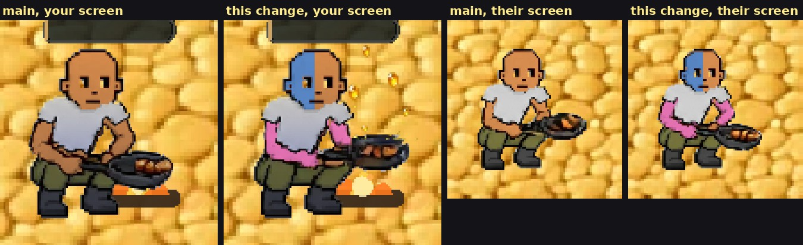
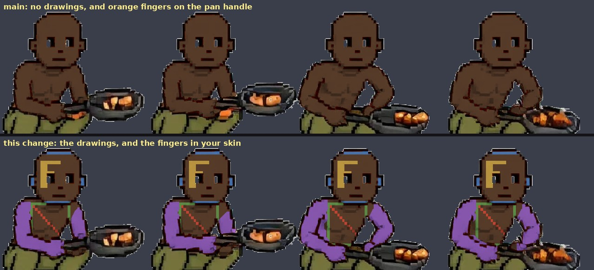
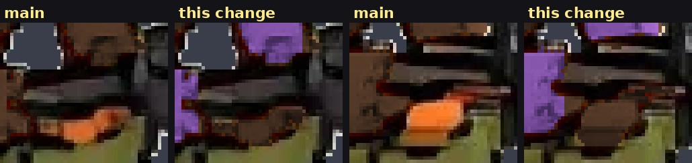
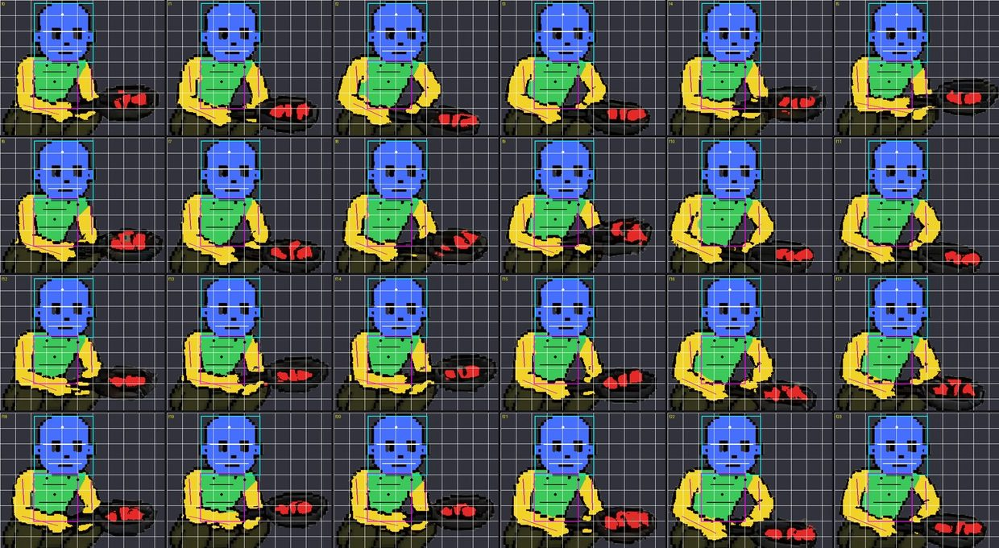

# Your tattoos stay on while you cook (v2.3.2856)

Owner: *"Yea do woodcutting and missing ones."* Cooking is one of the missing
ones. Built on #725 (fishing and woodcutting), whose region tables and stamp it
reuses.

## What was wrong

At the campfire the game swaps your body for a separately drawn cook
(`sprites/skills/cook-strip.webp`, 24 frames). v2.3.1710 gave that figure your
skin colour and nothing else, so your face, chest and arm drawings vanished for
as long as you cooked, on your screen and everyone else's.

It also left your **fingers** orange. The hand on the pan's handle is drawn as
small separate pieces of skin (the handle's outline cuts them apart), and the
skin recolour skips small pieces so that it does not recolour the fish frying in
the pan, which is painted the same orange. Size can't tell fingers from fish, so
the fingers kept the artist's orange whatever skin you chose. This is the same
bug the lumberjack's head had (#725).

In the game, with the test drawings mp-cookink uses (a blue face on the left
half, pink arms and chest; the shirt covers the chest as it does when walking),
on your screen and on another player's:

The same cook on a dark skin, main above and this change below, with test
drawings on the face (an F, and a border round the grid), the chest (a box with
a diagonal) and both arms (filled in). The F reads the right way round:

The hand on the handle, zoomed:

## Why the drawings are a layer of their own

The cook figure the game bakes is **shared**. Every other player's cook on your
screen is drawn from your bake (the SPEC table in `effectsRenderer`, v2.3.1713:
a per-player bake of the whole figure costs about 4.5 MB each and was turned down
for phone memory). So the drawings cannot simply be baked into it. If they
were, every cook at every campfire would wear your tattoos.

A second, private copy of the figure would avoid that, at 9 MB for its two
strips (with and without greaves, 4.5 MB each: the cook fills his frames, so
cropping saves nothing on him). Instead the drawings go on a **layer of
their own**. `recolorStandInSkinSplit` bakes the figure exactly as before, then
stamps the drawings onto a copy and keeps only the pixels they changed. The
layer is cropped per frame like every other stand-in, and `cookInkSprite` draws
it over the figure, under the clothes. It exists only for a player who has drawn
something. The test fills every cell of the face, both arms and the chest, the
most ink a player can draw, and that costs 2.2 and 2.3 MB for the two strips:
about half of each figure. A small drawing costs a small fraction of that.

Each strip gets its own layer. The legless strip (used under greaves) was
exported separately and differs from the full one by a few hundred edge pixels
per frame, and it has part of the forearm erased where the thighs were, so a
shared layer would have floated ink over holes in the lap (~85 px per frame,
measured).

## Where the drawings go

`standInInk.js` (`COOK_INK_REGIONS`), fitted by hand like the lumberjack's.
This figure is easier: he squats facing the camera and only his arms and the pan
move. The head and torso sit on the same pixels in all 24 frames, so the face
and chest boxes are one entry each. Only the forearm lying across his lap moves
from frame to frame, and it needs a seed of its own on every frame, because its
top edge is outlined with gaps and the chest's flood ran through them into the
hand.

Blue face, green chest, yellow arms. The boxes are the face and chest boxes.
Red is skin that is not part of the cook (the fish).

Two measured settings come with the table:

- **`pieceKeep: 0.17`.** The arm drawing goes on each arm piece that is at least
  this share of the biggest one. The walking body uses 35%. Here the arm on the
  pan's handle is 23–58% of the other arm, so at 35% it lost its drawing on 10
  of the 24 frames and would have blinked at 17 fps. The largest stray piece
  (a knuckle, a speck between outlines) is 11%.
- **`COOK_KEEP_X = 120`.** A small piece of skin that starts left of this column
  is the cook's own and is recoloured, however small. Measured on both strips,
  every finger or knuckle piece starts left of x = 117 and every fish piece at
  x = 125 or further right.

## Other players

A drawn player's cook gets their layer over the shared figure. The rules are
the lumberjack's:
- only for players with a face, chest or arm drawing;
- only while they cook;
- at most two layers held at once;
- each released 15 s after nobody drew it.

Their drawings can't be known at load (the preload law's named exception).
The cook keeps no source image in memory (see `_fetchAndBakeCook`), so the first
time a drawn player cooks, the strip is fetched again from the HTTP cache and
they cook bare until the layer lands.

Their **skin** under the layer is still yours: that is the SPEC note's trade,
and this change leaves it alone. The drawings themselves are shaded by their
skin, as they see them.

## When you change a drawing

The layer is rebuilt when the strokes stop (400 ms, as for the lumberjack). The
figure under it is not: a drawing change doesn't change the figure. The bake
still runs in full, because the drawings are shaded by the skin under them, but
only the layer's textures are replaced.

## How it is checked

`mp-cookink` (new). Two players: one with drawings (a blue face on the left
half, pink arms and chest), one with none. Every check reads the frames the
renderer actually draws and compares them pixel for pixel with the same frame
of the shipped strip:

- **your screen:** the layer is drawn over the cook on every frame with the
  cook's exact transform; the face drawing is on the half it was drawn on;
  the arm and chest drawings are on every frame;
- **lined up:** every pixel of the layer sits on the cook's skin, on the same
  frame;
- **the pan:** nothing is drawn on the pan or the fish, and the fish keeps its
  painted colour;
- **the fingers:** no skin pixel of the cook is left in the artist's paint;
- **a watcher's screen:** the drawn player's cook carries their drawings once
  the layer lands, and keeps them;
- **no leak:** the plain player cooks with no drawings on the inked player's
  screen, and has no layer of their own;
- **greaves:** the legless cook, with its own layer, lined up with that strip;
- **a drawing change:** the new drawing shows on every frame, and the cook's
  texture is the same one as before;
- **memory:** the most ink a player can draw costs about half a figure per strip;
- **release:** the watcher lets the layers go 15 s after the player stops;
- no page errors.
