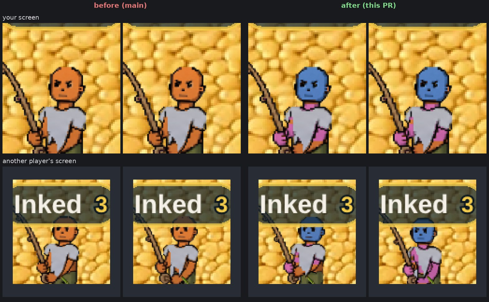
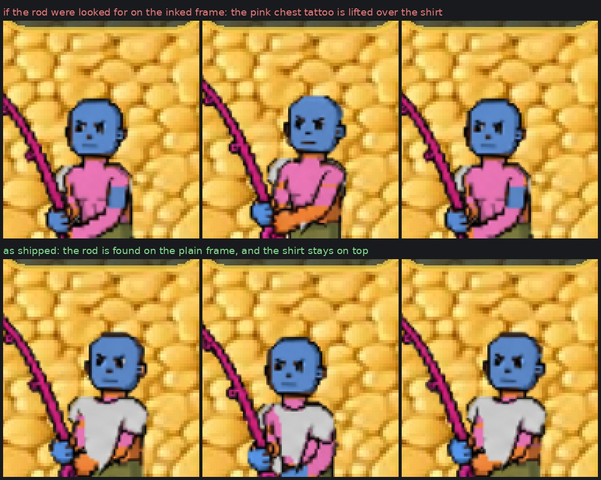
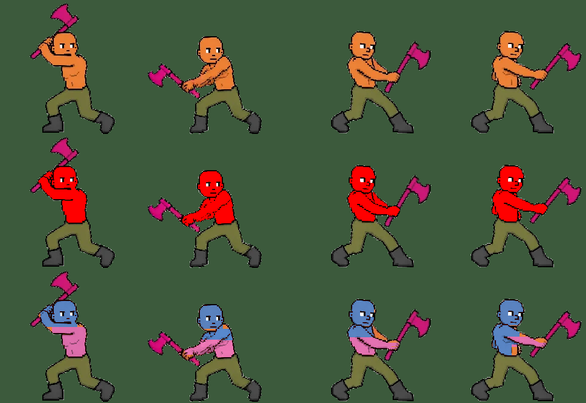

# Tattoos stay on while you harvest (v2.3.2780)

Owner: *"yes make tattoos stay on while harvesting resources."*

The game has three gathering skills. Where each one stood:

| skill | what draws you | tattoos before | now |
|---|---|---|---|
| mining | the `mine` body sheet, baked like walking | on | on (unchanged) |
| fishing | the **raw** `fish` sheet | **gone**, on every screen | **on**, on every screen |
| woodcutting | a separate lumberjack figure (`chop-strip`) | gone | still gone, see below |

## Fishing

The same tattooed character (blue face, pink arms and chest) fishing on main
and on this change, on his own screen and on another player's:

Fishing drew the raw fish sheet on purpose (entityRenderer v2.3.2304): the pink
rod and line are baked into that art, and the body-region **recolour** (skin
tone, trousers, shoes) mis-paints them. The drawings were stamped in the same
bake, so they were lost with it. Nobody chose that; it came along.

The drawings do not need the recolour. In the file the rod is the magenta tool
key, and `_isSkin` refuses it (skin wants `g >= b`; the key is `b > g`), so a bake
with no retint targets and only the drawings stamps the tattoos, prints and
patterns into the regions they always use and leaves every other pixel as drawn,
rod included. The bake then turns the key to pine after the stamp (v2.3.2761), so
the rod is pine on the inked sheet exactly as on the plain one.

**The pine recolour only touches the rod.** It finds the key by a hue window
(315 to 350), and the drawing palette's pink (`#d76ba8`) is hue 326, inside it.
On the first build that combined the two, a player's pink tattoos turned to pine
wood for as long as he fished. The recolour now only touches pixels that were key
in the sheet file (`_fileKeyMask`), read before anything is painted.
`getFishFrame(art, frameIdx)` (playerSkins) is that bake. A player with no
drawings gets the raw frame back, exactly as before. Skin tone, trouser and shoe
colours still do not apply while fishing; that is the trade v2.3.2304 made, and
it stands.

**Loading.** Your own inked fish sheet is baked behind the loading screen
(`preloadBodyAll` → `prewarmFishInk`) and again right after you edit a drawing
(`prewarmBody`), so your first cast shows the tattoos from its first frame. The
armour-masked fishing frames are prewarmed from the inked frame too.

**Another player's** inked fish sheet bakes the first time they cast. Their
drawings cannot be known at load, which is the exception CLAUDE.md's preload law
names, and it is how every other pose of a custom-looking peer already works. So
on their first cast they fish bare until the bake lands: 0.9 to 1.8 s across
runs on the test machine, which renders several times slower than a phone. The alternative,
baking every tattooed player's fish sheet on sight, holds about 2.7 MB of GPU
memory per tattooed player whether they ever fish or not.

### The hand-over-shirt overlay

v2.3.1914 lifts the rod and the gripping hand **above** the shirt while fishing.
Since v2.3.2761 it finds the rod by its recorded shape, which no colour can pass.
When that shape was not recorded, it falls back to the rod's old magenta, and a
pink tattoo passes that colour test. On an inked frame, a pink chest tattoo would
count as rod, and it and the skin around it would ride above the tee: ink
showing through a shirt. So the rod is looked for on the **raw** frame, where
no ink can be, and the pixels are copied from the inked one. That is also what
puts the face tattoo in the lifted head band.

This was not hypothetical. With the rod looked for on the inked frame by colour,
the test's pink chest tattoo covered the whole tee. The picture was taken before
v2.3.2761, while the rod was still magenta; it is what the colour fallback would
still do:

## Woodcutting: not in this change

Woodcutting swaps your whole body for a pre-drawn lumberjack
(`sprites/skills/chop-strip.webp`, twelve 240×220 swing frames). Stamping
drawings on it with the body pipeline was tried: the axe is safe (the skin test
refuses its magenta), but the **placement** is wrong. The face/chest/arm split
is tuned to the walking body's proportions, and on this figure it moves from
frame to frame. The face tattoo runs down onto the chest and shoulders on some
swing frames, and the chest tattoo lands on an arm:

Doing it properly means fitting the face, chest and arm regions to these twelve
frames. Other players' choppers are a second limit. They are drawn from one
shared figure, because a per-player chopper bake was refused on phone-memory
grounds (effectsRenderer, v2.3.1713 / v2.3.2303). That is why another player's
lumberjack already shows the artist's skin tone rather than theirs.

## How it is checked

`mp-harvestink` (new) reads the frame the renderer actually draws and compares
it pixel by pixel with the same frame of the sheet the game loads (the `.webp`
twin), so colour that is in the drawn frame and not in the art is ink, whatever
else is that colour. The face is drawn blue, the arms and chest pink:

- a plain angler still draws the raw sheet, with no ink on any frame (control);
- your own screen: ink on every fishing frame, from the first, the pink too
  (the colour the rod's recolour could take);
- a watcher's screen: ink from the first cast, and on every frame after it;
- every rod pixel of the art is still rod on every inked frame;
- the overlay's rod is no bigger than a plain angler's, with a pink chest tattoo
  on (at most 107 px; with the rod looked for on the inked frame it measured
  240 to 613, which is the picture above);
- no page errors on either client.

`mp-cosmpose`'s "fish" tattoo check, left live in v2.3.2746 as the owner's call,
now passes.
