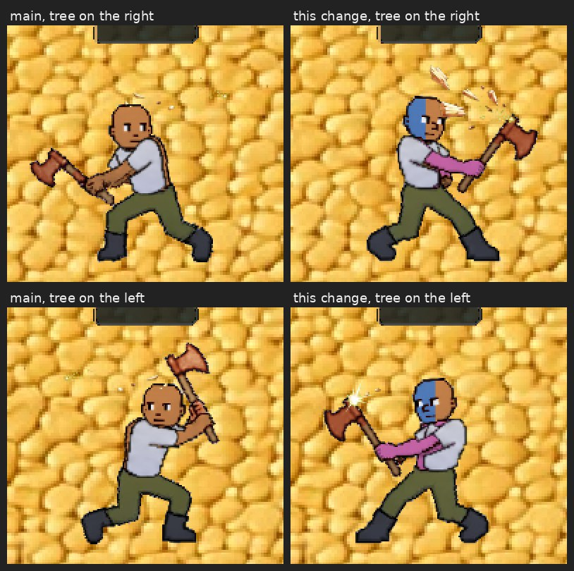
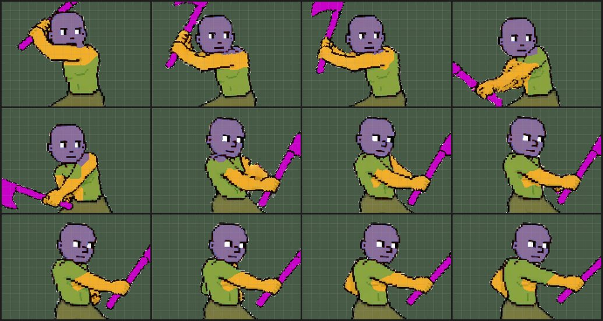
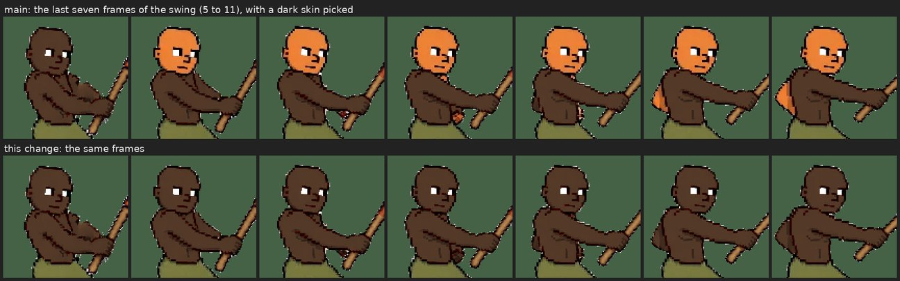

# Tattoos stay on while you harvest (v2.3.2834, v2.3.2835)

Owner: *"yes make tattoos stay on while harvesting resources"*, then *"Yea do
woodcutting"*.

The game has three gathering skills. Where each one stood:

| skill | what draws you | tattoos before | now |
|---|---|---|---|
| mining | the `mine` body sheet, baked like walking | on | on (unchanged) |
| fishing | the **raw** `fish` sheet | **gone**, on every screen | **on**, on every screen |
| woodcutting | a separate lumberjack figure (`chop-strip`) | **gone**, on every screen | **on**, on every screen (v2.3.2835) |

## Fishing

The same tattooed character (blue face, pink arms and chest) fishing on main
and on this change, on his own screen and on another player's:

Fishing drew the raw fish sheet on purpose (entityRenderer v2.3.2304): the pink
rod and line are baked into that art, and the body-region **recolour** (skin
tone, trousers, shoes) mis-paints them. The drawings were stamped in the same
bake, so they were lost with it. Nobody chose that; it came along.

The drawings do not need the recolour. In the file the rod is the magenta tool
key, and `_isSkin` refuses it (skin wants `g >= b`; the key is `b > g`), so a bake
with no retint targets and only the drawings stamps the tattoos, prints and
patterns into the regions they always use and leaves every other pixel as drawn,
rod included. The bake then turns the key to pine after the stamp (v2.3.2761), so
the rod is pine on the inked sheet exactly as on the plain one.

**The pine recolour only touches the rod.** It finds the key by a hue window
(315 to 350), and the drawing palette's pink (`#d76ba8`) is hue 326, inside it.
On the first build that combined the two, a player's pink tattoos turned to pine
wood for as long as he fished. The recolour now only touches pixels that were key
in the sheet file (`_fileKeyMask`), read before anything is painted.
`getFishFrame(art, frameIdx)` (playerSkins) is that bake. A player with no
drawings gets the raw frame back, exactly as before. Skin tone, trouser and shoe
colours still do not apply while fishing; that is the trade v2.3.2304 made, and
it stands.

**Loading.** Your own inked fish sheet is baked behind the loading screen
(`preloadBodyAll` → `prewarmFishInk`) and again right after you edit a drawing
(`prewarmBody`), so your first cast shows the tattoos from its first frame. The
armour-masked fishing frames are prewarmed from the inked frame too.

**Another player's** inked fish sheet bakes the first time they cast. Their
drawings cannot be known at load, which is the exception CLAUDE.md's preload law
names, and it is how every other pose of a custom-looking peer already works. So
on their first cast they fish bare until the bake lands: 0.9 to 1.8 s across
runs on the test machine, which renders several times slower than a phone. The alternative,
baking every tattooed player's fish sheet on sight, holds about 2.7 MB of GPU
memory per tattooed player whether they ever fish or not.

### The hand-over-shirt overlay

v2.3.1914 lifts the rod and the gripping hand **above** the shirt while fishing.
Since v2.3.2761 it finds the rod by its recorded shape, which no colour can pass.
When that shape was not recorded, it falls back to the rod's old magenta, and a
pink tattoo passes that colour test. On an inked frame, a pink chest tattoo would
count as rod, and it and the skin around it would ride above the tee: ink
showing through a shirt. So the rod is looked for on the **raw** frame, where
no ink can be, and the pixels are copied from the inked one. That is also what
puts the face tattoo in the lifted head band.

This was not hypothetical. With the rod looked for on the inked frame by colour,
the test's pink chest tattoo covered the whole tee. The picture was taken before
v2.3.2761, while the rod was still magenta; it is what the colour fallback would
still do:

## Woodcutting (v2.3.2835)

Woodcutting swaps your whole body for a pre-drawn lumberjack
(`sprites/skills/chop-strip.webp`, twelve 240×220 swing frames). It was baked
with your skin tone and nothing else, so the tattoos were gone while you
chopped, and on other players' screens the figure was the shared raw art.

The same character (blue face drawn on its left half only, pink arms and chest)
chopping, on main and on this change, with the tree on each side. The shirt
covers the chest tattoo, as it does when walking:

**Where the drawings go.** The body's face/chest/arm split cannot be pointed at
this figure. It is tuned to the walking body's proportions, and on the
lumberjack it put the face tattoo on the raised hands and the chest tattoo on
the arm crossing the chest:

So the regions are fitted to these twelve frames by hand, in
`src/rendering/standInInk.js`. Each frame gives a few points on the head, the
torso and the arms, and `splitSkinBySeeds` (playerDecal) floods out from them
over the skin, all at once. The art's own dark outlines are not skin, so they
stop the flood. An arm drawn with an outline along both edges is claimed right
up to that outline, however roughly its seed was placed. Where the painter drew
no outline (a shoulder, a neck), the floods meet halfway. Face in blue, chest in
green, arms in yellow:

The chest drawing is fitted to the **whole** torso's box on each frame,
including the part the arm hides, so it holds still while the arm sweeps across
it. The paint still only lands on skin you can see. The face drawing is fitted
to the head's box, as on the body. Each arm is measured as the body measures
its arms.

**The flipped figure.** The art faces right and is drawn mirrored when the tree
is on your left, which reads a drawing backwards. The sword and bow stand-ins
had the same problem and solved it the same way (v2.3.2429 / v2.3.2431): a
second, pre-flipped bake, made **only** when a drawing is not its own mirror
image. That is 2.5 MB per strip. A player whose drawings are symmetric (the
designer's Mirror tool) or blank pays nothing. In the picture above, the blue
half of the face is on the same side with the tree on either side.

**The axe** keeps its copper and pine: the recolour only touches pixels that
were the tool key in the file, read before anything is painted, which is the
fishing rod's lesson again (the drawing palette's pink sits inside the key's hue
window).

**The head was never recoloured on half the swing.** This was already broken,
and it would have shown under a face tattoo. The skin recolour skips skin islands
smaller than a floor that was set for the cook's frying fish (1500 px), and on
frames 6 to 11 this figure's head is an island of its own (about 1240 px, cut
off by the chin's outline). So the lumberjack's head kept the artist's orange
for half of every swing while the rest of him wore your skin. With the default
skin that is subtle, because the painted orange is close to it. With a dark or
pale skin it is glaring. Some fingers and the far arm on frames 10 and 11 had
the same problem:

Every skin-coloured pixel in these frames belongs to the lumberjack (the axe is
the tool key, which the skin test refuses). So the floor for this strip is 1:
all of him. Measured by `mp-standinskin`, the figure's mean skin colour moved
from 19 units off the walking palette to 9.

**Loading.** Your own inked lumberjack is baked behind the loading screen, as
the plain one was. After you edit a face, chest or arm drawing it is re-baked
once the strokes stop (0.4 s), not after every stroke. The strips it replaces
are released straight away rather than left for Pixi's idle collector.

**Other players.** A peer's lumberjack is drawn from one shared figure, because
a per-player bake was turned down for phone memory (effectsRenderer, v2.3.1713 /
v2.3.2303). This adds one only where it is needed:

- only for a peer who **has** a face, chest or arm drawing;
- only while they are chopping;
- at most **two** at once;
- each released 15 s after nobody has drawn it.

A peer with no drawings, or one past the cap, keeps the shared figure exactly as
before. The bake carries their skin tone too, because the ink is shaded by the
skin under it. Their look cannot be known at load, which is the preload law's
named exception, so the shared figure draws until the bake lands: 0.6 s on the
test machine, which renders several times slower than a phone.

## How it is checked

### Woodcutting

`mp-chopink` (new) checks woodcutting the same way `mp-harvestink` checks
fishing. It reads the lumberjack frame the renderer draws and compares it with
the same frame of the shipped strip. With the tree on his right, then on his
left, and a second player watching, it checks:

- his own screen: ink on every swing frame, pink included;
- the axe: every key pixel is still copper or pine, on every frame;
- no skin pixel is left in the artist's paint on any frame (the head bug above);
- the face drawing's blue half sits on the head's left with the tree on his
  right, **and** with the tree on his left, where the figure is flipped;
- the watcher: ink once the bake lands, on every frame after it, flipped the
  right way round too; no more than two held, and none 15 s after he stops;
- no page errors on either client.

Run against main's lumberjack code, 10 of its 18 checks fail. The 8 that still
pass are the guards and the ones that cannot tell the difference, such as
"no page errors".

### Fishing

`mp-harvestink` reads the frame the renderer actually draws and compares
it pixel by pixel with the same frame of the sheet the game loads (the `.webp`
twin), so colour that is in the drawn frame and not in the art is ink, whatever
else is that colour. The face is drawn blue, the arms and chest pink:

- a plain angler still draws the raw sheet, with no ink on any frame (control);
- your own screen: ink on every fishing frame, from the first, the pink too
  (the colour the rod's recolour could take);
- a watcher's screen: ink from the first cast, and on every frame after it;
- every rod pixel of the art is still rod on every inked frame;
- the overlay's rod is no bigger than a plain angler's, with a pink chest tattoo
  on (at most 107 px; with the rod looked for on the inked frame it measured
  240 to 613, which is the picture above);
- no page errors on either client.

`mp-cosmpose`'s "fish" tattoo check, left live in v2.3.2746 as the owner's call,
now passes.
