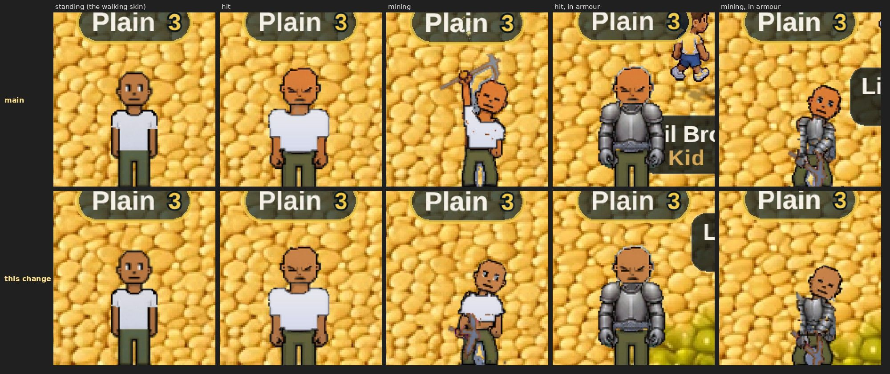

# The face tattoo stays on under the head overlays (v2.3.2860, v2.3.2861-2862)

Owner: *"Yea do woodcutting and missing ones."* This is the first of the
missing ones.

## What was missing

In four situations the game draws a **separate head** over your own, from its
own head-only picture (`sprites/player/<pose>-<dir>-head.png`):

| when | why the head is redrawn |
|---|---|
| picking up loot | the crouch drops your head under your armour (v2.3.1055), so the head is drawn above it, on every pickup, armour or not |
| taking a hit, in armour | the recoil throws the head behind the chest plate (v2.3.1479) |
| mining, in armour | same (v2.3.1479) |
| jogging in the full steel set | the knight figure has no head of its own; yours is drawn on it (v2.3.1368) |

Those head pictures were coloured with your skin, eyes and eye style, but
**never with your drawings**, so a face tattoo vanished whenever one was up.
That included every single loot pickup. The same went for other players' heads
on your screen.

The same character (blue face drawn on its left half only) in each situation,
on main and on this change:

## What changed

- **The bake takes your drawings** (`getPickupHeadFrame(..., art)`,
  `_buildPickupHeadSheet`). They are resolved for the facing exactly as the body
  resolves them (`artForFacing`). A head turned away (the north hit and north jog
  heads) shows the back-of-head drawing, not the face drawing.
- **Where the face goes.** The body finds the face relative to the torso ("no
  torso in this frame: place nothing"), and these pictures have no torso. On
  them every skin pixel is the head, down to wherever the painter cut the neck,
  which is also the area the body's face fit covers. So the drawing is fitted to
  the head's own skin, frame by frame, the way the body fits it.
- **Facing the other way.** West, northwest and southeast are drawn by flipping
  east, northeast and southwest. So a drawing that is not its own mirror image
  gets a pre-flipped head bake, the same pair the body bakes. A symmetric drawing
  shares one bake between both sides.
- **The cache key carries the face drawing**, so an edit is a new head. The
  heads with the old drawing are dropped along with the body's, and your heads
  are re-baked straight after the edit, so the next pickup shows the new drawing
  from its first frame.
- **Loading.** Your inked heads are baked behind the loading screen, as your
  plain ones were. Another player's bake happens the first time you see that
  head, which is how every other part of a custom-looking peer works (their look
  cannot be known at load).

Two small fixes came with it, both in the same code:

- The loot-pickup head was prewarmed under a key that left out the eye style
  (v2.3.2643). A player with an eye style got a prewarmed sheet nothing ever
  read, and the real one was baked at their first pickup, in the middle of play.
  The prewarm and the lookup now build the key in one place.
- The cache's "never evict your own heads" rule matched only keys with no eye
  style, so a styled player's own heads were first in line for eviction. It now
  matches with or without one.

## Hit, mining and rolls wear the walking skin (v2.3.2861)

Owner: *"fix the orange head during hits/mining to be whatever color the
character color should be."*

With the **default** skin nothing is recoloured: `skinTarget('default')` is
null, meaning "the art is already this colour". For walking that is true. For
three poses it is not, because their pictures were painted a more orange skin.
Mean skin measured on the shipped sheets, as green over red (lower is more
orange):

| pose | green / red |
|---|---|
| standing, jogging, picking up | 0.64-0.65 |
| hit (by facing) | 0.57-0.62, one facing at 0.66 |
| mining | 0.58 |
| dodge roll | 0.56-0.57 |

So a player who never opened the skin picker turned orange for every hit,
every mining swing and every roll. The head drawn over armour for a hit or a
mining swing (above) did the same, which is the orange head the owner saw.

The sword and bow figures had exactly this and were given the walking skin for
the default skin in v2.3.1788. This is that rule for the three body poses that
still needed it: `poseSkinTarget` (playerSkins) hands the default skin the
walking colour, `DEFAULT_SKIN_TARGET`, for `hit`, `mine` and `dodge`, in every
place those pictures are made: your body, the head drawn over armour, other
players' bodies on your screen, and the monkey's fur (its hit frames were
painted in the same orange, 0.58). A chosen skin is untouched. It was already
recoloured from these pictures to its own colour. Fishing stays as it is: it
skips every recolour on purpose, to keep the rod.

In the game, a player on the default skin, main above and this change below.
The roll is measured by the test but not pictured: it carries the figure out of
the picture's frame.

**Baked while loading.** The default skin used to bake nothing. Its hit, mining
and roll pictures are now baked behind the loading screen with everything else,
or the first hit would flash the old orange while it baked (the preloading law).

**Memory.** The eight new pictures (five hit facings, mining, two roll facings)
hold 2.3 MB. The default skin held none before. A player who has picked any
skin already holds 7.4 MB of these for the same poses and more, so a
default-skin player now carries about a third of that.

**Other players.** Another default-skin player's hit is made on your screen
the first time you see it in each facing (unless your look is the same as
theirs, when your own is reused). For the moment that takes, you see the old
orange. After that, every frame is the walking skin. This is how every other
look already works for other players: it can't be known while loading.

### The eyes (v2.3.2860)

The recolour gives a pixel the skin colour at full strength, and the pale cream
edging the white of each eye passes the skin test. Recoloured, it becomes an
orange bar down every eye. #734 found this on the bow shot and stops it: a pixel
with green at 0.8 of its red or more is left as drawn. This change recolours
more pictures, so it carries the identical rule. The two copies are the same
code, so the PRs merge in either order.

## How it is checked

`mp-headink` (new, 23 checks) reads the head overlay sprite as the renderer
holds it, on every animation frame. It counts the blue of the face drawing and
the green of the back-of-head drawing. Nothing in the head art is either colour.

- picking up loot: the face drawing on every pickup frame, on the head's left;
- the full steel set jogging south, east and west: the face drawing on every
  frame. East has it on the head's left in the picture. West, which is east
  flipped, has it on the right, which the flip puts back on the left;
- jogging north: the back-of-head drawing and no face drawing;
- a hit and a mining swing in armour: the face drawing on every frame;
- a second player watching: the knight's head and his hit head carry the face
  drawing once their bake lands;
- no page errors on either client.

Against main's code, 12 of the 23 fail: every drawing check, with zero ink on
every head overlay. The guards all pass.

`mp-poseskin` (new, 20 checks) is a player who never picked a skin, and a
watcher on a skin of their own. It reads the pictures the game draws, frame by
frame, and compares the mean skin colour with the standing body's:

- the hit, mining and roll pictures are baked during loading, and what they
  cost;
- a hit, a mining swing and a roll wear the walking skin on every frame
  (0.652-0.654 against 0.646 standing);
- so do the heads drawn over armour for a hit and a mining swing;
- so does the monkey's fur over a hit;
- the watcher sees the walking skin too, in every facing, once it's made for
  them;
- no page errors on either client.

With the change switched off, 10 of the 20 fail: every colour check (hits at
0.58, mining at 0.575, rolls at 0.555, the monkey's fur at 0.584, the watcher's
view at 0.58), and the loading checks, because nothing is baked.
