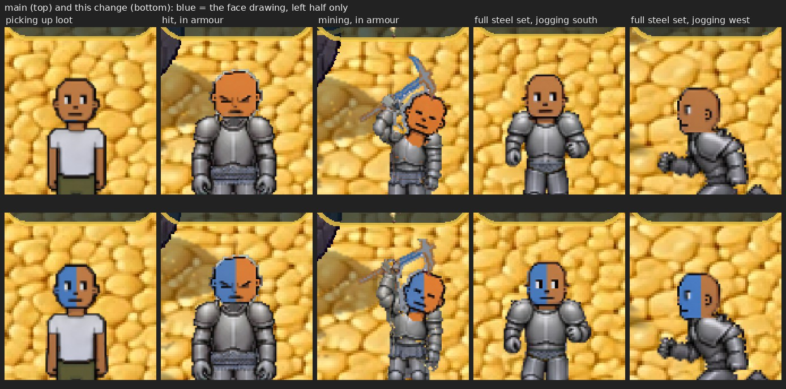

# The face tattoo stays on under the head overlays (v2.3.2824)

Owner: *"Yea do woodcutting and missing ones."* This is the first of the
missing ones.

## What was missing

In four situations the game draws a **separate head** over your own, from its
own head-only picture (`sprites/player/<pose>-<dir>-head.png`):

| when | why the head is redrawn |
|---|---|
| picking up loot | the crouch drops your head under your armour (v2.3.1055), so the head is drawn above it, on every pickup, armour or not |
| taking a hit, in armour | the recoil throws the head behind the chest plate (v2.3.1479) |
| mining, in armour | same (v2.3.1479) |
| jogging in the full steel set | the knight figure has no head of its own; yours is drawn on it (v2.3.1368) |

Those head pictures were coloured with your skin, eyes and eye style, but
**never with your drawings**, so a face tattoo vanished whenever one was up.
That included every single loot pickup. The same went for other players' heads
on your screen.

The same character (blue face drawn on its left half only) in each situation,
on main and on this change:

## What changed

- **The bake takes your drawings** (`getPickupHeadFrame(..., art)`,
  `_buildPickupHeadSheet`). They are resolved for the facing exactly as the body
  resolves them (`artForFacing`). A head turned away (the north hit and north jog
  heads) shows the back-of-head drawing, not the face drawing.
- **Where the face goes.** The body finds the face relative to the torso ("no
  torso in this frame: place nothing"), and these pictures have no torso. On
  them every skin pixel is the head, down to wherever the painter cut the neck,
  which is also the area the body's face fit covers. So the drawing is fitted to
  the head's own skin, frame by frame, the way the body fits it.
- **Facing the other way.** West, northwest and southeast are drawn by flipping
  east, northeast and southwest. So a drawing that is not its own mirror image
  gets a pre-flipped head bake, the same pair the body bakes. A symmetric drawing
  shares one bake between both sides.
- **The cache key carries the face drawing**, so an edit is a new head. The
  heads with the old drawing are dropped along with the body's, and your heads
  are re-baked straight after the edit, so the next pickup shows the new drawing
  from its first frame.
- **Loading.** Your inked heads are baked behind the loading screen, as your
  plain ones were. Another player's bake happens the first time you see that
  head, which is how every other part of a custom-looking peer works (their look
  cannot be known at load).

Two small fixes came with it, both in the same code:

- The loot-pickup head was prewarmed under a key that left out the eye style
  (v2.3.2643). A player with an eye style got a prewarmed sheet nothing ever
  read, and the real one was baked at their first pickup, in the middle of play.
  The prewarm and the lookup now build the key in one place.
- The cache's "never evict your own heads" rule matched only keys with no eye
  style, so a styled player's own heads were first in line for eviction. It now
  matches with or without one.

## Seen while doing this, not changed

With the **default** skin, the hit and mining pictures are painted a more
orange skin than walking: measured mean skin `[211,124,59]` and `[212,122,55]`,
against `[187,121,70]` for walking and picking up. Nothing recolours the default
skin, so an unarmoured default-skin player turns slightly orange while hit or
mining, and so does the head overlay (visible in the picture above). This is in
the art for those two poses, not from this change. The sword and bow stand-ins
had the same thing and were evened out in v2.3.1788. It is a one-line choice if
it is wanted.

## How it is checked

`mp-headink` (new, 23 checks) reads the head overlay sprite as the renderer
holds it, on every animation frame. It counts the blue of the face drawing and
the green of the back-of-head drawing. Nothing in the head art is either colour.

- picking up loot: the face drawing on every pickup frame, on the head's left;
- the full steel set jogging south, east and west: the face drawing on every
  frame. East has it on the head's left in the picture. West, which is east
  flipped, has it on the right, which the flip puts back on the left;
- jogging north: the back-of-head drawing and no face drawing;
- a hit and a mining swing in armour: the face drawing on every frame;
- a second player watching: the knight's head and his hit head carry the face
  drawing once their bake lands;
- no page errors on either client.

Against main's code, 12 of the 23 fail: every drawing check, with zero ink on
every head overlay. The guards all pass.
