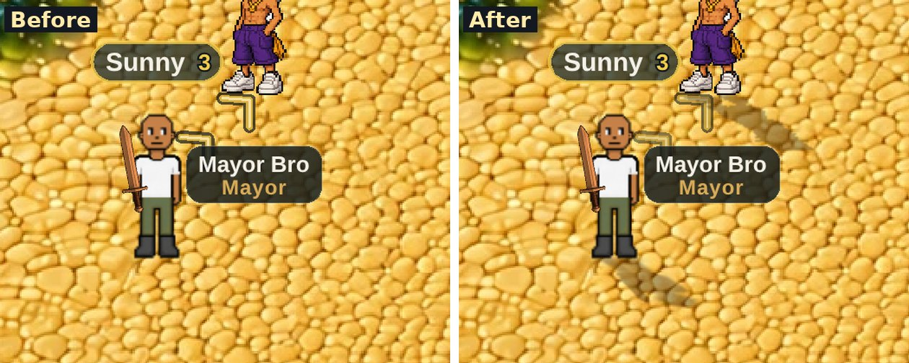
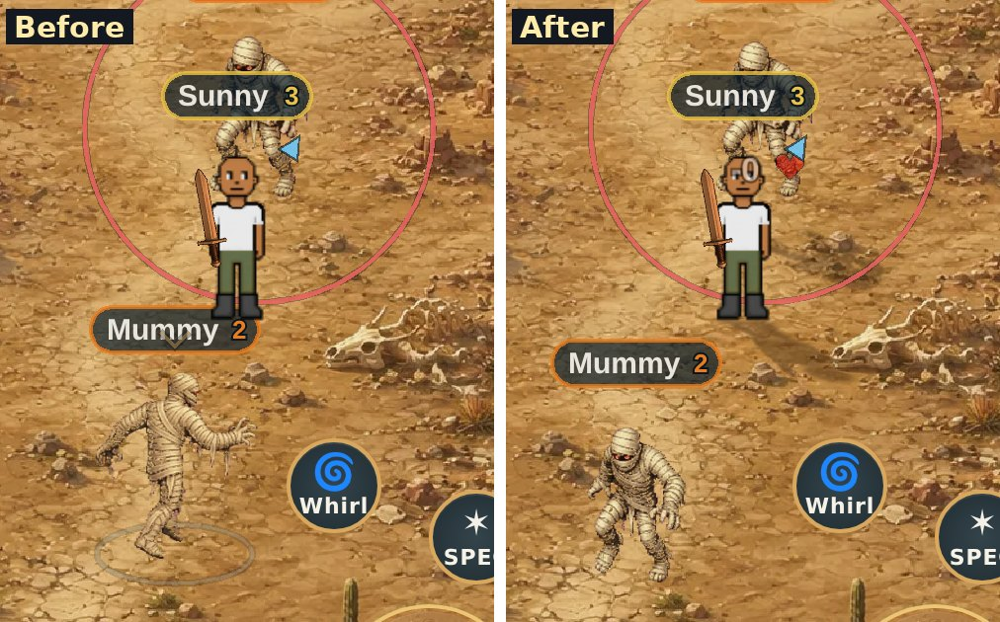
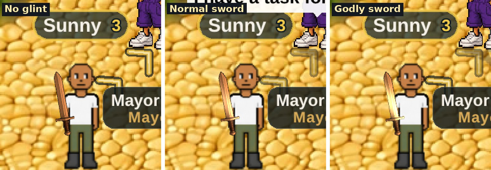
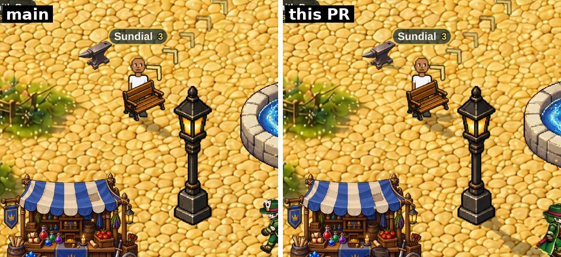
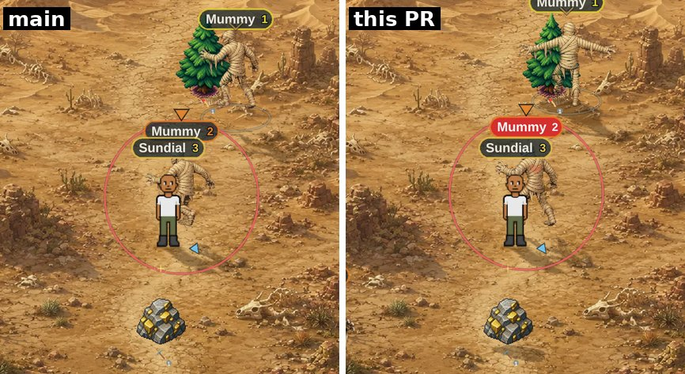
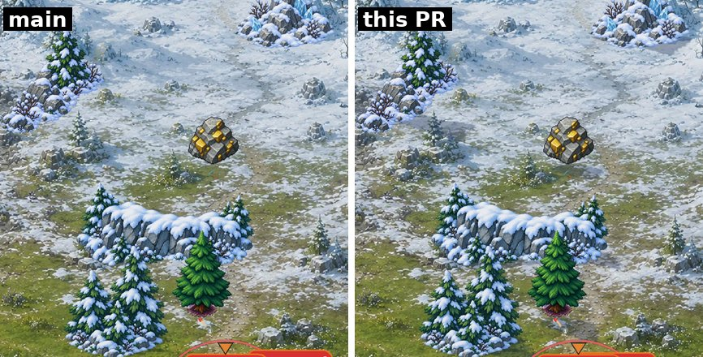

# Light and shine (v2.3.2710)

Owner: *"I'm wondering if you can enhance the art in the game just using
your code abilities. Maybe subtle shadowing to make things pop, adding
material-specific textures or shine, etc."* Then, of the options offered:
*"Yeah go ahead, build 1 and 2."*

1. **Shadows cast by each map's own sun.** Every character, NPC and monster
   casts a shadow made from its own figure, lying on the ground in the
   direction the painting's own shadows fall.
2. **Metal that catches the light.** A glint sweeps across metal weapons
   and armour now and then. It comes more often, and brighter, the better
   the item's grade.

**On for everyone from v2.3.2711.** It shipped behind a switch that was off
(v2.3.2710) so the owner could see it first. They did, and said: *"Push it to
main with the switch on."* The switch stays, per device:

| | |
|---|---|
| `?lightfx=0` | turn it off on this device (remembered). Nothing is drawn, allocated or filtered while it is off |
| `?lightfx=1` | turn it back on |

## Why this is not the shadow that was removed

v2.3.2632 took out the ellipse shadows: *"the elliptical shadows put in the
game looked worse than nothing."* The reason is in `docs/DEPTH-ROADMAP.md`.
A round blob is a shadow for a sun directly overhead. These maps are painted
with their own light and throw long shadows to one side, so the blob
disagreed with every one of them and read as a smudge. Two earlier removals
were narrower:

- the player's own blob, "a dark blob between the knight's legs mid-stride"
  (v2.3.1365);
- the slimes' blob, "way beneath the monster" (v2.3.1704).

This design answers each point:

- **Direction comes from the painting.** Each zone's light was read off its
  map (`src/rendering/lightfx/zoneLight.js`, one note per zone). The town's
  fences and rock pillar shade the cobble below and to the right, and every
  prop is lit on its upper-left faces. So a town shadow falls lower right. A
  zone with no single sun casts nothing at all: thunder (electric
  point-lights at night), hollows (a cave lit from its mouth), ember (lit by
  the lava) and the world view. That is a decision, not an omission.
- **The shadow is the figure.** Every visible piece of the figure (body,
  armour, hair, hat, cape, weapon, shield) is drawn again into a `shadows`
  layer, projected onto the ground. So it swings the sword and flaps the
  cape because the figure does. It lies away from the body, not between the
  legs.
- **It hangs off the feet.** A player's body is centred on its frame, so
  the feet are an offset below the figure's position (`figureFeetY`,
  `entityRenderer.js`). Monsters and NPCs are anchored at their feet (the
  slime on its base row), so their anchor is the ground point.
  `mp-lightfx` measures both against the drawn pixels.
- **Shade has a colour.** Warm brown on the town cobble, blue on the frost
  snow.

## How it works

**The projection.** A point `h` pixels above a figure's feet lands at
`(lx·h, ly·h)` from them, and the feet stay put. That is one affine map per
figure, pivoted on its ground point, applied on top of each piece's own
transform. A shadow piece is a Sprite sharing the figure piece's texture.
No texture is created and nothing is drawn on the CPU.

**One pass for the whole layer.** The pieces are drawn opaque, and the
`shadows` layer carries one filter that turns "covered" into the zone's
shade colour at its alpha. Applying alpha per piece instead would darken
every overlap (the arm over the torso, two players side by side), and a
shadow with dark patches inside it reads as a stain. The filter runs at CSS
resolution, which is the Pixi default. On a 3× iPhone it touches a ninth of
the pixels a full-resolution pass would, and the upscale softens the edge
the way a real shadow is soft. When no shadow is on screen, there is no
filter and no pass.

**Where the layer sits.** Above the map, footprints and splatter, because a
shadow falls on them. Below `groundLoot` and `telegraphs`, because a dropped
item and an incoming attack's ring must stay readable. Below everything that
stands on the ground, so a building in front of a shadow hides it.

**Stand-ins.** During a sword swing, a bow shot or a gather, the body is
swapped for a stand-in figure drawn by the effects renderer. The shadow
follows the stand-in: `casters.js` lists the stand-in sprites by name, and
`mp-lightfx` proves a mid-swing shadow is cast by the stand-in. A pose that
is not listed yet (a new cast animation, say) makes the shadow hold its last
shape for up to 1.5 s rather than blink off.

**The glint.** Every metal in the game is one steel image with a tint. A
tint can only darken, so a copper plate's brightest highlight comes out
copper-coloured rather than bright. The glint gives those highlights back
for a moment:

- A narrow band of the metal's own shine colour sweeps across the piece,
  strongest on its already-bright pixels. Steel shines white, iron cooler,
  copper warm, and a godly piece gold.
- It uses a small filter attached **only** while a sweep is crossing that
  piece.
- Each piece starts its sweep at its own offset, so a room of players never
  flashes in unison.

What glints follows the tint pipeline's own rules: swords and greatswords in
a metal, and the plate and greaves art. Bows, staffs, cloth and bare hands
never glint.

| grade | every | strength |
|---|---|---|
| normal | 6.5 s | 0.85 |
| rare | 4.6 s | 1.0 |
| elite | 3.3 s | 1.15 |
| godly | 1.9 s | 1.4, gold |

Other players' grades are not on the wire: the relay carries the metal
(`wpnMat`) but not the grade. So their gear glints at the normal rate until
a grade key is relayed.

## Cost

- **Off:** one boolean read per frame.
- **On, JS:** about 0.15 ms per frame on the QA box, with a town's worth of
  NPCs (`mp-lightfx` asserts under 1.5 ms).
- **On, GPU:** one extra pass at CSS resolution for all shadows, plus a
  small pass per glinting piece while its half-second sweep is on. The QA
  box renders in software, so the phone's GPU cost is not measured here.
  Watch it on the preview.
- **Memory:** no new textures. The shadow pieces share the figures' own.

## Files

- `src/rendering/lightfx/lightFx.js`: the switch, the per-frame driver and
  the `window.__btLightFx` probe.
- `src/rendering/lightfx/zoneLight.js`: each map's light, read off the
  painting.
- `src/rendering/lightfx/shadows.js`: the projection, the pooled pieces,
  the one-pass filter and the hold.
- `src/rendering/lightfx/casters.js`: which sprites make up each figure,
  and where its feet are.
- `src/rendering/lightfx/glint.js`: which pieces are metal, the grade
  cadence, and the sweep filter.
- `src/rendering/pixiApp.js`: the `shadows` layer.
- `src/rendering/pixiRenderer.js`: runs light and shine last among the
  world passes, after the depth sort, so a shadow copies each figure where
  it is this frame.
- `src/rendering/systems/entityRenderer.js`: `figureFeetY`.

## Tests

`node tools/qa/mp/run.mjs worldshadow` (v2.3.2749) checks that props, trees
and every monster on screen cast in each sunlit zone. It also checks that the
auction house's shadow darkens its shaded side and not its sunlit one, and it
takes off/on pictures to `/tmp/qa-worldshadow/`.

`node tools/qa/mp/run.mjs lightfx` (off the PR path; 19 assertions):

- **Default:** it is on by default, and switched off it draws nothing.
- **Layer order:** the shadow layer sits on the ground and under everything
  that stands on it.
- **On in town:** the player and the townsfolk cast shadows through one
  pass.
- **Feet:** the player's shadow pivots within 3 world px of his lowest drawn
  pixel. This is measured by rendering the figure alone, after first
  establishing the read-back's row order: a centred figure measures the same
  either way up. Each standing NPC's shadow pivots within 4 px of its
  picture's lowest opaque row.
- **Direction:** the ground darkens below-right of the feet (by 45
  luminance) and not above-left (by 6).
- **Swing:** mid-swing, the shadow is cast by the stand-in, not a held copy.
- **Stand-in names:** every stand-in sprite the shadow reads off the effects
  renderer still exists under that name. A rename over there would otherwise
  quietly turn a swing's shadow into the hold.
- **Glint:** a copper greatsword is a glint target and carries the filter
  mid-sweep.
- **Cost:** JS time per frame is measured.
- **Other zones:** Wind Dunes uses its own, harder light. The Flame Fields,
  which have no sun, draw nothing and have no filter pass.
- **Off again:** switched back off, everything is gone.

It also writes the before/after pictures above to `/tmp/qa-lightfx/`.

## The world casts too (v2.3.2749)

Owner, having seen the figures' shadows: *"Add shadows to props and
monsters."*

**Monsters already cast**, in every sunlit zone, and now it is proven zone by
zone rather than assumed. `mp-worldshadow` warps to Frost Ridge, the Wind
Dunes and the Verdant Wilds and checks that every monster on screen is in the
shadow pass. A zone with no sun (the Flame Fields, lit by lava) still casts
nothing, by design.

**Props, trees and ore now cast.** There are two kinds, because a building is
not a billboard:

- **Thin things** (a lamp, a bench, the anvil, the fountain, the market stall,
  frost's pines and rocks, trees and ore) are projected the way a figure is.
  The pivot sits a little behind the base, at the middle of the footprint, so
  the top falls away from the sun. Trees and ore pivot on their *drawn* base,
  because their frames have empty margin below the art.
- **Buildings** (footprint 120 px deep or more: the bank, the forge, the
  mayor's house, the auction house) are projected **column by column**. A
  building's picture is a front wall with roofs, towers and signs above it,
  standing over ground further back. One pivot for all of it put the auction
  house's back-left tower's shadow on the cobble in front of its *sunlit*
  left wall. So in each column, a pixel on the base row stands on the base
  the art shows there (the diamond's V, read off the art, see
  `docs/specs/prop-depth.md`). The column's top stands on the footprint's
  back edge, and the rows between move back in step. Nothing is lifted by
  less than zero, so no shadow can fall toward the sun. It is a two-row mesh
  per column (`MeshSimple`) sharing the building's own texture, in the same
  filtered layer as everything else, so overlaps never darken twice.

The fountain and the stall were tried as buildings first and lost their
shadows: their tall part stands in the middle, not at the back, so the
building model sent it behind the prop, where the prop hid it. As billboards
they picture right.

Each picture is one frame, before and after: on the left the game as it was
(figures cast, the world does not), on the right the world casting too. The
QA switch that makes the left one is `window.__btLightFx.world(false)`.

## Not done, and the natural next steps

- **An in-game toggle.** Today the only off switch is `?lightfx=0` in the
  address. If a phone turns out to struggle, a Settings toggle is the
  friendly version.
- **Other players' grades** need one relay key (a `wq` beside `wpnMat`) and
  its server gate.
- **Props and gather nodes**: done at v2.3.2749 (above).
- **A figure standing in a building's shadow is not darkened.** The shadow
  lies on the ground, under everything standing on it. Darkening a figure
  that stands inside one would need the shadow as a mask over the figures
  too.
- **Rim light**, option 3 of the original offer, was not built.
