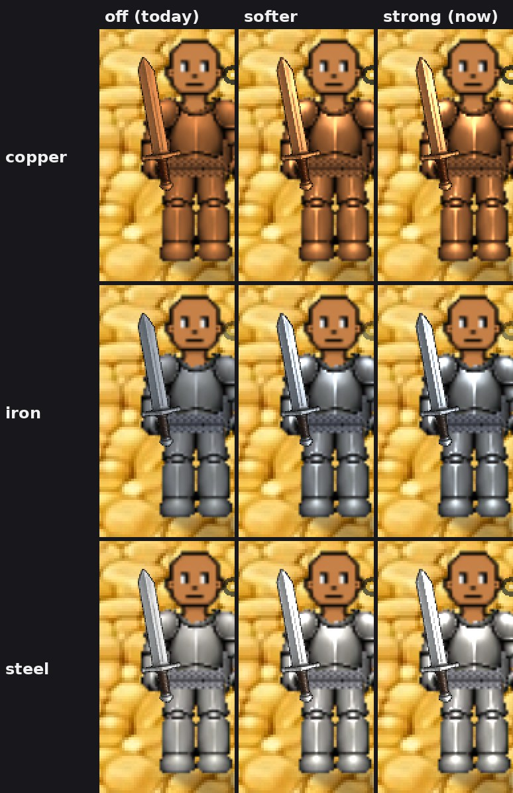
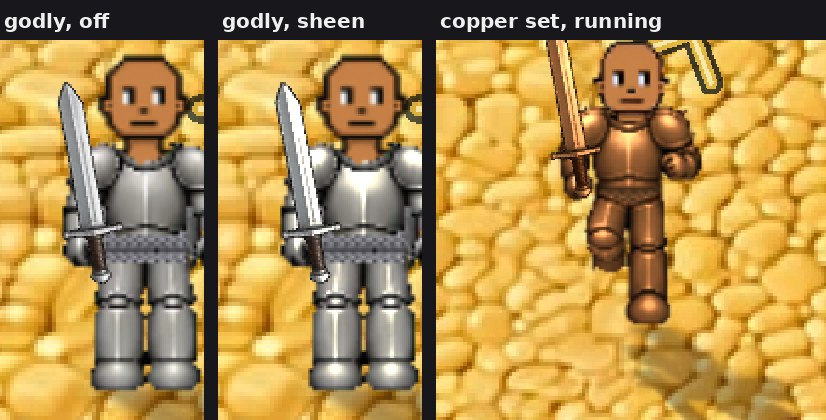

# Metal sheen, a preview (v2.3.2750)

Owner: *"aside from the glint can you see what adding a permanent soft shine
to armor and sword (and other metals) would look like?"*

**This is a preview. It is OFF unless a device asks for it.** Nothing changes
for anyone else:

| | |
|---|---|
| `?sheen=1` | turn it on on this device (remembered) |
| `?sheen=0` | turn it off again |

It rides on light and shine (`docs/specs/light-and-shine.md`), so it also
needs that switch on, which it is by default.

Each picture is one frozen frame, so the columns differ only by the sheen
(zoomed 2x from a phone screenshot):

## What it is

The glint's filter (`src/rendering/lightfx/glint.js`), with a second term
that never switches off:

- **It lights the art's own highlights.** Where the steel art is bright, the
  piece gets brighter, toward the metal's shine colour: white for steel,
  cool for iron, warm for copper, gold for a godly piece.
- **It gives copper and iron real highlights.** Every metal is one steel
  picture drawn with a tint, and a tint can only multiply
  (`traits/materialTints.js`, v2.3.1761). So a copper plate's brightest
  pixel came out copper-coloured, never bright, and copper read as dull
  orange cloth. The shader divides the tint back out to find where the steel
  art was bright, then adds light there. Copper gets a highlight and stays
  copper.
- **It is lit from the zone's sun.** A little more on the side of the piece
  that faces the sun, from the same per-zone table the shadows use
  (`lightfx/zoneLight.js`). A zone with no sun (Flame Fields, the caves)
  gets it evenly. It dims at night and in a zone's deep levels, but never
  goes out: metal still catches the moon.
- **It climbs with the grade**, like the glint: normal 0.83, rare 0.93,
  elite 1.05, godly 1.2 at its brightest. These are the **strong cut**: the
  preview first showed a soft sheen (0.55 for a normal piece) beside one
  1.5x stronger, and the owner chose it: *"I do like the strong polish
  previews."*
- **The glint still sweeps over it** as before.

**What it covers:** swords and greatswords in a metal, plate, greaves, and
the full-set knight figure. **Not covered:** cloth, bows, staffs, bare
hands, and the painted props. The props are painted art with their own
highlights already in them.

### The piece the glint never reached

When you jog in a full set of one metal, the armour is not drawn as a chest
layer and a legs layer. It is one finished knight figure drawn on the body
sprite (`entityRenderer _fullsetFrame`, v2.3.1361), and the chest and leg
layers are empty. The glint only looked at the layers, so a jogging knight
never glinted. The sheen follows the figure onto the body sprite
(`display._fullsetOn`), and the glint now reaches it too, since they share
the filter.

## What it costs, and why it is a preview

A filter is an extra render pass for the sprite it is on. The glint pays that
for half a second every few seconds per piece. The sheen pays it **every
frame, for every metal piece on screen**: three passes for a player in plate,
greaves and a sword. A plaza of armoured players is dozens of passes a frame.

**This machine cannot measure it.** The QA box renders in software at about
five frames a second, so a few extra filter passes vanish in the noise
(`mp-sheen` logs the frame time on and off: 199 and 217 ms, within noise).
The honest number is the count: three passes per armoured player. It has to
be judged on a phone, with the switch.

If the look is wanted, the version to ship should not be a filter. Bake one
highlight mask per gear sheet at load (shared by all three metals, since they
are one picture) and draw it as an additive sprite over the piece. That
batches like any other sprite, so it costs close to nothing per frame. The
memory is one extra mask per sheet, which on iPhone needs weighing against
the gear sheets' budget first.

## Tests

`tools/qa/mp/mp-sheen.mjs`:

- off on a fresh device;
- on, the sword, plate and greaves carry it on every frame sampled, and a
  figure with no metal carries nothing;
- every metal comes out brighter, and copper's added light stays warm
  (the brightened pixels average 212, 149, 87);
- it follows the sun: on the figure's left third, 75% of the lit pixels are
  brighter with the sun on the left; on its right third, 100% are brighter
  with the sun on the right;
- jogging in a full copper set, the knight figure on the body sprite carries
  it;
- the pass count per figure (and the frame time, which this machine is too
  slow to resolve).

The pixel checks hold the game still for their pictures. A breathing
figure's frames differ more than the sheen does, so the test holds back the
game loop's next frame and redraws the scene itself at one pinned instant
for each setting.
