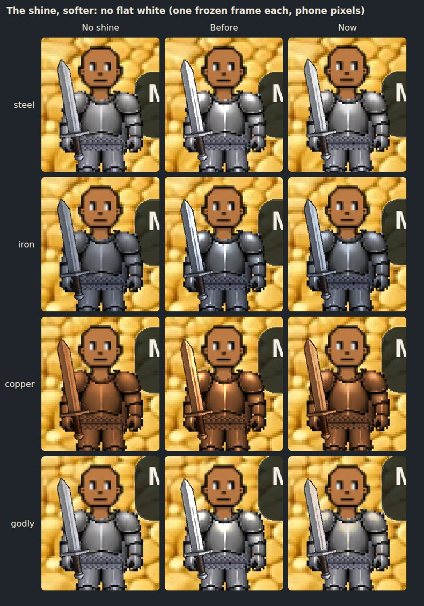

# Metal sheen (v2.3.2864; on for everyone since v2.3.2887; softer, no flash since v2.3.2902)

Owner: *"aside from the glint can you see what adding a permanent soft shine
to armor and sword (and other metals) would look like?"*

Then, after the previews: *"Push the metal shine to main and I'll revert it
if I don't like it. The previews looked much better. But make sure the shine
stays on through every armor animation and through different recolors (like
copper recolored from the original steel)."*

**It is ON for everyone** (v2.3.2887). A device can still turn it off:

| | |
|---|---|
| `?sheen=0` | turn it off on this device (remembered) |
| `?sheen=1` | turn it back on |

To turn it off for everyone, revert the v2.3.2887 change on `main`. That is
one commit, so it is one button on GitHub.

It rides on light and shine (`docs/specs/light-and-shine.md`), so it also
needs that switch on, which it is by default.

## Softer, and no flash (v2.3.2902)

Owner, with it live: *"I think the shine needs to be dialed back just a bit.
It also doesn't need the occasionally 10 second flash animation (to show the
shine). I just don't want it to look like white spots (rather than shine) on
the armor and it's on the edge of looking like that right now."*

- **No flash.** The band that swept across each metal piece every 1.9 to
  6.5 s (by grade, v2.3.2710) no longer runs on its own. The steady shine is
  the shine now. It is one switch (`glint.js AUTO_SWEEP`), and the band can
  still be pinned for pictures and tests.
- **No white spots.** The spots came from how the light was added, not how
  much. The shine was added to each pixel and cut off at white, so on the
  sun side every steel pixel from about 72% brightness up hit pure white: a
  flat white patch wherever the art has a highlight. Turning the strength
  down did not fix it. At 55% strength a steel figure still had about 670
  flat-white pixels, against about 1,000 at full.
- **So the light now rolls off below white.** Each pixel can be lifted only
  toward 92% of the metal's shine colour (`SHEEN_CEIL`). A little light
  behaves as before; a lot slows down and stops short of the ceiling. A pixel
  the artist already painted brighter than that is left as drawn.

Measured on one frozen standing figure (phone, 3x pixels):

| | flat-white pixels before | after |
|---|---|---|
| steel | ~1,000 | 0 |
| iron | ~425 | 0 |
| copper | 0 (its highlights went pale peach, near white) | 0 (they stay copper) |
| godly | ~1,070 (its gold washed out to white) | 0 (it stays gold) |

The rest of the shine is a bit softer too: the metal's mid-tones keep about
60 to 75% of the light they got before. The grade numbers below are
unchanged; they now feed the roll-off, so a better piece is still shinier.

Each picture is one frozen frame, so the columns differ only by the sheen
(zoomed 2x from a phone screenshot):

## What it is

The glint's filter (`src/rendering/lightfx/glint.js`), with a second term
that never switches off:

- **It lights the art's own highlights.** Where the steel art is bright, the
  piece gets brighter, toward the metal's shine colour: white for steel,
  cool for iron, warm for copper, gold for a godly piece.
- **It gives copper and iron real highlights.** Every metal is one steel
  picture drawn with a tint, and a tint can only multiply
  (`traits/materialTints.js`, v2.3.1761). So a copper plate's brightest
  pixel came out copper-coloured, never bright, and copper read as dull
  orange cloth. The shader divides the tint back out to find where the steel
  art was bright, then adds light there. Copper gets a highlight and stays
  copper.
- **It is lit from the zone's sun.** A little more on the side of the piece
  that faces the sun, from the same per-zone table the shadows use
  (`lightfx/zoneLight.js`). A zone with no sun (Flame Fields, the caves)
  gets it evenly. It dims at night and in a zone's deep levels, but never
  goes out: metal still catches the moon.
- **It climbs with the grade**, like the glint: normal 0.83, rare 0.93,
  elite 1.05, godly 1.2 at its brightest. These are the **strong cut**: the
  preview first showed a soft sheen (0.55 for a normal piece) beside one
  1.5x stronger, and the owner chose it: *"I do like the strong polish
  previews."*
- **The glint no longer sweeps over it** (v2.3.2902, above).

**What it covers:** swords and greatswords in a metal, plate, greaves, and
the full-set knight figure, on you and on every other player, in every
animation (below). **Not covered:** cloth, bows, staffs, bare hands, and the
painted props. The props are painted art with their own highlights already
in them. The chain belt is not covered either: it is painted into the body
picture itself (v2.3.1347), so there is no separate metal sprite to shine.

### The piece the glint never reached

When you jog in a full set of one metal, the armour is not drawn as a chest
layer and a legs layer. It is one finished knight figure drawn on the body
sprite (`entityRenderer _fullsetFrame`, v2.3.1361), and the chest and leg
layers are empty. The glint only looked at the layers, so a jogging knight
never glinted. The sheen follows the figure onto the body sprite
(`display._fullsetOn`), and the glint now reaches it too, since they share
the filter.

## Every animation, every metal (v2.3.2887)

The armour is not always drawn by the character's own sprites. When you
swing, shoot, block, chop, cook or light a fire, the character is swapped for
a stand-in figure with its own armour sprites. The greaves on the running
legs under a moving swing or shot are another sprite again. Other players
have their own copies of all of these.

The preview covered your own stand-ins, and another player's walking figure
and standing sword swing. On other players it missed four things, now fixed:

- **Another player's bow shot**: their plate and greaves, and the greaves on
  their running legs when they shoot on the move.
- **Another player's sword swing on the move**: the greaves on their running
  legs.
- **Another player chopping, cooking or lighting a fire**: their plate and
  greaves on those figures.
- **A player who has just walked into your zone** had no shine for up to two
  seconds. The shine read their armour from a field that only arrives with
  their next position update. It now reads the armour the game actually
  draws them in.

On your own figure, one more was missing, found by the new test:

- **The arm over your sword.** With a sword out, jogging east, the game
  draws your arm a second time over the slung shield (and your hand over the
  grip when you have no shirt on, v2.3.185 / v2.3.200). Each is a copy of the
  body picture, cut down by a mask. In a full set the body picture is the
  knight, so the copy is plate, and it had no shine: a dull arm on a shining
  figure on every east jog. It now shines like the body.
- **The copy has to match the body under it**, or the arm reads as a patch.
  Pixi shrinks a masked sprite's effect area to the mask's box, and the
  shine's sun side and sweep are laid out across that area. So the copy's
  area is pinned to the whole frame, the same box the body's shine uses
  (`glint.js unmaskedArea`). Measured on one frozen frame, counting the
  pixels the arm copy visibly changes: 628 with the pin, 611 with no shine
  anywhere (the copy's own soft edges, drawn twice, since v2.3.200), and 2,776
  without the pin.

The raised shield's arm also wears a sleeve cut from the plate, but only
while the bow art that normally carries a block has not loaded. It is
covered too.

**Recolours.** Copper and iron are the steel picture drawn with a tint. The
filter reads the tint off the sprite it is on, so wherever the shine is
attached, copper stays copper and iron stays iron. A mixed set (copper plate
over iron greaves) keeps both metals.

## What it costs

A filter is an extra render pass for the sprite it is on. The glint pays that
for half a second every few seconds per piece. The sheen pays it **every
frame, for every metal piece on screen**: three passes for a player in plate,
greaves and a sword. A plaza of armoured players is dozens of passes a frame.

The owner took this cost on to see the shine live (v2.3.2887). If phones
feel it, the baked mask below is the cheaper form of the same look.

**This machine cannot measure it.** The QA box renders in software at about
five frames a second, so a few extra filter passes vanish in the noise
(`mp-sheen` logs the frame time on and off: 199 and 217 ms, within noise).
The honest number is the count: three passes per armoured player. It has to
be judged on a phone, with the switch.

The cheaper version would not be a filter. Bake one
highlight mask per gear sheet at load (shared by all three metals, since they
are one picture) and draw it as an additive sprite over the piece. That
batches like any other sprite, so it costs close to nothing per frame. The
memory is one extra mask per sheet, which on iPhone needs weighing against
the gear sheets' budget first.

## Tests

`tools/qa/mp/mp-sheen.mjs`:

- no sweep crosses any piece on its own, over 7.5 s, longer than the old
  6.5 s cadence (v2.3.2902). It watches with the sheen off, where a filter
  is on a piece only while a band crosses it, so the check fails against the
  v2.3.2887 code as well as passing this one;
- the shine never pushes any metal, godly included, to flat white: at most
  20 stray pixels, where the old clip made hundreds (v2.3.2902);
- on for a fresh device (v2.3.2887; off while it was a preview), and
  `?sheen=0` turns it off and is remembered;
- the arm drawn over the sword on an east jog carries the shine, and changes
  the picture no more than it does with no shine at all (v2.3.2887);
- on, the sword, plate and greaves carry it on every frame sampled, and a
  figure with no metal carries nothing;
- every metal comes out brighter, and copper's added light stays warm
  (the brightened pixels average 212, 149, 87);
- it follows the sun: on the figure's left third, 75% of the lit pixels are
  brighter with the sun on the left; on its right third, 100% are brighter
  with the sun on the right;
- jogging in a full copper set, the knight figure on the body sprite carries
  it;
- the pass count per figure (and the frame time, which this machine is too
  slow to resolve).

The pixel checks hold the game still for their pictures. A breathing
figure's frames differ more than the sheen does, so the test holds back the
game loop's next frame and redraws the scene itself at one pinned instant
for each setting.

`tools/qa/mp/mp-sheenall.mjs` (v2.3.2887) checks every animation:

- **It finds the metal by its art file**, not by the shine's own list of
  sprites. Every metal armour texture is cut from the steel plate, greaves
  or knight art, and carries that file's name. The test walks everything on
  screen, so a new stand-in that nobody adds to the shine is caught.
- **Every metal piece, on every frame drawn,** must carry the shine, and the
  filter must read that sprite's own tint. The tint must be the metal worn.
- **The animations checked:**
  - yours: standing, walking, hit, mining, dodge, pickup, fishing, sword
    swing and bow shot (standing and on the move), shield block, chopping,
    cooking, lighting a fire;
  - another player's: walking (really walking, on their own client), hit,
    dodge, mining, fishing, sword swing and bow shot (standing and on the
    move), chopping, cooking, lighting a fire.
- **The sets:** steel, iron, copper, and copper plate over iron greaves.
- **Guards:** every animation must put its armour on screen. A control run
  with the shine switched off must see every piece flagged.

Its first run found the arm over the sword (above). The run this version
shipped on: 108 animation runs, 903 frames and 3,570 metal pieces, every one
shined in its own metal.

Two things the first runs taught it, both in the file:

- **The sun's shadows are not armour.** They are copies of the figure's own
  sprites, drawn as one dark silhouette through the shadow layer's filter.
  The sweep skips that layer.
- **Each piece is credited to the figure it is nearest.** Both players are
  put back on their marks after every walk, or the walker drifts on top of
  the other player.
