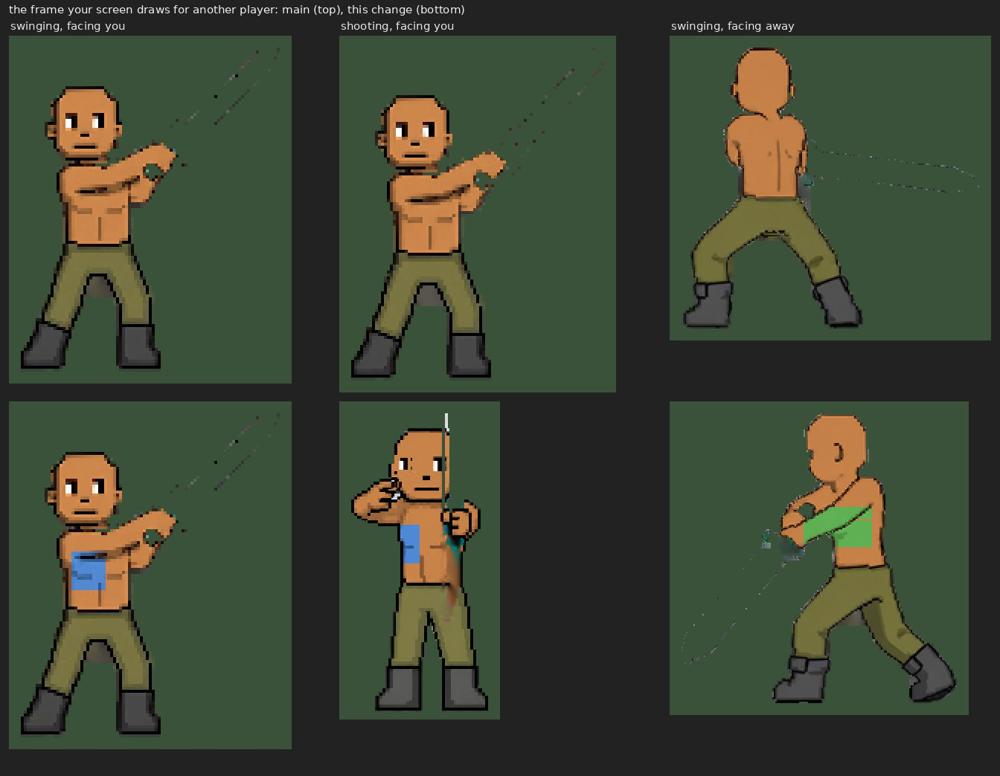
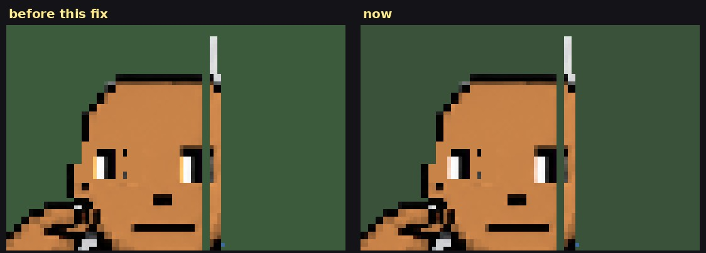

# Another player's swing and bow shot wear their drawings (v2.3.2863)

Owner: *"Yea do woodcutting and missing ones."* This is the second of the
missing ones.

## What was wrong

When you swing a sword, shoot a bow or raise a shield, the game swaps your body
for a pre-drawn attack figure. v2.3.2429 put your drawings on that figure
("make sure during shield block … the custom designs show up"). But the
figures the game draws for **other players** are baked by two different
functions (`_remoteBodyFramesFor` / `_remoteSheetFramesFor`), and those never
got the drawings. So on your screen, another player's tattoos, trouser prints
and patterns vanished every time they attacked, which is exactly when you are
looking at them.

Looking into it turned up a second bug in the same place. Those two functions
saved their bakes under the **facing** alone (`south|skin|pants|shoes`). The
sword and the bow both have a south, an east and a north sheet, so whichever of
the two a player used first was reused for the other. Another player shooting a
bow was drawn in their **sword** pose, with no bow in their hands.

The frame your screen draws for another player, on main and on this change.
The test drawings are a blue block on the chest and a green one on the back,
two colours on purpose, so a picture shows which drawing is on screen: facing
you it is the chest (blue), facing away the back (green).

## What changed

Everything `_bakeBodyStrip` already did for your own attack figure, it now does
for theirs:

- **their drawings**, through the same sanitiser every other peer drawing goes
  through (entityRenderer's `remoteBodyArt`), resolved for the sheet's own
  direction (`artForFacing`, so a back view shows their back drawings);
- **the sheet's own frame width**, so the drawing is placed frame by frame
  where the sheet's frames are (v2.3.2431 measured what the default 256 px
  windows do to these sheets);
- **a pre-flipped copy** for the facings drawn flipped (west is east flipped),
  made only when a drawing would read backwards (`_twinWouldDiffer`, now shared
  at module scope);
- **the default skin target**: v2.3.1788 ("the attack stand-ins wear the WALKING
  skin") was applied to your figure only, so a default-skin player still
  turned the painted orange of these sheets mid-swing on everyone else's
  screen.

The cache key names the **sheet** now, not the facing, so the bow and the sword
can no longer be swapped. A player with no drawings gets exactly the bake they
had before, under the new key. The cache keeps its existing limit of 24 bakes
(`REMOTE_BAKE_CACHE_MAX`), least recently seen evicted, and the bakes are
cropped (#728), so drawings add at most one bake per sheet per drawn player
on screen.

## The eyes (v2.3.2860)

Owner, on the picture above: *"The bottom change on the south bow shot messed up
the eyes."* It had. The white of each eye is edged with a pale cream where the
art blends it into the face, (247,210,186) on that sheet, and the skin test
accepts it. The recolour keeps a pixel's brightness and gives it the skin
colour at full strength, so that cream came out a saturated (255,197,110): an
orange bar down every eye. Your **own** bow shot had done this since v2.3.1788
gave the attack figures the walking skin; this change gave it to other players'
view of you as well.

Measured on every body sheet, skin (highlights included) keeps its green under
0.77 of its red, and the eye creams sit at 0.81-0.89. So a pixel with green at
0.8 of its red or more is now left as drawn, as the white of the eye. The
pixels that rule catches, marked on the sheets, are the eyes, the white flash of
a hit, the blur along a sword blade and the odd knuckle glint, none of them
skin. It applies to every body the game recolours: your figure, other
players', every pose and every skin.

The frame the game draws for another player's south bow shot, before and after:

## How it is checked

`mp-peerattackink` (new, 25 checks) has three players: the tattooed one, a
watcher, and a **plain control** with no drawings. The sword and bow art have
some blue of their own (up to about 190 pixels a frame on the east sword), so a
raw count is not enough. The watcher's screen shows both attackers on the same
frame of the same sheet at the same moment, and the drawing is judged by the
difference between them.

- every sword and bow facing is drawn from its **own** sheet, never the other
  weapon's (the swapped-sheet bug);
- facing you and facing east: his chest drawing is on every frame, over the
  plain player's on the same frame;
- facing away: his back drawing, and not the chest;
- the flip: both bakes of every frame are read directly. On each frame the
  pre-flipped copy has the drawing mirrored, 11 to 41 px further right in the
  texture. Facing west, the frames on screen are drawn from that copy;
- no page errors on any of the three clients.

Re-run with the eye fix: `mp-peerattackink` 25/25, `mp-standinskin` 25/25 and
`mp-facebow` 6/6.

Against main's code, 15 of the 25 fail, every bow facing among them (drawn from
the sword's sheet). Your own attack figures are unchanged: `mp-standinart`,
`mp-standinskin`, `mp-capeattack`, `mp-backshield`, `mp-facebow` and
`mp-geartrim` pass, 508 of 508.
