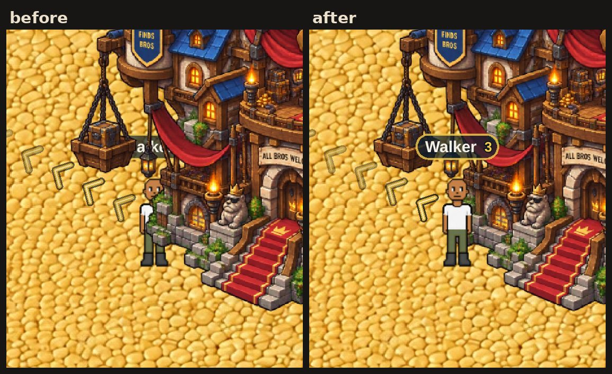
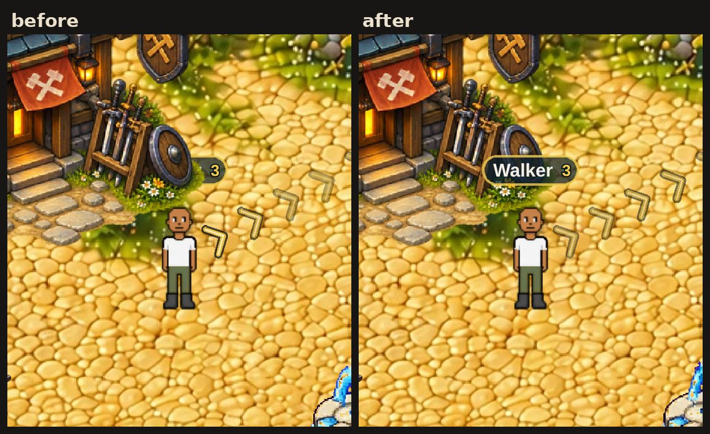
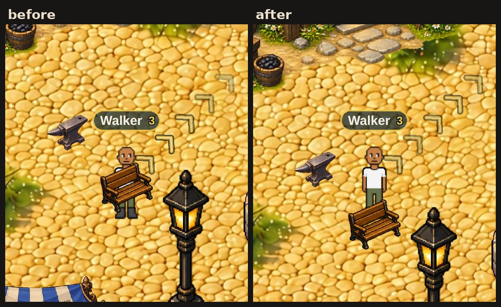

# In front of a prop or behind it, and where you stop (v2.3.2748)

The owner sent four iPhone screenshots of the town and wrote: *"Fix layer
detection for props. Right now it's really bad at detecting contact and when
the player should appropriately show in front or behind the layer. Jogging
against a prop seems to be some of the most problematic."*

Each screenshot turned out to be a separate case:

| | what it showed | cause |
|---|---|---|
| 1 | the forge's weapon rack drawn over your head, with your feet plainly south of it | your **waist** was compared, not your feet |
| 2 | walking into the bench from behind: your feet came out of the front of it, and it was drawn over your chest | a prop stopped your **waist**, not your feet |
| 3 | behind the lamp post, hidden by it | correct, and still is |
| 4 | beside the auction house's left corner, drawn behind the whole building | a building's base was treated as **one flat line** |

## Two numbers were wrong

**1. Your position is your body's centre, not your feet.** The game places
your figure centred on `S.player.y`, and your boots are drawn about 52 world
px lower. v2.3.822 measured the same thing from the other side: "its body
extends ~57 world-px BELOW P.y". The depth sort (`depthSort.js`, v2.3.2633)
was handed `S.player.y` as "the player's ground line". So any prop whose base
fell between your waist and your boots counted as being in front of you, and
was drawn over you while you stood visibly in front of it. That is screenshot
1. Other players had the same fault through their own position.

Now the depth pass pivots on your drawn feet (`figureFeetY`), and another
player's figure tells it how far below its position their feet are
(`_groundDy`). NPCs, monsters and props were always anchored at their feet
and are unchanged. Trees and ore rocks were anchored at the bottom of their
*frame*, which has empty margin below the art: a pine's trunk is drawn about
27 px above that point. They now sort on the trunk (`NODE_ART_BASE`,
`effectsRenderer.js`).

**2. A building does not meet the ground along one line.** The owner's
building art is drawn in three-quarter isometric view, so the base is a
diamond. The auction house touches the ground at its front step, which is
what the old rule used. It also touches along two walls that climb away from
the step: to a left corner about 95 px further up the screen and a right
corner about 77 px up. Stand beside the left corner, as in screenshot 4, and
you are plainly in front of the wall next to you. But you are north of the
front step, so the whole building was drawn over you.

`propGround.js` reads each prop's base off its own art: for every column of
the picture, the lowest solid pixel. It is measured once per prop, off a
128-column copy, one prop per frame. The diamond's walls come out as a V, and
the rack beside the forge at its own feet. It is used only *beside* a prop's
footprint, where a figure can stand level with a wall that recedes. Across
the footprint's own width, the flat line is already exact, because nobody
stands inside a footprint.

Because a building's base now depends on where along it you stand, one
number per object can no longer order everything. So after the ordinary
sort, a figure standing in front of a building's actual base is **raised**
just above that building (`raiseOverProps`).

## What stops your feet

The movement collision was the other half of "contact". It tested a box
around your body's centre, so from behind a bench (34 px deep) your waist
stopped at the bench's back edge while your feet walked on through the bench
and out of its front. That is screenshot 2.

Now a step is also refused if it would put your **feet** inside a prop's
footprint (`propFeetBlocked`, `BroTown.jsx`). The same goes for the townsfolk
(their radius is now feet to feet) and for a tree's trunk. Only a step that
goes *deeper* is refused, so a knockback or a spawn that leaves you inside
one can always walk back out.

**What did not change, on purpose.** The old test on your body's centre
stays exactly as it was. A prop's cover against attacks reads that same point
on the client and on the worker (`attackBlocked`: "an endpoint inside a box
never counts"). Letting your body's centre into a footprint from the south
would open a hole in the cover of every rock you hug. The price is a gap that
was always there: walking up to a building's front, you still stop with your
feet about 60 px short of its base. Closing it means moving the player's
ground point to the feet for attacks too, on the client and on the worker.
That is a separate change.

One corridor in Frost Ridge closes: the gap between the south face of the
rock ridge and the north face of the pine pair. It is 74 px deep. Standing in
it now takes 72 px: your feet clear of the pines, and your waist, 52 px above
them, clear of the ridge. You walk round either end instead.

## Cost

- **Depth pass:** one comparison per prop per figure that could overlap it.
  That is a few hundred cheap checks in town, and no allocation.
- **Profiles:** about 1–2 ms per building, once, spread one per frame over a
  zone's first frames. Until a building is measured, it uses the flat line it
  always used.
- **Movement:** one box test per footprint per step. Town has 9 and frost 6.

## Tests

`node tools/qa/mp/run.mjs propdepth` (off the PR path). Every layer check is
run under the new rule and under the old one on the same frame
(`window.__btDepthLegacy`), so each case proves it tells the two apart:

- the depth pass pivots on the feet, about 52 px below `S.player.y`;
- **screenshot 4:** beside the auction house's left corner, in front of the
  wall, the building draws behind you (the old rule drew it over you). A step
  north of the wall, it draws over you. Walking north past the corner, it
  changes sides once, at the wall;
- **screenshot 1:** at the forge's rack, feet south of the forge's base, the
  forge draws behind you (the old rule drew it over your head);
- **screenshot 2:** walking into the bench from behind, your feet stop at its
  back edge, are never inside it on the way, and the bench draws over you;
- beside the bench with your feet south of its base, it draws behind you;
- walking north into the forge, your feet stay out of it;
- **screenshot 3:** behind the lamp post, it still draws over you;
- walking into an NPC from behind, your feet stop behind his and he draws
  over you;
- another player standing in front of the bench is drawn over it on your
  screen;
- the entity layer is in key order, and every key is its object's ground
  line, except a figure raised over a building it stands in front of.

`mp-townmap`'s NPC check now measures your feet, because the radius is feet
to feet.
