# Lane A — sprite art: the rule fixes, at 20×

Evidence for the lane-A PRs off `docs/BACKLOG-TRIAGE-2026-09-14.md` §5.8 and
§2.7. Every plate below is the SAME frame rendered twice — once against
`main`, once against the branch — blown up 20× with nearest-neighbour so a
one-pixel hem is visible. `docs/TRAPS.md` §21 is the standing rule these exist
to satisfy: art in this repo is signed off on a render, never by eye and never
on a number alone.

**How they were made.** `node tools/qa/mp/run.mjs arules facebow teeshield`
with `BT_SHOT_TAG=before` against `main` and `BT_SHOT_TAG=after` against the
branch, then `node tools/qa/art/compare-shots.mjs` to pair them. Nothing here
is hand-cropped.

---

## The cape on the roll and the loot bend (D6)

The cape is a standing still pinned to each frame's crown, so it hangs straight
down from the head. That is right for every pose where the figure stays
upright — and wrong for the two where the torso goes flat.

| | |
|---|---|
| 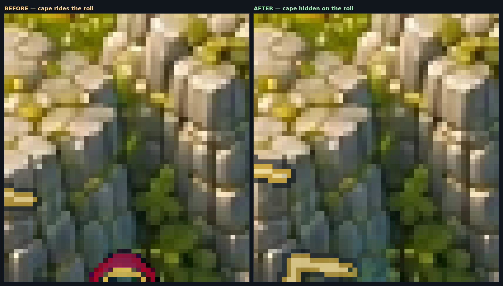 | |
| 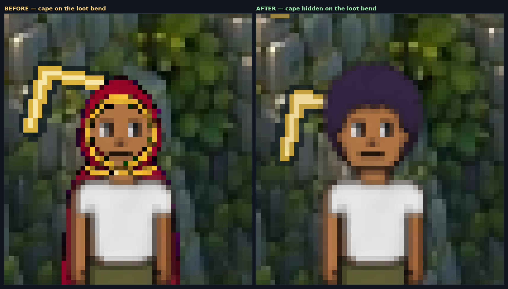 | |

**Control — the wardrobe did not simply switch off.** An ordinary jog still
wears it, and so do the hit, mine and fish poses (asserted in `mp-cape`).

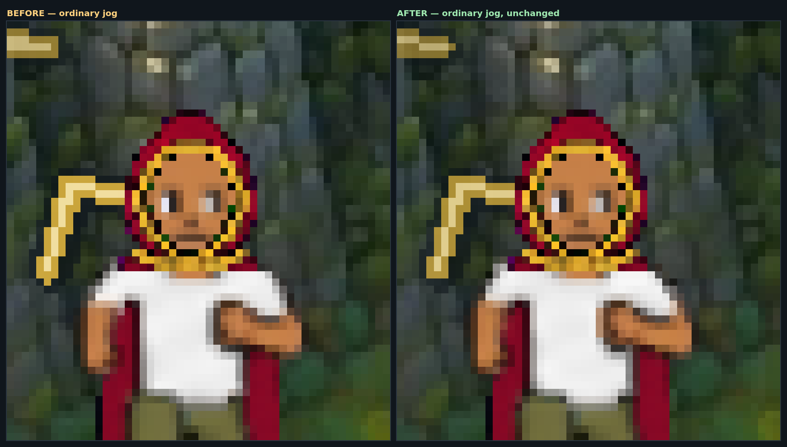

## The cape on the south shield block

South is the one facing that blocks on the real body. While moving, the
renderer splits him into a frozen standing top half and striding legs and hides
the body sprite so it cannot draw a second pair of legs — and the cape code
read that as "he is not on screen".

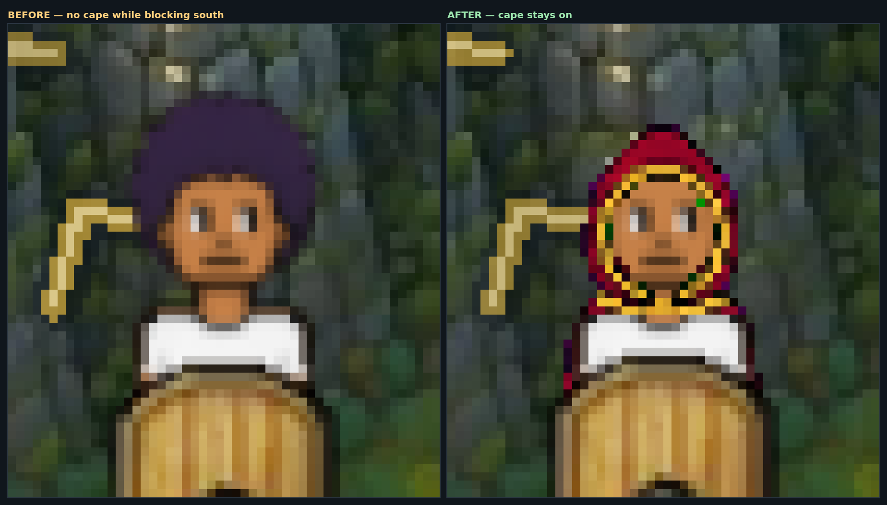

## The greatsword at southwest (D7)

Carried, and swung. Southeast and east are the controls: the owner's answer
names them as unchanged, and they are.

| | |
|---|---|
| 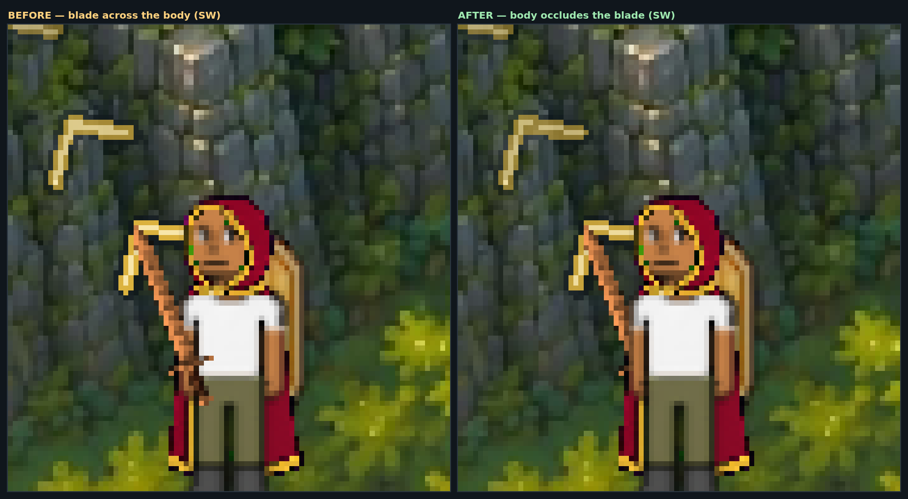 | |
| 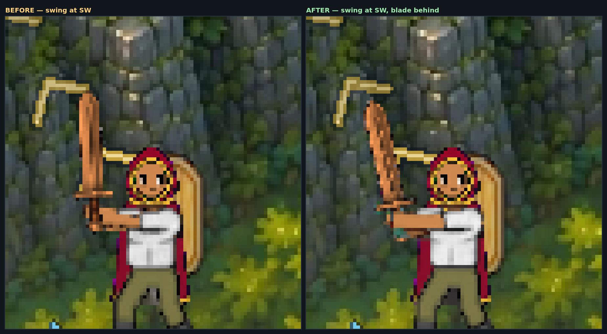 | |
| 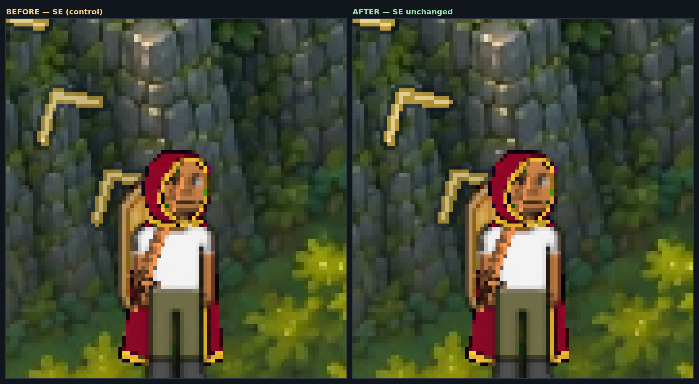 | |
| 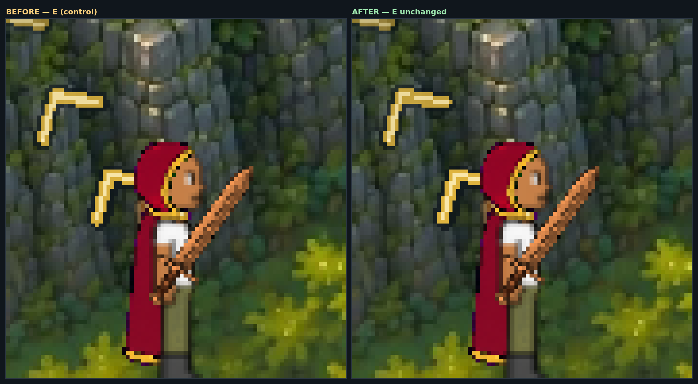 | |

## The cape on the east bow shot

East is the only profile the attack stand-ins have, and side-on "behind the
body" stops being the same picture as "behind in the world".

| | |
|---|---|
| 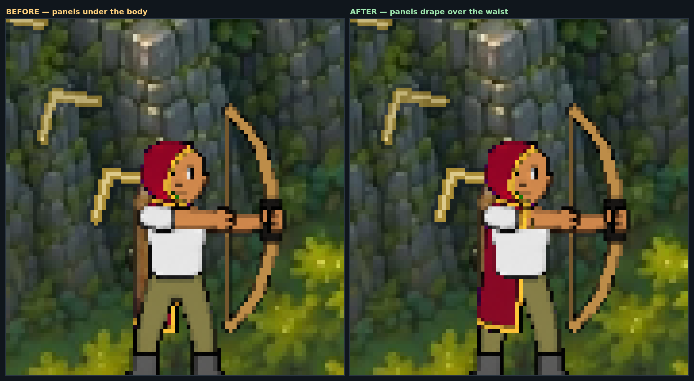 | |
| 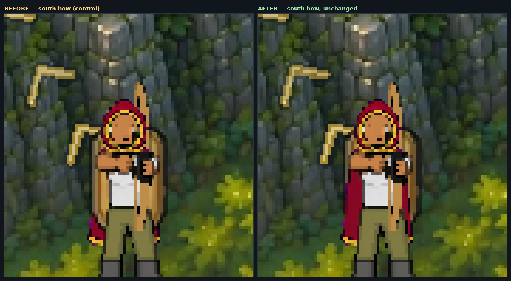 | |
| 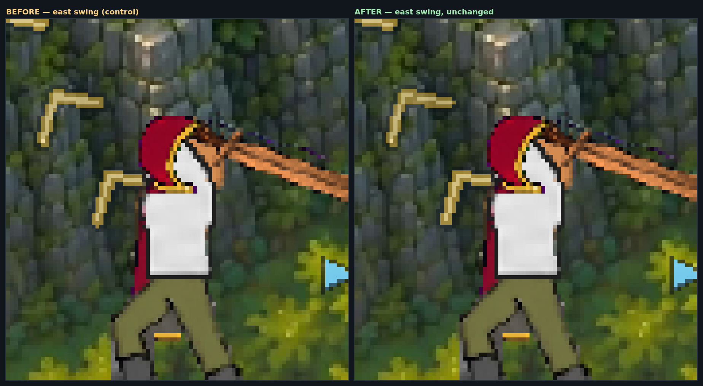 | |

## The cape in the equipment preview

The equip screen pins itself to southwest, which is a split facing, so the hood
draws in front of the skull and the panels behind the torso — and in front of
the slung shield — exactly as they do in the world.

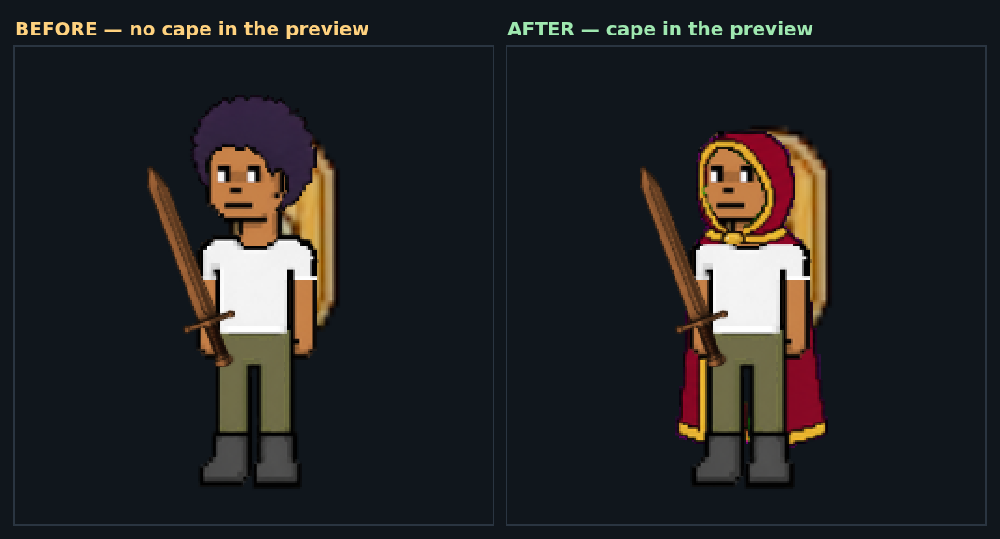

## The face tattoo on a moving bow shot

A full-coverage magenta face canvas, which is the one hue the figure cannot
otherwise make. Before, the drawing is fitted into the forehead and stops at
the cheekbones; after, it reaches the jaw and stops there.

| | |
|---|---|
| 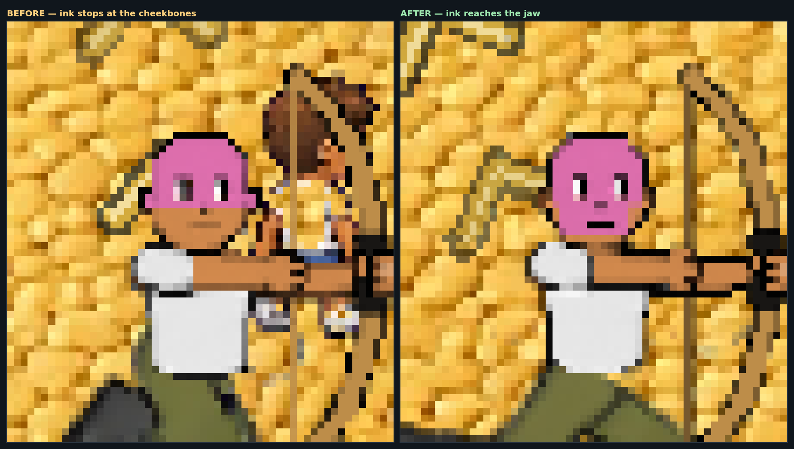 | |
| 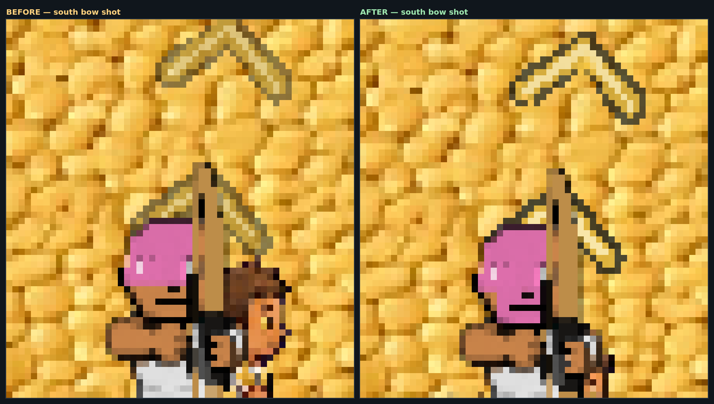 | |
| 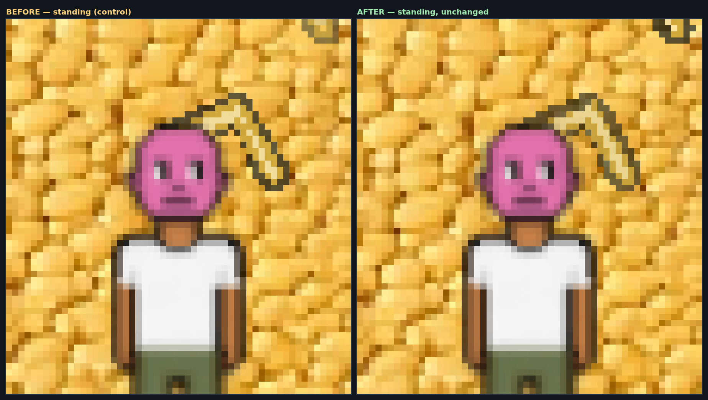 | |

## The bare tee shoulder on a jog east — a diagnosis, not a fix

Both halves are the SAME build; the only difference is whether a shield is
equipped. The shoulder is bare either way, and the shielded run measures no
worse. See the PR body for what that rules out.

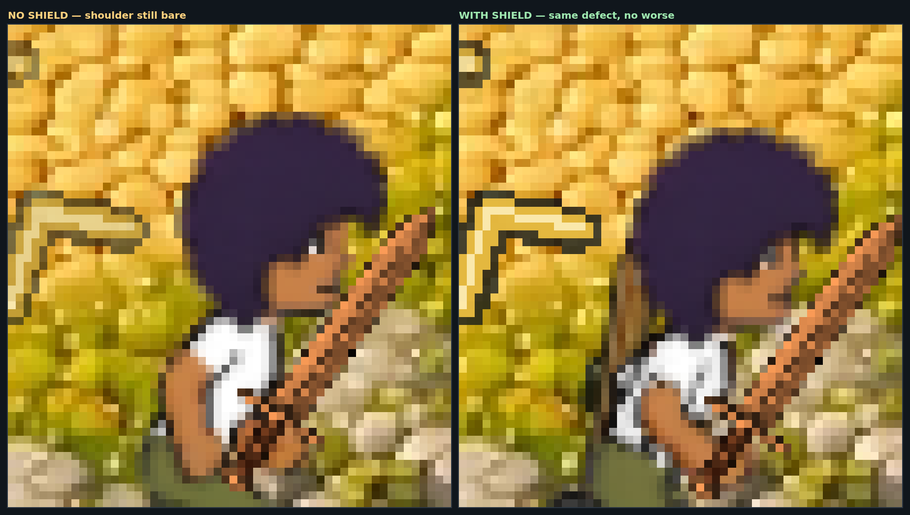
