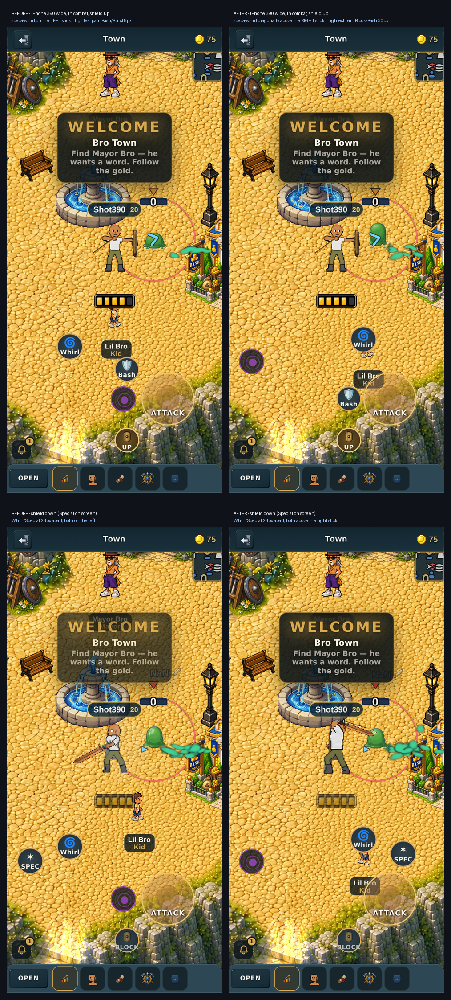
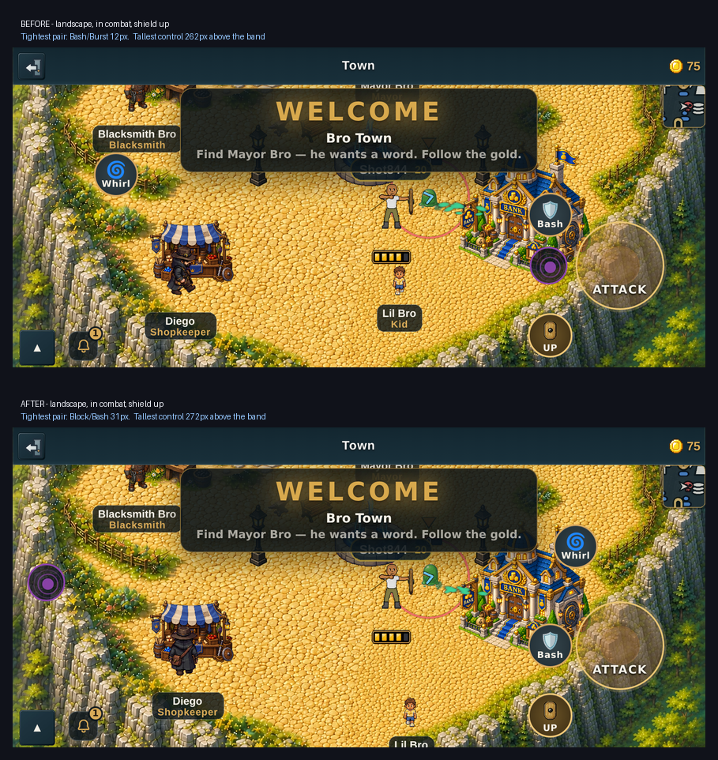
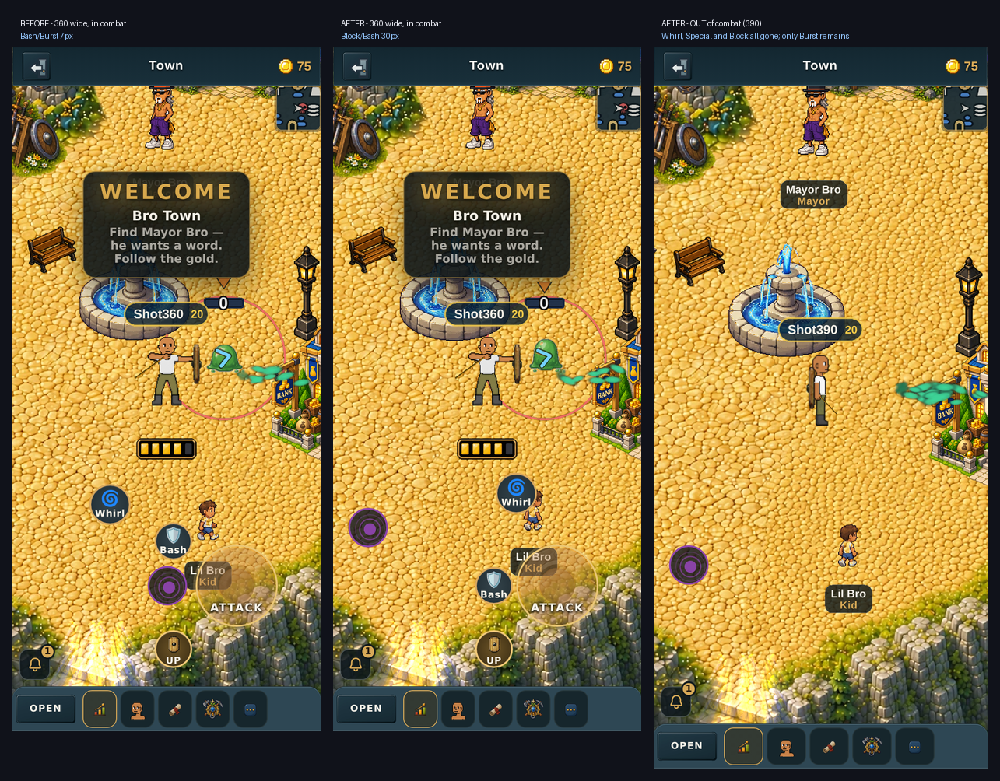

# Combat button layout, before and after (v2.3.2574)

GitHub renders this page with the pictures in place — that is why it exists.
The pull-request description cannot embed them (see the note at the bottom).

Owner, in order:

> "the placement of the buttons isn't ideal. I'd like the whirlwind and special
> attack buttons diagonally above the left joystick (directionally above but
> diagonal to provide enough space between them for not accidentally pressing
> the other one) and the shield block button to the diagonal bottom left of that
> right joystick (as a mental separation for combat purpose further away from
> the other buttons on its own side)"

> "Spec and swirl need to be on the right joystick. It was put on the left."

## iPhone 390 wide, portrait

Top row is in combat with the guard up; bottom row is the same fight with the
guard down, which is the only state the Special button appears in.



## Sideways



## 360 wide (the narrowest phone checked), and out of combat

Out of combat the Whirlwind, Special and Block buttons all disappear and only
the purple Element Burst button is left — so the layout was checked with that
hole in it, not only when everything is on screen.



## The numbers

Measured from real screenshots in a real browser, in combat with the guard up —
the worst case, because that is when the most buttons share the screen. "Clear
air" is the shortest distance between the two buttons' edges, in screen pixels.

| | iPhone 390 wide | 360 wide | Sideways (844x390) |
|---|---|---|---|
| Closest two buttons, **before** | **8px** — bash/burst | **7px** — bash/burst | **12px** — bash/burst |
| Closest two buttons, **after** | **30px** — block/bash | **30px** — block/bash | **31px** — block/bash |
| Block to its nearest neighbour, before | 29px (burst) | 29px (burst) | 35px (burst) |
| Block to its nearest neighbour, after | 30px (bash) | 30px (bash) | 31px (bash) |
| Block to whirlwind | 136px → 136px | 126px → 136px | 496px → 152px |
| Block to special | 161px → 122px | 139px → 122px | 567px → 135px |
| Block to bash | 83px → 30px | 82px → 30px | 93px → 31px |
| Bash to burst | 8px → 133px | 7px → 105px | 12px → 565px |
| Tallest control above the dashboard | 237px → 250px | 237px → 250px | 262px → 272px |

With the guard down, Special and Whirlwind are **24px** of clear air and **77px**
centre-to-centre apart at both portrait widths, and 27px / 86px sideways. Those
are the same numbers the pair had on the left-hand side, which is the point: the
diagonal that was tuned there transfers to the right stick unchanged.

Sideways, 272px is the tallest anything reaches. The limit is about 283px, which
is where a previous attempt was rejected for putting a combat button "up among
the health bars", so there is roughly 11px of headroom left.

## How to reproduce these

```
node tools/qa/mp/run.mjs btnmove
```

`tools/qa/mp/shot-btnmove.mjs` captures the same eight states and prints the
full pairwise gap table. It deliberately asserts nothing, so the identical file
can be dropped into a worktree at an older commit to produce the "before"
column — which is how the two halves of every row above were measured with the
same ruler.

## Why this page exists

The pull-request description is created through an API path that rewrites
markdown in the request body: it strips the `!` from `` and prefixes
absolute URLs inside link parentheses with a backtick. An earlier pull request
shipped a picture the owner could not see for exactly this reason. Bare URLs
survive intact, so the description links here with one, and the images live in
this committed file where GitHub resolves the relative paths itself.
