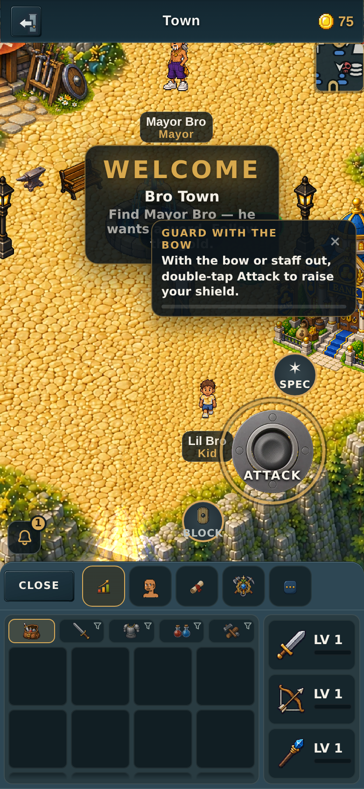
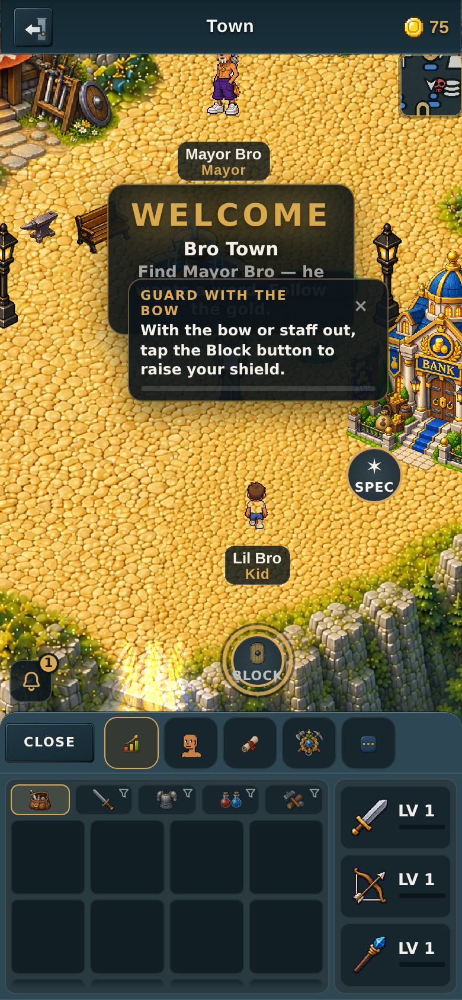
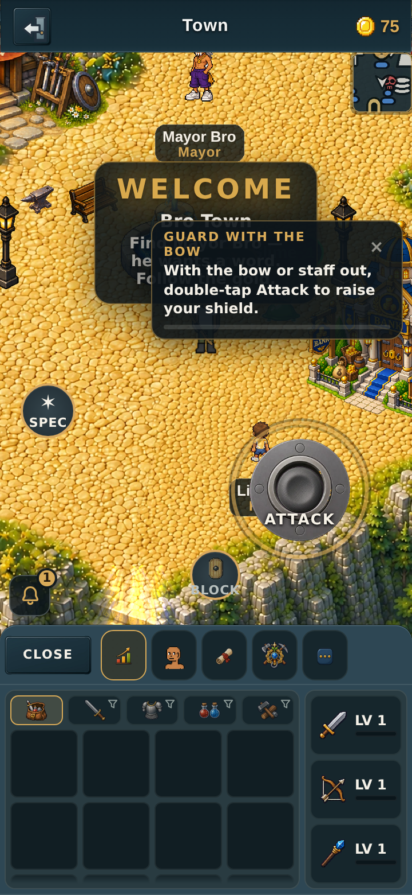
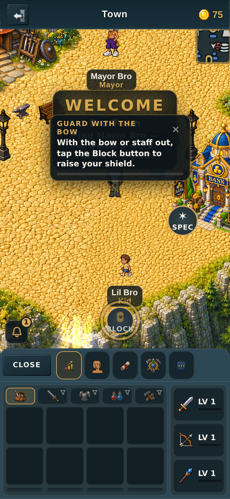
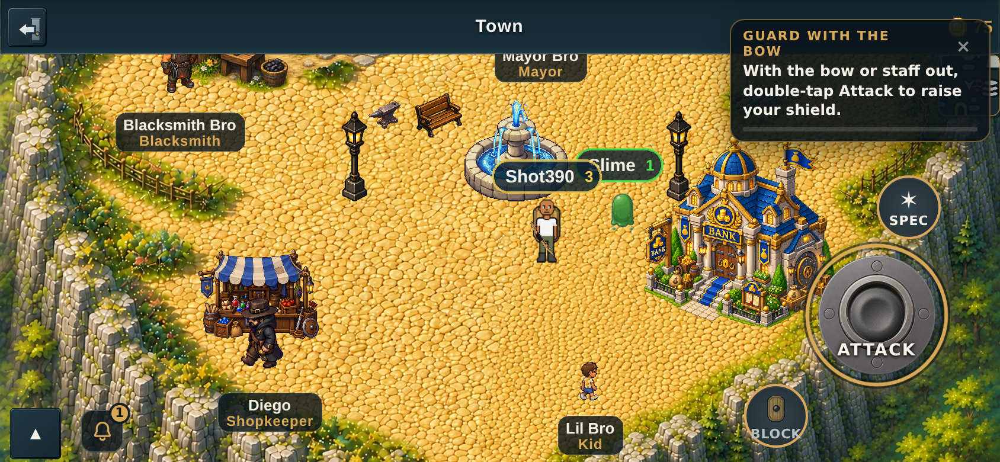
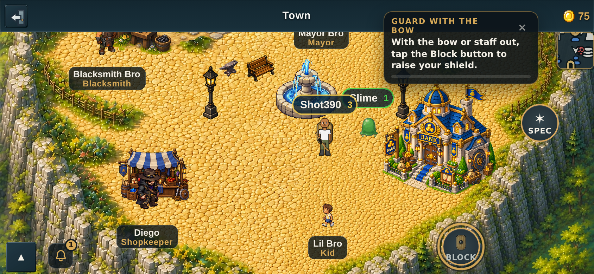
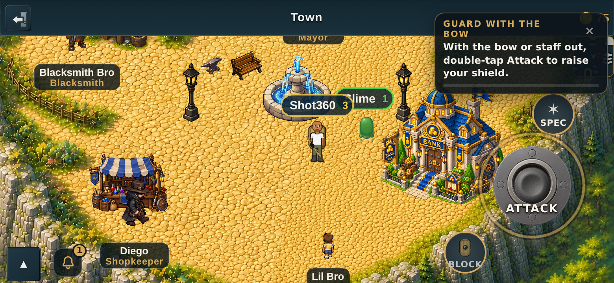
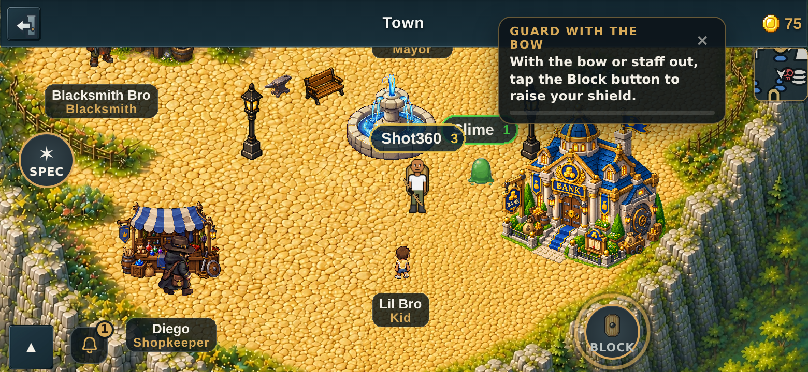

# v2.3.2576 — the guard lesson, before and after

Screenshots for PR #659. The tutorial's `blockRanged` lesson ("Guard with the
bow") told new players to *"double-tap Attack to raise your shield"* — a gesture
retired at v2.3.2472. It now names the **Block button**, and the flashing ring
moved from the Attack disc to the Block button with it.

Captured on the project's own phone-sized harness at the two iPhone widths that
matter (360 and 390 CSS px), portrait and landscape.

## 390 wide — portrait

Before — the card says "double-tap Attack", the ring is on **ATTACK**, and the
**BLOCK** button is sitting right there unmentioned:

After — the card names the Block button and the ring is on **BLOCK**:

## 360 wide — portrait

## 390 wide — landscape

## 360 wide — landscape

