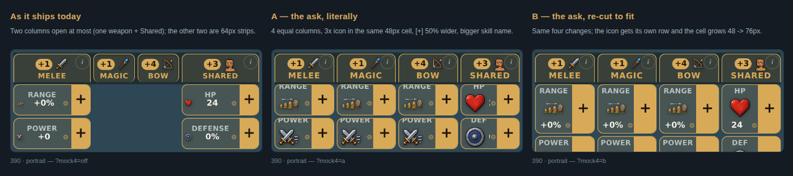
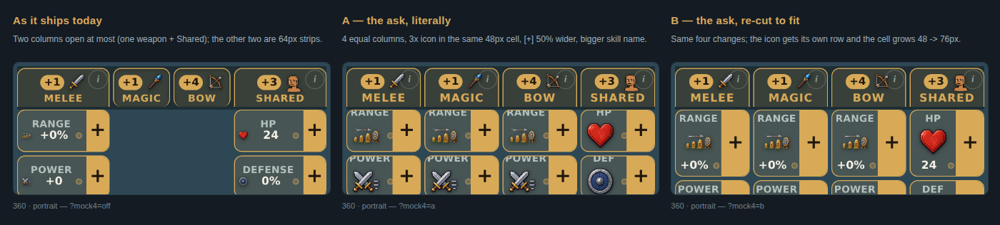
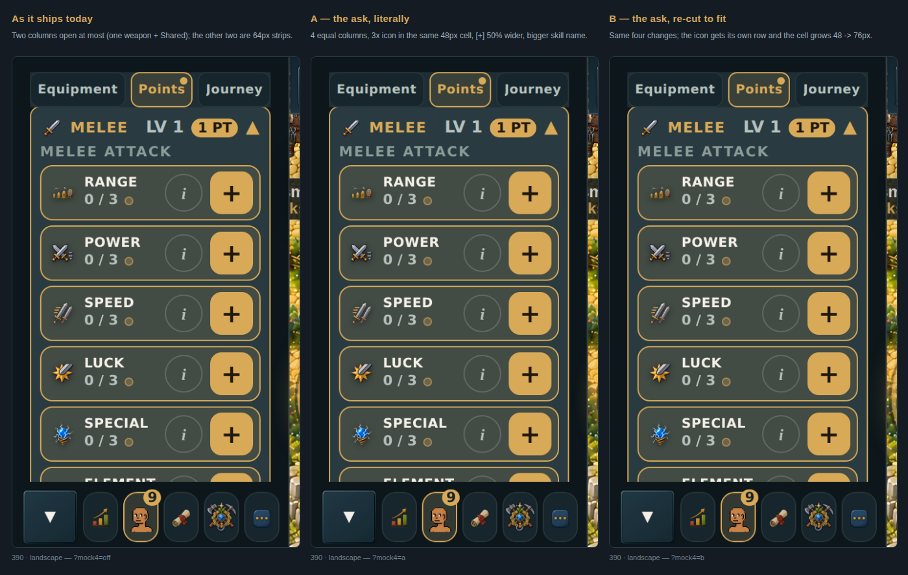

# Four columns, equal width — a mockup to look at (v2.3.2596)

You asked:

> I want to see a mockup of what all of the 3 combat skills and shared stats
> column look like expanded but sharing equal width. **I think it might actually
> look better.** The icons need to be about 3x as large in each of the cells.
> Also make the plus button 50% wider and increase the font size of each skill a
> bit.

This is that mockup, built in the real app and photographed — not a drawing. It
is **behind a switch and off by default**, so nothing changes for players unless
you turn it on. Merging it changes nothing; throwing it away costs nothing.

**The short version: three of your four asks fit comfortably. The 3x icon does
not fit in the cell as it is built today — so there are two pictures, A and B.**

---

## The pictures

### At 390 wide (iPhone 15/16 Pro)

### At 360 wide (the narrower Androids, and the tightest case that matters)

Left is the screen as it ships today. Middle (**A**) is your ask taken
literally. Right (**B**) is the same ask with the cell re-cut so it actually
fits.

Full uncropped phone screens, if you want to see them in context:
[today](assets/full-390-portrait-before.png) ·
[A](assets/full-390-portrait-a.png) ·
[B](assets/full-390-portrait-b.png)

---

## What each picture is

**As it ships today.** Only two columns can be open at once — one weapon plus
Shared — which is the rule you set a couple of versions back. The other two sit
as narrow 64px strips. So "all four open" is not a state the current screen can
even reach; that is why this had to be built rather than screenshotted.

**A — your ask, literally.** Four equal columns, the icon at exactly 3x, the [+]
50% wider, the skill name bigger. Nothing softened. **It breaks**, and the way it
breaks is the useful part:

- the stat names (RANGE, POWER, HP…) are **sliced in half** across the top — the
  39px icon pushes them out of a 48px-tall cell
- the stat **numbers disappear completely**. There is no room left for them
  beside a 39px icon and a wider [+]. The value needs about 31px more width than
  it has.
- **50 elements clipped, 25 truncated**, at both 390 and 360.

That is not a rendering bug to go fix. It is the four asks competing for one
width: you are adding a fourth column to a row that currently holds three,
*while* making everything inside the cells bigger.

**B — your ask, re-cut to fit.** Same four changes, and the icon is still the
full 3x (39px). The difference is that the icon gets **its own row** instead of
sitting beside the number, and the cell grows from 48px to 76px tall to hold it.
Result: **nothing clipped, nothing truncated**, at either width, with every piece
of text at or above the 11px readability floor this project locks.

---

## The numbers

Measured in a real browser on the real screen, not estimated.

| | Ships today | A — literal | B — re-cut |
|---|---|---|---|
| Columns open at once | 2 (max) | **4** | **4** |
| Column width @ 390 | 119 open / 64 strip | **91.5 each** | **91.5 each** |
| Column width @ 360 | 104 open / 64 strip | **84 each** | **84 each** |
| Cell icon | 13px | **39px (3.0×)** | **39px (3.0×)** |
| Cell height | 48px | 48px | **76px** |
| [+] width @ 390 | 29.25px | **33.56px** | **33.56px** |
| [+] width @ 360 | 25.50px | **30.75px** | **30.75px** |
| [+] as share of cell | 25% | **37.5%** | **37.5%** |
| Skill name font | 11px | **12.5px** | **12.5px** |
| Stat name font | 11px | 11px | 11px |
| Stat value font | 12.5px | 12.5px | 12.5px |
| Clipped elements | 0 | **50** | **0** |
| Truncated labels | 0 | **25** | **0** |

Raw data: [measurements.json](assets/measurements.json).

### One number that needs explaining: the [+] button

You asked for 50% wider, and there are two honest answers depending on what it
is measured against:

- **Against the same four-column layout: exactly 1.50× wider.** The [+] is sized
  as a share of its cell — 25% today, 37.5% now. In a 91.5px column that is
  22.38px → 33.56px. This is the 50% you asked for.
- **Against today's screen: only about 15% wider** (29.25px → 33.56px at 390).
  Not because the change is smaller, but because splitting the row four ways
  makes every cell *narrower* — 119px → 91.5px. The button takes a much bigger
  bite of a smaller cell and ends up only a little bigger in absolute pixels.

If what you actually want is a [+] that is 50% wider **on screen**, that is a
different number again — about 44px, which is nearly half the whole cell. Say
the word and I will show that too.

---

## What "a bit" means for the font, and what had to give

**The skill name went 11px → 12.5px** (about 14% bigger). That is MELEE / MAGIC /
BOW / SHARED — the words that actually name a skill. I stopped at 12.5 because
the next step up (14px) starts cutting off "SHARED", the longest of the four, in
an 84px column at 360.

The stat names and values **kept their current sizes** (11px and 12.5px). An
earlier attempt shrank them to 10px and 11.5px to buy room — that is below the
**11px readability floor** this project enforces, so I put them back and paid for
the room elsewhere.

**Three things gave, and they are worth naming:**

1. **The stat names use their short forms at every width** — "Spec" instead of
   "Special", "Elem" instead of "Elemental". These are the short names the
   project already uses on narrow phones; a quarter-width column is a narrow
   column, so they apply everywhere under this layout. The full name is still
   what a screen reader reads.
2. **The padding beside the [+] is tighter** (4px → 2px, and 3px → 2px on the
   left). This is your own rule from an earlier round — "reduce horizontal
   padding rather than shrinking the text excessively."
3. **In B, the column is taller.** A seven-stat column goes from 360px to 556px
   — about **54% more scrolling**. The screen already scrolls; under B it
   scrolls about half again as far. This is the real cost of B and the main
   thing to weigh.

---

## Sideways (landscape)

**Landscape is deliberately untouched — the three pictures above are the same
screen three times.** That is the evidence, not an oversight.

Turned sideways the points screen is not four columns at all; it is a stacked
list of four lanes that open one at a time. Four equal columns there would be
about 45px wide each, and this project has already measured that width failing —
stat names collapse to a single letter. So "four equal columns" is a portrait
idea, and forcing it sideways would make the screen worse, not better.

If you want landscape changed too, that needs its own decision and I would show
you options rather than guess.

---

## One thing worth knowing about how this was checked

The automatic check said the labels fit. The picture said "POW…". **The picture
was right.**

The browser reports element widths as whole numbers, and "POWER" wanted 46.64px
in a 46.50px box — a seventh of a pixel over, reported as a clean fit. It slipped
past two rounds of automated checking while plainly visible on screen. The cause
was letter-spacing being reserved after the final letter but never drawn.

*(That is the same cell after the fix, magnified. Before it, the identical cell
read "POW…".)*

Both are fixed: the layout, and the checking tool, which now measures text
down to fractions of a pixel. Worth recording because the same blind spot would
hide the same class of bug anywhere else in the UI.

---

## Try it on your phone

Once the preview build finishes, the Pages bot posts a link on the pull request.
Add one of these to the end of it:

- `?mock4=a` — variant A, the literal version (the broken one)
- `?mock4=b` — variant B, the one that fits
- no suffix at all — the screen exactly as it is today

The expected address is:

https://claude-prog3-four-equal-mockup.gamedev-aix.pages.dev/?mock4=b

Use whatever link the bot posts if it differs — that one is authoritative.

---

## What I need from you

**Does four equal columns look better?** That was your actual question, and it is
the one I cannot answer for you.

If yes, the follow-up is **which cell**:

- **B as built** — full 3x icons, 54% more scrolling.
- **B, but shorter** — keep the icon on its own row, shrink it to about 2x
  (26px), cell around 62px. Less scrolling, still much bigger than today.
- **Keep today's cell, smaller icon** — no extra scrolling at all, but the icon
  can only reach about 2x before the numbers start losing room.
- **Something else** — including "no, the current two-column version is better",
  which is a completely fine answer and costs nothing to keep.

I did not pick for you, because "I think it might actually look better" is a
thing to see rather than a thing to argue.
