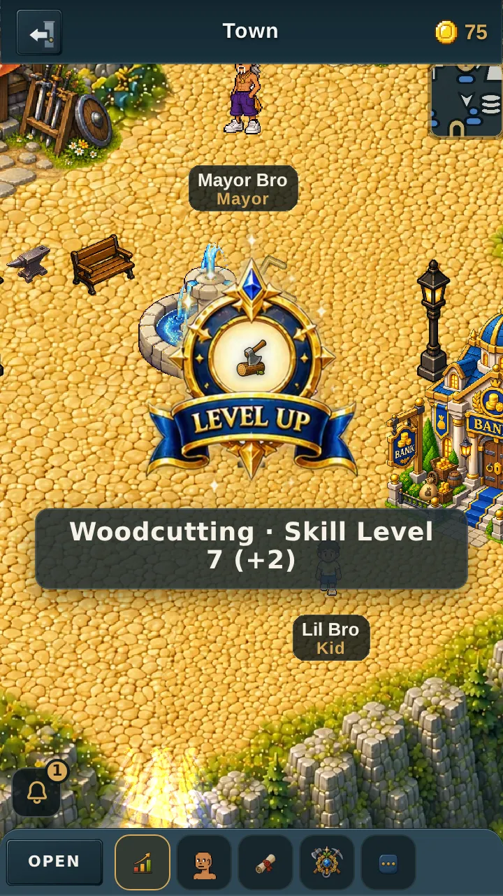
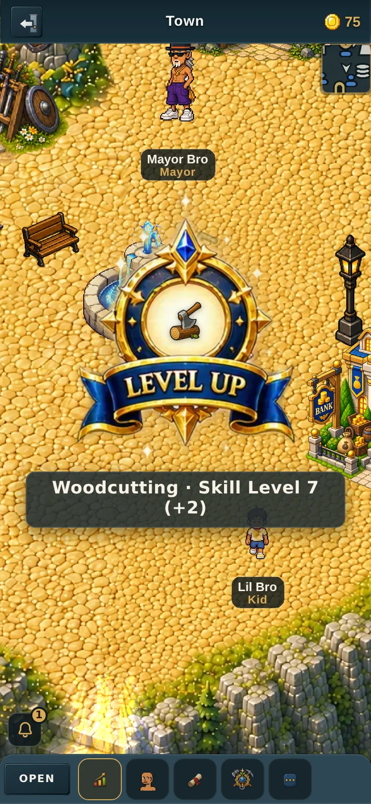
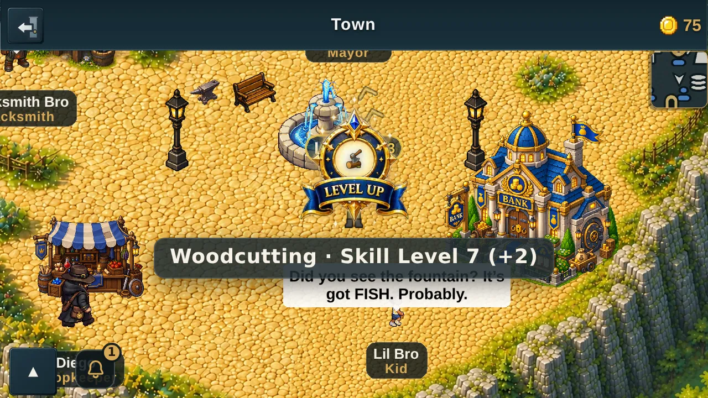
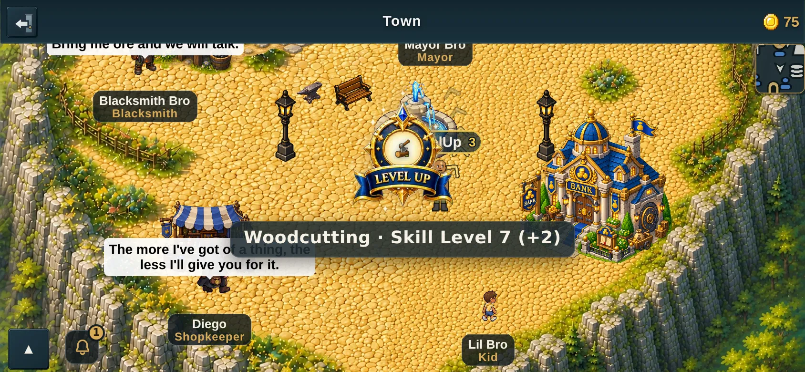
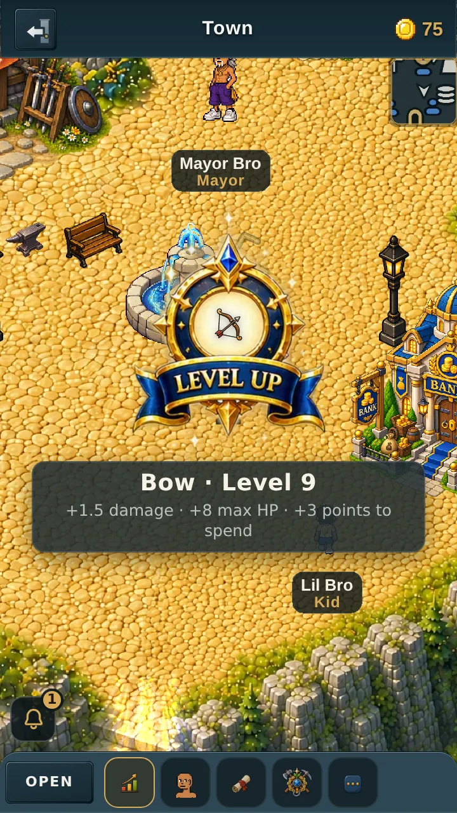
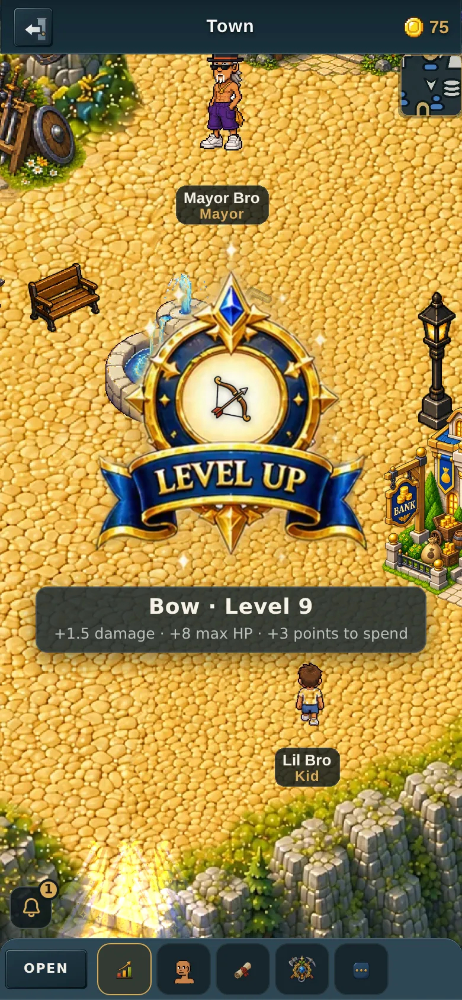
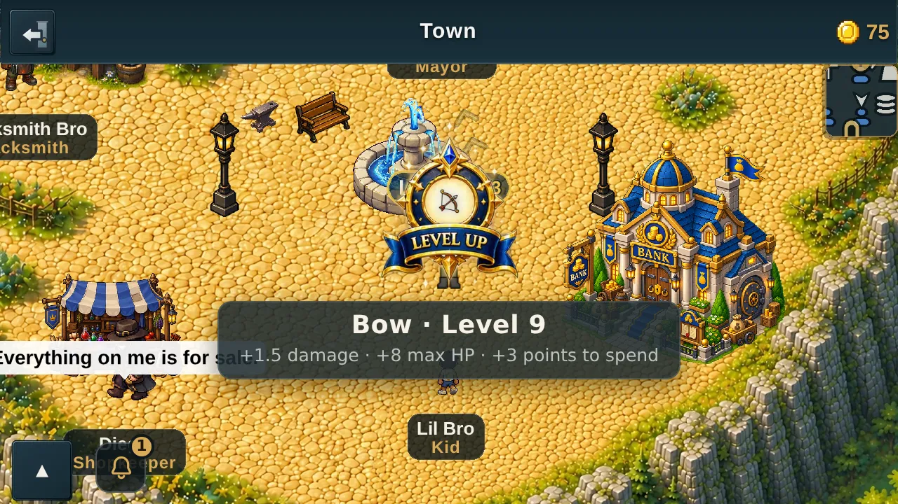
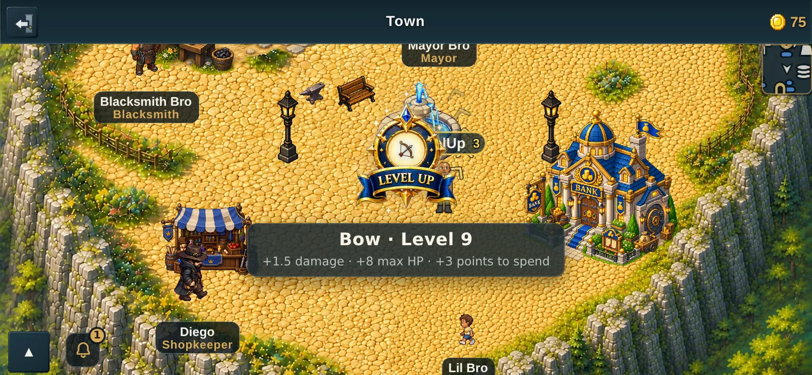
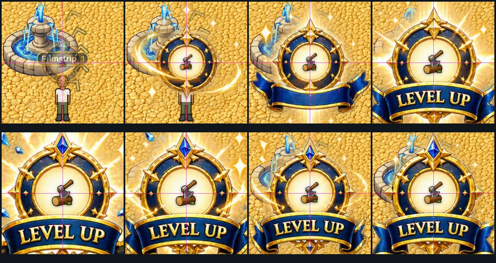

# The new level-up notification — what it looks like and what was measured

*v2.3.2591. Every picture on this page came out of the running game (a real
worker, a real join) via `tools/qa/mp/shot-levelup.mjs`.*

---

## What you will see

A gold burst grows out of nothing, peaks, and settles into a ringed medallion
with a **LEVEL UP** banner. The skill you just levelled sits in the medallion's
centre circle, and a line underneath says which skill and what level.

### Life skill — woodcutting

360 × 640, portrait



390 × 844, portrait



640 × 360, landscape



844 × 390, landscape



### Combat skill — bow

360 × 640, portrait



390 × 844, portrait



640 × 360, landscape



844 × 390, landscape



---

## The icon really is locked to the circle

This is the part worth checking, because the medallion **moves and grows and
shrinks** across the eight frames — it is not the same size or in the same
place twice.

Below are all eight frames, each cut to the **same 220 × 220 box** around the
point the circle is pinned to. The magenta crosshair is that point. The
medallion swells and settles around it; the axe does not move.



Measured off the live page rather than judged by eye:

| | |
|---|---|
| icon centre drift across the whole run | **0.01 px** horizontally, **0.01 px** vertically |
| icon width, frame 0 → 7 | 24.3 → 38.9 → 44.4 → 59.7 → **65.9** → 63.8 → 53.4 → 55.5 px |

The width grows and settles because the icon is sized from each frame's own
measured circle — it scales *with* the medallion instead of sitting in front
of it at a fixed size.

---

## The measurement the whole thing rests on

The artwork is one strip, 2172 × 724, with eight frames across it.
2172 ÷ 8 = **271.5**, so there is no clean grid to cut on — and the frames are
not merely half a pixel off one. They are genuinely different widths, because
the artist drew to the art:

| frame | cut from … to | width | circle centre (x, y) | circle radius | rays agreeing |
|---|---|---|---|---|---|
| 0 | 0 – 189 | 189 | 98.3, 372.9 | 17.5 | 333 / 360 |
| 1 | 189 – 448 | 259 | 318.4, 369.5 | 28.0 | 360 / 360 |
| 2 | 448 – 700 | 252 | 575.5, 347.1 | 32.0 | 360 / 360 |
| 3 | 700 – 1003 | 303 | 857.4, 336.9 | 43.0 | 360 / 360 |
| 4 | 1003 – 1362 | **359** | 1187.5, 339.3 | **47.5** | 360 / 360 |
| 5 | 1362 – 1649 | 287 | 1502.5, 340.4 | 46.0 | 360 / 360 |
| 6 | 1649 – 1908 | 259 | 1784.8, 345.1 | 38.5 | 360 / 360 |
| 7 | 1908 – 2172 | 264 | 2038.0, 343.7 | 40.0 | 360 / 360 |

An even grid would have put every boundary at a multiple of 271.5. The real
ones are at 189, 448, 700, 1003, 1362, 1649 and 1908 — the first one is **82
pixels** away from where the arithmetic says it should be. Cutting on the grid
would have sliced part of frame 4's rays into frame 3 and clipped frame 4's own
left edge.

**How the numbers were found, so they can be checked:**

- The **cuts** come from the strip's own transparent gutters — the columns
  where the picture is empty — not from dividing by eight.
- The **circle** comes from the pixels: a distance transform finds the deepest
  point inside the cream glow, then 360 rays are cast outward and the *median*
  distance to the edge is taken. The median matters — on frames 0 and 4 the
  white rays cross the disc, and a simpler "find the bright blob" measurement
  leaks out along them (frame 4's blob measures 296 × 333 for a disc of radius
  47.5). "Rays agreeing" in the table is how many of the 360 landed within
  ±28 % of the median; on seven of the eight frames it is all of them.

Re-run it yourself:

```
git show e136a64:public/sprites/fx/levelup-burst-v1.png > /tmp/lu.png
node tools/levelup/measure-medallion.mjs /tmp/lu.png
```

---

## A note on the two screenshots that look cluttered

The character in these shots is brand new, so Mayor Bro and Lil Bro are
standing right where the burst lands, and there is a "Level Up 3" name plate
floating behind the medallion in a couple of them. That is the town, not the
notification.
