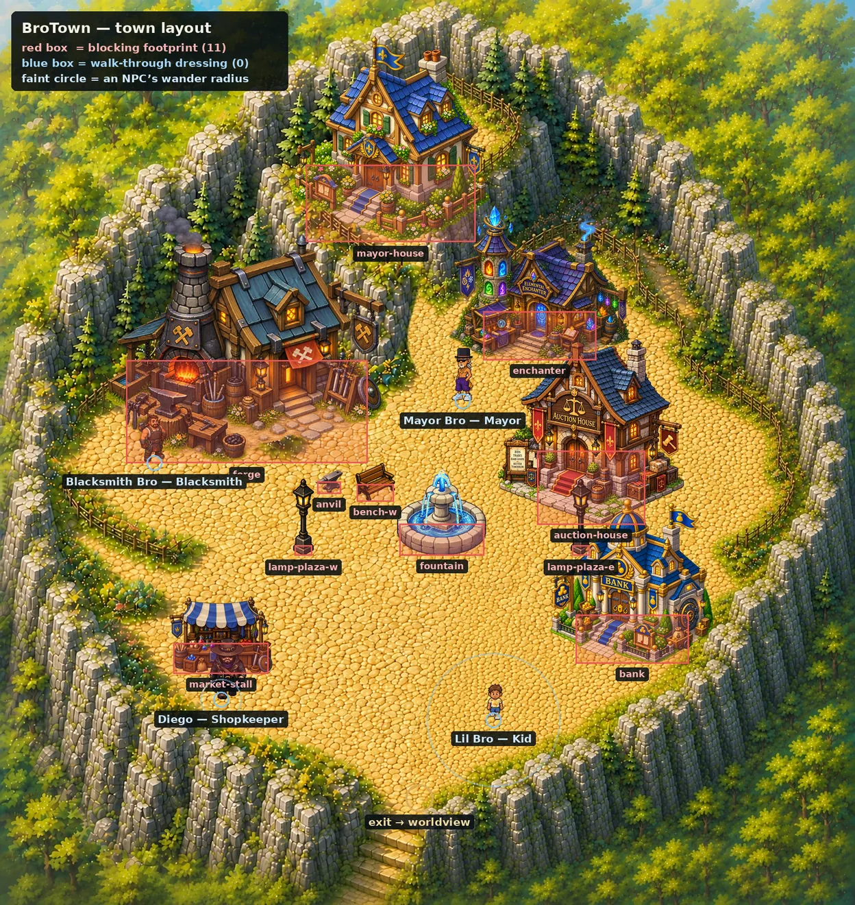
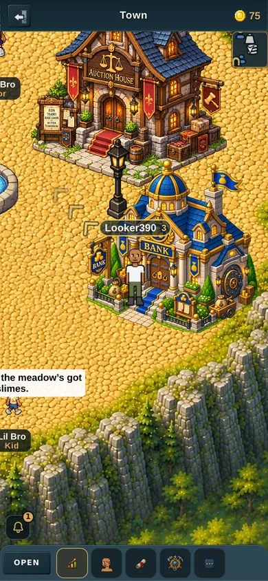
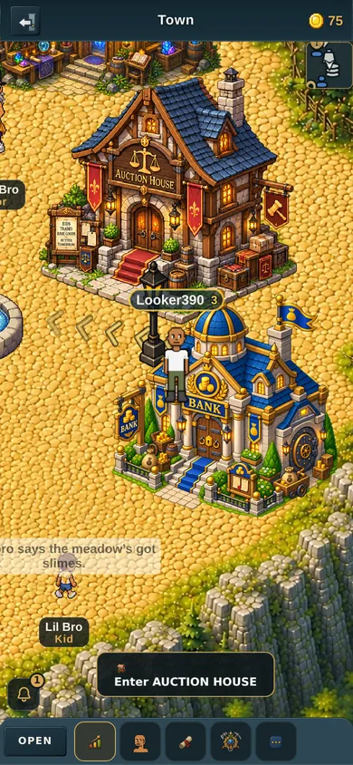
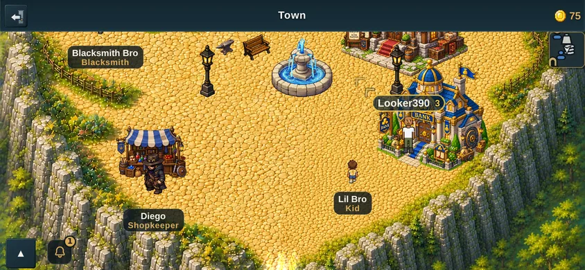
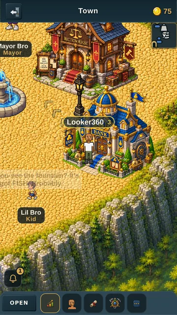
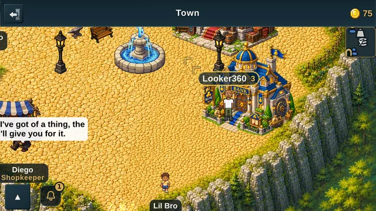

# The Auction House gets its own building, and moves onto the plaza

v2.3.2626. Companion page to the PR, because GitHub's PR-body API mangles
markdown image syntax and these are pictures.

---

## Before and after, in one sentence

The Auction House used to be a small shop sprite tucked into the far
north-east corner of town, behind the enchanter and up against the fence. It is
now your building art, at nearly twice the size, standing on the east side of
the plaza facing the fountain.

## The whole town, after

Every prop drawn at its real size and position, straight from the data:

The building used to sit up in the top-right corner, in the gap that is now
open cobble.

## On a phone

390 wide, portrait — walking up to it:

390 wide, portrait — standing at the door, with the prompt up:

390 wide, landscape:

360 wide, portrait — the smallest phone this is tested at:

360 wide, landscape:

---

## The numbers behind the placement

| | Before | After |
|---|---|---|
| Position | (1290, 800) | (1150, 1020) |
| Distance to the fountain | 513 | 296 |
| Height in world pixels | 200 | 360 |
| Sprite file | 512 x 498 | 515 x 512 |
| Blocking footprint | 190 x 85 | 210 x 144 |
| Walking east along y=800 stops at | x = 1182 | x = 1476 |

The building is drawn about as wide as it is tall, so 360 is also roughly its
width on the ground.

## Why not closer than that

Every position further north or west puts this building's roof over the
**enchanter's front**. Measured as actual overlapping sprite pixels, not
rectangles:

| Position | Enchanter covered |
|---|---|
| y = 1020 (chosen) | 0.9% |
| y = 1010 | 2.0% |
| y = 990 | 5.5% |
| y = 970 | 10.2% |

The middle of the plaza is not an option either — your own blueprint puts this
building on the east side, opposite the blacksmith.

## Nobody gets walled in

The town's walkable map, with every building's footprint stamped onto it, was
flood-filled from the town exit:

- **94.26%** of open ground reachable after the move, against **94.35%** before
  (the missing slice is off-plateau trees, and was already like that)
- all four doors — forge, bank, enchanter, auction house — keep a spot you can
  stand on inside the prompt's 95-pixel radius; this one at **7 pixels**
- the eastward walk the old position blocked now runs the length of the plateau

## One thing to know

The plaza lamp now stands in front of the steps. That was looked at rather than
argued about, and in the screenshots above it reads as a street lamp lighting
the entrance. Say the word if you would rather it moved.

## Not in this change

The interior art you sent with the building (`auction-house-interior-raw.png`)
is a backdrop for the panel, not map art. Putting a full-bleed painted scene
behind a panel full of text is its own design question — whether the listings
stay readable over it, and what it weighs on a phone — so it deserves its own
change and its own screenshots rather than being folded in here.
