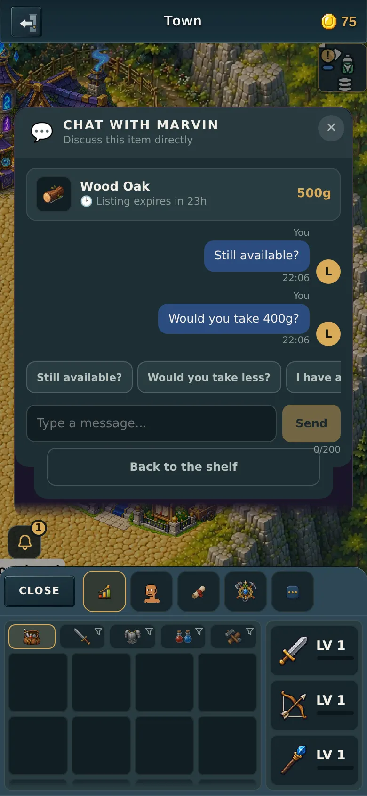
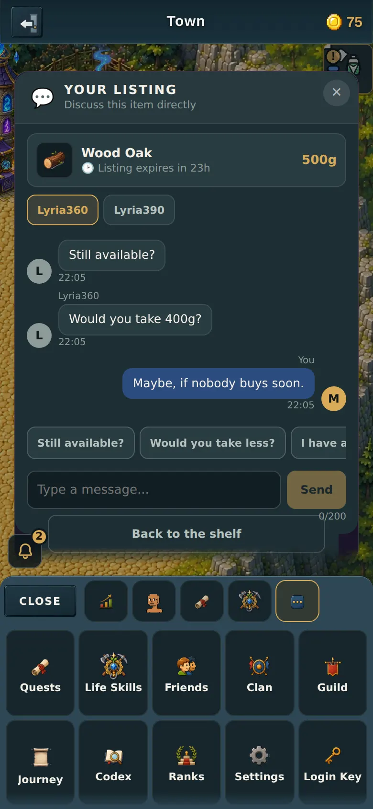
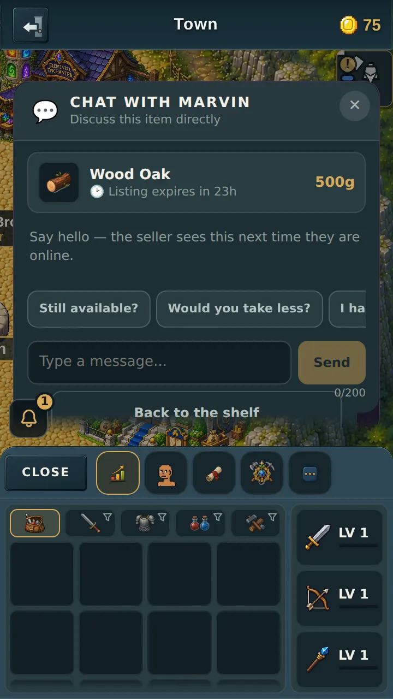
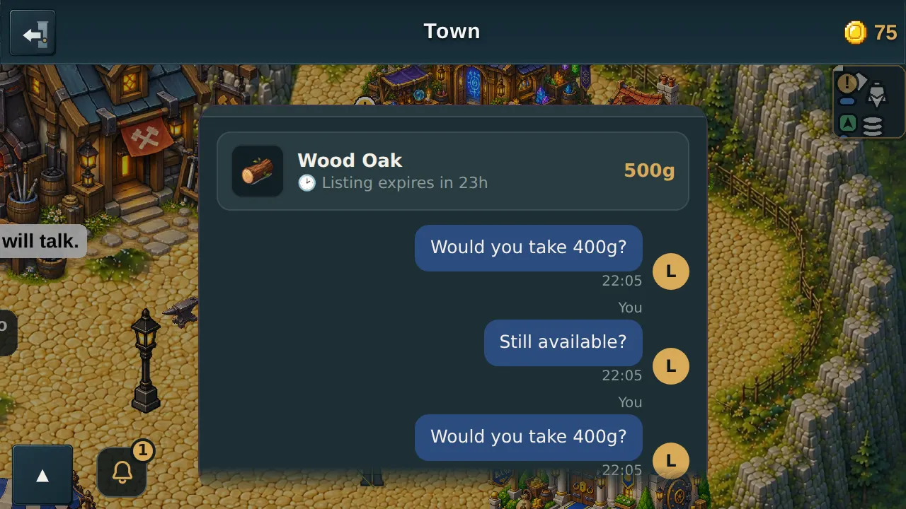
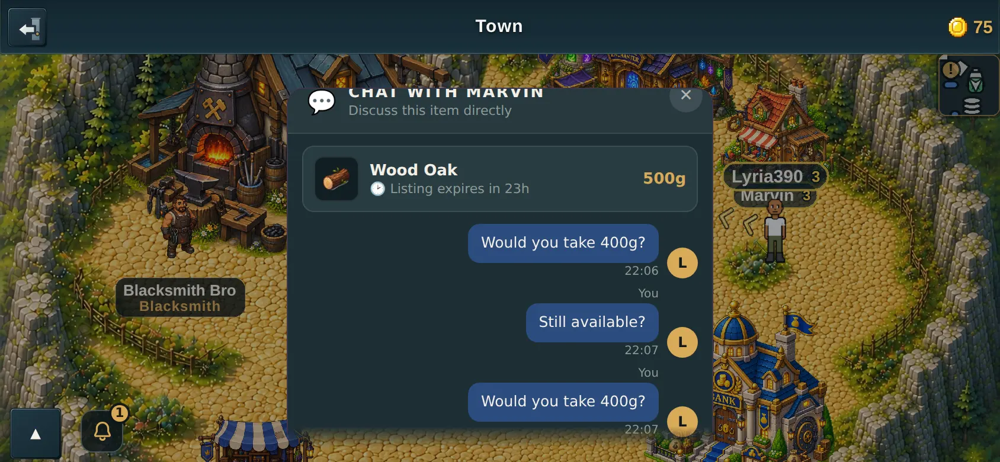

# Messaging the seller about a listing

v2.3.2621. Companion page to the PR, because GitHub's PR-body API mangles
markdown image syntax and these are pictures.

---

## What you asked for

> "Add the direct message feature (little chat icon)"

There is now a small 💬 button on every listing, next to the seller's name. It
opens a conversation **about that listing** — your mockup, built as drawn.

The item, its price and **the listing's own countdown** sit at the top, so you
always know what you are haggling over and how long is left. Then the bubbles,
your three canned replies, and a composer that counts to 200.

### It is a real conversation between two people

This is the important one, and it is what the test checks hardest: a line typed
by the buyer is read back **off the seller's screen**, in a second browser, on a
second player. A chat that only drew your own words back to you would pass
everything else and fail only that.

---

## The three canned replies

*Still available?* · *Would you take less?* · *I have a question*

They are one tap and they send immediately. You were right that they cover most
of what anyone needs to say — but free typing worked out to be small too, so
**both shipped**, not one then the other.

The reason free text was cheap: the game already had a working private-message
system for friends, with the sender stamped by the server, the length capped, and
the chat-moderation hook wired in. This is that same machinery pointed at a
listing instead of at a friendship.

Canned replies are sent as **ordinary text** through the same length cap and the
same moderation as anything typed. Treating them as special would have made them
the one thing worth faking.

---

## Your mockup shows one conversation. A seller has several.

A listing has one seller and any number of interested buyers, so what the seller
really has is **one conversation per buyer** on that listing.

- A **buyer** sees exactly one conversation: theirs.
- A **seller** opening their own listing sees a row of buyer names and reads one
  at a time.

So the mockup is not wrong — it is drawn from the buyer's side. A seller cannot
start a conversation with someone who never asked; they can only reply to people
who came to them.

---

## What happens to a conversation when the listing ends

**It goes with the listing.** Sold, expired, or taken down — the conversation is
deleted too.

A thread is *about* a listing, so once the listing is gone there is nothing left
for it to be about. The alternative is keeping dead conversations forever, which
then needs its own cleanup job to stop them piling up — and that is exactly the
kind of thing that quietly fills up storage.

**The trade-off, stated plainly:** there is no history after a sale. If you want
a receipt trail that outlives the sale, that is a different feature and should be
its own thing.

## Two other limits, deliberate

- **A listing holds five conversations.** The sixth person to ask about the same
  listing is told so. Raising it raises how much is stored, so it is a dial, not
  an accident.
- **Twenty messages per conversation**, oldest dropped. A haggle, not a history.

---

## Safety

- **The server stamps who said it.** A modified game claiming to be someone else
  is ignored — the test literally sends `from: "FORGED"` and checks the stored
  sender is the real one.
- **The 200 limit is enforced on the server**, not just in the box you type in.
- **The same moderation as the rest of the chat.** Every line is recorded for the
  report system before it is delivered, so an abuse report quotes the game's own
  copy of what was said and never the reporter's version. Muting someone stops
  their messages reaching you.
- **Rate limited** — five in a row, then one every couple of seconds.
- **Old and new versions stay safe together.** The icon only appears once the
  server says it understands these messages. That matters more than usual here:
  an older server would not recognise them and would **rebroadcast a private
  haggle to everyone in the room**. So the button does not exist to be tapped
  until the server can handle it.

---

## All four screens

---

## Testing

- **Server:** new suite `server/test/storechat.test.mjs` — 40 checks covering
  forged senders, the length cap, control characters, the per-conversation and
  per-listing limits, the rate limit, `__proto__` safety, and that conversations
  are deleted both when a listing **sells** and when it **expires**.
  `cd server && npm test` — all pass.
- **Through the screen:** `tools/qa/mp/mp-listingdm.mjs` — **71 checks, 71
  passed**, across 360 and 390, portrait and landscape. Two real players against
  one real server: the icon is tapped with a simulated finger, the canned reply
  sends, a typed line sends, the counter counts, the box refuses a 201st
  character — and the buyer's line is then read **off the seller's screen** and
  the seller replies back.
- `node tools/dev/precheck.mjs` — 0 FAIL.

Full design notes, including why a conversation is keyed to the listing rather
than to the pair of players: `docs/specs/store-chat.md`.
