# The vendor building is a player marketplace now

v2.3.2618. Companion page to the PR, because GitHub's PR-body API mangles
markdown image syntax and these are pictures.

---

## What you asked for

> "I want something like this for the storefront ui ... This is only going to
> be a player marketplace so make that the only button."

### The vendor building, before and after

Before — the shopkeeper's shelf, with the player store as a small link on top:

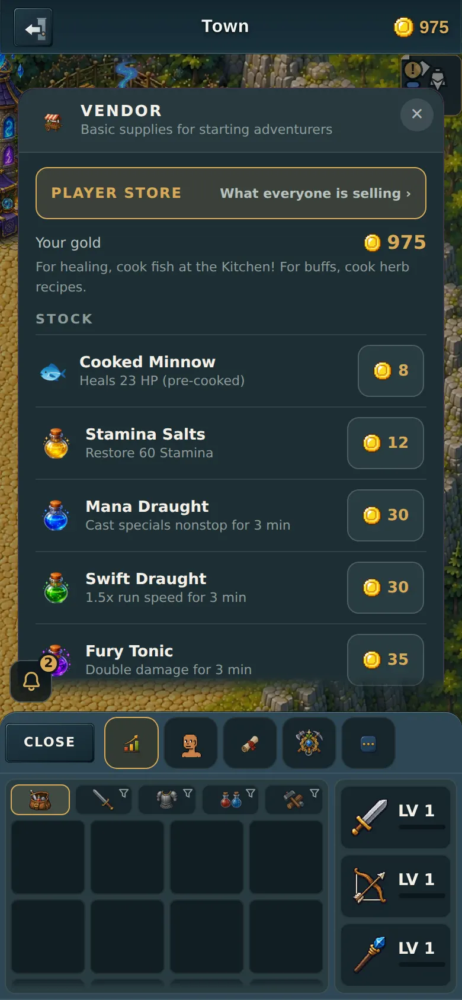

After — one button, in your mockup's own words:

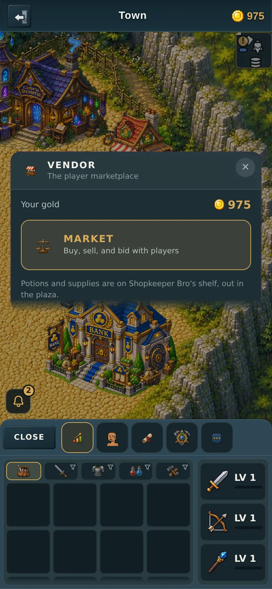

### The shelf itself

Before:

After, built to match your mockup's listing row — the price on the Buy
button, a clock, who is selling it, and the bid line:

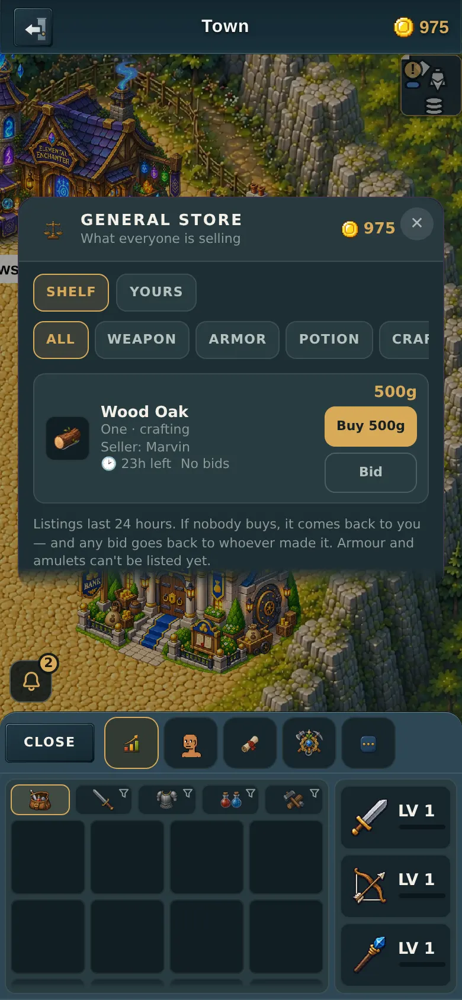

---

## Important: the shop DATA was hidden, not deleted

The shopkeeper's five items are still in the game. They are still sold, at the
same prices, by **Shopkeeper Bro out in the plaza** — and his shelf is
literally built from that same table (`shopStaples()` reads every entry of
`SHOP_ITEMS`). So nothing was removed; one of two duplicate shopkeeper
surfaces was closed.

That table is load-bearing in a second place too: your **bag's potion filter**
is keyed off it. Deleting it would have emptied that filter.

If anything, the surface that went is the worse of the two. Its own code
comment records that its purchases were a **local illusion** for months — it
checked a flag that is false in town, which is exactly where this door is, so
the server never heard about a single purchase and put your gold back on the
next update. Shopkeeper Bro does it properly, server-side.

The test proves this rather than asserting it: it asks the **worker** what Bro
is selling and requires all five to still be on his shelf. If a future change
tidies that table away, this goes red here instead of in a player's empty bag
three weeks later.

---

## What else changed on the shelf

Measured against your mockups:

- **"Buy 500g"** instead of a bare "Buy". A Buy button whose price you have to
  read off another line is one you tap by accident.
- **"🕐 23h left"** on every row. The server has always sent the expiry time —
  nothing new had to be added to show it. It turns red under two hours, the way
  your mockup draws "2h left".
- **"Seller: Marvin"** on its own line (this is where the seller's icon and the
  chat button go in the next two PRs).
- **"Top bid: 11g"**, or "No bids".
- **Yours** splits into **My Listings** and **My Bids** — two tabs, as in your
  mockup's third screen, instead of two stacked sections. On a 360 phone the
  "Your bids" heading used to sit below the fold whenever you had more than two
  things up for sale.
- **The empty state** from your mockup: *"You're not selling anything yet."*
  with a **+ List an Item** button.
- **"3 of 10 slots used"** on My Listings — see below.

### About "max 10"

Your ask was *"Make max listings at one time per player 10 to start with."*
**It is already 10** and has been since the store shipped — `MAX_PER_PLAYER: 10`
in the server. Nothing needed changing. What was missing is that you had no way
to *know* the limit existed until the game refused your eleventh listing, so My
Listings now says how many of your ten slots are used.

### About bidding

Also already built. The Bid button, the top bid and the gold held in escrow
while your bid stands are all existing server code — the mockup's Bid rows are a
picture of something that already works.

---

## What "List an Item" does

It closes the store and takes you to your **bag**, because that is where
selling starts — you tap an item and choose Sell. It deliberately does not open
a second selling flow that would have to be kept in step with the first one.

One thing to know: **sideways, it lands on the dashboard instead.** The bag
pane is portrait-only in this game (a deliberate earlier decision), so there is
nothing for it to open in landscape. That is the app's existing rule, not
something this PR introduced — but it does mean **you can't list an item while
holding the phone sideways.** Worth its own fix if it bothers you.

---

## All four screens

### The one button

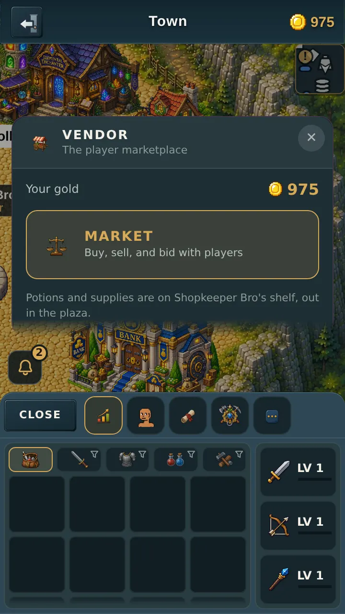
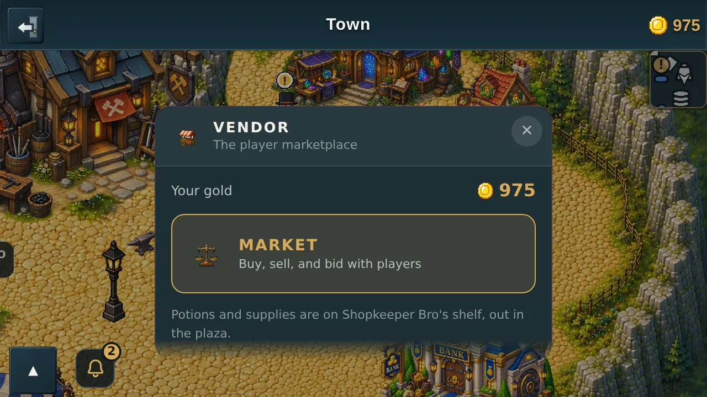
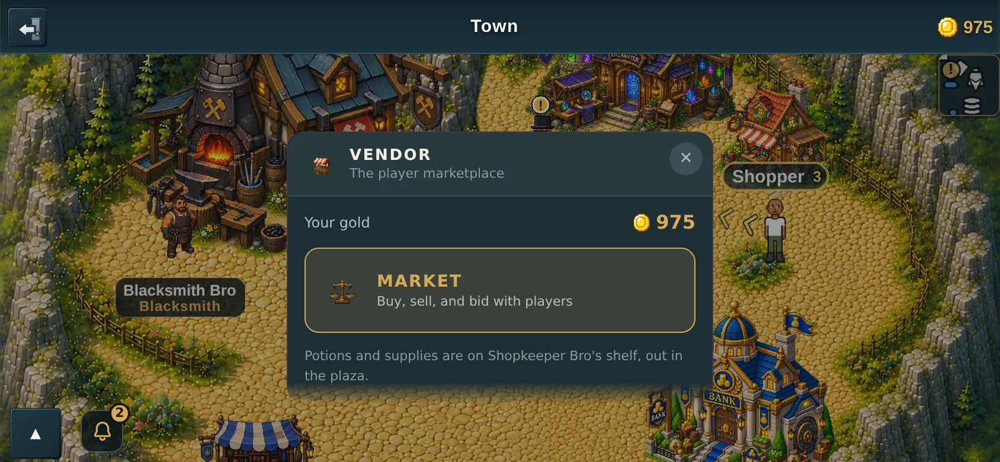

### The shelf

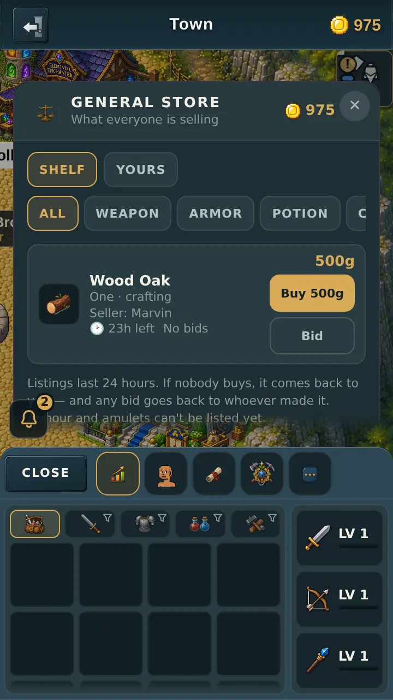
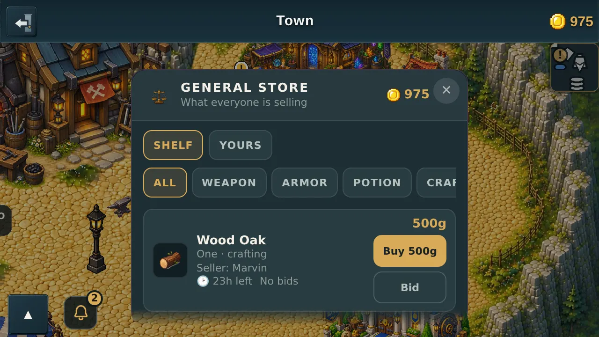
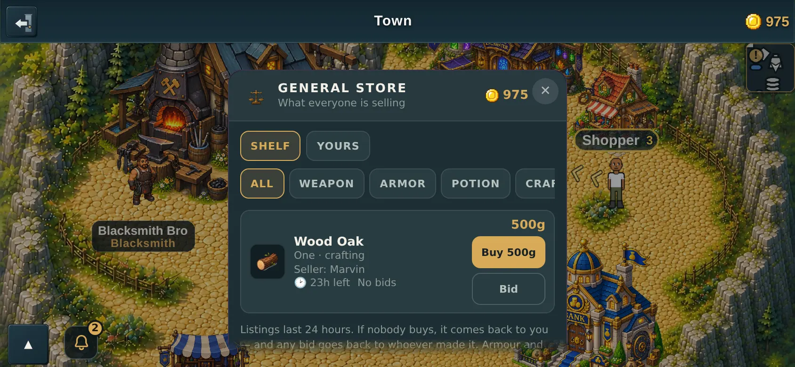

### My Listings / My Bids

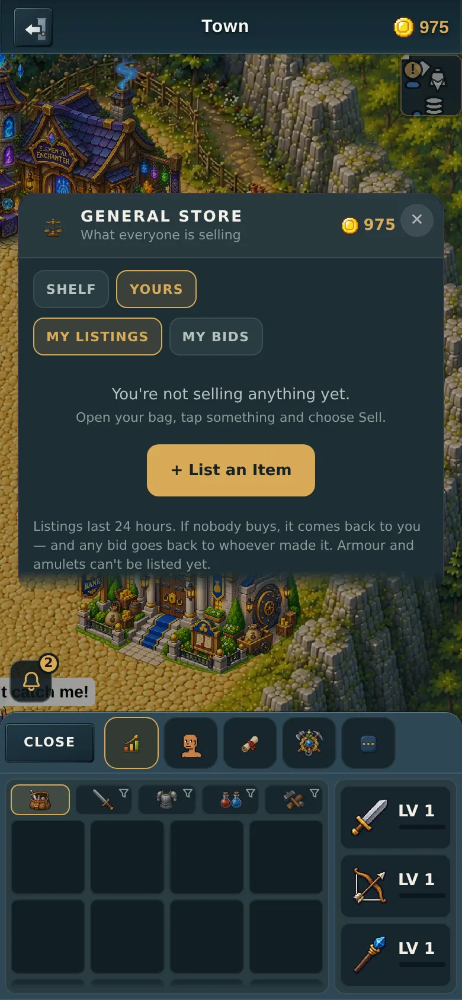
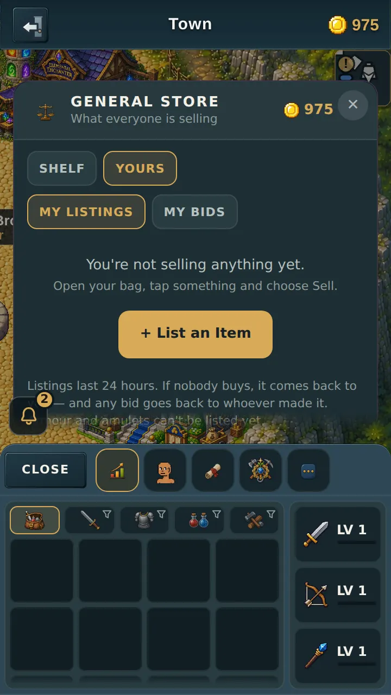

---

## Testing

New scenario `tools/qa/mp/mp-marketonly.mjs`. It puts a real listing up as one
player, then walks a second player to the door and presses the things.

- **68 checks, 68 passed** — 360 and 390, portrait and landscape.
- Run against the previous panels, the same scenario is **red across every
  storefront assertion** (the shelf names are still there, there is no priced
  Buy, no clock, no seller line, no tabs, no empty state). So the test is
  measuring the change, not describing it.
- `cd server && npm test` — all pass, including the mirror audit that pins
  `SHOP_ITEMS` against the client.
- `node tools/dev/precheck.mjs` — 0 FAIL.

### Found along the way, NOT fixed here

The **first-run coach card** ("Your bag, your gear and your stats live down
here") is drawn *over* open building panels, and at 390 wide its 44x44 dismiss
✕ lands exactly on the new **List an Item** button — so a brand-new player's
tap goes to the coach instead. Dismissing it does not help, because dismissing
one lesson immediately brings up the next.

It is not caused by this PR — you can see the same card drawn across the old
store panel's body text in the "before" screenshots above. It is the same class
of problem as the World Chat feed sitting over the party roster, already on
record in the architecture handoff. It needs its own fix; the test works around
it by pre-marking the lessons, and says so in its own comments rather than
quietly clicking elsewhere.
