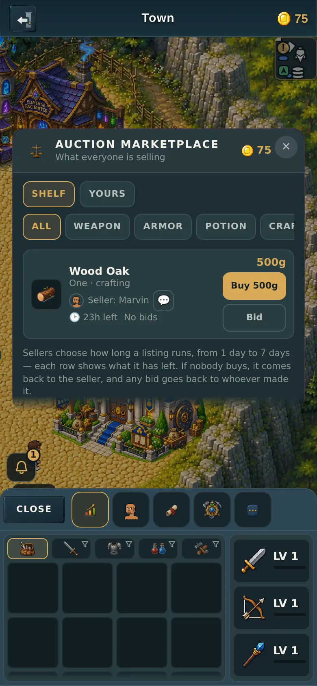
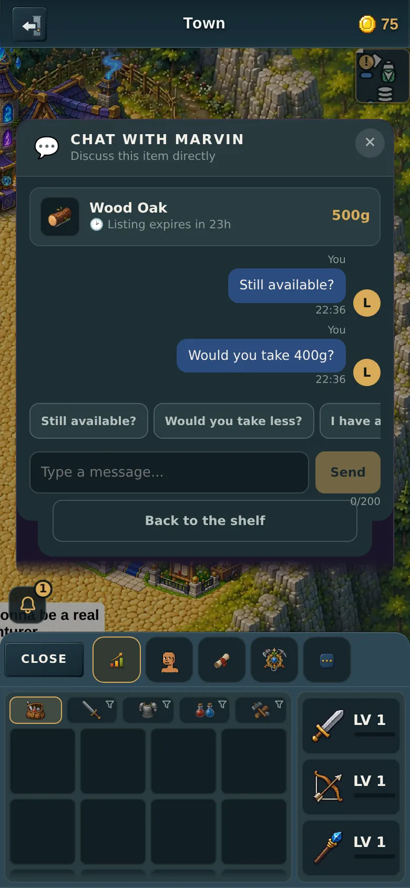

# Real faces on listings, and the Auction Marketplace

v2.3.2622. Companion page to the PR, because GitHub's PR-body API mangles
markdown image syntax and these are pictures.

---

## What you asked for

> "Make the player's actual profile picture be there instead of the M.
> Also change 'general store' to 'Auction Marketplace'"

Both done:

The header now reads **AUCTION MARKETPLACE**, and next to *Seller: Marvin* is
Marvin's **actual character** — the bro he built — instead of a letter.

---

## Why it was a letter before

The icon had two states: a player's **Hemi Bro picture** if they owned one, or
a coloured disc with their initial if they didn't. Only verified Hemi Bro
holders have a picture, so **almost everyone got the letter.** That was the
game's existing rule, and copying it was the wrong call — you wanted the
character.

The game can already draw anybody's character: it's how the inspect card, the
trade window and the character picker each show someone. This makes the
marketplace a fourth user of that same drawing code rather than a fourth copy
of it.

---

## The two things that had to be got right

### 1. Not sending the whole wardrobe

A player's appearance is 28 pieces of information — and **nine of them are
drawings** (shirt prints, trouser prints, five tattoo zones). Each drawing is a
fixed 256 characters. Sending all of it on every listing would be about
**2,300 bytes per row — roughly 92KB on a full page of 40**, for artwork that is
*physically invisible on an 18-pixel circle*.

So only the head-and-shoulders pieces travel: skin, hair, beard, hat, glasses,
eyes, shirt, and the three build numbers the drawing code needs to size the
head correctly. Measured: **198 bytes per row.**

There's a test that fails if any of the nine drawing fields ever sneaks back in.

### 2. A face and a Hemi Bro picture are never both sent

The game draws one or the other, so sending both wasted one of them on every
row. Sending both took a full page to **29.7KB against a 32KB limit** — the kind
of headroom that runs out on the next change.

They're now either-or, which puts the worst case back to about **22KB**.

### Why the face is *stored* and the Hemi Bro picture isn't

The Hemi Bro picture is looked up fresh each time (it costs nothing to store).
The face is **saved onto the listing** — because the whole point is that it's
*there*, and a face that vanishes when the seller logs off would be your
complaint again with extra steps. That costs about 380KB across a full 2,000
listings, roughly a tenth of what saving the picture URLs would have cost.

---

## Elsewhere

The seller's face also shows on their messages in the chat:

The **door sign in town**, the **Sell** sheet and the link from the old exchange
screen all say Auction Marketplace now too.

**Two things I did not change, on purpose — tell me if you want them:**

- The building is still called **VENDOR** (the sign outside says Auction
  Marketplace, the panel inside says VENDOR). Renaming the building is a bigger
  change and you've been calling it the vendor yourself, so I left it.
- The **player list** (the "who's nearby" list) still shows letters. It's the
  same shared icon, it just isn't being handed the appearance yet. Small
  follow-up whenever you want it.

---

## Testing

- **Server:** 7 new checks in `server/test/market.test.mjs` — the right pieces
  are saved, the nine drawing fields are not, an over-long value is dropped, the
  face survives the seller logging off, a face and a picture never ship
  together, and a full page stays under the size limit. `cd server && npm test`
  — all pass.
- **Through the screen:** **277 checks, 277 passed** across all five marketplace
  scenarios at 360 and 390, portrait and landscape. The face check waits for the
  drawing to finish rather than sleeping a fixed time, and asserts a real image
  is on screen with no letter left behind.
- `node tools/dev/precheck.mjs` — 0 FAIL.

### Two stale tests this caught, worth knowing about

Running all five scenarios together — which I had not done before, having run
each against its own branch — found **two tests that had gone red without
anything being wrong with the game**:

- The PR #680 test measured the seller's row and required it to be no taller
  than 24px. PR #682 then put a 26px chat button on that same row. The row grew
  legitimately; the test was written a version earlier and never re-run.
- The PR #677 test clicks the way through to the market. PR #678 renamed that
  button from "Player store" to "Market", so the older test was clicking a label
  that no longer existed.

Both are fixed here, and the second is now written to accept **either** label —
because these branches are a stack, and a test that only knows the newer name is
red on every commit before the rename.

The lesson is about the stack, not the code: **a scenario has to be re-run
against the tip, not only against the branch it was written on.** All five now
pass together.
