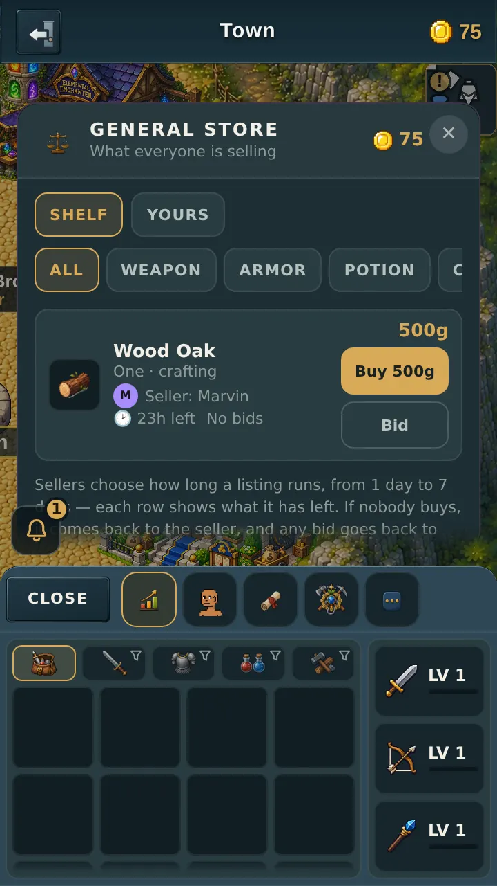
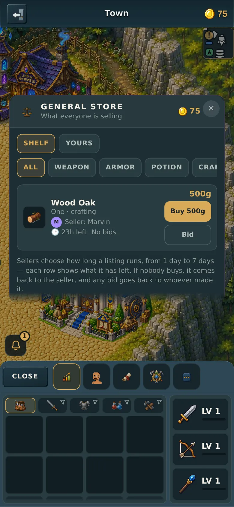
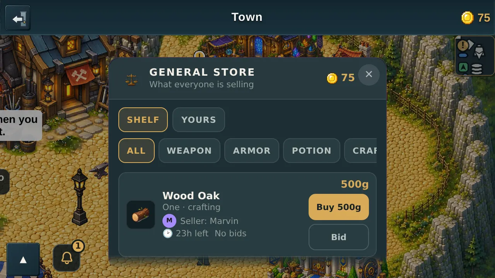
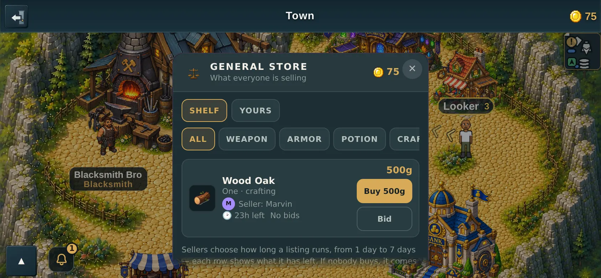

# The seller's tiny icon on every listing

v2.3.2620. Companion page to the PR, because GitHub's PR-body API mangles
markdown image syntax and these are pictures.

---

## What you asked for

> "Add the players tiny icon (similar to how the player icons are displayed
> elsewhere in the game) next to their listing."

The small round **M** beside *Seller: Marvin* is the icon. It is 18 pixels —
the row already carries four lines and a price, so anything bigger would push
the price column around at 360.

---

## "Similar to how they are displayed elsewhere" — that was the whole job

Elsewhere in the game, a player icon is exactly two things:

1. their **avatar** picture, if they have one, or
2. a **disc in their colour with the first letter of their name**, if they
   don't.

Only verified Hemi Bro holders have an avatar picture, so **the coloured disc
is the normal case**, not a rare fallback.

That rule was written down twice already, inline and separately, in the player
list and the inspect card. Rather than write it a third time for the
marketplace — which is how the three would slowly stop matching — the rule moved
into one small shared piece (`src/ui/PlayerIcon.jsx`), and **the player list now
uses it too.**

So there is exactly one answer in the game to "what does a player look like in a
list", and the marketplace cannot drift away from it.

The test checks **both ends** of that: the new icon on a listing, *and* that the
player list still draws the same thing afterwards. A tidy-up that quietly
changed the player list is the real risk of a move like this, and only the
second half would catch it.

---

## What it costs, measured

You asked for this on a page that can hold 40 listings, so here is the actual
number rather than a reassurance.

A **full 40-row page is 21,923 bytes**, of which **10,720 bytes are icon
(268 bytes per row)**.

And that is the *worst case the store can produce*: every single seller online
at once and every one of them wearing a Hemi Bro picture. Real pages are much
cheaper, because most players have no avatar picture at all — their disc costs
about 20 bytes.

There are two tests holding that line: a full page must stay under 32KB, and the
icons must never be more than half the page.

### How it stays that cheap

The avatar URL is **never stored on the listing**. It is looked up fresh each
time the shelf is read, from information the game already has in memory about
who is online.

That matters more than it sounds. An avatar URL is 150–250 characters. Stored on
every listing, with room for 2,000 listings, that is about a megabyte of saved
data — and when the server restarts it reads *every* listing back before it can
answer anything at all. Looking it up live costs nothing to store and nothing to
reload.

The **colour** is stored (it is seven characters), because the coloured disc is
what most listings draw and it has to keep working after the seller logs off.

**The honest cost:** if a seller is offline, their listing shows the coloured
disc instead of their Bro picture. That is the same thing the player list
already shows for most players, so it degrades into something familiar rather
than into a hole.

---

## Nothing new is revealed about anyone

The listing now carries the seller's **name, colour and avatar** — and all three
are *already* sent to every player in the room and drawn at each other in the
player list. This is the same information going to the same people.

No location, no zone, no account details. The test pins this: it asserts that
the only seller fields on a listing are id, name, colour and avatar, so a future
change that adds a fifth one has to come past a failing test.

A junk colour or a non-image link is dropped by the server rather than passed
through to the screen — the icon ends up in an ``, so only `https://` and
the game's own files are allowed through, which is stricter than the path this
same value already travels on.

---

## All four screens

---

## Testing

- **Server:** 9 new cases in `server/test/market.test.mjs` §S5d — the colour is
  stored, the avatar is *not*, an online seller's picture appears, an offline
  seller falls back to the disc, junk links and junk colours are refused, and the
  two page-size bounds. `cd server && npm test` — **all pass**.
- **Through the screen:** `tools/qa/mp/mp-sellericon.mjs` — **42 checks, 42
  passed** across 360 and 390, portrait and landscape. It checks the icon is
  18px, round, carries the right initial, sits on the seller's line, doesn't
  spill out of the panel and doesn't make the row taller — and then opens the
  player list and checks that still draws its own 28px icon by the same rule.
- `node tools/dev/precheck.mjs` — 0 FAIL.
