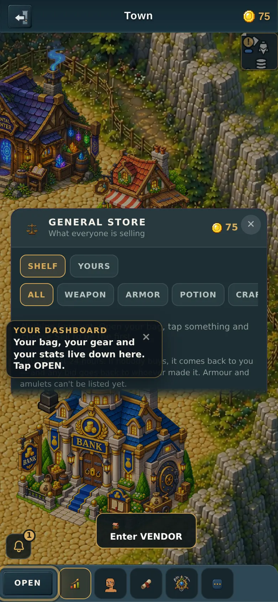
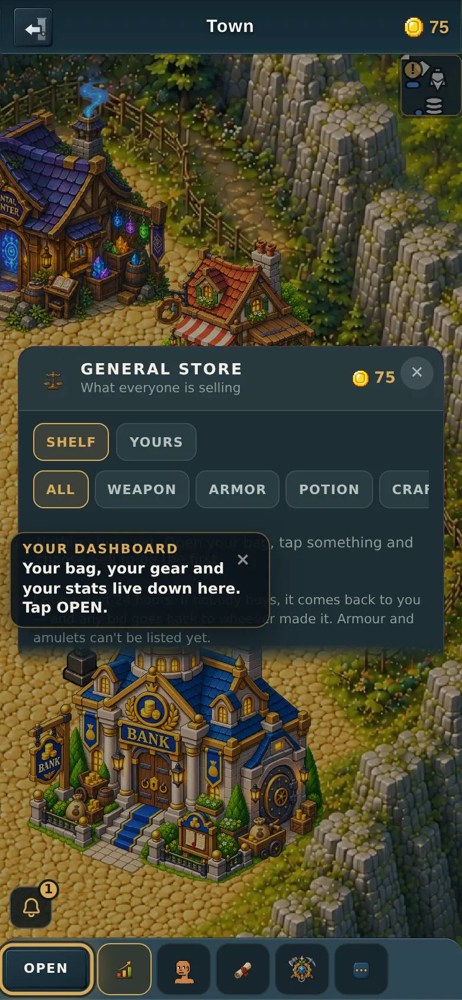
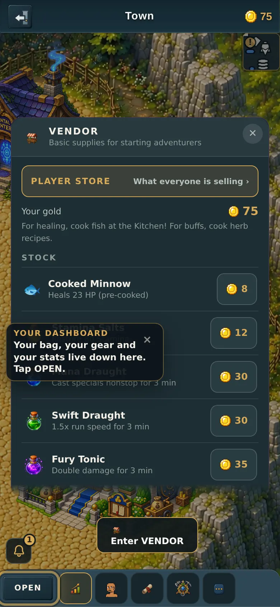
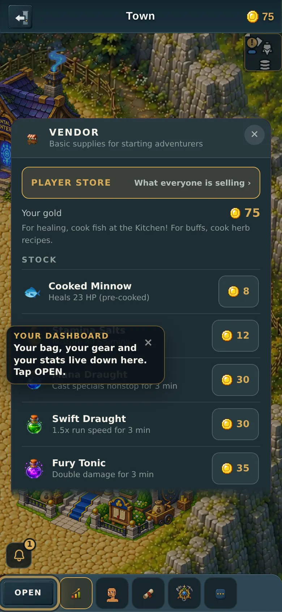
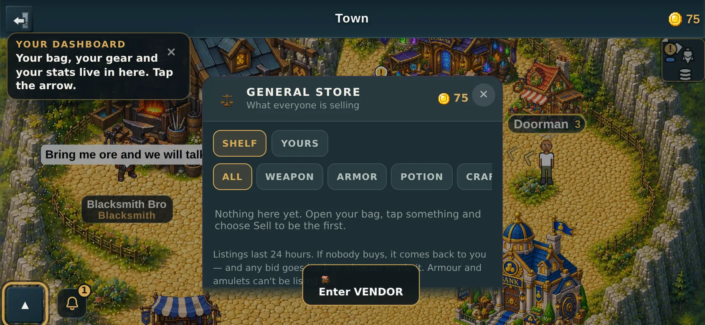
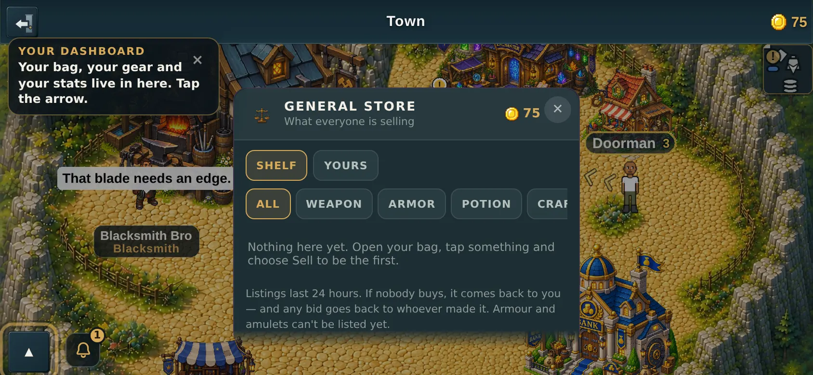
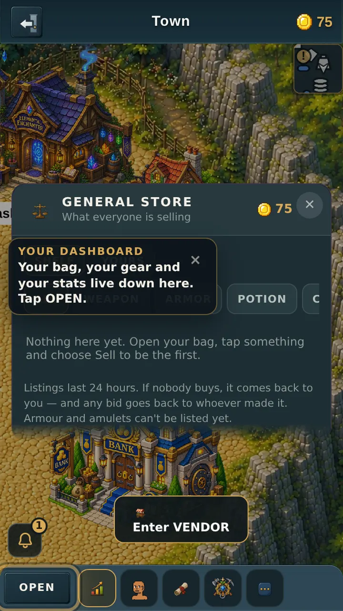
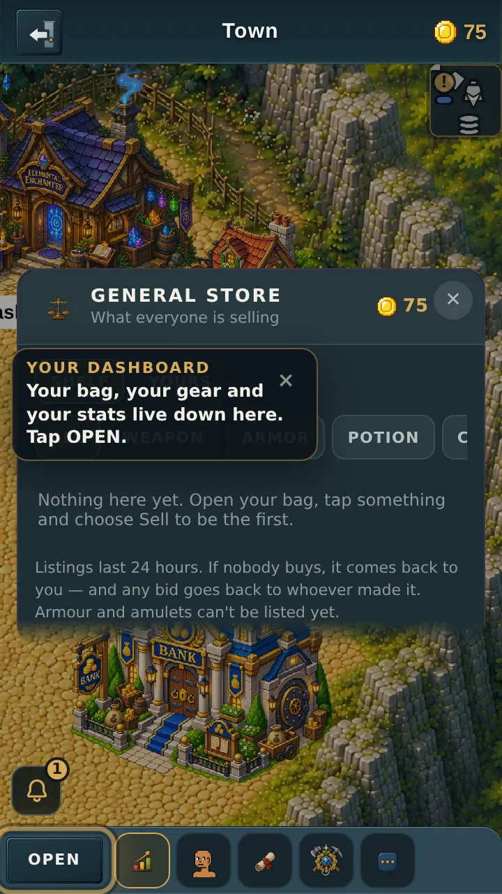
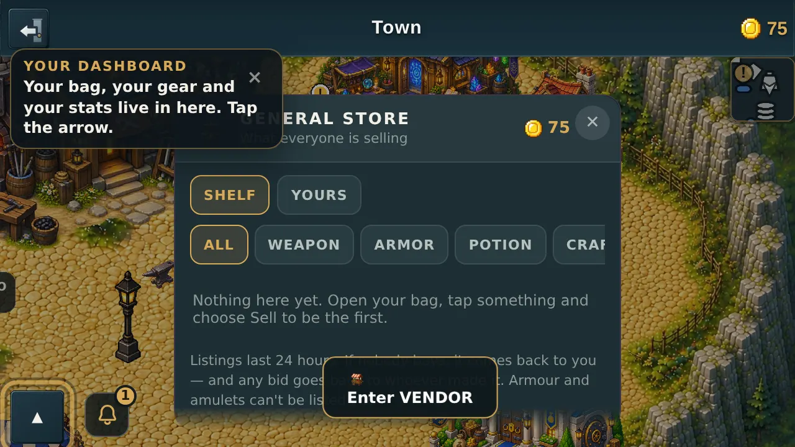
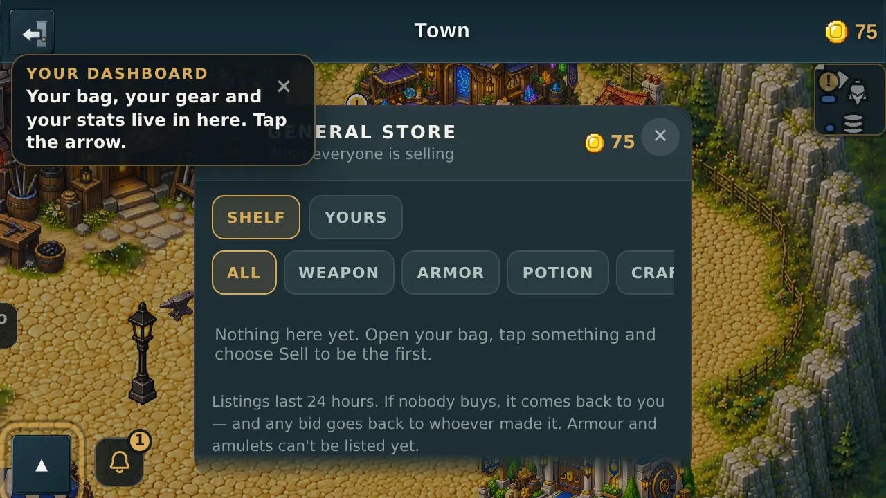

# The "Enter VENDOR" button that would not go away

v2.3.2617. Companion page to the PR, because GitHub's PR-body API mangles
markdown image syntax and these are pictures.

---

## What you reported

> "get rid of the vendor pop up button after you tap it because it's staying on
> even when you're in the vendor marketplace menus"

That is exactly what it did. Here is the marketplace open on a 390-wide phone,
before the fix — the pulsing **Enter VENDOR** button is still sitting there
underneath it:

And after:

Nothing else on the screen moved.

---

## Why it was happening

The button appears when you are **standing near a door**. That was the only
thing it checked. Walking into a building does not move you anywhere — the game
opens a panel and you stay exactly where you were standing — so as far as the
button was concerned you were still next to the door, and it stayed up.

It also sat on a *higher layer* than the marketplace panel, which is why it
painted on top of the menus rather than politely behind them.

The fix is one extra condition: the button now also checks that **no panel is
open**. Walk away and back and it returns as normal.

---

## The part that was not obvious

Hiding the button broke walking into the building — and only on some phones.

The button used to react to your finger the instant it *touched down*. On a
phone, one tap actually produces two rounds of events: the touch, and then a
"pretend mouse click" the browser sends afterwards for the benefit of older web
pages. The button was reacting to both.

While the button stayed on screen, the second round landed harmlessly back on
the button itself. Once the button disappeared, the second round fell **through
to the marketplace panel that had just opened** — and landing on the dark area
around a panel is how you close it. So the panel opened and instantly shut
again, too fast to see.

On a 360-wide phone the same tap happened to land on the panel's *card* instead
of the dark surround, so it survived. Same code, two phone sizes, two different
outcomes — which is why everything here is measured on four screens and not one.

The button now reacts when your finger **lifts** instead of when it touches
down. That is the last event of a tap, so nothing follows it to fall through.
In practice it opens a fraction of a second later and feels the same.

This is written up properly for future sessions in `docs/TRAPS.md` §88.

---

## The evidence, all four screens

Each pair is the same moment before and after the fix. "Panel" is the vendor
panel right after the tap; "marketplace" is one menu deeper, which is where you
met it.

### 390 portrait

### 390 landscape

### 360 portrait

### 360 landscape

The remaining four (`*-panel-*` at 360 portrait, 360 landscape and 390
landscape) are in the same folder.

---

## How it was tested

A new automated scenario, `tools/qa/mp/mp-vendorprompt.mjs`, plays the game for
real: it creates a character, walks to the general store, and **taps the button
with a simulated finger** at the exact spot on the glass where the button is.
Then it asks the browser what is actually at that spot afterwards.

That last part matters. The existing test for this door pokes the button
directly in a way that skips the screen entirely, so it could never have noticed
any of this — see `docs/TRAPS.md` §67 for why that is a trap the project has
been caught by before.

**Results: 42 checks, 42 passed**, across 360 and 390, portrait and landscape.

Run against the old code, the same scenario fails 8 of those 42 — the eight that
ask "is the button gone?" — at all four screen sizes. So the test really does
catch the bug it is about.

### One thing found along the way, not fixed here

Starting the game *already in landscape* does not work: on a 640x360 or 844x390
screen the **Enter Bro Town** button on the character-creation screen is
positioned off the bottom of the screen, so a brand-new player who is holding
their phone sideways cannot create a character at all.

This has nothing to do with the vendor button and it happens on the current
`main` too, untouched by this PR. It needs its own fix. The tests here get to
landscape the way a real player does — start upright, then rotate — which also
works fine.
