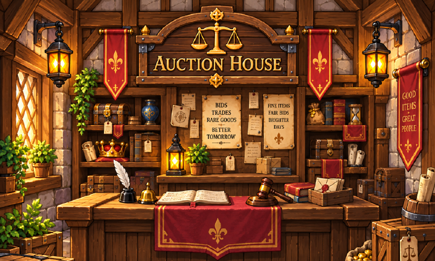
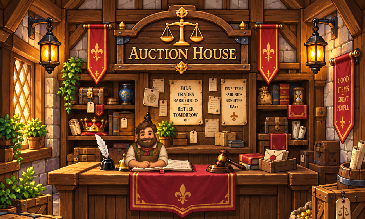
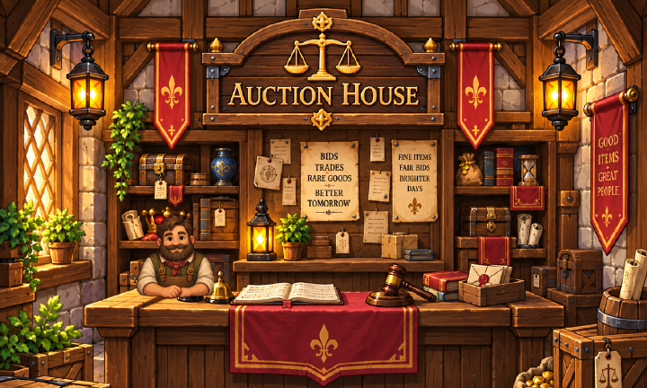
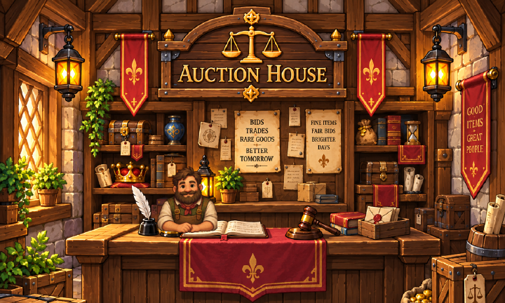
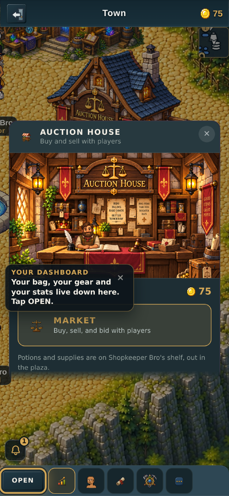

# The auction house's interior, and whether a figure fits in it

*v2.3.2627. Renders from `tools/qa/art/measure-auction-interior.mjs`.*

## What changed, and why it changed

v2.3.2624 put the owner's **general store** interior at the top of the vendor
panel. Between that PR opening and it merging, the building stopped being a
general store:

- **#686** renamed it to the **Auction House** — id, action, label, exterior
  art and a new position on the plaza.
- **#678** removed the shopkeeper's stock list from this panel entirely. The
  potions now come from Shopkeeper Bro, who walks the plaza.

So the painting no longer matched the building you walk into, and the figure in
it was minding a shelf that is not there any more. The owner's decision was to
swap the art rather than re-word the header, using the auction-house interior
they had already supplied.

## The room

| | |
|---|---|
| raw | 1448×1086, opaque RGB |
| ships as | 1288×773, **1.5 MB** |
| what was cut | the bottom 20% — floorboards and the rug, below anything the panel shows |
| re-encode | RGB (colour type 2) with adaptive row filtering, not the repo's `tools/png.mjs` |

That last row is worth a note. `tools/png.mjs` writes RGBA with filter `None`
on every row, which on a painted background *grows* the file: putting the raw
through `tools/resize_png.mjs` at 1288 wide produced **3.3 MB**, larger than
the 2.4 MB source it started from. Cropping first and encoding as RGB with
per-row adaptive filters gives 1.5 MB for the same pixels.



## Does a figure fit?

The general store's painting had a plainly empty spot behind the counter. This
one is a fully dressed composition built around the gavel, so the question was
not *how big* to draw him but *whether he belongs at all*. Four placements were
rendered and looked at rather than argued about:

**cx 45% — he buries the ledger.** Reads well as a clerk, but his hands and
torso cover the open ledger's left page, which is the counter's centrepiece.


**cx 40% — the lantern is behind his head.** The lantern's finial pokes out of
his hair and its glow halos him for no reason.



**cx 27% — cramped into the window bay.** He covers the quill, the inkwell and
the crown on the shelf, and stands too close to the left edge.



**18% wide — a giant.** Out of proportion to the counter he is leaning on, and
he swallows the shelf behind him.


### The one that ships: 12% wide, centred at 37%, forearms on 77%

Between the inkwell and the ledger. The lantern stays clear beside his head,
the ledger and the gavel are both readable to his right, and the crown shelf
sits behind him. He covers the brass bell; that is the whole cost.



## Why 77%

77% of the room's height is the row the counter's top surface runs along, read
off the 5% ruler the measure tool draws (`--ruler`) rather than guessed at. The
keeper strip is cropped at his forearms, so landing that cut on the counter's
surface is what makes him read as a man leaning on it. He is drawn **on top**
of the painting, not behind it — the room is one flat opaque image with no
layer to slide a figure into, and composited behind it he is simply invisible.

## Re-deriving any of this

```
node tools/qa/art/measure-auction-interior.mjs --ruler --preview=/tmp/ruler.png
node tools/qa/art/measure-auction-interior.mjs --keeper --w=12 --cx=37 --base=77 --preview=/tmp/try.png
```

The three flags are the same three constants `VendorPanel.jsx` uses
(`KEEP_W` / `KEEP_CX` / `KEEP_BASE`), so another placement can be seen before
it is typed into the panel.

## In the running game

Not a harness composite — a real browser walked to the door on the plaza and
tapped it, at 390×844 with DPR 3. The building's exterior sign and the room's
sign are the same sign, which is the thing the general-store painting could no
longer do.



The **YOUR DASHBOARD** coach card drawn across the room is the pre-existing
first-run overlay bug #678 documented and did not fix; it sits over any open
building panel, not just this one.

## What this cost, and what it saved

| | before | after |
|---|---|---|
| room PNG on the gate | 1.4 MB (general store) | 1.5 MB (auction house) |
| keeper strip | 1.16 MB | 1.16 MB |
| art that matches the building | no | yes |

The general-store painting is **deleted**, not left unused. Nothing references
it, and a 1.4 MB orphan in `public/sprites/props` is exactly the kind of thing
that never gets cleaned up later.
