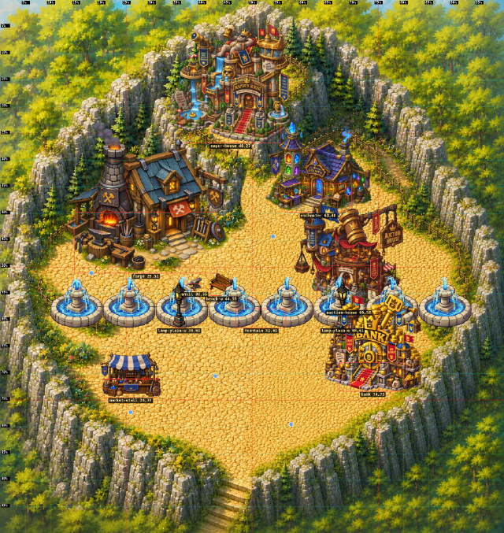
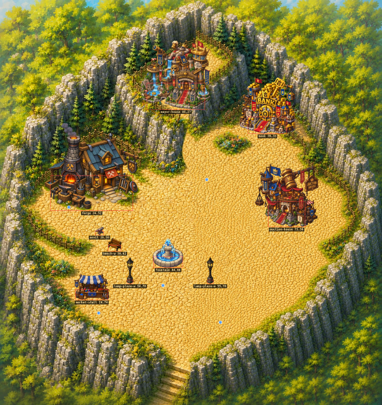
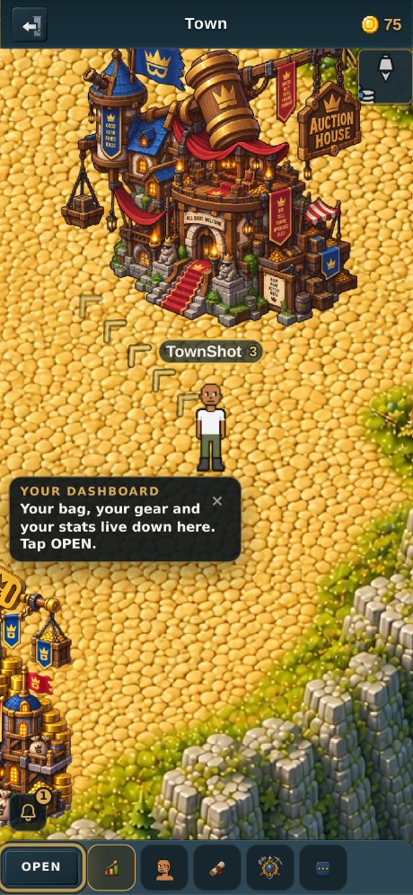
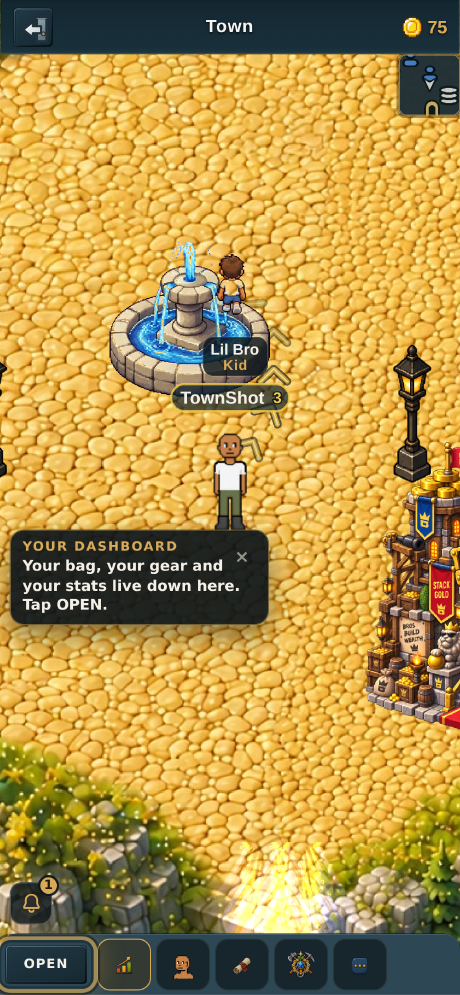
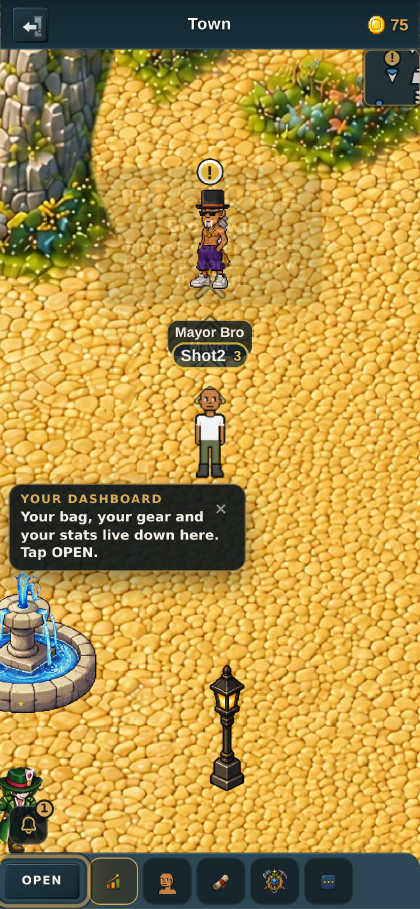

# The town's missing half, and where it went

*v2.3.2628.*

## What the owner reported

> "Something happened with the town map and half of it got lost. It's supposed
> to be a fused map between two different maps to make it larger like it was
> before. Restore that. These buildings need to be more spread out there."

## The fusion is intact. The size is what was lost.

Checked before anything was changed, because "restore the fusion" and "restore
the size" are different repairs:

| | |
|---|---|
| `town_v17.webp` | 1674×1774 — **887 + 887 − 100 overlap**, both painted halves |
| `tools/maps/src-art/` | `town17-west.png` and `town17-east.png`, 887×1774 each, both present |
| rendered side by side | west is the cliff-on-the-left piece, east the cliff-on-the-right one; both appear in the finished map |
| reachability | 94.26% of open cells reachable from spawn — nothing walled off |

So no half of the art is missing, and the builder (`tools/maps/build-town-v17.mjs`)
still reproduces it. What changed is the **zone**, at v2.3.1813:

| | tiles | world px | area |
|---|---|---|---|
| v16 (the town before) | 96×30 | 3072×960 | 2.95M |
| v17 (what shipped) | 52×55 | 1664×1760 | 2.93M |
| **v2.3.2628** | **68×72** | **2176×2304** | **5.01M** |

The area barely moved at v17 — but the **width fell 46%**, 3072 → 1664. Walking
east–west you now covered a little over half the ground you used to. That is the
half that got lost, and it is a zone number, not a missing painting.

## Why 68×72 and not something rounder

The art is 1674×1774, an aspect of 0.9437. 68×72 = 2176×2304 is 0.9444 — a
**0.07% stretch**, tighter than the 52×55 box it replaces (0.10%) and far
tighter than v16 lived with (0.8%). The map draws 1.30× larger, uniformly.

That is **not** the mistake v16's fusion made. What made that one look bad was
one half upscaled ~1.4× *relative to the other*, so the seam joined sharp art to
soft art and no blending could hide it — the mismatch was in the detail
frequency. Scaling one finished map by one factor has no seam to mismatch, and
this is a painting, so there is no pixel grid to break.

## Spread out, not scaled

Scaling positions preserves crowding exactly. The layout **was** crowded — this
is the live data rendered onto the live art before the change:



The bank's art overlaps the auction house's, the enchanter nearly touches it,
and the whole southern half of the plaza is bare cobble.

After: five doors around the plaza's edge, one per quarter, the middle left
open, and the owner's new art on three of them.



| prop | position | why there |
|---|---|---|
| mayor-house | 46%, 27% | the north terrace, up the painted stairs |
| forge | 24%, 52% | west, clear of the cliff by ~60px of cobble |
| auction-house | 75%, 56% | east, facing the plaza across it |
| bank | 70%, 33% | the north-east shelf, where the enchanter stood |
| fountain | 44%, 66% | the middle, which is now a middle |

**Prop sizes are unchanged.** A building is worth the same number of world px it
was, so it draws the same size on screen and the 1.71× of extra ground shows up
as distance *between* buildings — which is what was asked for.

Both nudges after the first pass came from the picture, not from arithmetic: the
forge at 22% had its left wall in the cliff, and the auction house at 78% hung
its sign over the east fence.

## The layout renderer runs here now

`render_town_layout.py` cannot run in this sandbox — Pillow is not installed and
`npm install` will not bring it. A layout picture that only renders on someone
else's machine is a layout picture nobody looks at, which is how a town comes to
be laid out by arithmetic alone. `tools/maps/render-town-layout.mjs` is a node
port with the same contract: it imports `worldProps.js`, `zones.js` and
`gameDisplay.js` and applies the renderers' own arithmetic, so a prop moved in
the data moves in the picture.

```
node tools/maps/render-town-layout.mjs --grid --names
```

## In the running game

Not a composite — a real browser, 390×844 at DPR 3, walked to each door.

| | |
|---|---|
|  |  |

## Two stale test helpers, fixed rather than worked around

Both had the old zone's shape **written into them as literals**, so they broke on
a resize in ways that did not mention a resize:

1. **`harness.doorOf`** mapped world px onto the walk grid with a hardcoded
   `52 × 32, 55 × 32`. Every door came out on the wrong cell; the auction
   house's landed on the cliff and surfaced as *"no walkable cell within the
   prompt radius"*. It reads `ZONES.town` now.
2. **`mp-townmap`** repeated `52` and `55` in two bounds checks that had already
   drifted from its own `ZONE_W`/`ZONE_H` constants. They read the constants now;
   the constants stay a deliberate pin, so a future resize still has to be an act
   rather than a drift.

## Verification

- `townmap` **12/12**, `townbuildings` **12/12**, `marketonly` **68/68**, `store` **28/28** — real worker, real browser
- `precheck` 0 FAIL, `npm run build` clean
- `movespeed` and `arrowshot` each fail one assertion — **reproduced identically on `main`** in a clean worktree, so pre-existing and not this change


## Follow-up: Mayor Bro in the cliff, and the bank on the exit path (v2.3.2629)

> "Mayor bro needs to be moved off the rocks and the bank needs to be moved
> further from the exit. Like directly east of the fountain but against the
> rocks would be fine."

### Mayor Bro was a bug in the resize, not a placement

His anchor measured **100% cobble** on a 95px disc, so the data said he was
fine — and in the game he was standing in the rock face. The reason is that
`NPC_DATA` carries the position **four times**: `x/y`, `spawnX/spawnY`,
`renderX/renderY` and `targetX/targetY`. v2.3.2628 scaled `x/y` for the bigger
town and left the other three at their pre-resize values, for all five town
NPCs.

Mayor Bro has `pathRadius: 0`, which means the wander step steers him to
`spawnX/spawnY` **every frame** — so he spawned at his new spot and then walked
back to the old one, which after the resize is 41%, 34%: the cliff.

The file's own v2.3.1813 comment describes this exact trap, three lines above
the field that was left stale:

> *"MOVED WITH HIM. The wander step steers an NPC toward spawnX/spawnY
> (pathRadius 0 means exactly that point, with no roaming), so leaving this at
> the old plaza spot spawned him outside his new house and then walked him back
> down the stairs."*

All 15 fields now move with `x/y`. Read back from a live game after letting the
wander settle, the two pinned NPCs sit exactly on their anchors and the three
wanderers are inside their radii.



### The bank

60%, 82% → 78%, 71% — directly east of the fountain, against the east cliff and
745px from the exit staircase instead of 280px.

## The enchanter comes off the map (v2.3.2630)

> "Remove the enchanter building and put the bank in its place."

Done — the enchanter's prop is deleted and the bank moves to its shelf at
70%, 33%, superseding the 78%, 71% spot above.

Only a **prop** makes a door: the proximity scan reads `propsForZone` and
`p.action`, and `BUILDINGS` supplies only the label, icon and action for
whatever the scan finds. Most of that table already has no prop (marketplace,
kitchen, tavern, woodworker, gambling den, gem cutter), so the `enchanting`
row is left alone — deleting it would be churn against a catalogue that is
already mostly doorless, and it is what brings the building back.

**Two things this costs**, both worth knowing before it is undone:

1. **Gear enchanting has no other way in.** `buildingPanel === 'enchant'` is
   reached only from that door; the Pet House's "Enchant" tab is pet
   enchanting, a different system. "Slot gems into gear" is off the map until
   a door for it exists again.
2. **The town is down to three doors** — forge, bank, auction house. `mayor_1`
   ("Visit 3 buildings in town") declares `needsDoor: 3` and unlocks
   `zone_exits`, so the whole world hangs off three distinct doors existing,
   and its own check wants three distinct visits. Three is exactly the
   minimum: it still passes, with no slack. A fourth door going away takes the
   world with it — the wall v2.3.2087 wrote that guard to prevent.

`mp-townbuildings` used to walk to the enchanter's door. That assertion is
replaced by one that pins what the removal put at risk: the town still has the
three distinct doors `mayor_1` needs.
